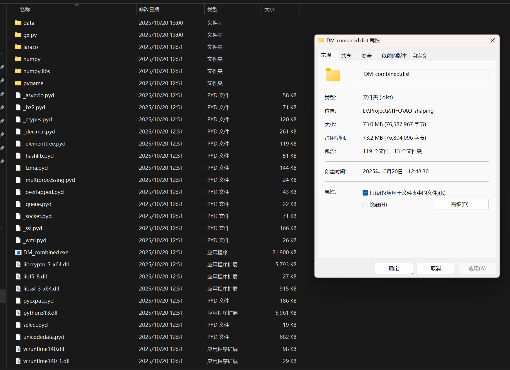
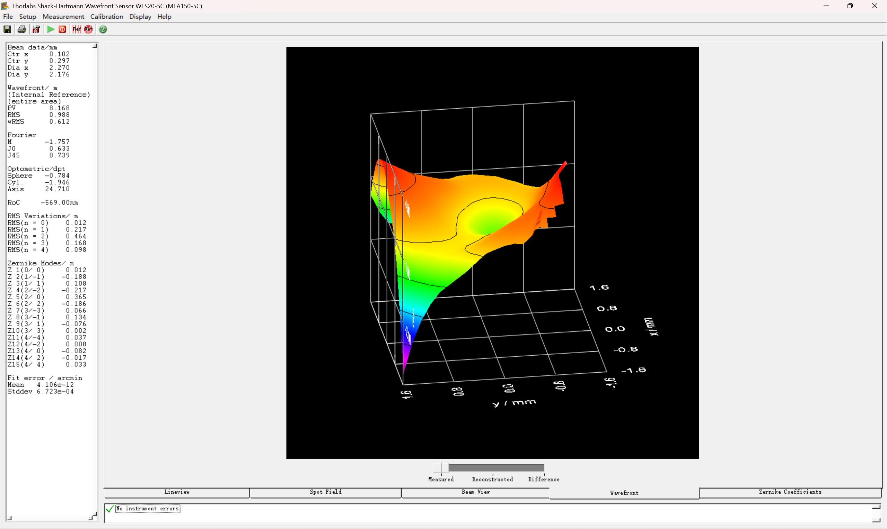
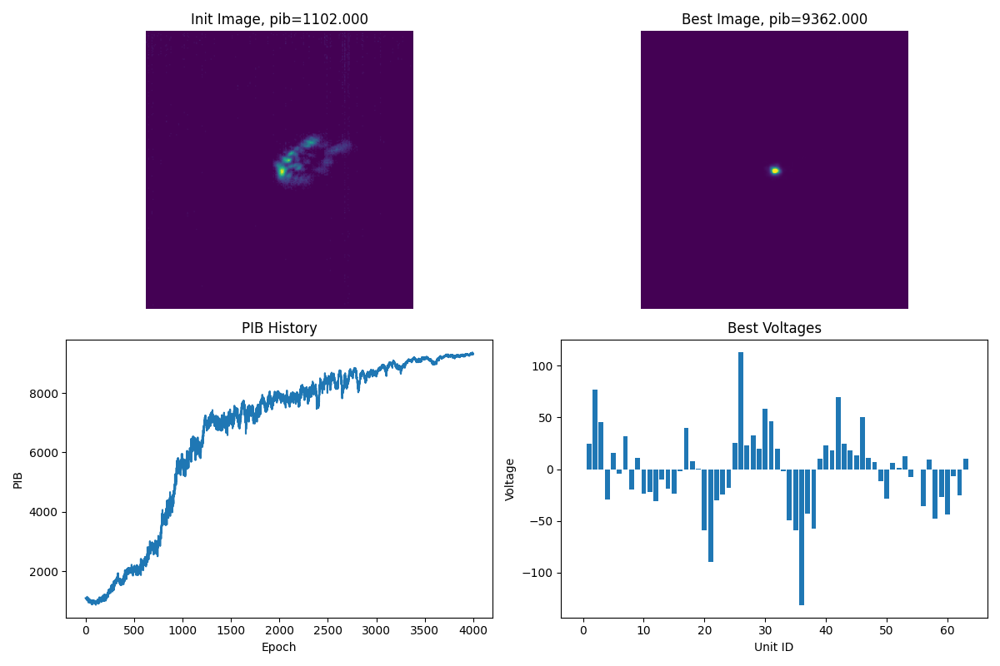
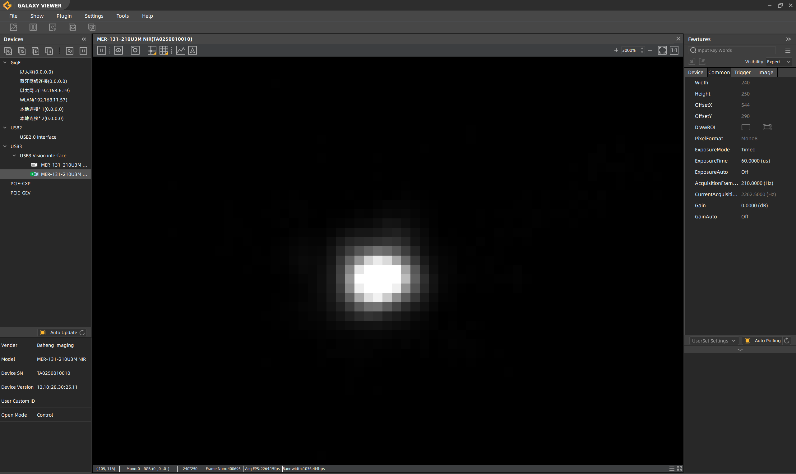
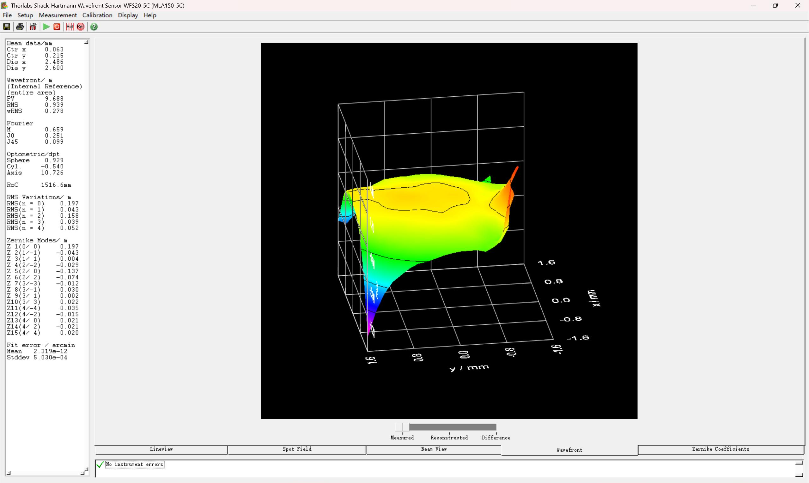
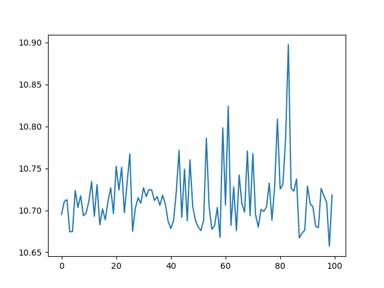
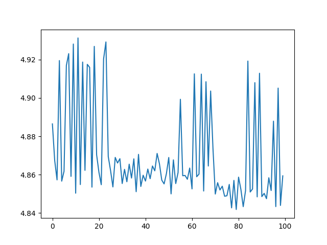
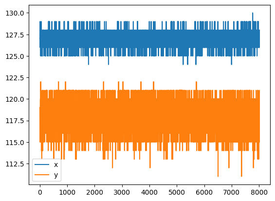
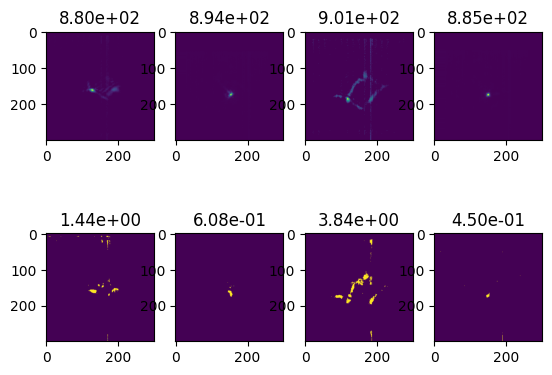

# CCD无波前矫正

## 打包



1. 默认参数直接执行
   
   ```powershell
   (ao-shaping) PS D:\Projects\TIFO\AO-shaping\DM_cam.dist> .\DM_cam.exe
   pygame 2.6.1 (SDL 2.28.4, Python 3.13.2)
   Hello from the pygame community. https://www.pygame.org/contribute.html
   相邻单元矩阵加载完成:(64, 64),最大压差:300
   iter 4000: 100%|████████████████████| 4000/4000 [00:28<00:00, 138.56it/s, J=9114.5, pib=9110.0, gamma=0.8, r=4.58, delta=0.6]
   3887 -> 9217.0
   ```

2. 命令行参数
   
   ```powershell
   usage: DM_cam.py [-h] [--cam_id CAM_ID] [--center CENTER] [--exposure_time_ms EXPOSURE_TIME_MS] [--epochs EPOCHS]
                    [--r_bucket R_BUCKET] [--delta DELTA] [--lr LR] [--shrank_iter SHRANK_ITER] [--show SHOW]
                    [--cam_size CAM_SIZE]
   
   options:
     -h, --help            show this help message and exit
     --cam_id CAM_ID       远场光斑CCD设备ID (default: 1)
     --center CENTER       远场光斑CCD中心位置 (default: (665, 415))
     --exposure_time_ms EXPOSURE_TIME_MS
                           远场光斑CCD曝光时间 (毫秒) (default: 60)
     --epochs EPOCHS       优化迭代次数 (default: 4000)
     --r_bucket R_BUCKET   渲染半径桶大小 (default: 18)
     --delta DELTA         优化步长 (default: 2)
     --lr LR               优化学习率 (default: 2)
     --shrank_iter SHRANK_ITER
                           优化迭代次数后收缩半径桶和步长 (default: 300)
     --show SHOW           显示远场光斑CCD图像和优化历史 (default: True)
     --cam_size CAM_SIZE   相机开窗大小 (default: 250*250)
   ```

## 效果

1. 0电压初始



2. 迭代结束：
   
   4000/4000 [00:28<00:00, 141.77it/s, J=8472.5, pib=8468.0, gamma=0.8, r=4.58, delta=0.6]
   
   **聚焦光斑目测直径：126-115=11px * 4.8μm/px= 52.8μm**
   
   





相机信息：[MER-131-210U3M-L NIR](https://www.daheng-imaging.com/show-94-2639-1.html)

## 测试

1. 有风情况下子孔径质心偏移rms
   
   

2. 直接测量RMS
   
   

3. 聚焦光斑质心抖动
   
   

## 智能AO

训练DM代理模型（cVAE），通过电压预测远场光斑


