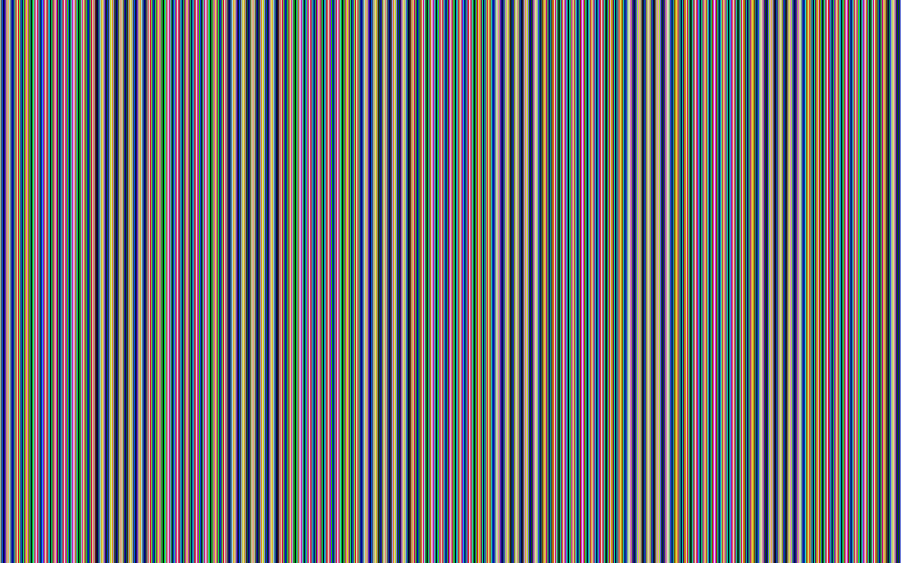
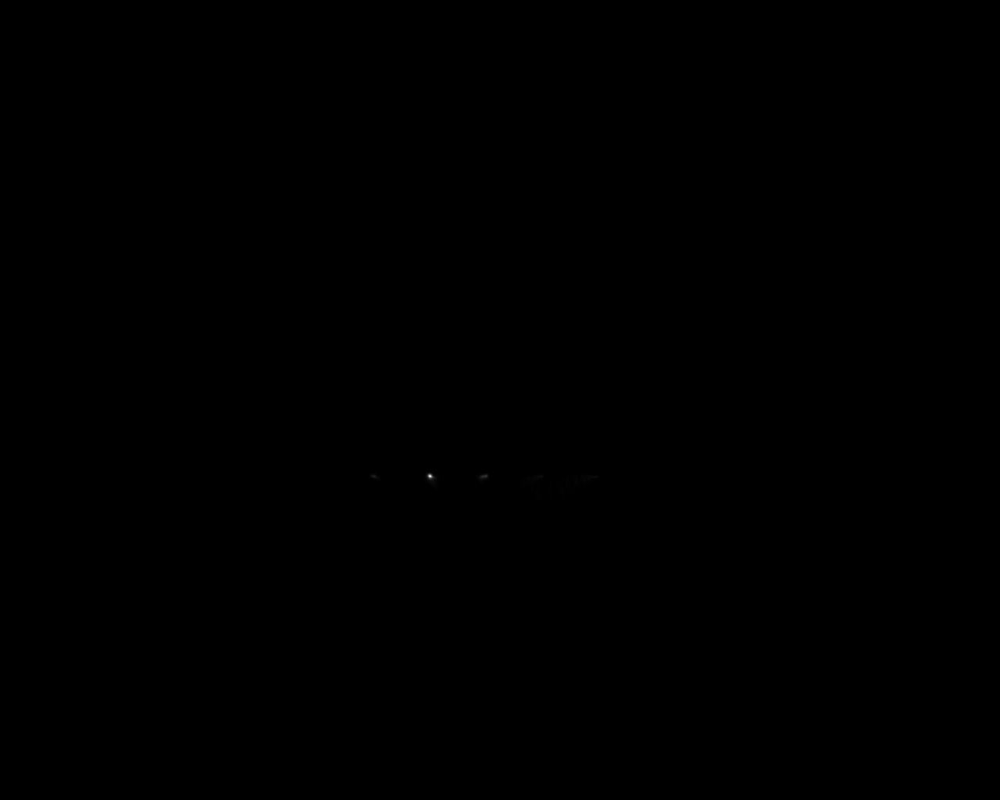
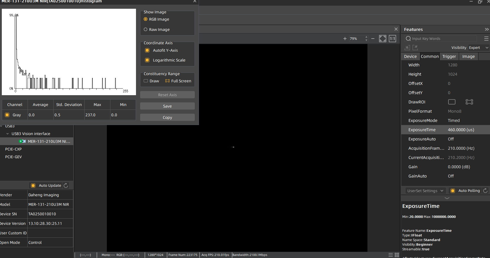
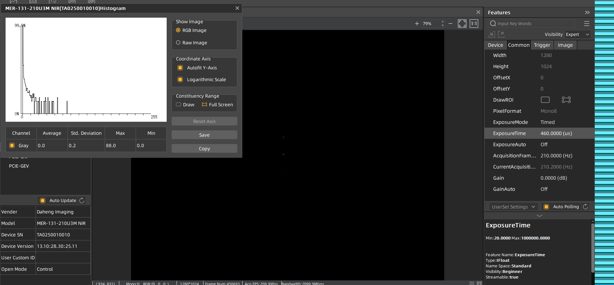
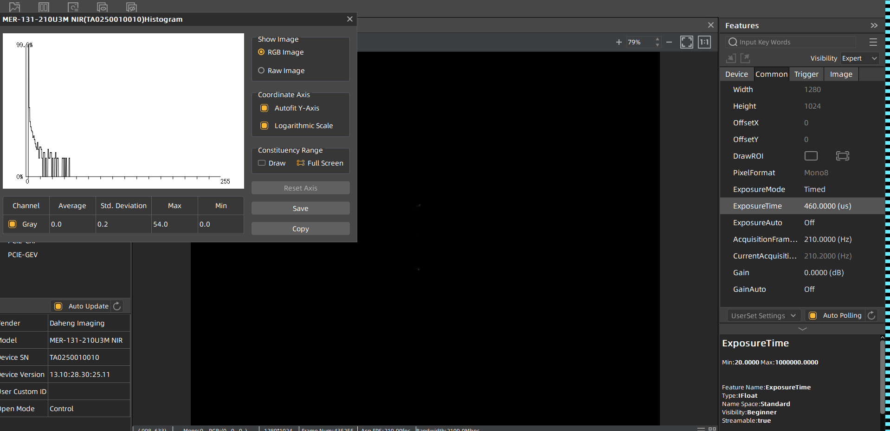
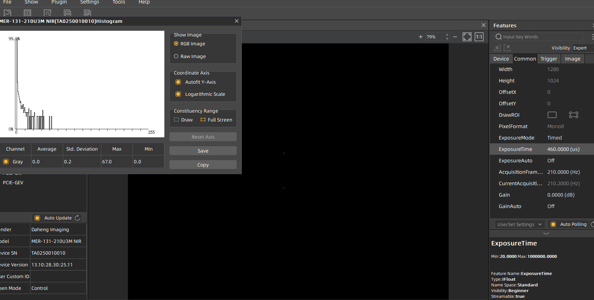
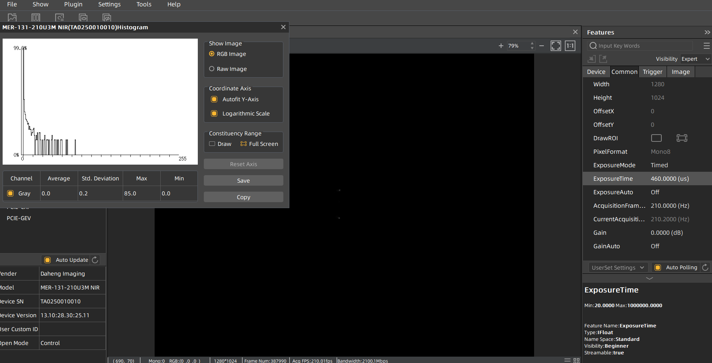
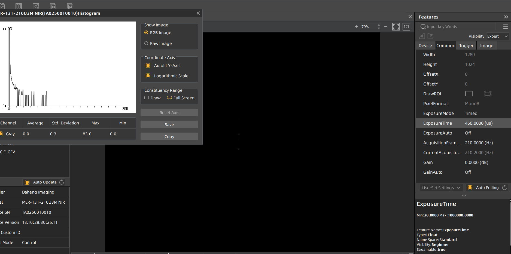

1. 过曝下可见次级衍射
2. 正常曝光
   

   

   
3. 闪耀光栅
   diffraction=8

   

   
4. 衍射效率 $\101*2/240 \eq 84.1$

a=11,b=15

a=10,b=5

a=5,b=10

# 第二台

* 全0：~230
* 二元光栅

  N=4

  

  N=8

  

  N=10

  

  N=15

  

  N=20

  
*
