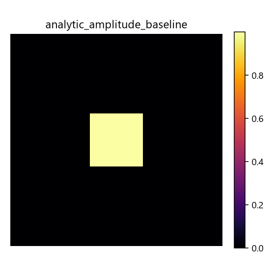
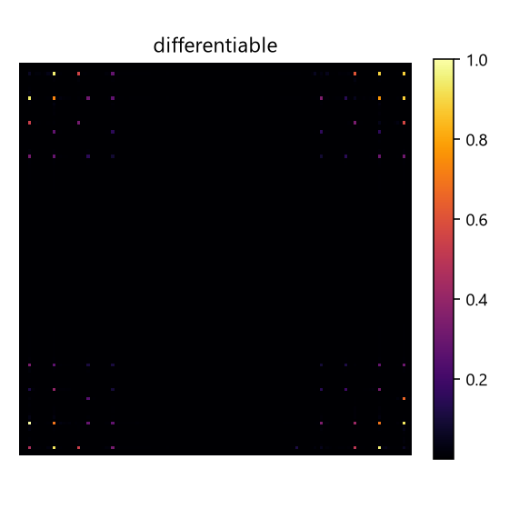
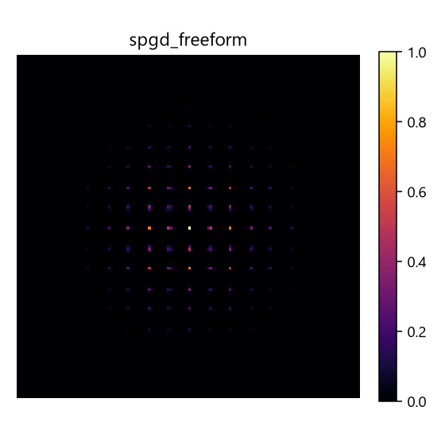

# 闭环 SLM 远场光斑整形 — 仿真基准报告

> 生成时间: 2026-09-25 09:31:56  
> 模型: 2f-Fourier 单相位 SLM (高斯入射 × 相位板 → 透镜 + 传播 → 焦平面)  
> 配置: n_grid=128, aperture=12mm, λ=532nm, f=125mm, target=square 32px

## 方法对比

| 方法 | PIB | efficiency | CV (越小越好) | Strehl† | zero_order | 迭代数 |
|------|-----|-----------|--------------|--------|-----------|--------|
| analytic_amplitude_baseline | 0.250 | 1.000 | 0.000 | 1.000 | 0.034 | 0 |
| unshaped_zero_phase | 0.480 | 0.480 | 4.380 | 0.175 | 0.034 | 0 |
| gerchberg_saxton | 0.357 | 0.430 | 2.837 | 0.247 | 0.027 | 150 |
| differentiable | 0.354 | 0.000 | 2.138 | -0.018 | 0.030 | 200 |
| spgd_freeform | 0.479 | 0.479 | 4.365 | 0.175 | 0.034 | 400 |

## 图像

- **analytic_amplitude_baseline** — 
- **unshaped_zero_phase** — 
- **gerchberg_saxton** — 
- **differentiable** — 
- **spgd_freeform** — 

## 说明

- **PIB** (power-in-bucket): 目标区域内能量占比，越高越好。
- **CV** (均匀性, 目标区内强度系数变异): 越低越好。
- **zero_order**: 中心零级(未衍射)占比；相位型 SLM 会保留零级，故非零。
- **Strehl†**: 归一化重叠（余弦相似度），越接近 1 越匹配目标。
  **† 不是物理 Strehl 比**：`slm_shaping_bench.py:309` 的 `strehl()` 实现为
  **均值中心化后的余弦相似度**，只是"Strehl-like"。真正的 Strehl 比是
  `峰值强度 / 理想峰值强度`。本表列名保留 `Strehl` 是为与既有表格对齐，
  **不可当作 Strehl 读**；命名决策见 `docs/zotero_objectives/README.md` §命名冲突。
- `analytic_amplitude_target` 是纯振幅基线（理想上界）；`unshaped_zero_phase` 是无整形基线。

> 本报告由 `scripts/generate_beam_shaping_papers_report.py` 生成，仿真基于 `ao_shaping.drivers.sim.slm_shaping_bench`。