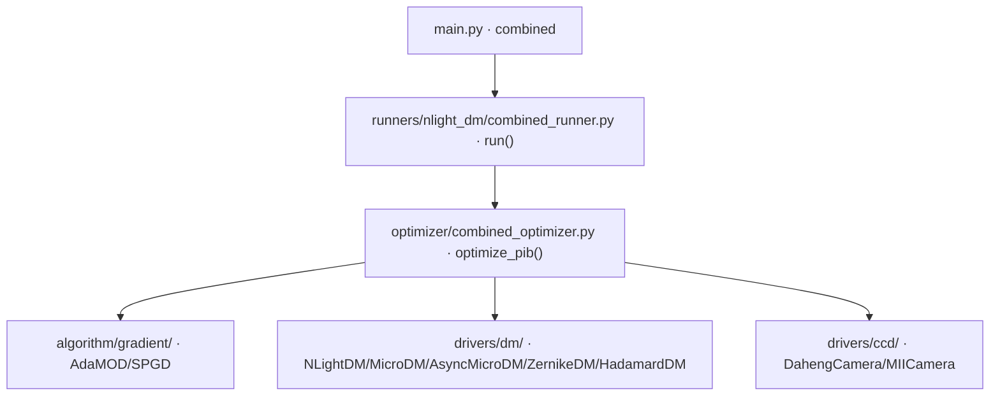

# AdaMOD+SPGD 混合 PIB 优化 (combined)

> **生成脚本**: [`scripts/generate_combined_report.py`](../../scripts/generate_combined_report.py)
> **复现命令**: `python scripts/generate_combined_report.py`
> **运行环境**: 离线 (纯源码静态分析; 不开设备)

## 1. 这条命令做什么

基于 AdaMOD + SPGD 混合策略的 PIB (桶内功率) 优化 (DM+CCD 无波前模式)。

**注意**：该 runner 功能仍通过 `combined` 命令可用，非废弃；`pipeline_runner` 是推荐的 WF→PIB 串行方案。

## 2. 调用关系



## 3. 混合策略

- **AdaMOD**：自适应学习率优化器，用于全局搜索阶段
- **SPGD**：随机并行梯度下降，用于局部精细优化
- 两者交替或按条件切换，结合全局探索与局部收敛能力

## 4. 主要选项

| 选项 | 说明 | 默认值 |
|------|------|--------|
| `-d, --root_dir` | 数据保存根目录 | data |
| `-f, --load_file` | 加载初始电压文件 | - |
| `--cam_id` | 远场光斑 CCD 设备 ID | Far_CAM_ID/0 |
| `-c, --center` | 光斑中心位置 (mass/auto/'x,y') | mass |
| `-t, --exposure_time_ms` | CCD 曝光时间 (ms, 0=不固定) | **0** |
| `-e, --epochs` | 优化迭代次数 | 4000 |
| `-r, --r_bucket` | 半径桶大小 (0=自动调整) | 0 |
| `--delta` | 优化步长 | 1.0 |
| `--lr` | 优化学习率 (0=动态衰减) | 0.0 |
| `--shrink_iter` / `--shrink_ratio` | 收缩半径桶迭代间隔/比例 | 0 / 0.9 |
| `-s, --cam_size` | 相机开窗大小 | 250 |
| `-b, --target_max_brightness` | 目标最大亮度值 | 40 |
| `--show` | 显示远场光斑 CCD 图像和优化历史 | False |
| `--dm_type` | 变形镜类型 (nlight/micro/asyn_micro/zernike/hadamard/auto) | auto-detect |

## 5. 多 DM 支持

同 `pib` 命令，支持 `nlight`/`micro`/`asyn_micro`/`zernike`/`hadamard`/`auto`。

## 6. 曝光默认值陷阱 (红线)

> **`--exposure_time_ms 0` = "不固定"，大恒驱动钳到 ~0.02 ms** (比可用区间 0.4–1.5 ms 暗 20–75×)。
> 上机前**必须显式传入按当前激光功率实测的曝光**。

## 7. 输出契约

- `data/combined/<日期>/`：优化历史 CSV、最优电压 NPY、最优远场图 PNG
- `--debug`：逐轮 CCD 帧、Recorder pkl

## 8. 示例

```bash
DEBUG=1 python src/ao_shaping/main.py combined --epochs 2000 --cam_size 250
```

## 9. 单独运行

```bash
python -m ao_shaping.runners.nlight_dm.combined_runner [OPTIONS]
```

## 10. 与 pipeline 的区别

| 项 | `pipeline` (推荐) | `combined` (legacy 保留) |
|----|-------------------|--------------------------|
| 策略 | 串行 WF→PIB，阶段清晰 | AdaMOD+SPGD 混合 |
| 反馈源 | WFS + CCD | 仅 CCD |
| 适用场景 | 有 WFS 硬件时首选 | 无 WFS 或纯 PIB 场景 |
| 维护状态 | 活跃开发 | 仅保留兼容 |