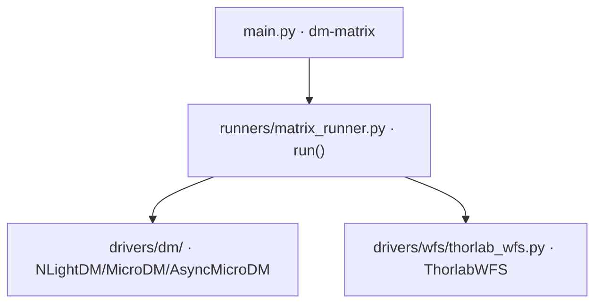

# DM 响应矩阵标定 (dm-matrix)

> **生成脚本**: [`scripts/generate_dm_matrix_report.py`](../../scripts/generate_dm_matrix_report.py)
> **复现命令**: `python scripts/generate_dm_matrix_report.py`
> **运行环境**: 离线 (纯源码静态分析; 不开设备)

## 1. 这条命令做什么

通过推拉电压扰动测量 DM-to-WFS 响应矩阵，支持顺序模式与哈达玛模式。

## 2. 调用关系



## 3. 两种校准模式

### Sequential (默认，逐单元推拉)
- 逐个有效致动器施加 `±voltage` 扰动
- 每次读取 WFS 响应 (平均 `--n-averages` 帧)
- 正负交替 `--n-cycles` 次消除漂移
- 测量次数 = `2 × n_actuators × n_cycles`

### Hadamard (哈达玛模式)
- 所有有效单元按哈达玛行**同时**推拉
- 哈达玛矩阵阶数 `mode_order` (2 的幂次，≥ 有效单元数)
- 测量次数 = `mode_order²` (显著少于顺序模式)
- 利用哈达玛正交性解码各单元响应

## 4. 主要选项

| 选项 | 说明 | 默认值 |
|------|------|--------|
| `--voltage` | 扰动电压 (0=自动优化) | 0.1 |
| `--n-averages` | 每次 WFS 读取次数 M | 10 |
| `--n-cycles` | 正负交替循环次数 N | 10 |
| `--wait` | 电压施加后等待时间 (s) | 0.1 |
| `--output` | 输出文件路径 | data/dm_response_matrix |
| `--dm-unit-mask` | DM 单元掩码 (逗号分隔 0/1) | 全部有效 |
| `--mla-index` | MLA 分辨率 (512/540/600/768/1280) | 512 |
| `--exp-time` | WFS 曝光时间 (ms, 0=自动) | 0.0 |
| `--auto-exposure/--no-auto-exposure` | 启用 WFS 自动曝光 | True |
| `--high-speed` | 启用高速模式 | False |
| `--use-custom-ref` | 使用自定义参考文件 | False |
| `--pupil-diameter` | 瞳孔直径 (mm) | 2.0 |
| `--pupil-center` | 瞳孔中心坐标 | (0,0) |
| `--no-inverses` | 不计算逆矩阵 | False |
| `--cancel-tile` | 测量时去除 WFS tip/tilt | False |
| `--auto-optimize/--no-auto-optimize` | 自动优化每路扰动电压 (voltage=0 时) | True |
| `--optimize-n-avg` | 电压优化时 WFS 读取次数 | 10 |
| `--mode [sequential\|hadamard]` | 校准模式 | sequential |
| `--hadamard-order` | 哈达玛矩阵阶数 (mode=hadamard 时) | 自动取 ≥有效单元数的最小 2 的幂 |

## 5. 哈达玛模式模式数量

| mode_order | 模式数 (mode_order²) |
|------------|---------------------|
| 8 | 64 |
| 16 | 256 |
| 32 | 1024 |

## 6. 自动电压优化 (`--voltage 0`)

当 `--voltage 0` 时：
1. 对每个致动器二分搜索合适扰动电压
2. 目标：WFS 响应信号在动态范围内 (不饱和、不淹没在噪声中)
3. `--optimize-n-avg` 控制搜索时的平均帧数

## 7. 输出契约

- `data/dm_response_matrix.h5` (或指定路径)：
  - `response_matrix`：`(n_modes, n_actuators)` 或 `(n_wfs_modes, n_actuators)`
  - `pseudo_inverse`：伪逆矩阵 (用于闭环控制)
  - `actuator_mask`：有效致动器掩码
  - `voltage`：使用的扰动电压
  - `mla_index` / `pupil_diameter` / `pupil_center`：几何参数
  - `timestamp`：标定时间

## 8. 示例

```bash
# 默认逐单元推拉
DEBUG=1 python src/ao_shaping/main.py dm-matrix --voltage 0.2 --n-averages 5 --output data/dm_response.h5

# 哈达玛模式 (所有单元同时扰动，测量次数更少)
python src/ao_shaping/main.py dm-matrix --mode hadamard --output data/dm_response_had.h5
```

## 9. 单独运行

```bash
python -m ao_shaping.runners.matrix_runner [OPTIONS]
```

## 10. 与 hadamard-matrix 的区别

| 项 | `dm-matrix` | `hadamard-matrix` |
|----|-------------|-------------------|
| 驱动设备 | DM (NLight/Micro) | SLM (Santec) |
| 测量设备 | WFS (Thorlabs) | WFS (Thorlabs) |
| 模式基础 | 单致动器 / 哈达玛行 | 哈达玛相位模式 |
| 适用场景 | DM 电压→波前响应 | SLM 哈达玛相位→波前响应 |