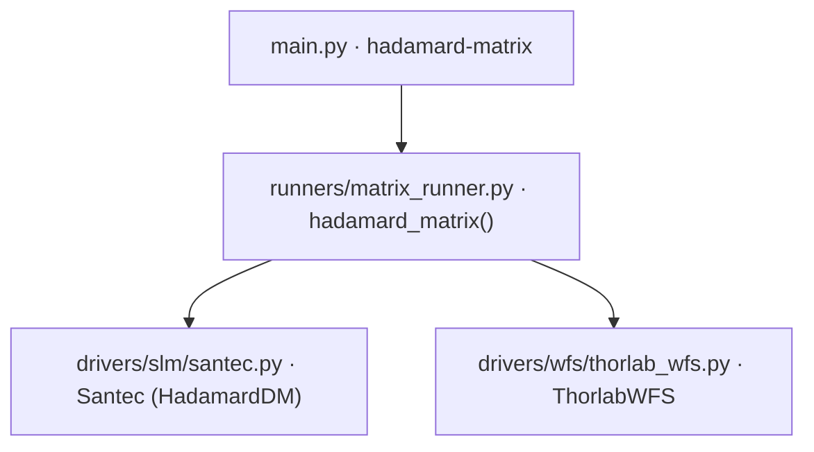

# Hadamard 响应矩阵标定 (hadamard-matrix)

> **生成脚本**: [`scripts/generate_hadamard_matrix_report.py`](../../scripts/generate_hadamard_matrix_report.py)
> **复现命令**: `python scripts/generate_hadamard_matrix_report.py`
> **运行环境**: 离线 (纯源码静态分析; 不开设备)

## 1. 这条命令做什么

使用 HadamardDM 逐一加载各阶 Hadamard 相位模式，测量对应的 Thorlabs WFS 响应，建立 Hadamard 模式命令到 WFS 响应的响应矩阵。

与 `dm-matrix` 类似，但驱动设备是 SLM (Santec)，模式基础是 Walsh-Hadamard 相位模式。

## 2. 调用关系



## 3. 算法流程

1. **初始化**：打开 SLM (HadamardDM 模式) 与 WFS
2. **生成哈达玛模式**：阶数 `mode_order` (2 的幂次)，生成 `mode_order²` 个 Walsh-Hadamard 相位模式
3. **逐模式测量**：
   - SLM 加载第 `i` 个哈达玛相位模式 (幅度 `magnitude` 波长)
   - 等待 `--wait` 秒
   - WFS 读取 `--n-averages` 帧平均
   - 可选：正负交替 `--n-cycles` 次消除漂移
4. **矩阵组装**：堆叠所有 WFS 响应向量 → 响应矩阵 `R ∈ ℝ^{n_wfs_modes × n_hadamard_modes}`
5. **伪逆计算**：`R⁺ = pinv(R)`
6. **保存**：输出 `.h5` 文件

## 4. 主要选项

| 选项 | 说明 | 默认值 |
|------|------|--------|
| `--mode-order` | 哈达玛矩阵阶数 (2 的幂次) | 8 |
| `--magnitude` | 扰动幅度 (波长) | 0.5 |
| `--n-averages` | 每次 WFS 读取次数 M | 10 |
| `--n-cycles` | 正负交替循环次数 N | 1 |
| `--wait` | 等待时间 (s) | 0.1 |
| `--output` | 输出文件路径 | data/hadamard_response_matrix |
| `--resolution` | SLM 分辨率 (宽,高) | "1920,1080" |
| `--wavelength` | 工作波长 (nm) | 1064 |
| `--mla-index` | MLA 分辨率 (512/540/600/768/1280) | 512 |
| `--exp-time` | WFS 曝光时间 (ms, 0=自动) | 0.0 |
| `--auto-exposure/--no-auto-exposure` | 启用 WFS 自动曝光 | True |
| `--high-speed` | 启用高速模式 | False |
| `--use-custom-ref` | 使用自定义参考文件 | False |
| `--no-inverses` | 不计算伪逆矩阵 | False |
| `--display/--no-display` | 显示实时 pygame 显示 | off |
| `--debug` | 启用调试模式 | False |

## 5. 模式数量

| mode_order | 哈达玛模式数 (mode_order²) |
|------------|---------------------------|
| 8 | 64 |
| 16 | 256 |
| 32 | 1024 |

## 6. 输出契约

- `data/hadamard_response_matrix.h5` (或指定路径)：
  - `response_matrix`：`(n_wfs_modes, n_hadamard_modes)`
  - `pseudo_inverse`：伪逆矩阵
  - `hadamard_order`：矩阵阶数
  - `magnitude`：扰动幅度 (波长)
  - `wavelength`：工作波长
  - `resolution`：SLM 分辨率
  - `mla_index`：MLA 分辨率
  - `timestamp`：标定时间

## 7. 示例

```bash
python src/ao_shaping/main.py hadamard-matrix --mode-order 16 --n-averages 5 --output data/had_resp
```

## 8. 单独运行

```bash
python -m ao_shaping.runners.matrix_runner hadamard-matrix [OPTIONS]
```

## 9. 与 dm-matrix 的区别

| 项 | `dm-matrix` | `hadamard-matrix` |
|----|-------------|-------------------|
| 驱动设备 | DM (NLight/Micro) | SLM (Santec, HadamardDM) |
| 测量设备 | WFS (Thorlabs) | WFS (Thorlabs) |
| 模式基础 | 单致动器电压 / 哈达玛行电压 | Walsh-Hadamard 相位模式 |
| 适用场景 | DM 电压→波前响应 | SLM 哈达玛相位→波前响应 |
| 哈达玛阶数 | `--hadamard-order` (mode=hadamard 时) | `--mode-order` (固定哈达玛模式) |