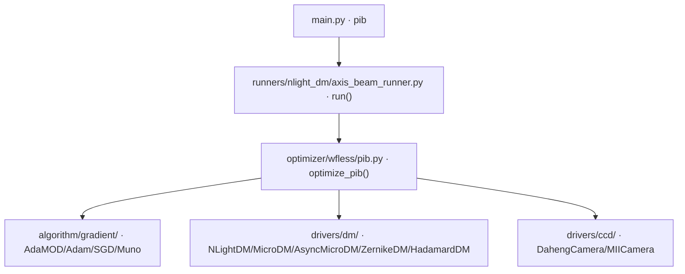

# PIB 优化 (pib)

> **生成脚本**: [`scripts/generate_pib_report.py`](../../scripts/generate_pib_report.py)
> **复现命令**: `python scripts/generate_pib_report.py`
> **运行环境**: 离线 (纯源码静态分析; 不开设备)

## 1. 这条命令做什么

基于 NLight 变形镜 (DM) 电压控制 + CCD 远场光斑反馈，使用 SPGD 优化 DM 电压，最大化桶内功率比 (PIB, Power-in-Bucket)。

## 2. 调用关系



## 3. 算法流程

1. **初始化**：打开 DM 与 CCD，读取初始帧定位光斑中心
2. **中心计算**：`center='mass'` (质心) / `'max'` (峰值) / `'auto'` / `'x,y'` (固定)
3. **桶半径**：`r_bucket` (默认 18 px)，可自适应收缩 (`shrink_iter`, `shrink_ratio`)
4. **主优化循环** (每轮 2 帧 SPGD)：
   - 生成随机扰动向量 `u ∈ ℝ^{n_actuators}`
   - `voltage ± δ·u` 下发 DM
   - 读 CCD，`_prepare_frame` (去背景+裁剪)
   - 计算 PIB：桶内功率 / 总功率
   - 梯度估计：`g = (PIB(+δ) - PIB(-δ)) / (2δ) * u`
   - 优化器更新：`v ← optimizer.update(g)` (AdaMOD/Adam/SGD/Muno)
   - 桶半径自适应收缩 (可选)
   - 学习率/δ 自适应调度 (可选)
5. **早停**：达到 `epochs`

## 4. 主要选项

| 选项 | 说明 | 默认值 |
|------|------|--------|
| `-f, --load_file` | 加载优化结果文件 | - |
| `--cam_id` | 远场光斑 CCD 设备 ID | 0 |
| `-c, --center` | 光斑中心位置 (mass/max/auto/'x,y') | mass |
| `-t, --exposure_time_ms` | CCD 曝光时间 (ms) | 800 |
| `-e, --epochs` | 优化迭代次数 | 4000 |
| `-r, --r_bucket` | 桶半径 (px) | 18 |
| `--delta` | 优化步长 (δ, V) | 2 |
| `--lr` | 优化学习率 | 2 |
| `--weight_decay` | 权重衰减 | 0.0 |
| `--shrink_iter` | 收缩半径桶迭代间隔 | 300 |
| `--shrink_ratio` | 收缩比例 | 0.8 |
| `-s, --cam_size` | 相机开窗大小 | 200 |
| `--dm_type` | 变形镜类型 (nlight/micro/asyn_micro/zernike/hadamard/auto) | auto-detect |

## 5. 多 DM 支持

`optimize_pib` 接受任意 `DM` 子类实例，命令行 `--dm_type` 支持：
- `nlight`：NLightDM
- `micro`：MicroDM (同步 R50Power)
- `asyn_micro`：AsyncMicroDM (异步 R50Power)
- `zernike`：ZernikeDM
- `hadamard`：HadamardDM
- `auto` (默认)：自动探测在线 DM，仅一个时自动选取，多个时报错提示

## 6. 仿真模式

```bash
python src/ao_shaping/main.py pib --cam_type sim --dm_type sim -e 200
```

> DM→相位耦合已接入仿真 (2026-10-01)：`SimDmOptics` 把 DM 电压映射为瞳孔相位，经 `SimPibSystem.dm_optics` 在 `far_field()` 的 cache-miss 分支叠加。修复前仿真结果**没有物理意义** (DM 动作对远场无影响)。修复后实测 `pib --cam_type sim --dm_type sim -e 200`，目标函数真实上升：pib 0.66 → 2.33 → **2.98** (修复前 200 epoch 恒为 0.0145)。

## 7. 曝光默认值陷阱 (红线)

> **`--exposure_time_ms` 默认 800 ms 仅为历史兼容**。新实验建议显式传入实测曝光值。

## 8. 输出契约

- `data/pib/<日期>/`：优化历史 CSV (每轮 PIB、电压范数、学习率)、最优电压 NPY、最优远场图 PNG
- `--debug`：逐轮 CCD 帧、Recorder pkl

## 9. 单独运行

```bash
python -m ao_shaping.runners.nlight_dm.axis_beam_runner [OPTIONS]
```