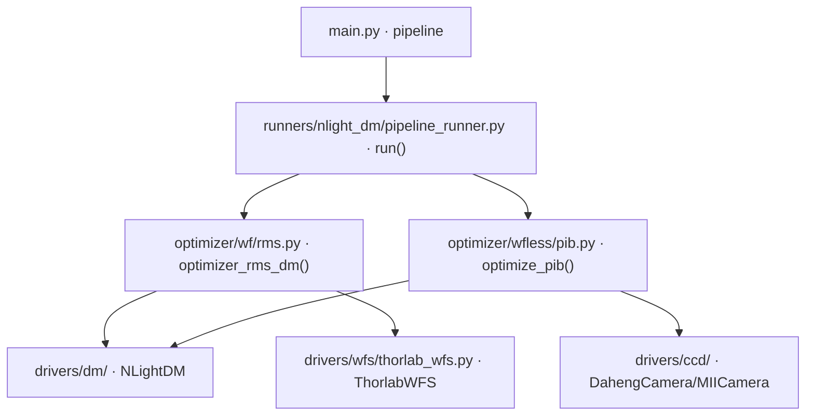

# 串行 WF→PIB 流水线 (pipeline)

> **生成脚本**: [`scripts/generate_pipeline_report.py`](../../scripts/generate_pipeline_report.py)
> **复现命令**: `python scripts/generate_pipeline_report.py`
> **运行环境**: 离线 (纯源码静态分析; 不开设备)

## 1. 这条命令做什么

串行执行波前 RMS 优化 (`wf`) → PIB 优化 (`pib`)，集成 WFS 与 CCD 双反馈，实现高质量光束输出。

推荐的 WF→PIB 串行方案 (`combined` 为 legacy 保留)。

## 2. 调用关系



## 3. 处理流程详解

### 使用的设备
1. **波前传感器 (WFS)**：Thorlabs WFS 系列，测量光波前畸变
2. **变形镜 (DM)**：NLight DM 设备，校正光波前
3. **CCD 相机**：大恒相机/MIICAM 系统，捕捉远场光斑图像

### 算法流程

#### 第一阶段：波前优化 (RMS 优化)
1. 初始化 DM 电压为零或从文件加载初始电压 (`--load_file`)
2. 使用 WFS 测量当前波前，计算 RMS 值
3. 应用扰动法，分别向正负方向施加随机扰动电压
4. 测量扰动后的波前 RMS 值
5. 根据 RMS 差异计算梯度，更新 DM 电压 (Adam/AdaMOD)
6. 重复直到 RMS 达到阈值 (`--rms_threshold`) 或完成预定迭代次数

#### 第二阶段：PIB 优化 (远场光斑优化)
1. 基于第一阶段优化结果初始化 DM 电压
2. 使用 CCD 相机捕获远场光斑图像
3. 计算光斑中心和桶内功率 (PIB)
4. 应用扰动法，分别向正负方向施加随机扰动电压
5. 测量扰动后的光斑图像，计算 PIB 值
6. 根据 PIB 差异计算梯度，更新 DM 电压 (AdaMOD/Adam/SGD/Muno)
7. 重复直到完成预定迭代次数

### CCD 中心计算方法
- **最大值法**：`np.unravel_index(np.argmax(img), img.shape)[::-1]`
- **质心法**：强度加权计算质心位置
- **形状识别法**：阈值分割识别光斑区域，计算该区域质心

### 优化目标
1. **第一阶段目标**：最小化波前 RMS 值，使光波前尽可能接近理想平面波
2. **第二阶段目标**：最大化 PIB 值，将更多光能集中到目标区域内

### 关键技术细节
1. **自适应学习率**：根据当前优化状态动态调整学习率和扰动幅度
2. **桶半径自适应收缩**：随着优化进展逐步缩小功率计算区域，提高聚焦精度
3. **安全检查机制**：监控相邻 DM 单元间的电压差，防止损坏设备
4. **曝光时间自适应调节**：根据图像亮度自动调整相机曝光时间
5. **可视化监控**：实时显示优化过程中的图像、波前和电压变化

## 4. 主要选项

| 选项 | 说明 | 默认值 |
|------|------|--------|
| `-f, --load_file` | 加载优化结果文件 | - |
| `-e, --epochs` | 优化迭代次数 (WF+PIB 总轮数) | 8000 |
| `-R, --wfs_res` | WFS 分辨率 | 768 |
| `-p, --pupil_diameter` | 瞳孔直径 | 2.7 |
| `-c, --cam_id` | 远场光斑 CCD 设备 ID | 0 |
| `-t, --exposure_time_ms` | CCD 曝光时间 (ms) | 500 |
| `-s, --cam_size` | 相机开窗大小 | 160 |
| `-r, --rms_threshold` | RMS 阈值 (WF 阶段早停) | 0.12 |
| `-u, --dm_unit_mask` | DM 单元掩码 | all |
| `--wfs_type` | WFS 类型 (thorlab/sim) | thorlab |

## 5. 仿真模式

```bash
DEBUG=1 python src/ao_shaping/main.py pipeline --wfs_type sim --dm_type sim -e 1000
```

## 6. 输出契约

- `data/pipeline/<日期>/`：两阶段历史 CSV、阶段间电压 NPY、最终电压 NPY、WFS 波前图、最优远场图 PNG
- `--debug`：逐轮 WFS/CCD 帧、Recorder pkl

## 7. 单独运行

```bash
python -m ao_shaping.runners.nlight_dm.pipeline_runner [OPTIONS]
```

## 8. 与 combined 的区别

| 项 | `pipeline` (推荐) | `combined` (legacy) |
|----|-------------------|---------------------|
| 策略 | 串行 WF→PIB，阶段清晰 | AdaMOD+SPGD 混合 |
| 阶段分离 | 显式两阶段 | 隐式混合 |
| 维护状态 | 活跃开发 | 仅保留兼容 |