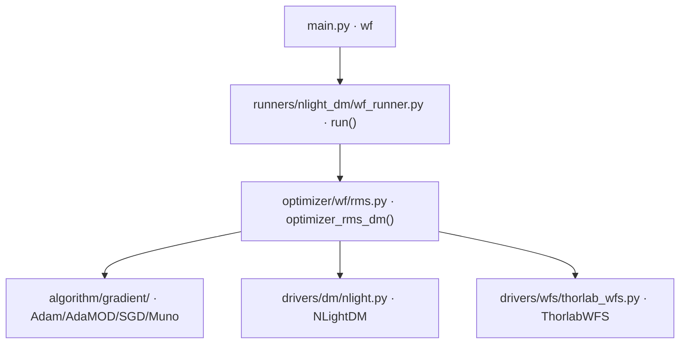

# 波前 RMS 优化 (wf)

> **生成脚本**: [`scripts/generate_wf_report.py`](../../scripts/generate_wf_report.py)
> **复现命令**: `python scripts/generate_wf_report.py`
> **运行环境**: 离线 (纯源码静态分析; 不开设备)

## 1. 这条命令做什么

基于 NLight 变形镜 (DM) 电压控制 + Thorlabs WFS 测量，使用 SPGD (随机并行梯度下降) 优化 DM 电压，最小化波前 RMS。

## 2. 调用关系



## 3. 算法流程

1. **初始化**：打开 DM 与 WFS，设置瞳孔参数 (分辨率、直径)
2. **基线采集**：读取 WFS 基线波前，计算初始 RMS
3. **主优化循环** (每轮 2 次 WFS 读取：`+δ` / `-δ`)：
   - 生成随机扰动向量 `u ∈ ℝ^{n_actuators}` (单位球面均匀采样)
   - `voltage ± δ·u` 下发 DM
   - 读 WFS，计算波前 RMS
   - 中心差分估梯度：`g = (RMS(+δ) - RMS(-δ)) / (2δ) * u`
   - 优化器更新：`v ← optimizer.update(g)`
   - 电压安全检查：相邻致动器电压差 ≤ 阈值，单通道电压 ∈ [V_min, V_max]
   - 学习率/δ 自适应调度 (可选)
4. **早停**：RMS < `early_stop_threshold` 或达到 `epochs`

## 4. 主要选项

| 选项 | 说明 | 默认值 |
|------|------|--------|
| `-e, --epochs` | 优化迭代次数 | 20000 |
| `-r, --wfs_res` | WFS 分辨率 | 768 |
| `-p, --pupil_diameter` | 瞳孔直径 | 2.7 |
| `-t, --early_stop_threshold` | 早停阈值 | 0.0 |
| `--wfs_type` | WFS 类型 (thorlab/sim) | thorlab |
| `--disturbance-cn2` | 仿真 WFS 湍流强度 cn2 (0=不注入像差) | 0 |
| `--lr` | 覆盖自动学习率 | 自动调度 |
| `--delta` | 覆盖 SPGD 扰动幅度 δ (V) | 自动调度 |

## 5. 仿真模式

```bash
# 无硬件全仿真 (仿真 DM + 仿真 Shack-Hartmann WFS)
python src/ao_shaping/main.py wf --wfs_type sim --dm_type sim \
    --disturbance-cn2 2e-13 --lr 8 -e 400
```

> ⚠️ **仿真下必须先注入像差**：`disturbance_cn2` 为 0 时 DM 只能增加相位，平场命令就是 RMS 最优解，SPGD 正确地不动 —— 这不是 bug。要看到真实校正过程须给非零 `--disturbance-cn2`。

> ⚠️ **仿真收敛比硬件慢约一个数量级**：`schedule_lr_delta` 按**真实硬件**的电压→相位标度标定，对仿真 DM `delta=3 V` 时单致动器峰值相位只有 0.017 waves ≈ 目标量的 2.6%，梯度信号偏弱。实测 200 epoch 降 1.5%、400 降 5.6%、800 降 18.0%；用 `--lr 8 -e 400` 可达 19.0%。`--lr 40` 会**发散**。**判定"不收敛"前先确认 epoch 足够** —— 慢不等于不收敛。

## 6. 电压安全检查

- 单通道电压限幅：`np.clip(v, V_min, V_max)` (NLight: -300V~499V)
- 相邻致动器电压差检查：`|v[i] - v[j]| ≤ max_diff` (防止 DM 损坏)
- 违规时自动缩放整体电压幅度

## 7. 输出契约

- `data/wf/<日期>/`：优化历史 CSV (每轮 RMS、电压范数、学习率)、最优电压 NPY、WFS 波前图
- `--debug`：逐轮 WFS 原始帧、斜度图、Recorder pkl

## 8. 单独运行

```bash
python -m ao_shaping.runners.nlight_dm.wf_runner [OPTIONS]
```

## 9. 函数名区分

| 文件 | 函数 | 用途 |
|------|------|------|
| `optimizer/wf/rms.py` | `optimizer_rms_dm()` | DM 电压控制 + WFS (用于 `wf`, `pipeline`) |
| `optimizer/wf/rms_by_zernike.py` | `optimizer_rms_slm()` | SLM Zernike 相位控制 + WFS (用于 `rms-zernike`) |