# FourierGSNet 湍流仿真矩阵报告

**生成时间**: 2026-09-22 23:47:43
**数据来源**: `/home/ws/code/AO-shaping/data/fouriergsnet_sim/native_w4b` (矩阵运行时间 2026-09-22 23:46:10)

**Fully offline** — 本报告由 `scripts/generate_fouriergsnet_sim_report.py` 离线生成, 仅读取已保存的矩阵产物 (config/summary/metrics/frames), 不打开任何硬件。

## 1. 矩阵配置

| 参数 | 值 |
|---|---|
| 网格 K (k_px) | 512 |
| 闭环步数 (steps) | 30 |
| 基础种子 (base_seed) | 42 |
| 计算设备 | cuda |
| 在线 replay | False |
| 自适应 GS 初值迭代 | 5 |
| 原生像素节距 (native) | 是 (64×64 方板) |
| 峰值光子数 | 50000.0 |
| 读出噪声 (e-) | 2.0 |
| 标定噪声 | ΔK=0.02, 中心偏移 2.0px, 旋转 0.3° |
| 场景数 | 12 (12 成功) |

## 2. 汇总表

| shape | aberration | turbulence | final_uniformity | best_uniformity | final_encircled | best_encircled | wall_time_s | ok |
|---|---|---|---|---|---|---|---|---|
| gaussian | defocus | off | 0.0002 | 0.0005 | 4461408 | 4461408 | 1.3 | ✓ |
| square | defocus | off | 0.0138 | 0.0650 | 1766669 | 1766669 | 1.6 | ✓ |
| gaussian | mixed | off | 0.0000 | 0.0005 | 3532609 | 3532609 | 1.5 | ✓ |
| square | mixed | off | 0.0191 | 0.0417 | 2927598 | 2927598 | 1.6 | ✓ |
| gaussian | none | off | 0.0000 | 0.0008 | 2088840 | 2088840 | 1.3 | ✓ |
| square | none | off | 0.0519 | 0.0686 | 1908546 | 1908546 | 2.1 | ✓ |
| gaussian | defocus | slow | 0.0000 | 0.0004 | 4769387 | 4769387 | 2.3 | ✓ |
| square | defocus | slow | 0.0106 | 0.0519 | 3739152 | 3739152 | 2.4 | ✓ |
| gaussian | mixed | slow | 0.0000 | 0.0007 | 3024851 | 3024851 | 2.2 | ✓ |
| square | mixed | slow | 0.0112 | 0.0712 | 2014317 | 2014317 | 2.4 | ✓ |
| gaussian | none | slow | 0.0000 | 0.0006 | 5077626 | 5077626 | 1.9 | ✓ |
| square | none | slow | 0.0346 | 0.0806 | 2164570 | 2164570 | 2.4 | ✓ |

## 3. 逐场景分析

### gaussian__defocus__off

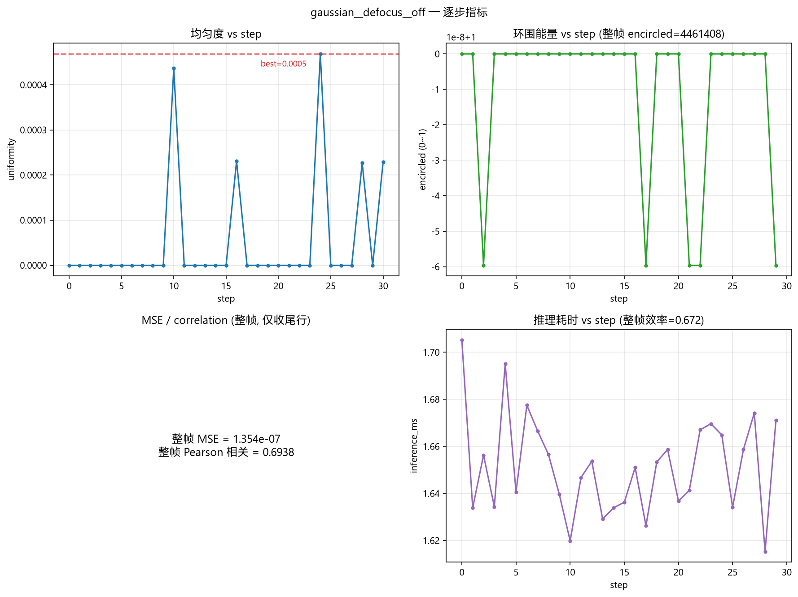

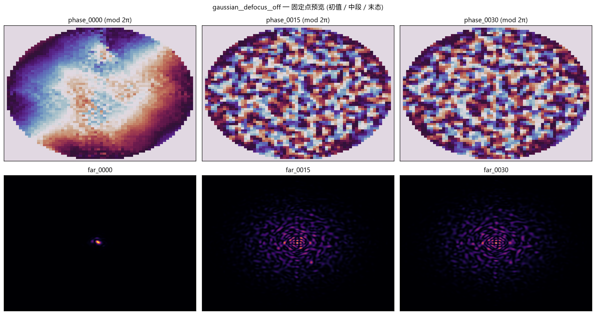

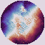

- 目标形状 **gaussian**, 静态像差 **defocus**, 湍流 **off**。
- 均匀度: 初值 (adaptive_gs_init 后) **0.000** → 最终 **0.000** (最佳 **0.000**, 变化 +0.000 / —)。
- 环围能量 (逐步, 0~1): **1.000** → **1.000**。
- 均匀度 (min/mean) 为平顶目标指标, 对 gaussian 目标恒≈0; 以环围能量/相关性/效率评估整形效果。

### square__defocus__off

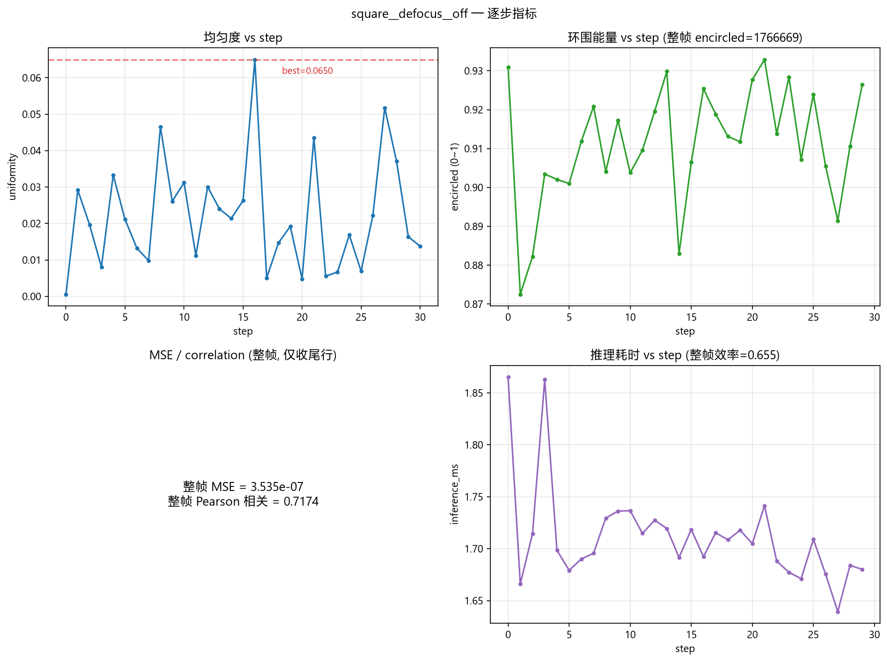

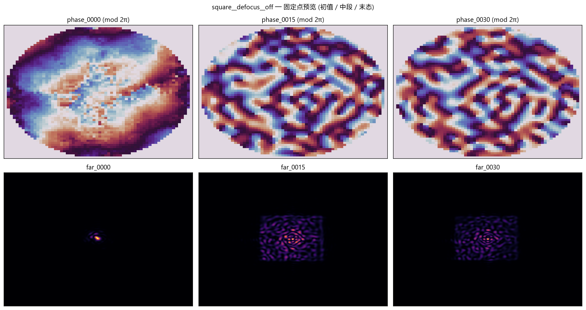

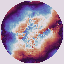

- 目标形状 **square**, 静态像差 **defocus**, 湍流 **off**。
- 均匀度: 初值 (adaptive_gs_init 后) **0.001** → 最终 **0.014** (最佳 **0.065**, 变化 +0.013 / +2230.2%)。
- 环围能量 (逐步, 0~1): **0.931** → **0.926**。
- 无湍流: 静态像差下闭环精修 GS 初值, 均匀度应波动上升并趋于固定点。

### gaussian__mixed__off

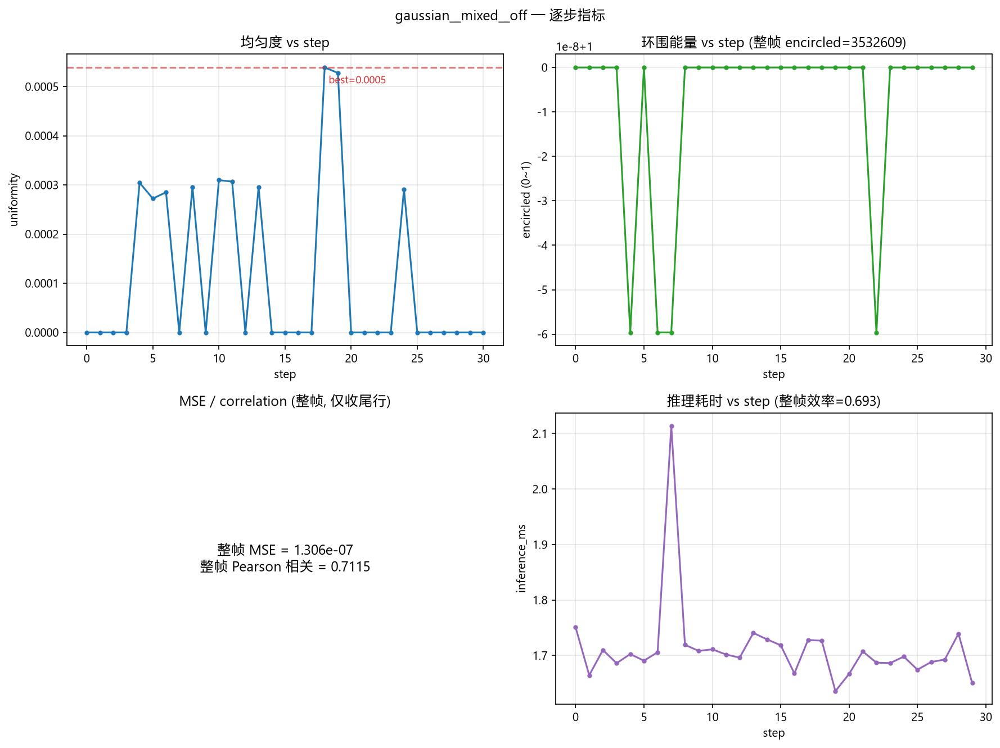

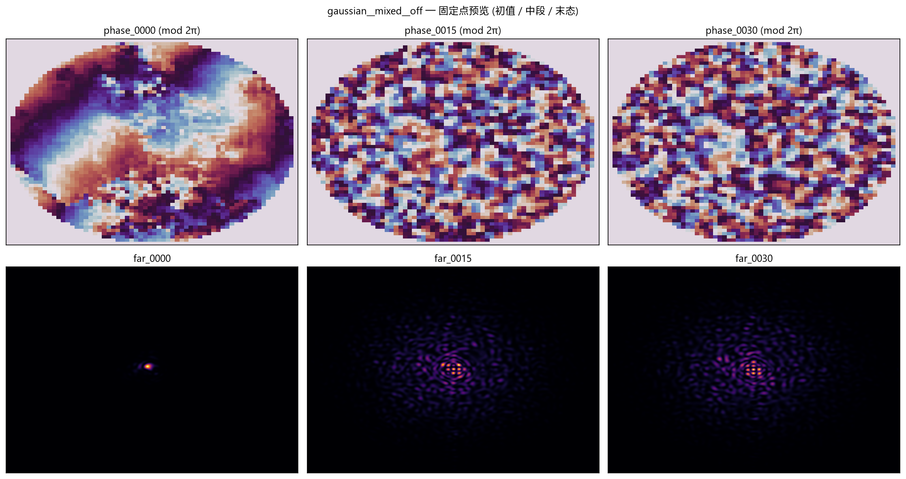

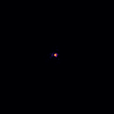

- 目标形状 **gaussian**, 静态像差 **mixed**, 湍流 **off**。
- 均匀度: 初值 (adaptive_gs_init 后) **0.000** → 最终 **0.000** (最佳 **0.001**, 变化 +0.000 / —)。
- 环围能量 (逐步, 0~1): **1.000** → **1.000**。
- 均匀度 (min/mean) 为平顶目标指标, 对 gaussian 目标恒≈0; 以环围能量/相关性/效率评估整形效果。

### square__mixed__off

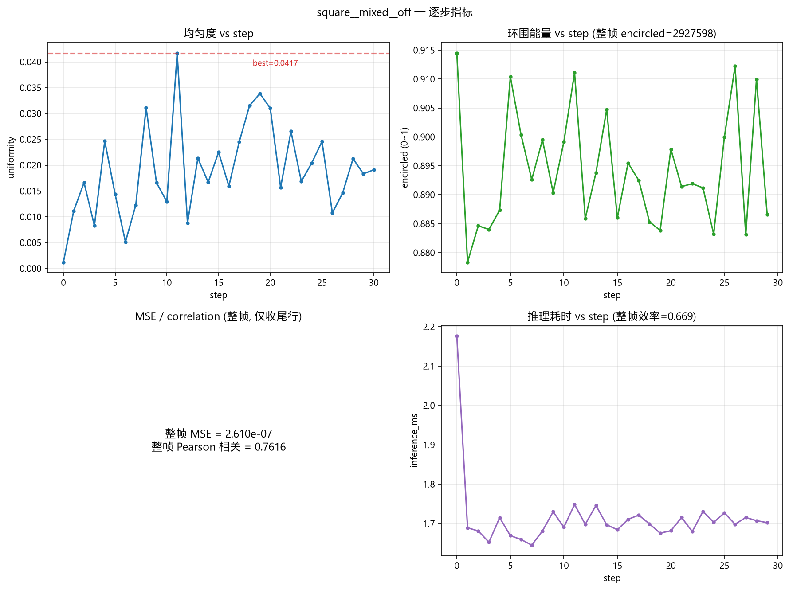

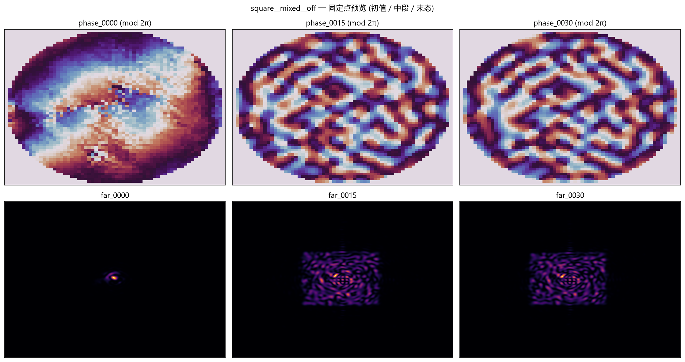

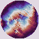

- 目标形状 **square**, 静态像差 **mixed**, 湍流 **off**。
- 均匀度: 初值 (adaptive_gs_init 后) **0.001** → 最终 **0.019** (最佳 **0.042**, 变化 +0.018 / +1484.6%)。
- 环围能量 (逐步, 0~1): **0.914** → **0.887**。
- 无湍流: 静态像差下闭环精修 GS 初值, 均匀度应波动上升并趋于固定点。

### gaussian__none__off

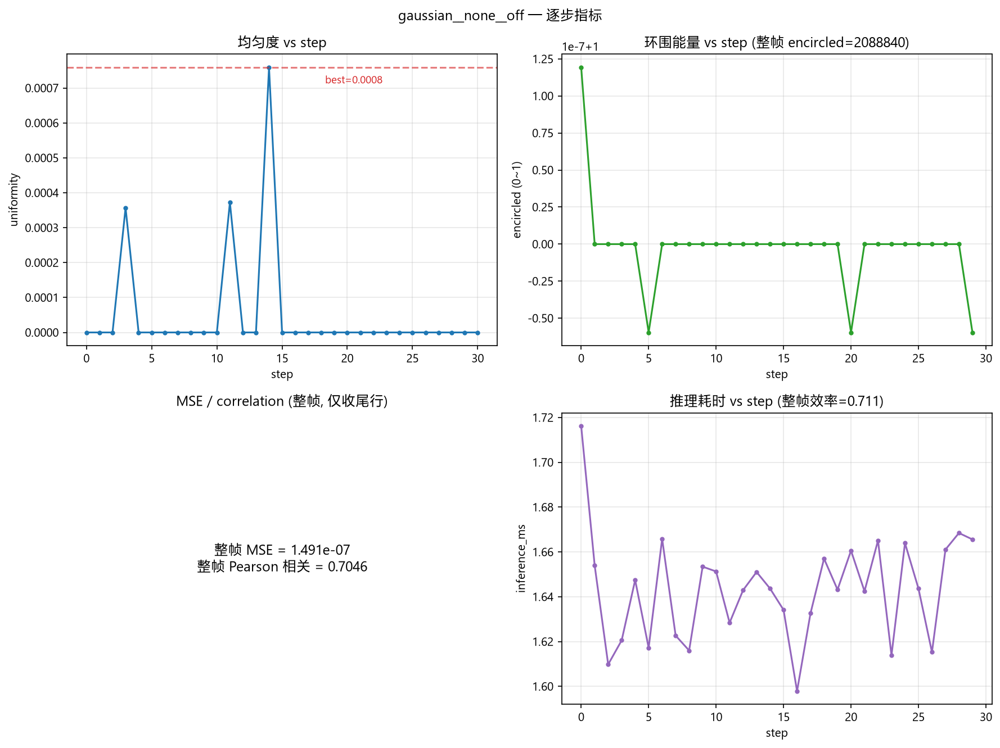

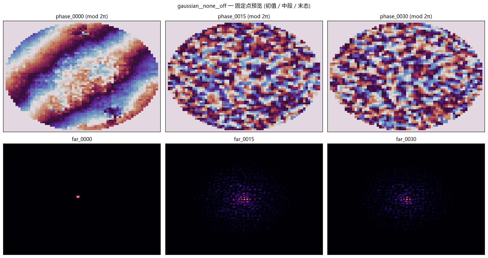

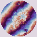

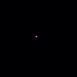

- 目标形状 **gaussian**, 静态像差 **none**, 湍流 **off**。
- 均匀度: 初值 (adaptive_gs_init 后) **0.000** → 最终 **0.000** (最佳 **0.001**, 变化 +0.000 / —)。
- 环围能量 (逐步, 0~1): **1.000** → **1.000**。
- 均匀度 (min/mean) 为平顶目标指标, 对 gaussian 目标恒≈0; 以环围能量/相关性/效率评估整形效果。

### square__none__off

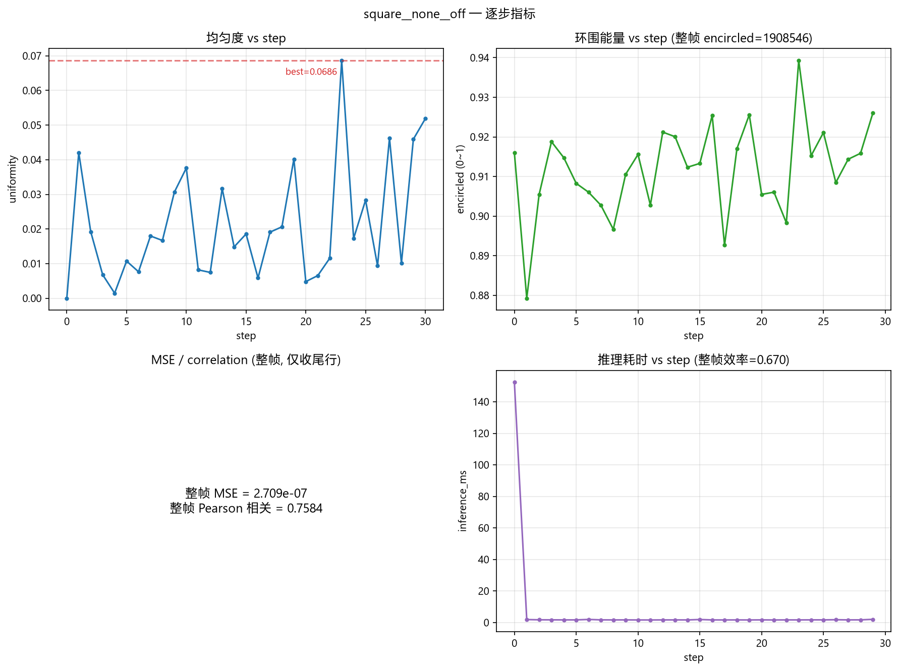

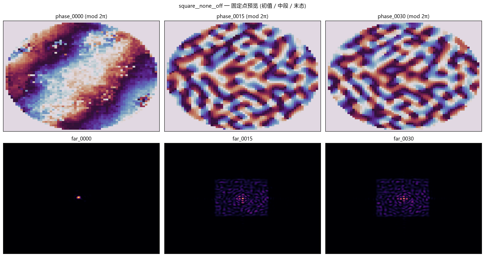

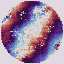

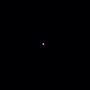

- 目标形状 **square**, 静态像差 **none**, 湍流 **off**。
- 均匀度: 初值 (adaptive_gs_init 后) **0.000** → 最终 **0.052** (最佳 **0.069**, 变化 +0.052 / —)。
- 环围能量 (逐步, 0~1): **0.916** → **0.926**。
- 无湍流: 静态像差下闭环精修 GS 初值, 均匀度应波动上升并趋于固定点。

### gaussian__defocus__slow

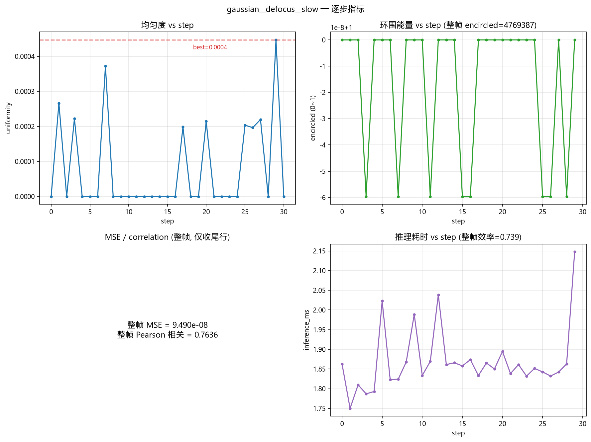

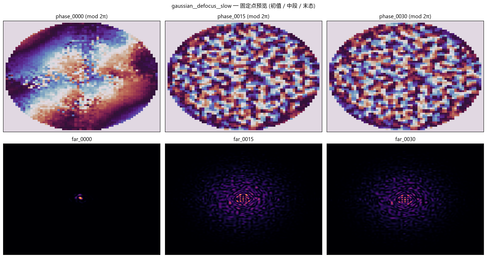

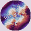

- 目标形状 **gaussian**, 静态像差 **defocus**, 湍流 **slow**。
- 均匀度: 初值 (adaptive_gs_init 后) **0.000** → 最终 **0.000** (最佳 **0.000**, 变化 +0.000 / —)。
- 环围能量 (逐步, 0~1): **1.000** → **1.000**。
- 均匀度 (min/mean) 为平顶目标指标, 对 gaussian 目标恒≈0; 以环围能量/相关性/效率评估整形效果。

### square__defocus__slow

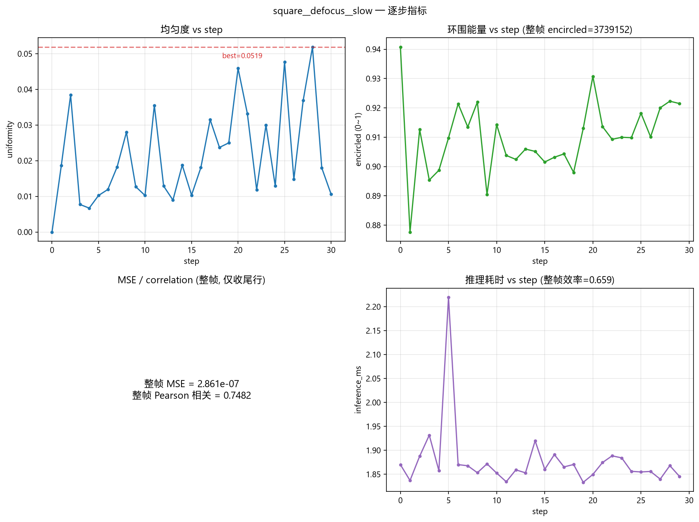

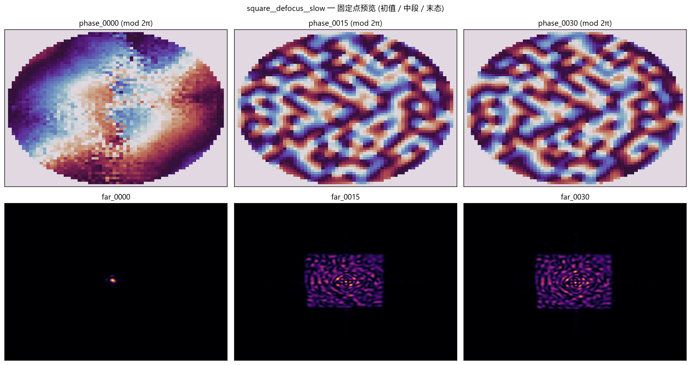

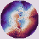

- 目标形状 **square**, 静态像差 **defocus**, 湍流 **slow**。
- 均匀度: 初值 (adaptive_gs_init 后) **0.000** → 最终 **0.011** (最佳 **0.052**, 变化 +0.011 / —)。
- 环围能量 (逐步, 0~1): **0.941** → **0.921**。
- **slow** 湍流导致跟踪退化: 最终均匀度低于最佳值 0.041。

### gaussian__mixed__slow

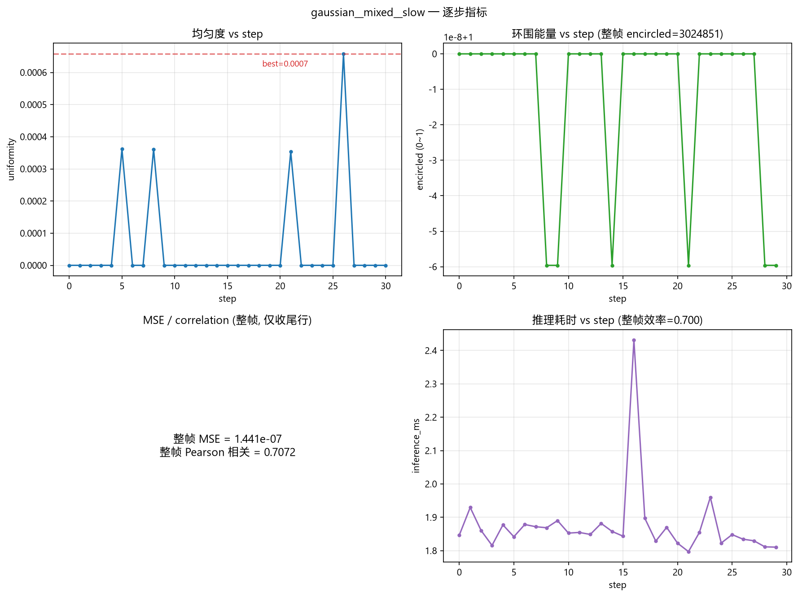

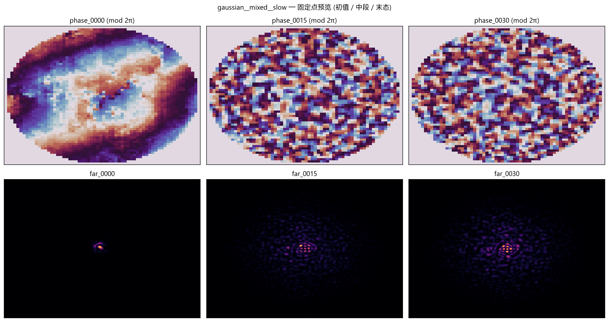

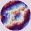

- 目标形状 **gaussian**, 静态像差 **mixed**, 湍流 **slow**。
- 均匀度: 初值 (adaptive_gs_init 后) **0.000** → 最终 **0.000** (最佳 **0.001**, 变化 +0.000 / —)。
- 环围能量 (逐步, 0~1): **1.000** → **1.000**。
- 均匀度 (min/mean) 为平顶目标指标, 对 gaussian 目标恒≈0; 以环围能量/相关性/效率评估整形效果。

### square__mixed__slow

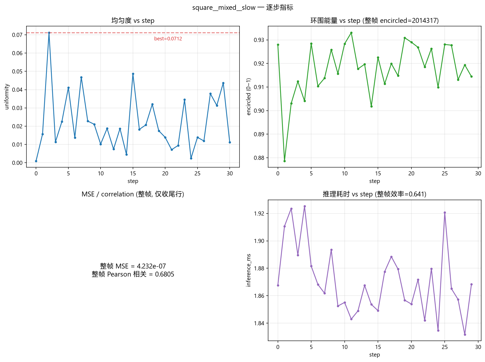

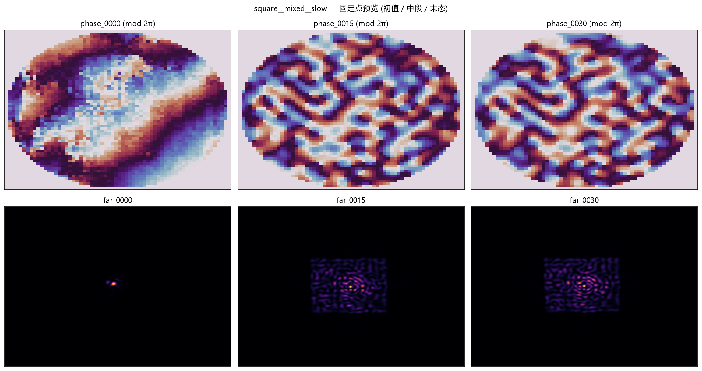

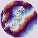

- 目标形状 **square**, 静态像差 **mixed**, 湍流 **slow**。
- 均匀度: 初值 (adaptive_gs_init 后) **0.001** → 最终 **0.011** (最佳 **0.071**, 变化 +0.010 / +993.3%)。
- 环围能量 (逐步, 0~1): **0.928** → **0.914**。
- **slow** 湍流导致跟踪退化: 最终均匀度低于最佳值 0.060。

### gaussian__none__slow

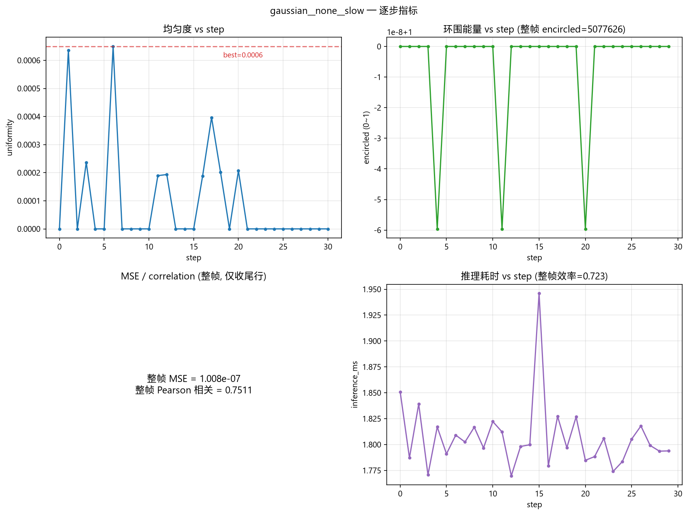

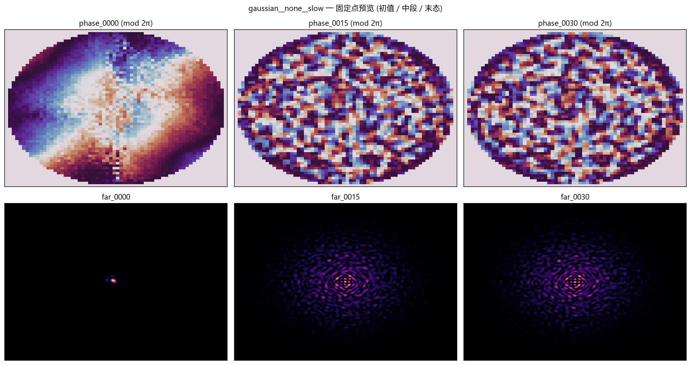

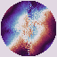

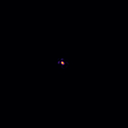

- 目标形状 **gaussian**, 静态像差 **none**, 湍流 **slow**。
- 均匀度: 初值 (adaptive_gs_init 后) **0.000** → 最终 **0.000** (最佳 **0.001**, 变化 +0.000 / —)。
- 环围能量 (逐步, 0~1): **1.000** → **1.000**。
- 均匀度 (min/mean) 为平顶目标指标, 对 gaussian 目标恒≈0; 以环围能量/相关性/效率评估整形效果。

### square__none__slow

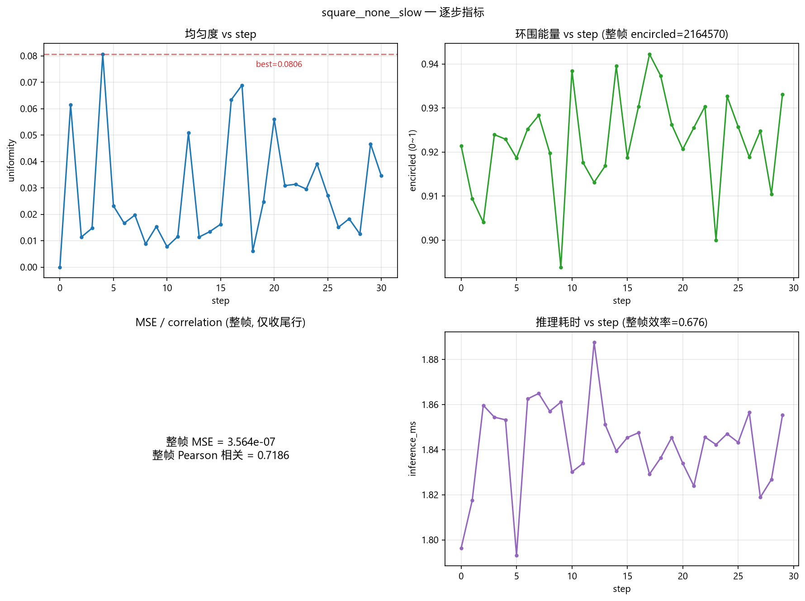

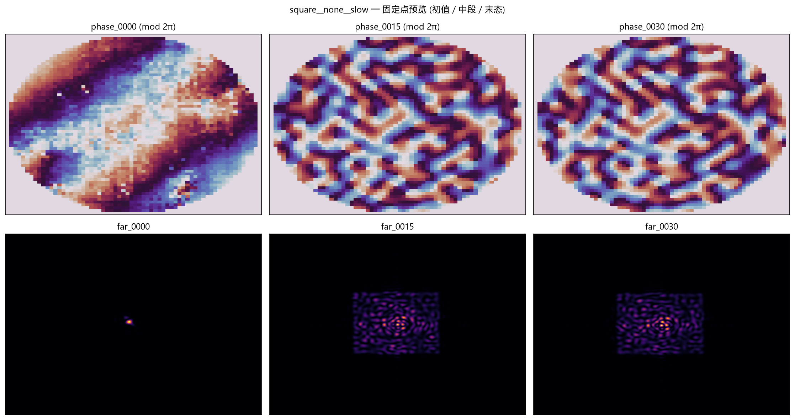

- 目标形状 **square**, 静态像差 **none**, 湍流 **slow**。
- 均匀度: 初值 (adaptive_gs_init 后) **0.000** → 最终 **0.035** (最佳 **0.081**, 变化 +0.035 / —)。
- 环围能量 (逐步, 0~1): **0.921** → **0.933**。
- **slow** 湍流导致跟踪退化: 最终均匀度低于最佳值 0.046。

## 4. 湍流影响

| shape | aberration | off | slow | fast |
|---|---|---|---|---|
| gaussian | defocus | 0.0002 | 0.0000 | - |
| gaussian | mixed | 0.0000 | 0.0000 | - |
| gaussian | none | 0.0000 | 0.0000 | - |
| square | defocus | 0.0138 | 0.0106 | - |
| square | mixed | 0.0191 | 0.0112 | - |
| square | none | 0.0519 | 0.0346 | - |

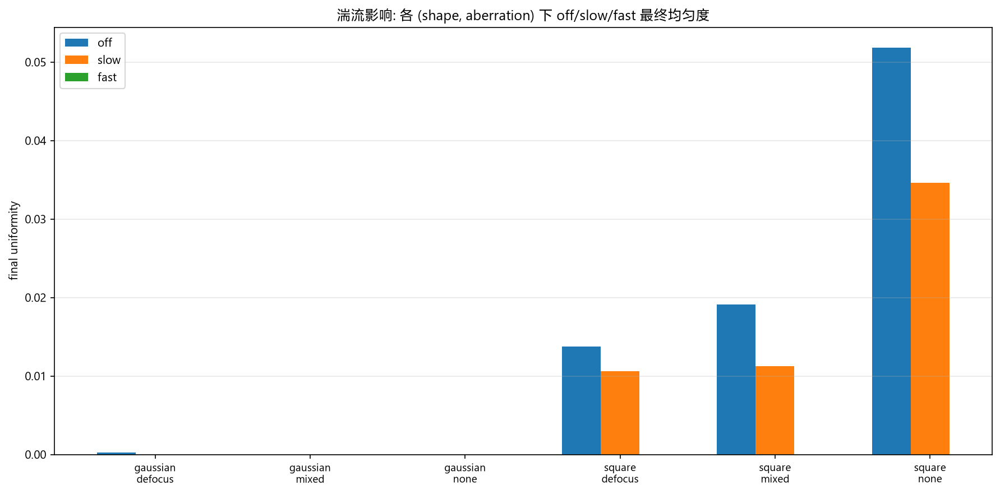

---

本报告由 `scripts/generate_fouriergsnet_sim_report.py` 离线生成。
