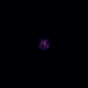
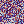

# FourierGSNet 湍流仿真矩阵报告

**生成时间**: 2026-09-22 23:47:43
**数据来源**: `/home/ws/code/AO-shaping/data/fouriergsnet_sim/native_w4b` (矩阵运行时间 2026-09-22 23:46:10)

**Fully offline** — 本报告由 `scripts/generate_fouriergsnet_sim_report.py` 离线生成, 仅读取已保存的矩阵产物 (config/summary/metrics/frames), 不打开任何硬件。

## 1. 矩阵配置

| 参数 | 值 |
|---|---|
| 网格 K (k_px) | 512 |
| 闭环步数 (steps) | 30 |
| 基础种子 (base_seed) | 42 |
| 计算设备 | cuda |
| 在线 replay | False |
| 自适应 GS 初值迭代 | 5 |
| 原生像素节距 (native) | 是 (64×64 方板) |
| 峰值光子数 | 50000.0 |
| 读出噪声 (e-) | 2.0 |
| 标定噪声 | ΔK=0.02, 中心偏移 2.0px, 旋转 0.3° |
| 场景数 | 12 (12 成功) |

## 2. 汇总表

| shape | aberration | turbulence | final_uniformity | best_uniformity | final_encircled | best_encircled | wall_time_s | ok |
|---|---|---|---|---|---|---|---|---|
| gaussian | defocus | off | 0.0002 | 0.0005 | 4461408 | 4461408 | 1.3 | ✓ |
| square | defocus | off | 0.0138 | 0.0650 | 1766669 | 1766669 | 1.6 | ✓ |
| gaussian | mixed | off | 0.0000 | 0.0005 | 3532609 | 3532609 | 1.5 | ✓ |
| square | mixed | off | 0.0191 | 0.0417 | 2927598 | 2927598 | 1.6 | ✓ |
| gaussian | none | off | 0.0000 | 0.0008 | 2088840 | 2088840 | 1.3 | ✓ |
| square | none | off | 0.0519 | 0.0686 | 1908546 | 1908546 | 2.1 | ✓ |
| gaussian | defocus | slow | 0.0000 | 0.0004 | 4769387 | 4769387 | 2.3 | ✓ |
| square | defocus | slow | 0.0106 | 0.0519 | 3739152 | 3739152 | 2.4 | ✓ |
| gaussian | mixed | slow | 0.0000 | 0.0007 | 3024851 | 3024851 | 2.2 | ✓ |
| square | mixed | slow | 0.0112 | 0.0712 | 2014317 | 2014317 | 2.4 | ✓ |
| gaussian | none | slow | 0.0000 | 0.0006 | 5077626 | 5077626 | 1.9 | ✓ |
| square | none | slow | 0.0346 | 0.0806 | 2164570 | 2164570 | 2.4 | ✓ |

## 3. 逐场景分析

### gaussian__defocus__off


- 目标形状 **gaussian**, 静态像差 **defocus**, 湍流 **off**。
- 均匀度: 初值 (adaptive_gs_init 后) **0.000** → 最终 **0.000** (最佳 **0.000**, 变化 +0.000 / —)。
- 环围能量 (逐步, 0~1): **1.000** → **1.000**。
- 均匀度 (min/mean) 为平顶目标指标, 对 gaussian 目标恒≈0; 以环围能量/相关性/效率评估整形效果。

### square__defocus__off


- 目标形状 **square**, 静态像差 **defocus**, 湍流 **off**。
- 均匀度: 初值 (adaptive_gs_init 后) **0.001** → 最终 **0.014** (最佳 **0.065**, 变化 +0.013 / +2230.2%)。
- 环围能量 (逐步, 0~1): **0.931** → **0.926**。
- 无湍流: 静态像差下闭环精修 GS 初值, 均匀度应波动上升并趋于固定点。

### gaussian__mixed__off


- 目标形状 **gaussian**, 静态像差 **mixed**, 湍流 **off**。
- 均匀度: 初值 (adaptive_gs_init 后) **0.000** → 最终 **0.000** (最佳 **0.001**, 变化 +0.000 / —)。
- 环围能量 (逐步, 0~1): **1.000** → **1.000**。
- 均匀度 (min/mean) 为平顶目标指标, 对 gaussian 目标恒≈0; 以环围能量/相关性/效率评估整形效果。

### square__mixed__off


- 目标形状 **square**, 静态像差 **mixed**, 湍流 **off**。
- 均匀度: 初值 (adaptive_gs_init 后) **0.001** → 最终 **0.019** (最佳 **0.042**, 变化 +0.018 / +1484.6%)。
- 环围能量 (逐步, 0~1): **0.914** → **0.887**。
- 无湍流: 静态像差下闭环精修 GS 初值, 均匀度应波动上升并趋于固定点。

### gaussian__none__off


- 目标形状 **gaussian**, 静态像差 **none**, 湍流 **off**。
- 均匀度: 初值 (adaptive_gs_init 后) **0.000** → 最终 **0.000** (最佳 **0.001**, 变化 +0.000 / —)。
- 环围能量 (逐步, 0~1): **1.000** → **1.000**。
- 均匀度 (min/mean) 为平顶目标指标, 对 gaussian 目标恒≈0; 以环围能量/相关性/效率评估整形效果。

### square__none__off


- 目标形状 **square**, 静态像差 **none**, 湍流 **off**。
- 均匀度: 初值 (adaptive_gs_init 后) **0.000** → 最终 **0.052** (最佳 **0.069**, 变化 +0.052 / —)。
- 环围能量 (逐步, 0~1): **0.916** → **0.926**。
- 无湍流: 静态像差下闭环精修 GS 初值, 均匀度应波动上升并趋于固定点。

### gaussian__defocus__slow


- 目标形状 **gaussian**, 静态像差 **defocus**, 湍流 **slow**。
- 均匀度: 初值 (adaptive_gs_init 后) **0.000** → 最终 **0.000** (最佳 **0.000**, 变化 +0.000 / —)。
- 环围能量 (逐步, 0~1): **1.000** → **1.000**。
- 均匀度 (min/mean) 为平顶目标指标, 对 gaussian 目标恒≈0; 以环围能量/相关性/效率评估整形效果。

### square__defocus__slow


- 目标形状 **square**, 静态像差 **defocus**, 湍流 **slow**。
- 均匀度: 初值 (adaptive_gs_init 后) **0.000** → 最终 **0.011** (最佳 **0.052**, 变化 +0.011 / —)。
- 环围能量 (逐步, 0~1): **0.941** → **0.921**。
- **slow** 湍流导致跟踪退化: 最终均匀度低于最佳值 0.041。

### gaussian__mixed__slow


- 目标形状 **gaussian**, 静态像差 **mixed**, 湍流 **slow**。
- 均匀度: 初值 (adaptive_gs_init 后) **0.000** → 最终 **0.000** (最佳 **0.001**, 变化 +0.000 / —)。
- 环围能量 (逐步, 0~1): **1.000** → **1.000**。
- 均匀度 (min/mean) 为平顶目标指标, 对 gaussian 目标恒≈0; 以环围能量/相关性/效率评估整形效果。

### square__mixed__slow


- 目标形状 **square**, 静态像差 **mixed**, 湍流 **slow**。
- 均匀度: 初值 (adaptive_gs_init 后) **0.001** → 最终 **0.011** (最佳 **0.071**, 变化 +0.010 / +993.3%)。
- 环围能量 (逐步, 0~1): **0.928** → **0.914**。
- **slow** 湍流导致跟踪退化: 最终均匀度低于最佳值 0.060。

### gaussian__none__slow


- 目标形状 **gaussian**, 静态像差 **none**, 湍流 **slow**。
- 均匀度: 初值 (adaptive_gs_init 后) **0.000** → 最终 **0.000** (最佳 **0.001**, 变化 +0.000 / —)。
- 环围能量 (逐步, 0~1): **1.000** → **1.000**。
- 均匀度 (min/mean) 为平顶目标指标, 对 gaussian 目标恒≈0; 以环围能量/相关性/效率评估整形效果。

### square__none__slow


- 目标形状 **square**, 静态像差 **none**, 湍流 **slow**。
- 均匀度: 初值 (adaptive_gs_init 后) **0.000** → 最终 **0.035** (最佳 **0.081**, 变化 +0.035 / —)。
- 环围能量 (逐步, 0~1): **0.921** → **0.933**。
- **slow** 湍流导致跟踪退化: 最终均匀度低于最佳值 0.046。

## 4. 湍流影响

| shape | aberration | off | slow | fast |
|---|---|---|---|---|
| gaussian | defocus | 0.0002 | 0.0000 | - |
| gaussian | mixed | 0.0000 | 0.0000 | - |
| gaussian | none | 0.0000 | 0.0000 | - |
| square | defocus | 0.0138 | 0.0106 | - |
| square | mixed | 0.0191 | 0.0112 | - |
| square | none | 0.0519 | 0.0346 | - |


## 5. 算法完整流程 (How the Pipeline Works)

本节解释**仿真如何搭、模型长什么样、数据如何采、网络如何训/微调、一次闭环的输入输出**。
所有数值均取自真实源码 (`fouriergsnet_optimize.py` + `fouriergsnet_env.py`) 与本次运行配置
(`data/fouriergsnet_sim/native_w4b/config.json`), 可直接对照代码阅读。

> 本矩阵运行命令 (摘自 `config.json`):
> ```bash
> scripts/fouriergsnet_sim_train.py --shapes square,gaussian --aberrations none,defocus,mixed \
>     --turbulence off,slow --steps 30 --k-px 512 --no-replay --device cuda --native \
>     --out data/fouriergsnet_sim/native_w4b
> ```

### 5.1 系统组成 (谁负责什么)

| 模块 | 文件 | 职责 |
|---|---|---|
| 数字孪生环境 | `src/ao_shaping/drivers/sim/fouriergsnet_env.py` | 2f Fourier 光路的物理仿真: SLM 前焦面 → 透镜 (f=0.125 m) → CCD 后焦面; 含 CCD 泊松/读出噪声与标定噪声注入 |
| 物理前向 | `fouriergsnet_optimize.py:prop` | 归一化傅里叶对 `fftshift(fft2(ifftshift(U),norm="ortho"))`, 0 级在画面中心 |
| 几何标定 | `SLMCCDCalibrator` (A) | 0 级质心 / K-尺度 / 旋转 / 光束位置 / workzone 取窗 |
| LUT 标定 | `SLMLUTCalibrator` (B) | 灰度↔相位曲线 (本仿真用理想 2π, 256 点线性) |
| 神经网络 | `FourierGSNetLite` (C) | GS 物理展开 + CNN 残差回归 (见 5.4) |
| 闭环编排 | `ShapingSystem` (D) | 测量/显示/初值/扰动采样/微调/闭环 (含在线 replay) |

### 5.2 如何仿真 (Simulation)

**光路模型** (与硬件 `run` 命令完全一致, 仅把 SLM+CCD 换成数字孪生):

```
SLM 面板 (相位) ──(傅里叶变换, 透镜 f=0.125 m)──▶ CCD 远场 (Fraunhofer 衍射图)
```

- 傅里叶前向: `E = fftshift(fft2(ifftshift(U), norm="ortho"))`, 其中源面复振幅
  `U = A_src · e^{iφ}` (`A_src`=源面高斯幅值, `φ`=显示相位)。
- 本矩阵 `--native`: 64×64 方板、原生像素节距 (无带限上采样), 使模型前向 `prop`
  与环境 `render_intensity` 的 FFT **一致** —— 这是方形目标能被真实整形的前提。
- CCD 帧 = `render_intensity` 经 `scipy.ndimage.zoom` 重采样到 `K×K` (K=`k_px`=512),
  再叠加**噪声**: 泊松光子 (peak_photons=50000) + 高斯读出噪声 (2 e-)。

**三个"真实失配"来源** (仿真里故意保留, 让网络面对的不是理想世界):

| 失配 | 数值 (本 run) | 注入点 |
|---|---|---|
| CCD 噪声 | 50000 光子 / 2 e- 读出 | 每次 `ccd.get_numpy_image` |
| 标定噪声 | ΔK=2%, 中心偏移 2 px, 旋转 0.3° | 渲染远场 `render_intensity` 末尾 |
| 静态像差 | Noll 系数 (rad) | 加在显示相位上 (每次渲染) |
| 时变湍流 | OU 过程 (rad) | 每帧 `advance_time` 推进 |

**静态像差预设** (`ABERRATION_PRESETS`, 单位 rad):
`none={}`, `defocus={4:0.6}`, `astig={5:-0.4,6:0.3}`,
`mixed={4:0.5,5:-0.4,6:0.3,11:0.2,13:-0.1}`, `severe={…}`。

**时变湍流 (OU 过程)** — 每帧推进, 每个 Noll 系数独立:
```
x ← x − (x/τ)·dt + σ·sqrt(2·dt/τ)·N(0,1)      (平稳分布 N(0, σ²))
```
预设: `slow = {σ=0.15, τ=50, Noll=(4,5,6)}`, `fast = {σ=0.30, τ=12, Noll=(4,5,6,11,13)}`。
`σ` 是平稳标准差 (rad), `τ` 是松弛时间 (帧)。

**一个 cell 的完整流程** (`run_cell`, 12 个 cell = 2 形状 × 3 像差 × 2 湍流):
1. 固定种子 `seed = base_seed + sha256(scenario)[:8]` (可复现)。
2. 建 `SimFourierGSNetEnv` (含噪声), 设 `env.aberrations = 预设`。
3. `ShapingSystem(slm, ccd, acquire, calib, lut, target_fn)`。
4. `adaptive_gs_init(iters=5)` → 初值相位 `φ₀` (设备自适应 GS, 用"实测幅值+仿真相位")。
5. (本 run `ft_samples=0`, **跳过**微调) → 直接进闭环。
6. `closed_loop(steps=30, replay=False)` → 纯**推理模式**闭环, 逐帧记录。
7. 收尾: 采整帧 → `compute_metrics` → 写 `config.json`/`metrics.csv`/`final.json`/帧。

### 5.3 模型结构 (Model Architecture)

`FourierGSNetLite` = **GS 物理展开 (K 层 FFT 双向投影)** + **CNN 残差注入**。
物理结构保证: 只要 `ĉ` 接近真实失配, 残差即被解析抵消。

**超参** (源码常量): `N=64` (模型网格), `K=5` (GS 展开层), `N_ZERN=24` (回归维, Z4~Z27),
`CH=32` (通道), `HALF=0.35` (方形归一化半宽)。可训练参数共 **104,440**。

**前向** (`forward(I_meas, I_tgt, A_src, A_tgt, phi_prev, Z)`):

```
1) gs_unroll(A_src, A_tgt, phi_prev, K=5, src_mask):
     循环 5 次 { 目标面替换幅值 → 反投影 → 源面保留相位 }
     → 返回 终相位 φ_GS  + K 通道物理特征 (5×N×N)
2) 特征拼接:  x = cat[feats(5), I_meas(1), I_tgt(1)]   # (7, 64, 64)
3) 编码器:    enc1: 7→32 (ConvBlock)
             enc2: 32→64 (ConvBlock + AvgPool×2 → 32×32)
4) 解码器:    up = interpolate(enc2)×2
             dec:  cat[up(64), h1(32)] = 96 → 32 (ConvBlock)
5) 残差头:    c_head = AdaptiveAvgPool→Flatten→Linear(32→24)  → ĉ (24 维像差系数)
6) 控制律:    φ = wrap_π( φ_GS − ĉ·Z )   # 用 ĉ 抵消失配
```

**卷积层** (`ConvBlock` = `Conv2d(3,pad=1)→GELU→Conv2d(3,pad=1)→GELU`):

| 模块 | 形状 |
|---|---|
| enc1 | (32,7,3,3), (32,32,3,3) |
| enc2 | (64,32,3,3), (64,64,3,3) |
| dec | (32,96,3,3), (32,32,3,3) |
| c_head.2 (Linear) | (24,32) |

`src_mask` = 单位圆盘内 ( pupil fill ≈ 75.6% ), 保证相位只在光瞳内变化。

### 5.4 如何训练 / 微调 (Training & Fine-tuning)

分两个层级:

**A. 设备自适应 GS 初值** (`adaptive_gs_init`, 本 run iters=5)
```
显示 φ → 采图取实测幅值 I.sqrt() → 仿真前向取相位 → 反投影
循环: 用"实测幅值 + 仿真相位"重建, 收敛到 φ₀ (GS 固定点)
```
这一步不训网络, 只得到一个物理自洽的初值相位。

**B. 微调 (域随机化, 升级 1+2)** (`collect` + `finetune`)
> 本矩阵 `ft_samples=0` (见 5.2 step 5), 因此**未执行** B; 以下为完整机制 (硬件 `run`
> 默认执行, 升级 1+2 即此)。

- **采样 `collect`**: 在 `φ₀` 上叠加**已知**像差 `aberration(Z, c)` 并显示, 采图。
  `c` 来自 `sample_c()`: 低阶 8 维幅度池 `{0.3,0.5,0.8} rad`, 高阶 16 维 `{0.1,0.2,0.3} rad`
  (域随机化: 网络见过轻/中/重失配); 目标半宽 `half` 在 `(0.30,0.40)` 随机 (目标尺寸也随机)。
  返回 `(I_meas, c, half)` 三元组。
- **`finetune`**: 只训网络 (物理展开无参数)。AdamW, `lr=2e-4`, `FT_EPOCHS=12`,
  `FT_BATCH=16`, `N_PERTURB=240`。每样本按其随机 `half` 重建目标。
- **损失** (`finetune`):
  ```
  loss = |ĉ − c|₁  +  0.5 · MSE( |prop(A_src·e^{iφ_new})|²/Σ ,  I_tgt )
         (系数回归误差)      (合成远场 vs 目标强度, 归一化)
  ```
  即"系数回归误差 + 0.5×强度 MSE"。

**C. 在线 replay (升级 3)** — 闭环中持续再学习 (本 run `--no-replay` 关闭):
- 触发条件 (任一): ① 均匀度 < 滑动窗口中位数 × `REPLAY_DROP=0.6` (束形退化);
  ② `mean|ĉ| > REPLAY_C_MAX=0.8` (网络拼命补偿=系统已变); ③ 每 `REPLAY_EVERY` 步 (0=关)。
- 触发后: 采 `REPLAY_N=50` 组 → `finetune` `REPLAY_EPOCHS=3` 轮 (小学习率 `REPLAY_LR=1e-4`
  防灾难性遗忘) → 冷却 `REPLAY_COOLDOWN=30` 步。

### 5.5 一次闭环的输入/输出样例 (One Closed-loop Step)

本 run 为 `replay=False` 的**推理模式**, 每个闭环步 `step ∈ 0..29` 执行:

```
I = measure()                       # 采 CCD 帧 → workzone(K×K) → 单位能量归一化
phi, c_hat = net(
        I.unsqueeze(0),             # (1,64,64)  实测远场强度
        I_tgt.unsqueeze(0),         # (1,64,64)  目标方形 (half=0.35, 单位能量)
        A_src.unsqueeze(0),         # (1,64,64)  源面高斯幅值
        A_tgt.unsqueeze(0),         # (1,64,64)  目标幅值 = sqrt(I_tgt)
        phi.unsqueeze(0),           # (1,64,64)  上一步相位 (bootstrap 初值)
        Z,                          # (24,64,64) Z4~Z27 基
    )
display(phi)                        # φ→LUT 灰度→SLM (本仿真: render_intensity)
uni, ee = _metrics(I, roi)          # 均匀度(min/mean) / 封闭能量(ROI 内)
recorder.append({step, uniformity, encircled, inference_ms, ccd, phase})
```

**实测张量形状** (本次运行验证):

| 量 | 形状 | 含义 |
|---|---|---|
| 输入 `I_meas` / `I_tgt` / `A_src` / `A_tgt` / `phi_prev` | (1, 64, 64) | 实测/目标远场、源幅值、目标幅值、上步相位 |
| `Z` | (24, 64, 64) | 24 阶 Zernike 基 |
| 输出 `phi` | (1, 64, 64) | 新整形相位 (rad, ∈ [−π, π]) |
| 输出 `c_hat` | (1, 24) | 估计的像差系数 (max\|c\|≈0.17 rad 量级) |
| `metrics.csv` 行 | step, uniformity, encircled, inference_ms, mse, correlation, efficiency | 逐步标量 |
| `frames/far_%04d.npy` | (512, 512) float32 | 干净远场 (K×K) |
| `frames/phase_%04d.npy` | (64, 64) float32 | 整形相位 (N×N) |

> 帧语义: `*_0000` = 初值 (GS 后, 闭环前); `*_%04d` (i=1..30) = 第 i 步 `display` 后。
> 逐帧播放即"整形相位 + 目标光斑演化"动画 (对应第 3 节 GIF)。

### 5.6 slm-gsnet 无硬件仿真演示 (Freeform SPGD, `--cam_type sim`)

本小节用 **`slm-gsnet`** 命令 (自由相位 per-pixel SPGD 方形整形, 见 README `slm-gsnet` 节)
在纯数值仿真下跑一次完整搜索, 展示 freeform 相位自由度如何把远场整形成方形。

**运行命令** (无硬件, 无 DVI 挂起风险):
```bash
python src/ao_shaping/main.py slm-gsnet spgd --cam_type sim --epochs 40 --debug
```

**结果** (本次运行): best quality = 0.5874 @ epoch 8 (CV=5.60, EE=0.979, AR=1.05),
final quality = 0.5862 (CV=5.32, EE=0.977, AR=1.00)。GIF 由
`scripts/generate_slm_gsnet_sim_gif.py` 从 `--debug` 产物 (PKL 中逐 epoch 的
`_img`/`_c`) 离线渲染:





- `slm_gsnet_spgd_sim_far.gif` — 逐 epoch 远场 (CCD 帧, inferno), 高斯光斑被
  freeform 相位逐步整形成近方形亮区。
- `slm_gsnet_spgd_sim_phase.gif` — 逐 epoch SLM 相位 (24×24 freeform 网格, mod 2π,
  twilight), 与远场演化一一对应。

**说明**: 与 §3 的 FourierGSNet 闭环 (GS 物理展开 + CNN 残差) 不同, `slm-gsnet`
直接用 SPGD 在 **逐像素相位** 上搜索 —— 低阶 Zernike (n≤4) 是圆对称光滑基无法
合成方形, freeform 是全像素自由度, 因此能直接在无网络介入下验证方形整形的
"相位⇄远场"对应关系。

---

本报告由 `scripts/generate_fouriergsnet_sim_report.py` 离线生成。
(§5.6 的 GIF 由 `scripts/generate_slm_gsnet_sim_gif.py` 生成)
