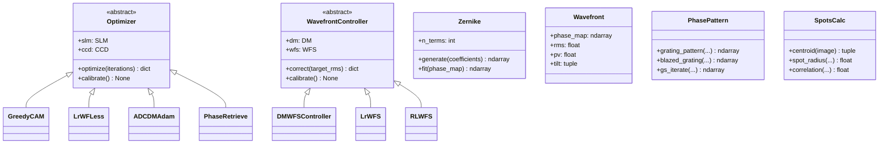
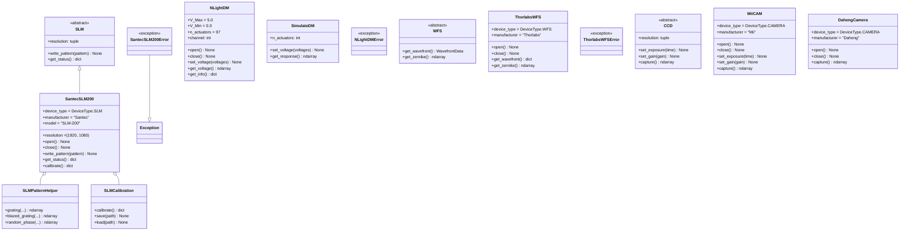

# 类图 (Class Diagram)

## 设备驱动类继承关系

```mermaid
classDiagram
    %% 基础枚举
    class DeviceType {
        <<enumeration>>
        CAMERA
        SLM
        DM
        WFS
        STAGE
        LASER
        FILTER
        OTHER
    }
    
    class DeviceState {
        <<enumeration>>
        UNKNOWN
        DISCONNECTED
        CONNECTING
        READY
        BUSY
        ERROR
        CALIBRATING
    }
    
    %% 数据类
    class DeviceParameter {
        +str name
        +Any value
        +type value_type
        +float | None min_value
        +float | None max_value
        +str unit
        +str description
        +bool writable
        +validate(value) bool
    }
    
    class DeviceCapability {
        +str name
        +str description
        +list~str~ parameters
        +type | None return_type
    }
    
    class DeviceMetadata {
        +str device_id
        +DeviceType device_type
        +str manufacturer
        +str model
        +str serial_number
        +str firmware_version
        +str hardware_version
        +dict connection_info
        +datetime registration_time
        +datetime | None last_seen
    }
    
    %% 异常类
    class DeviceError {
        <<exception>>
    }
    
    class DeviceNotFoundError {
        <<exception>>
    }
    
    class DeviceBusyError {
        <<exception>>
    }
    
    %% 抽象基类
    abstract class Device {
        +ClassVar device_type: DeviceType
        +ClassVar manufacturer: str
        +ClassVar model: str
        +ClassVar version: str
        -str _device_id
        -DeviceState _state
        -str | None _error_message
        -dict~str, DeviceParameter~ _parameters
        -dict~str, DeviceCapability~ _capabilities
        -list~Callable~ _data_callbacks
        -DeviceMetadata _metadata
        +__init__(device_id: str)
        +open() None
        +close() None
        +is_connected() bool
        +get_hardware_info() dict
        +__enter__() Device
        +__exit__(...) None
        +register_parameter(...) None
        +get_parameter(...) DeviceParameter
        +set_parameter_value(...) bool
        +register_capability(...) None
        +has_capability(...) bool
        +get_twin_state() dict
        +sync_from_twin(...) None
        +get_status() dict
        +health_check() tuple
    }
    
    %% DM 抽象基类
    abstract class DM {
        <<abstract>>
        +channel: int
        +transform(cmd)
        +send(cmd)
        +open()
        +close()
        +get_actuator_positions()
    }
    
    %% 继承关系
    Device <|-- DM
    Device <|-- SLM
    Device <|-- WFS
    Device <|-- CCD
    Device <|-- TM
    
    DM <|-- NLightDM
    DM <|-- SimulateDM
    
    SLM <|-- SantecSLM200
    SLM <|-- SantecSLM200_VISA
    
    WFS <|-- ThorlabsWFS
    
    CCD <|-- MiiCAM
    CCD <|-- DahengCamera
    
    TM <|-- SerialPortFSM
    
    DeviceError <|-- DeviceNotFoundError
    DeviceError <|-- DeviceBusyError
    
    Device o-- DeviceParameter
    Device o-- DeviceCapability
    Device o-- DeviceMetadata
```

---

## 算法模块类图



---

## 驱动类详细类图



---

*本文档由 AI 自动生成，最后更新于 2026-03-05*
