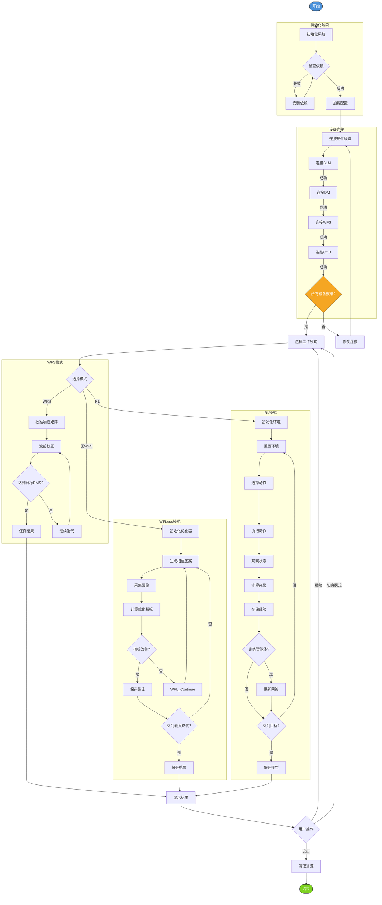
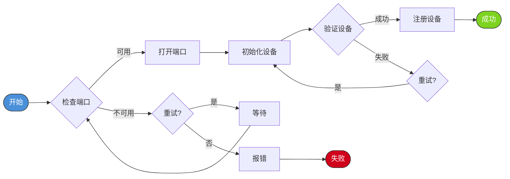
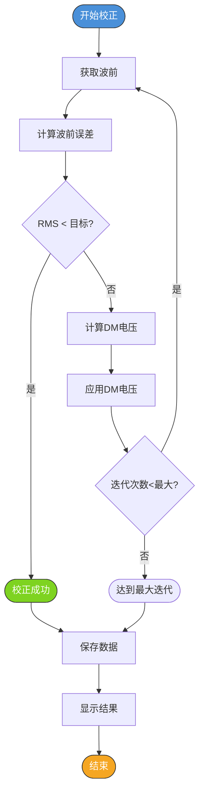
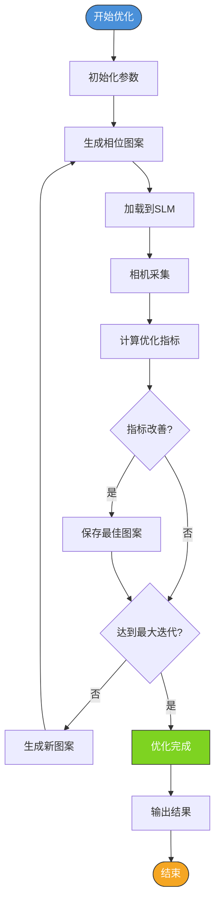
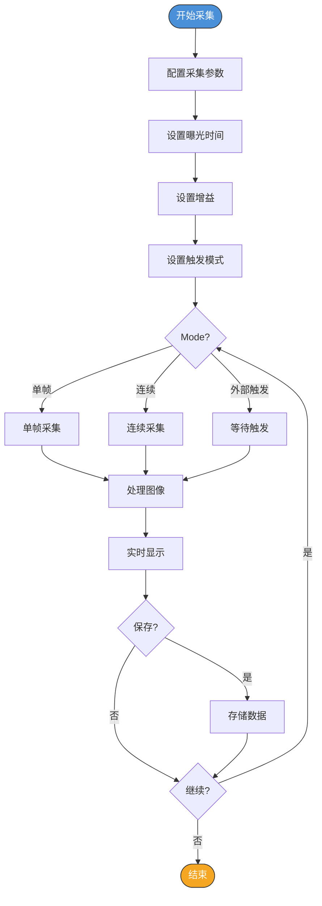
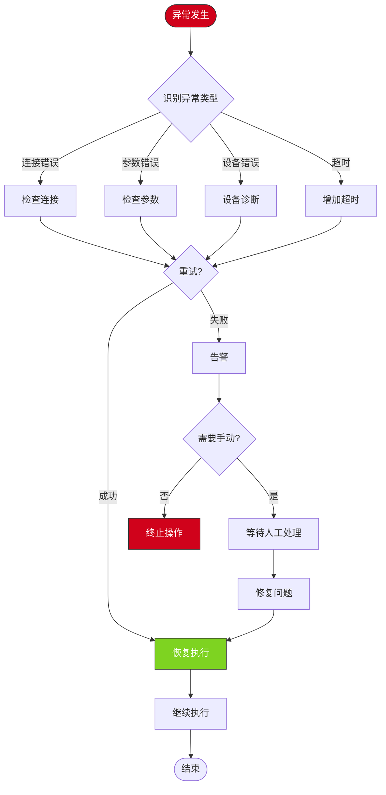

# 流程图 (Flowchart)

## 总体工作流程

```mermaid
flowchart TD
    Start([开始]) --> Init[初始化系统]
    
    subgraph 初始化 [初始化阶段]
        Init --> CheckDeps{检查依赖}
        CheckDeps --> |失败| FixDeps[安装依赖]
        FixDeps --> CheckDeps
        CheckDeps --> |成功| LoadConfig[加载配置]
    end
    
    LoadConfig --> Connect[连接硬件设备]
    
    subgraph 连接设备 [设备连接]
        Connect --> ConnectSLM[连接SLM]
        ConnectSLM --> |成功| ConnectDM[连接DM]
        ConnectDM --> |成功| ConnectWFS[连接WFS]
        ConnectWFS --> |成功| ConnectCCD[连接CCD]
        ConnectCCD --> |成功| Ready{所有设备就绪?}
    end
    
    Ready --> |是| SelectMode[选择工作模式]
    Ready --> |否| FixConn[修复连接]
    FixConn --> Connect
    
    SelectMode --> Mode{选择模式}
    
    subgraph 波前传感模式 [WFS模式]
        Mode --> |WFS| WF_Calibrate[校准响应矩阵]
        WF_Calibrate --> WF_Correct[波前校正]
        WF_Correct --> WF_Result{达到目标RMS?}
        WF_Result --> |是| SaveWF[保存结果]
        WF_Result --> |否| WF_Next[继续迭代]
        WF_Next --> WF_Correct
    end
    
    subgraph 无波前传感模式 [WFLess模式]
        Mode --> |无WFS| WFL_Init[初始化优化器]
        WFL_Init --> WFL_Generate[生成相位图案]
        WFL_Generate --> WFL_Capture[采集图像]
        WFL_Capture --> WFL_Metric[计算优化指标]
        WFL_Metric --> WFL_Update{指标改善?}
        WFL_Update --> |是| WFL_Best[保存最佳]
        WFL_Update --> |否| WFL_Continue
        WFL_Best --> WFL_Iter{达到最大迭代?}
        WFL_Continue --> WFL_Generate
        WFL_Iter --> |是| SaveWFL[保存结果]
        WFL_Iter --> |否| WFL_Generate
    end
    
    subgraph 强化学习模式 [RL模式]
        Mode --> |RL| RL_Init[初始化环境]
        RL_Init --> RL_Reset[重置环境]
        RL_Reset --> RL_Action[选择动作]
        RL_Action --> RL_Execute[执行动作]
        RL_Execute --> RL_Obs[观察状态]
        RL_Obs --> RL_Reward[计算奖励]
        RL_Reward --> RL_Store[存储经验]
        RL_Store --> RL_Train{训练智能体?}
        RL_Train --> |是| RL_Update[更新网络]
        RL_Train --> |否| RL_Episodes{达到目标?}
        RL_Update --> RL_Episodes
        RL_Episodes --> |是| SaveRL[保存模型]
        RL_Episodes --> |否| RL_Reset
    end
    
    SaveWF --> Display[显示结果]
    SaveWFL --> Display
    SaveRL --> Display
    
    Display --> UserOpt{用户操作}
    UserOpt --> |继续| SelectMode
    UserOpt --> |退出| Cleanup[清理资源]
    UserOpt --> |切换模式| SelectMode
    
    Cleanup --> End([结束])
    
    style Start fill:#4a90d9,stroke:#333,color:#fff
    style End fill:#7ed321,stroke:#333,color:#fff
    style Ready fill:#f5a623,stroke:#333,color:#fff
```

---

## 设备连接流程

```mermaid
flowchart LR
    Start([开始]) --> CheckPort{检查端口}
    
    CheckPort --> |可用| OpenPort[打开端口]
    CheckPort --> |不可用| Retry{重试?}
    Retry --> |是| Wait[等待]
    Wait --> CheckPort
    Retry --> |否| Error[报错]
    
    OpenPort --> InitDev[初始化设备]
    InitDev --> Verify{验证设备}
    Verify --> |成功| Register[注册设备]
    Verify --> |失败| Retry2{重试?}
    Retry2 --> |是| InitDev
    Error --> Fail([失败])
    Register --> Success([成功])
    
    style Start fill:#4a90d9,stroke:#333,color:#fff
    style Success fill:#7ed321,stroke:#333,color:#fff
    style Fail fill:#d0021b,stroke:#333,color:#fff
```

---

## 波前校正流程

```mermaid
flowchart TD
    Start([开始校正]) --> GetWFS[获取波前]
    
    GetWFS --> CalcError[计算波前误差]
    CalcError --> CheckRMS{RMS < 目标?}
    
    CheckRMS --> |是| Success([校正成功])
    CheckRMS --> |否| CalcDM[计算DM电压]
    
    CalcDM --> ApplyDM[应用DM电压]
    ApplyDM --> CheckIter{迭代次数<最大?}
    
    CheckIter --> |是| GetWFS
    CheckIter --> |否| MaxIter([达到最大迭代])
    
    Success --> SaveData[保存数据]
    MaxIter --> SaveData
    
    SaveData --> Display[显示结果]
    Display --> End([结束])
    
    style Start fill:#4a90d9,stroke:#333,color:#fff
    style Success fill:#7ed321,stroke:#333,color:#fff
    style End fill:#f5a623,stroke:#333,color:#fff
```

---

## 无波前传感优化流程

```mermaid
flowchart TD
    Start([开始优化]) --> Init[初始化参数]
    
    Init --> Pattern[生成相位图案]
    Pattern --> LoadSLM[加载到SLM]
    LoadSLM --> Capture[相机采集]
    
    Capture --> Metric[计算优化指标]
    Metric --> Compare{指标改善?}
    
    Compare --> |是| SaveBest[保存最佳图案]
    Compare --> |否| NextIter
    SaveBest --> NextIter{达到最大迭代?}
    
    NextIter --> |否| NewPattern[生成新图案]
    NewPattern --> Pattern
    
    NextIter --> |是| Finish[优化完成]
    Finish --> Output[输出结果]
    Output --> End([结束])
    
    style Start fill:#4a90d9,stroke:#333,color:#fff
    style Finish fill:#7ed321,stroke:#333,color:#fff
    style End fill:#f5a623,stroke:#333,color:#fff
```

---

## 数据采集流程

```mermaid
flowchart TD
    Start([开始采集]) --> Config[配置采集参数]
    
    Config --> ExpTime[设置曝光时间]
    ExpTime --> Gain[设置增益]
    Gain --> Triggers[设置触发模式]
    
    Triggers --> Mode{Mode?}
    
    Mode --> |单帧| Single[单帧采集]
    Mode --> |连续| Continuous[连续采集]
    Mode --> |外部触发| External[等待触发]
    
    Single --> Process[处理图像]
    Continuous --> Process
    External --> Process
    
    Process --> Display[实时显示]
    Display --> Save{保存?}
    
    Save --> |是| Storage[存储数据]
    Save --> |否| Continue{继续?}
    
    Storage --> Continue
    Continue --> |是| Mode
    Continue --> |否| End([结束])
    
    style Start fill:#4a90d9,stroke:#333,color:#fff
    style End fill:#f5a623,stroke:#333,color:#fff
```

---

## 异常处理流程

```mermaid
flowchart TD
    Start([异常发生]) --> Identify{识别异常类型}
    
    Identify --> |连接错误| ConnFix[检查连接]
    Identify --> |参数错误| ParamFix[检查参数]
    Identify --> |设备错误| DevFix[设备诊断]
    Identify --> |超时| TimeoutFix[增加超时]
    
    ConnFix --> Retry{重试?}
    ParamFix --> Retry
    DevFix --> Retry
    TimeoutFix --> Retry
    
    Retry --> |成功| Resume[恢复执行]
    Retry --> |失败| Alert[告警]
    
    Alert --> Manual{需要手动?}
    Manual --> |是| WaitManual[等待人工处理]
    Manual --> |否| Abort[终止操作]
    
    WaitManual --> Fix[修复问题]
    Fix --> Resume
    
    Resume --> Continue[继续执行]
    Continue --> End([结束])
    
    style Start fill:#d0021b,stroke:#333,color:#fff
    style Resume fill:#7ed321,stroke:#333,color:#fff
    style Abort fill:#d0021b,stroke:#333,color:#fff
```

---

*本文档由 AI 自动生成，最后更新于 2026-03-05*
