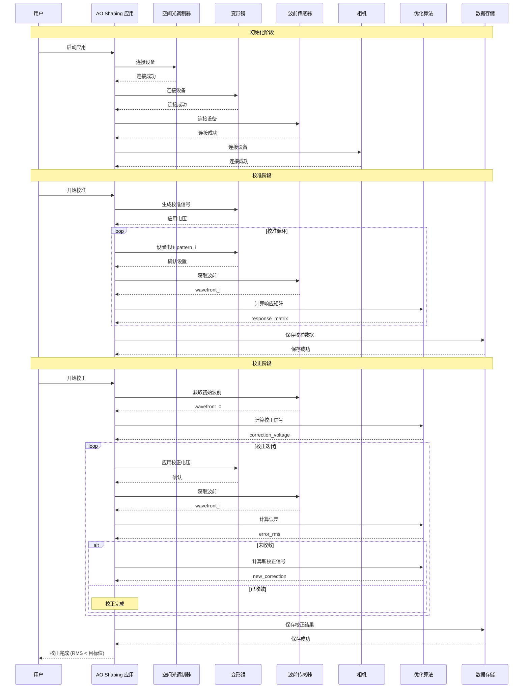
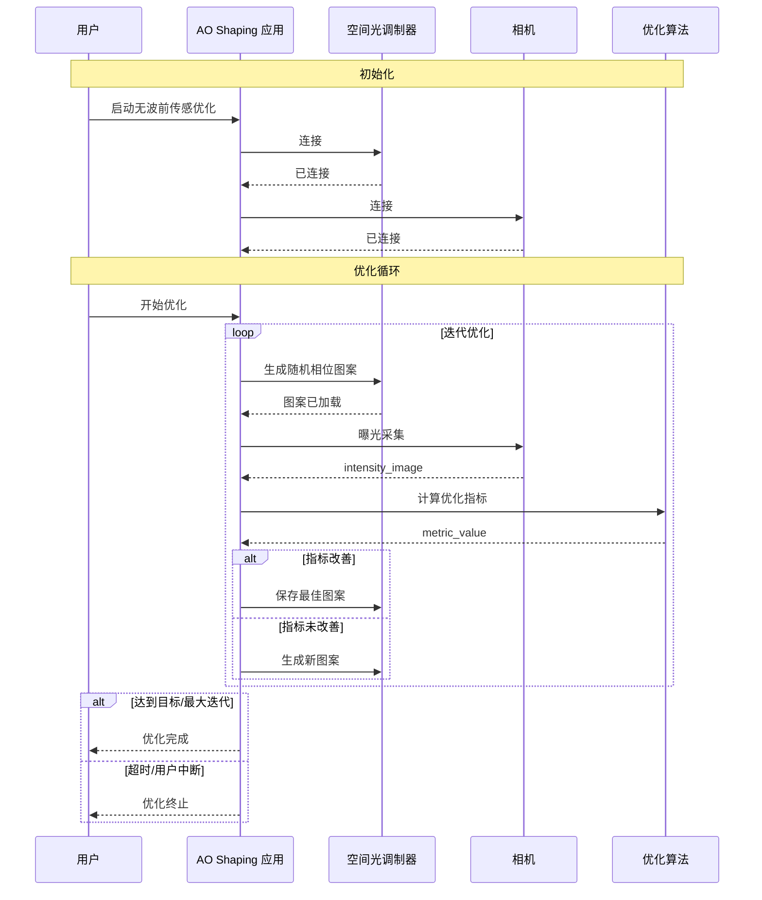
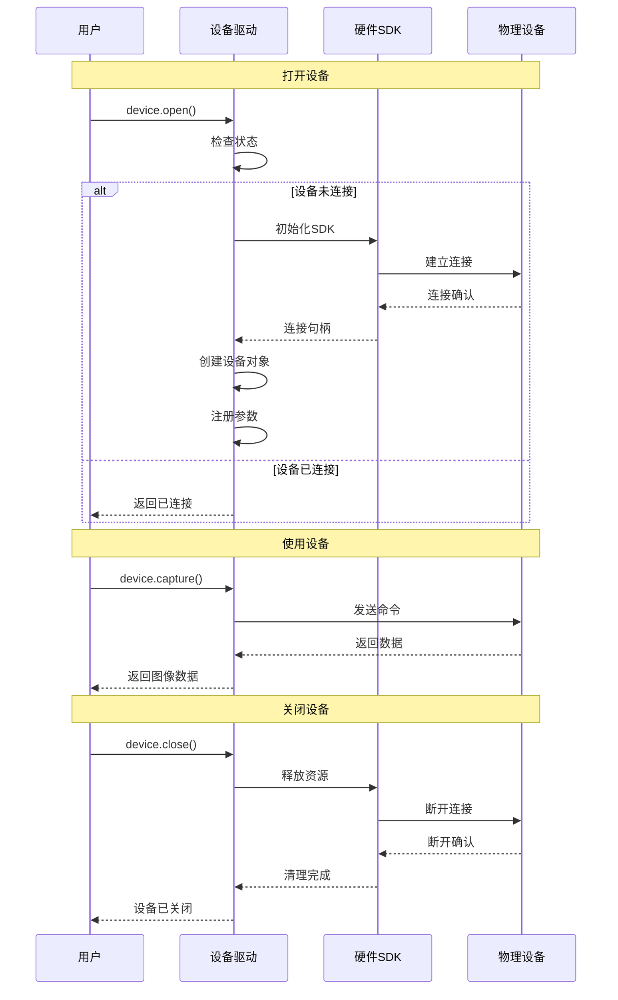
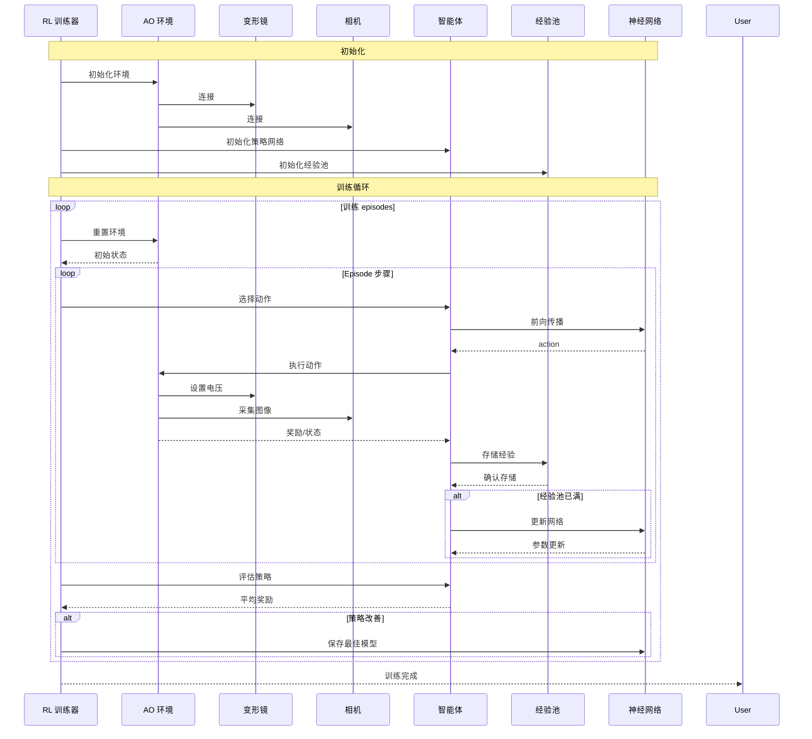

# 时序图 (Sequence Diagram)

## 波前校正完整工作流

```mermaid
sequenceDiagram
    participant User as 用户
    participant App as AO Shaping 应用
    participant SLM as 空间光调制器
    participant DM as 变形镜
    participant WFS as 波前传感器
    participant CCD as 相机
    participant Algo as 优化算法
    participant DB as 数据存储

    Note over User, DB: 初始化阶段
    User->>App: 启动应用
    App->>SLM: 连接设备
    SLM-->>App: 连接成功
    App->>DM: 连接设备
    DM-->>App: 连接成功
    App->>WFS: 连接设备
    WFS-->>App: 连接成功
    App->>CCD: 连接设备
    CCD-->>App: 连接成功
    
    Note over User, DB: 校准阶段
    User->>App: 开始校准
    App->>DM: 生成校准信号
    DM-->>App: 应用电压
    
    loop 校准循环
        App->>DM: 设置电压 pattern_i
        DM-->>App: 确认设置
        App->>WFS: 获取波前
        WFS-->>App: wavefront_i
        App->>Algo: 计算响应矩阵
        Algo-->>App: response_matrix
    end
    
    App->>DB: 保存校准数据
    DB-->>App: 保存成功
    
    Note over User, DB: 校正阶段
    User->>App: 开始校正
    App->>WFS: 获取初始波前
    WFS-->>App: wavefront_0
    App->>Algo: 计算校正信号
    Algo-->>App: correction_voltage
    
    loop 校正迭代
        App->>DM: 应用校正电压
        DM-->>App: 确认
        App->>WFS: 获取波前
        WFS-->>App: wavefront_i
        App->>Algo: 计算误差
        Algo-->>App: error_rms
        
        alt 未收敛
            App->>Algo: 计算新校正信号
            Algo-->>App: new_correction
        else 已收敛
            Note over App: 校正完成
        end
    end
    
    App->>DB: 保存校正结果
    DB-->>App: 保存成功
    App-->>User: 校正完成 (RMS < 目标值)
```

---

## 无波前传感优化时序图

```mermaid
sequenceDiagram
    participant User as 用户
    participant App as AO Shaping 应用
    participant SLM as 空间光调制器
    participant CCD as 相机
    participant Algo as 优化算法

    Note over User, Algo: 初始化
    User->>App: 启动无波前传感优化
    App->>SLM: 连接
    SLM-->>App: 已连接
    App->>CCD: 连接
    CCD-->>App: 已连接
    
    Note over User, Algo: 优化循环
    User->>App: 开始优化
    
    loop 迭代优化
        App->>SLM: 生成随机相位图案
        SLM-->>App: 图案已加载
        
        App->>CCD: 曝光采集
        CCD-->>App: intensity_image
        
        App->>Algo: 计算优化指标
        Algo-->>App: metric_value
        
        alt 指标改善
            App->>SLM: 保存最佳图案
        else 指标未改善
            App->>SLM: 生成新图案
        end
    end
    
    alt 达到目标/最大迭代
        App-->>User: 优化完成
    else 超时/用户中断
        App-->>User: 优化终止
    end
```

---

## 设备初始化时序图

```mermaid
sequenceDiagram
    participant User as 用户
    participant Driver as 设备驱动
    participant SDK as 硬件SDK
    participant Hardware as 物理设备

    Note over User, Hardware: 打开设备
    User->>Driver: device.open()
    Driver->>Driver: 检查状态
    alt 设备未连接
        Driver->>SDK: 初始化SDK
        SDK->>Hardware: 建立连接
        Hardware-->>SDK: 连接确认
        SDK-->>Driver: 连接句柄
        Driver->>Driver: 创建设备对象
        Driver->>Driver: 注册参数
    else 设备已连接
        Driver-->>User: 返回已连接
    end
    
    Note over User, Hardware: 使用设备
    User->>Driver: device.capture()
    Driver->>Hardware: 发送命令
    Hardware-->>Driver: 返回数据
    Driver-->>User: 返回图像数据
    
    Note over User, Hardware: 关闭设备
    User->>Driver: device.close()
    Driver->>SDK: 释放资源
    SDK->>Hardware: 断开连接
    Hardware-->>SDK: 断开确认
    SDK-->>Driver: 清理完成
    Driver-->>User: 设备已关闭
```

---

## 强化学习训练时序图

```mermaid
sequenceDiagram
    participant Trainer as RL 训练器
    participant Env as AO 环境
    participant DM as 变形镜
    participant CCD as 相机
    participant Agent as 智能体
    participant Buffer as 经验池
    participant Model as 神经网络

    Note over Trainer, Model: 初始化
    Trainer->>Env: 初始化环境
    Env->>DM: 连接
    Env->>CCD: 连接
    Trainer->>Agent: 初始化策略网络
    Trainer->>Buffer: 初始化经验池
    
    Note over Trainer, Model: 训练循环
    loop 训练 episodes
        Trainer->>Env: 重置环境
        Env-->>Trainer: 初始状态
        
        loop Episode 步骤
            Trainer->>Agent: 选择动作
            Agent->>Model: 前向传播
            Model-->>Agent: action
            
            Agent->>Env: 执行动作
            Env->>DM: 设置电压
            Env->>CCD: 采集图像
            Env-->>Agent: 奖励/状态
            
            Agent->>Buffer: 存储经验
            Buffer-->>Agent: 确认存储
            
            alt 经验池已满
                Agent->>Model: 更新网络
                Model-->>Agent: 参数更新
            end
        end
        
        Trainer->>Agent: 评估策略
        Agent-->>Trainer: 平均奖励
        
        alt 策略改善
            Trainer->>Model: 保存最佳模型
        end
    end
    
    Trainer-->>User: 训练完成
```

---

*本文档由 AI 自动生成，最后更新于 2026-03-05*
