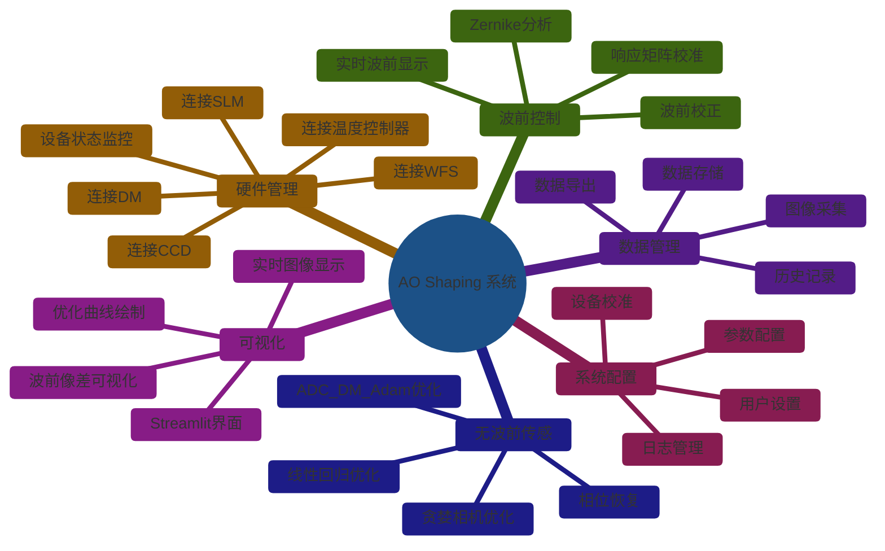

# 用例图 (Use Case Diagram)

## 系统总体用例图



---

## 用户用例详细图

```mermaid
useCaseDiagram
    %% 参与者
    actor Researcher as "研究人员"
    actor Engineer as "工程师"
    actor System as "系统"
    
    %% 用例 - 硬件管理
    usecase UC1 as "连接硬件设备"
    usecase UC2 as "断开硬件设备"
    usecase UC3 as "监控设备状态"
    usecase UC4 as "设备校准"
    
    %% 用例 - 波前控制
    usecase UC5 as "波前校正"
    usecase UC6 as "响应矩阵校准"
    usecase UC7 as "Zernike分解"
    usecase UC8 as "实时波前显示"
    
    %% 用例 - 无波前传感
    usecase UC9 as "贪婪相机优化"
    usecase UC10 as "线性回归优化"
    usecase UC11 as "Adam优化"
    usecase UC12 as "相位恢复"
    
    %% 用例 - 数据采集
    usecase UC13 as "图像采集"
    usecase UC14 as "视频录制"
    usecase UC15 as "数据保存"
    usecase UC16 as "数据导出"
    
    %% 用例 - 可视化
    usecase UC17 as "实时显示"
    usecase UC18 as "优化曲线"
    usecase UC19 as "波前可视化"
    usecase UC20 as "Streamlit界面"
    
    %% 用例 - 配置
    usecase UC21 as "参数配置"
    usecase UC22 as "系统设置"
    
    %% 关系
    Researcher --> UC1
    Researcher --> UC5
    Researcher --> UC9
    Researcher --> UC13
    Researcher --> UC17
    
    Engineer --> UC4
    Engineer --> UC6
    Engineer --> UC21
    Engineer --> UC22
    
    UC1 <.. UC3 : <<extends>>
    UC5 ..> UC6 : <<includes>>
    UC9 ..> UC13 : <<includes>>
    UC10 ..> UC13 : <<includes>>
    UC11 ..> UC13 : <<includes>>
    UC17 ..> UC19 : <<includes>>
```

---

## 功能模块用例图

```mermaid
useCaseDiagram
    actor User as "用户"
    
    %% 硬件驱动模块
    package "硬件驱动模块" {
        usecase UC_DRV_1 as "打开设备"
        usecase UC_DRV_2 as "关闭设备"
        usecase UC_DRV_3 as "发送命令"
        usecase UC_DRV_4 as "接收数据"
        usecase UC_DRV_5 as "设备诊断"
    }
    
    %% 波前控制模块
    package "波前控制模块" {
        usecase UC_WF_1 as "获取波前"
        usecase UC_WF_2 as "计算校正"
        usecase UC_WF_3 as "应用校正"
        usecase UC_WF_4 as "建立响应矩阵"
        usecase UC_WF_5 as "Zernike分解"
    }
    
    %% 无波前传感模块
    package "无波前传感模块" {
        usecase UC_WFL_1 as "采集图像"
        usecase UC_WFL_2 as "计算指标"
        usecase UC_WFL_3 as "优化相位"
        usecase UC_WFL_4 as "GS迭代"
    }
    
    %% 工具模块
    package "工具模块" {
        usecase UC_UTIL_1 as "波前计算"
        usecase UC_UTIL_2 as "相位生成"
        usecase UC_UTIL_3 as "光斑计算"
        usecase UC_UTIL_4 as "数据读写"
    }
    
    %% 可视化模块
    package "可视化模块" {
        usecase UC_DISP_1 as "图像显示"
        usecase UC_DISP_2 as "曲线绘制"
        usecase UC_DISP_3 as "3D可视化"
    }
    
    User --> UC_DRV_1
    User --> UC_DRV_2
    User --> UC_WF_1
    User --> UC_WFL_1
    User --> UC_UTIL_1
    User --> UC_DISP_1
    
    UC_WF_1 ..> UC_DRV_1 : <<includes>>
    UC_WFL_1 ..> UC_DRV_1 : <<includes>>
    UC_WF_2 ..> UC_UTIL_1 : <<includes>>
    UC_WFL_3 ..> UC_UTIL_2 : <<includes>>
```

---

## 权限用例图

```mermaid
useCaseDiagram
    actor Guest as "访客"
    actor User as "普通用户"
    actor Admin as "管理员"
    
    package "基础功能" {
        usecase ViewImage as "查看图像"
        usecase ViewStatus as "查看状态"
        usecase RunBasic as "运行基本校正"
    }
    
    package "高级功能" {
        usecase RunAdvanced as "运行高级优化"
        usecase TrainModel as "训练模型"
        usecase ExportData as "导出数据"
    }
    
    package "管理功能" {
        usecase ConfigSystem as "系统配置"
        usecase ManageDevice as "设备管理"
        usecase ViewLogs as "查看日志"
        usecase ManageUser as "用户管理"
    }
    
    Guest --> ViewImage
    Guest --> ViewStatus
    
    User --> ViewImage
    User --> ViewStatus
    User --> RunBasic
    User --> RunAdvanced
    User --> TrainModel
    User --> ExportData
    User --> ConfigSystem
    
    Admin --> ViewImage
    Admin --> ViewStatus
    Admin --> RunBasic
    Admin --> RunAdvanced
    Admin --> TrainModel
    Admin --> ExportData
    Admin --> ConfigSystem
    Admin --> ManageDevice
    Admin --> ViewLogs
    Admin --> ManageUser
```

---

*本文档由 AI 自动生成，最后更新于 2026-03-05*
