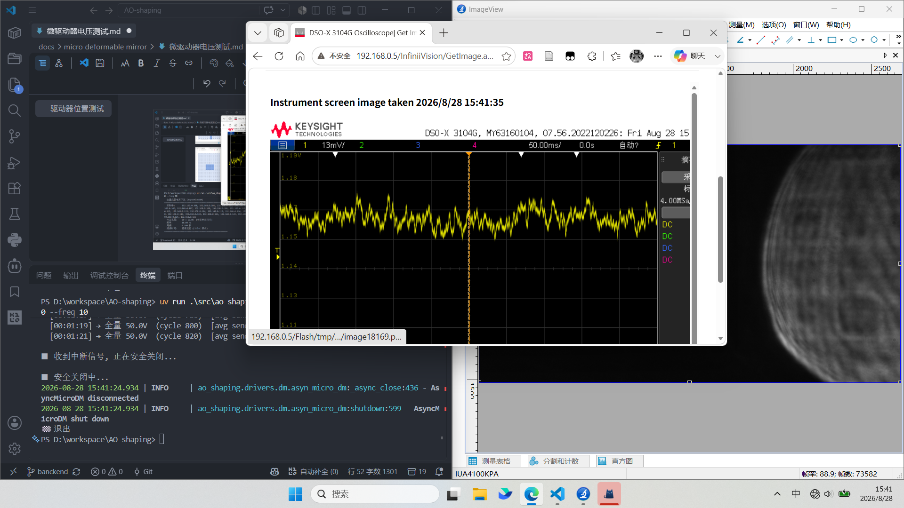
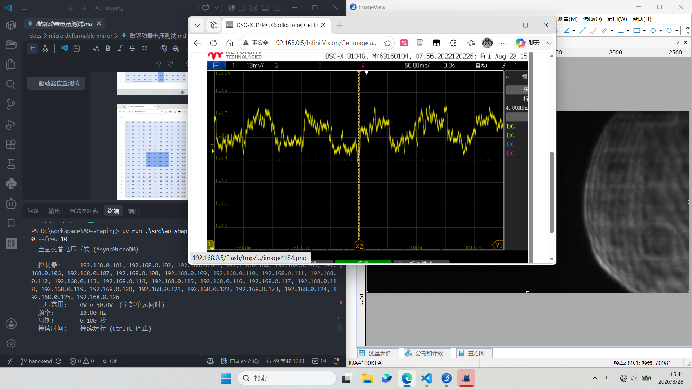
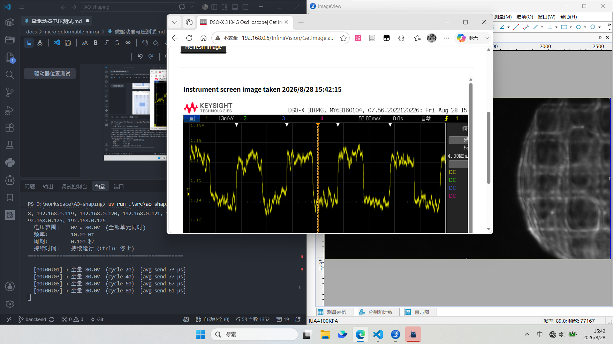
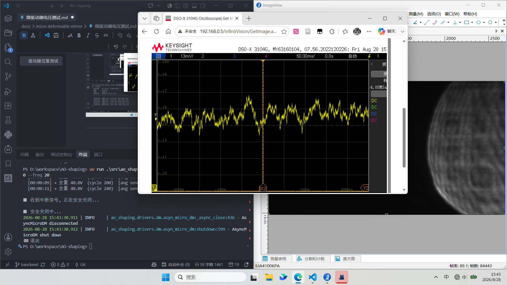
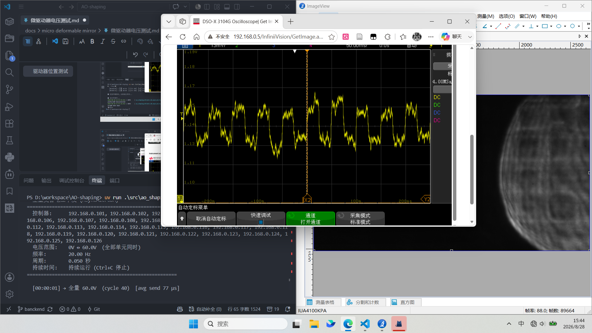
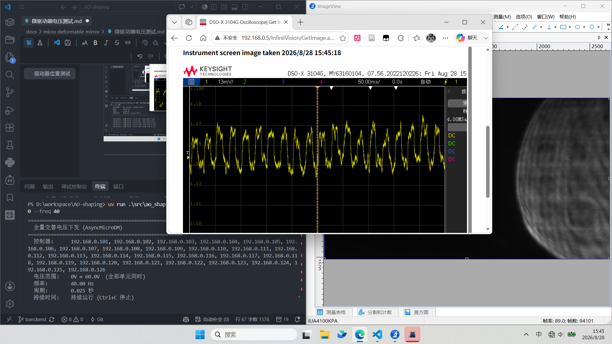
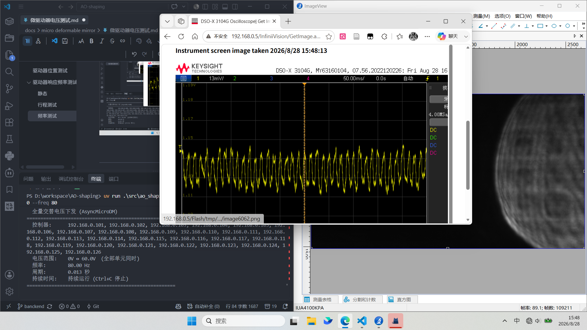
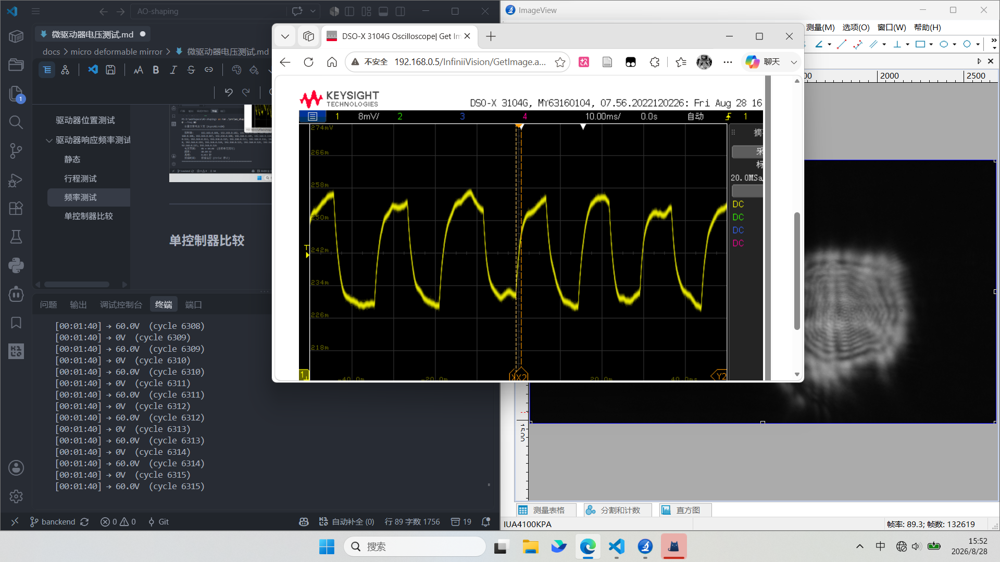

| 输入电压` `高位偏移 | 5.0  | 10.0 | 15.0  |
| ------------------------ | ---- | ---- | ----- |
| 256                      | 4.69 | 9.50 | 14.44 |
| 255                      | 4.96 | 9.50 | 15.32 |

---

---

---

---

---

---

# 驱动器位置测试

和理想分布不同

# 驱动器响应频率测试

### 静态

### 行程测试

10Hz

---

20Hz

---

### 频率测试

40Hz

80Hz

---

### 单控制器比较

