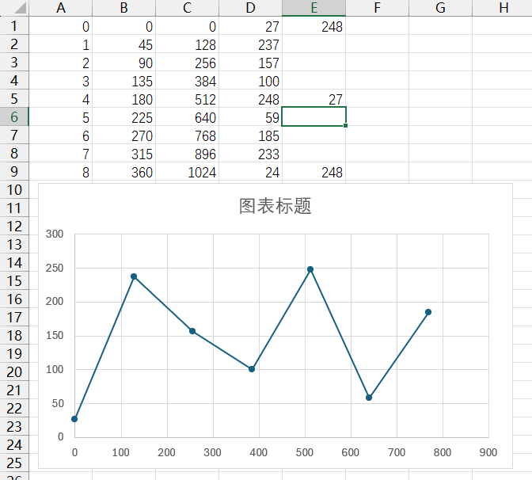
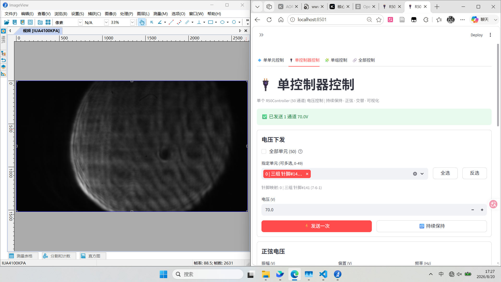
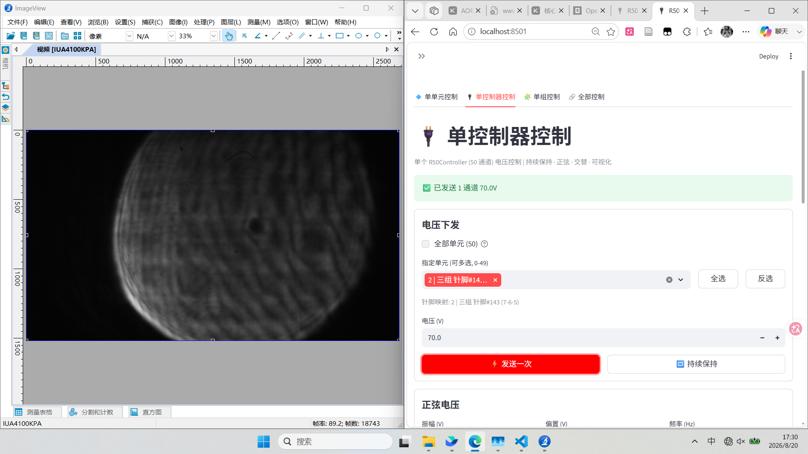
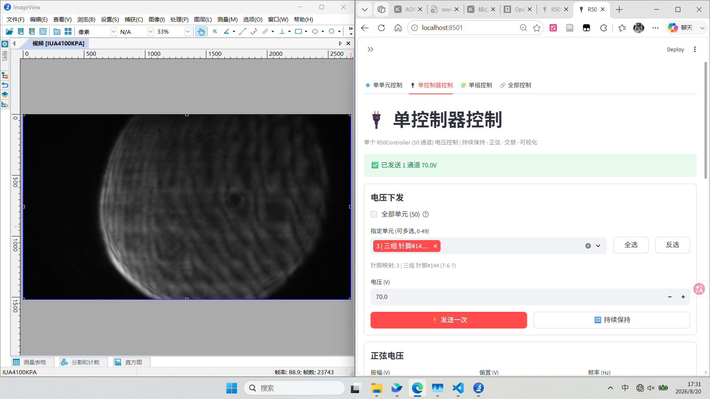
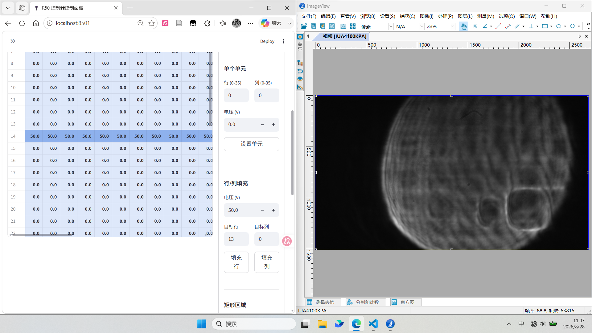
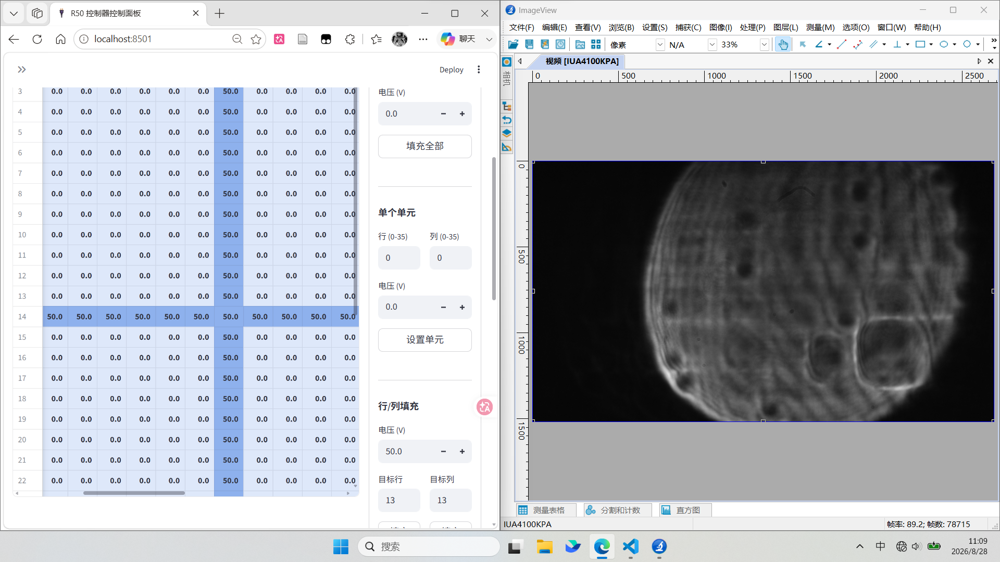
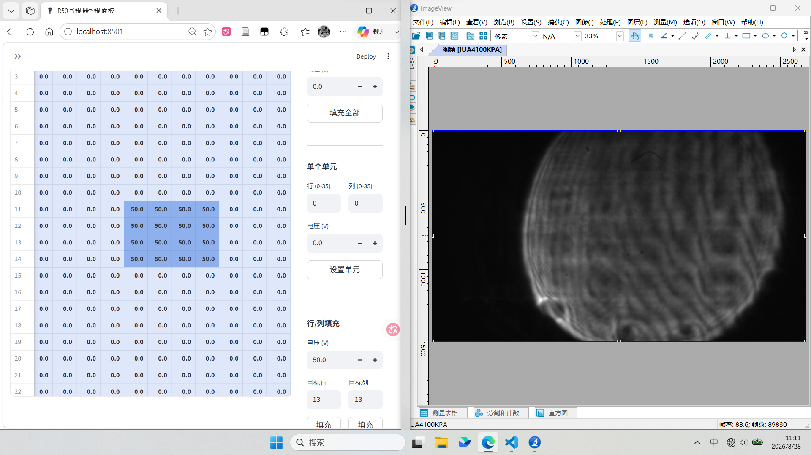

| 输入电压`<br>`高位偏移 | 5.0  | 10.0 | 15.0  |
| ------------------------ | ---- | ---- | ----- |
| 256                      | 4.69 | 9.50 | 14.44 |
| 255                      | 4.96 | 9.50 | 15.32 |




---




---


---




---



---


---


# 驱动器位置测试

和理想分布不同





  File "D:\workspace\AO-shaping\src\ao_shaping\gui\r50\r50_sidebar.py", line 112, in _sidebar_connection_config
    _sidebar_joint_connection()
    └ <function _sidebar_joint_connection at 0x000001E0B023F240>

  File "D:\workspace\AO-shaping\src\ao_shaping\gui\r50\r50_sidebar.py", line 268, in _sidebar_joint_connection
    _jc_connect()
    └ <function _jc_connect at 0x000001E0B023DA80>

> File "D:\workspace\AO-shaping\src\ao_shaping\gui\r50\r50_joint.py", line 76, in _jc_connect
    dm.open()
    │  └ <function MicroDM.open at 0x000001E0AF7E7C40>
    └ MicroDM(controllers=0, connected=0, channels=1521, voltage=[-20.0, 120.0] V, state=ERROR)

  File "D:\workspace\AO-shaping\src\ao_shaping\drivers\dm\MicroDM.py", line 973, in open
    raise MicroDMConnectionError(
          └ <class 'ao_shaping.drivers.dm.MicroDM.MicroDMConnectionError'>

ao_shaping.drivers.dm.MicroDM.MicroDMConnectionError: Failed to connect to any of 0 controller(s)
```

---

## 1300-5.xlsx 歧义 Key 记录

反向重建验证 `data/1300-5-enriched.csv` → `docs/micro deformable mirror/docs/1300-5.xlsx` 时发现：原 xlsx 中存在 **同一 (IP组, 序号) 组合对应多个不同 A 列（位置序号）** 的情况，即反向映射不唯一。明细如下：

| IP组 | 序号 | 对应的 A 列值（位置序号） | 出现次数 |
|------|------|--------------------------|----------|
| 106  | 6    | 1, 1293, 1296            | 3        |
| 116  | 26   | 1273, 1188               | 2        |

**影响**：通过 (IP组, 序号) 反查 A 列时，上述 key 存在歧义（无法唯一确定位置序号）。当前 CSV 反向重建时按原 xlsx 中的出现顺序匹配，仍可 100% 还原；但这两个 key 的语义对应关系不唯一，疑似为源数据录入错误，需人工核实。

其余 1293 个 (IP组, 序号) key 均为唯一映射，可无损还原。

