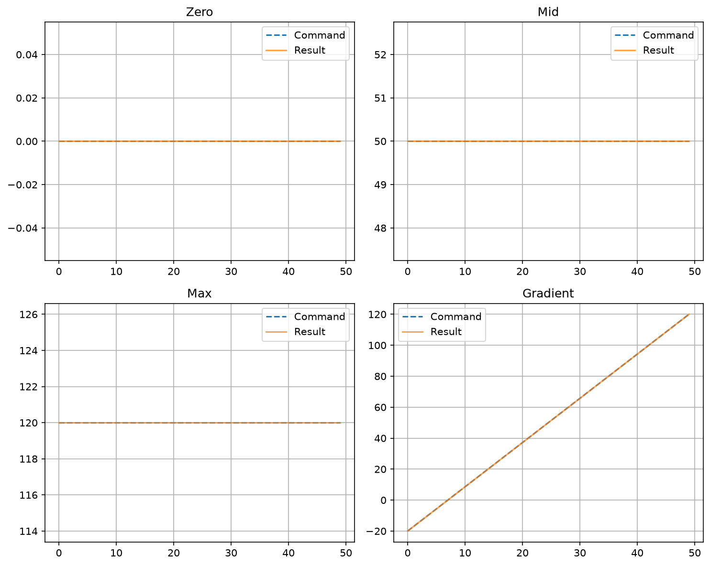

# MICRO-DM Hardware Test Report
**Generated:** 2026-09-10 18:23:15
**Device:** micro-dm
---

## Micro DM Simulation Test

### Simulation Initialization

**Channels:** 50

**Voltage Range:** -20.0 to 120.0 V

**Status:** ✅ PASS

**Duration:** 0.00s

---

### Transform Function

| Command | Expected (V) | Actual (V) | Error (V) |
| --- | --- | --- | --- |
| -1.0 | -20.0 | -20.0 | 0.00 |
| -0.5 | 15.0 | 15.0 | 0.00 |
| 0.0 | 50.0 | 50.0 | 0.00 |
| 0.5 | 85.0 | 85.0 | 0.00 |
| 1.0 | 120.0 | 120.0 | 0.00 |

**Status:** ✅ PASS

**Duration:** 0.00s

---

### Pattern Tests

*Simulation pattern tests*

**Status:** ✅ PASS

**Duration:** 0.22s

---

### Safety Ramping

**Status:** ✅ PASS

**Duration:** 0.00s

---
