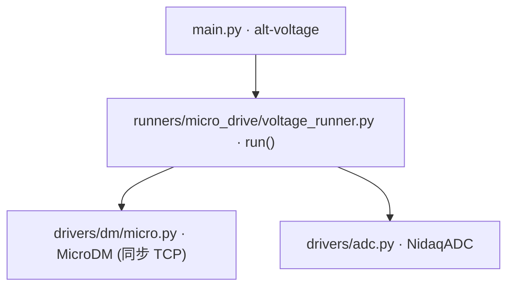

# 交替电压下发 (alt-voltage)

> **生成脚本**: [`scripts/generate_alt_voltage_report.py`](../../scripts/generate_alt_voltage_report.py)
> **复现命令**: `python scripts/generate_alt_voltage_report.py`
> **运行环境**: 离线 (纯源码静态分析; 不开设备)

## 1. 这条命令做什么

在 0V 和指定电压之间循环交替发送到 R50Power 控制器的指定单元。可选同步采集 NI DAQ ADC 信号。

## 2. 调用关系



## 3. 算法流程

1. **连接控制器**：TCP 连接 R50Power (默认 IP 192.168.0.101:8080)
2. **可选 Ping 检查**：`--no-ping-first` 跳过
3. **可选自动上电**：`--no-relay-on` 跳过继电器上电
4. **主循环**：
   - 发送全 0V 命令
   - 等待半周期 `1/(2*freq)`
   - 发送指定电压命令 (仅选定通道)
   - 可选：同步采集 ADC (每 `--adc-samples-per-read` 样本)
   - 等待半周期
   - 重复直到 `--duration` 秒或 Ctrl+C
5. **ADC 数据保存**：自动保存到 `data/alt_voltage_adc_<timestamp>.csv`

## 4. 主要选项

| 选项 | 说明 | 默认值 |
|------|------|--------|
| `-i, --ip` | R50Power 控制器 IP 地址 | 192.168.0.101 |
| `-p, --port` | 控制器端口 | 8080 |
| `-v, --voltage` | 高电平电压 (V) | 20.0 |
| `-f, --freq` | 交替频率 (Hz) | 1.0 |
| `-d, --duration` | 运行时长 (秒, 0=持续运行) | 0 |
| `-c, --channels` | 通道列表 (逗号分隔, 默认全部 50 通道) | 全部 |
| `--no-ping-first` | 跳过启动前 ping 检查 | False |
| `--no-relay-on` | 跳过自动上电 (relay on) | False |
| `--adc-enabled` | 启用 NI DAQ ADC 同步采集 | False |
| `--adc-device` | NI DAQ 设备名 | Dev1 |
| `--adc-channel` | 模拟输入通道 | ai0 |
| `--adc-sample-rate` | ADC 采样率 (Hz) | 5000 |
| `--adc-samples-per-read` | 每次读取的样本数 | 10 |

## 5. ADC 采集详情

- 基于 nidaqmx 的 `HW_TIMED_SINGLE_POINT` 采样模式
- 同步于电压切换时刻
- 数据格式：CSV，列为 `timestamp, voltage, adc_value`
- 用于电压-响应特性表征、迟滞测量

## 6. 示例

```bash
# 全部 50 个通道交替 20V, 1Hz, 持续运行
python src/ao_shaping/main.py alt-voltage --ip 192.168.0.101 --voltage 20

# 通道 0-5, 30V, 2Hz, 持续 10 秒, 同步 ADC 采集
python src/ao_shaping/main.py alt-voltage --ip 192.168.0.101 --voltage 30 --freq 2.0 --duration 10 --channels 0,1,2,3,4,5 --adc-enabled
```

## 7. 单独运行

```bash
python -m ao_shaping.runners.micro_drive.voltage_runner [OPTIONS]
```

## 8. 注意事项

- 同步 TCP 实现，每帧有编码/发送开销
- 高频 (＞10Hz) 或大量通道时建议使用 `full-voltage` (AsyncMicroDM)
- ADC 采集会增加循环延迟，高频下需评估实时性