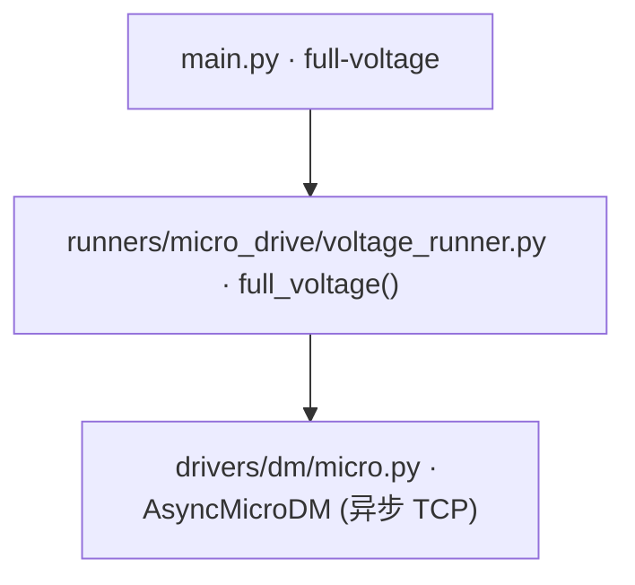

# 全量交替电压下发 (full-voltage)

> **生成脚本**: [`scripts/generate_full_voltage_report.py`](../../scripts/generate_full_voltage_report.py)
> **复现命令**: `python scripts/generate_full_voltage_report.py`
> **运行环境**: 离线 (纯源码静态分析; 不开设备)

## 1. 这条命令做什么

基于 **AsyncMicroDM 异步驱动**的全量交替电压工具：所有单元的电压**同时、均匀**地在 0V 和指定电压之间交替（无逐通道选择），可用于变形镜老化测试、寿命验证等场景。

## 2. 调用关系



## 3. 高实时性设计

- **asyncio 非阻塞 TCP** + `TCP_NODELAY` (禁用 Nagle，消除延迟 ACK 引入的每帧几十 ms 等待)
- **两种状态 (0V / 指定电压) 的命令字节一次性预构建**，热循环零编码、零分配，只做 `write`+`drain`
- **deadline 节拍调度**，下发/打印耗时不累积相位漂移；Ctrl+C 响应 ≤50ms
- **进度输出节流** + 实时打印每帧平均下发延迟 (µs)

## 4. 内联快路径

```python
# 预构建状态字节，热循环零开销重放
cmd_off = dm.build_frame_commands(np.zeros(dm.DM_Num))
cmd_on  = dm.build_frame_commands(np.full(dm.DM_Num, voltage))
await dm.send_frame_commands(cmd_off)  # 仅 write + drain
await dm.send_frame_commands(cmd_on)
```

## 5. 主要选项

| 选项 | 说明 | 默认值 |
|------|------|--------|
| `--ips` | 控制器 IP 列表 (逗号分隔) | 192.168.0.101 |
| `--voltage` | 高电平电压 (V, -20~120, **必需**) | - |
| `--freq` | 交替频率 (Hz) | 1.0 |
| `--duration` | 运行时长 (秒, 0=持续运行) | 0 |
| `--relay-on/--no-relay-on` | 自动继电器上电 | True |
| `--home-voltage` | 关闭时归位电压 (V) | 0.0 |
| `--timeout` | 控制器连接/下发超时 (秒) | 10.0 |
| `--debug` | 启用调试日志 | False |

## 6. 并行控制器通信

- 支持多控制器 (`--ips 192.168.0.101,192.168.0.102`)
- 每控制器独立 TCP 连接、独立超时控制
- 并发发送，聚合进度统计

## 7. 同步/异步双模式

```python
# 同步用法 (内部桥接到异步)
dm = AsyncMicroDM(ips=["192.168.0.101"])
dm.open()
dm.send_voltages(np.zeros(dm.DM_Num))
dm.close()

# 异步用法 (原生 asyncio)
dm = AsyncMicroDM(ips=["192.168.0.101"])
await dm.connect_all()
await dm.send_frame(np.zeros(dm.DM_Num))
await dm.shutdown()
```

## 8. 工厂创建

```python
from ao_shaping.drivers.dm._registry import create_dm
dm = create_dm("asyn_micro", ips=["192.168.0.101"])
```

## 9. 示例

```bash
# 单个控制器全部单元交替 20V, 1Hz, 持续运行
python src/ao_shaping/main.py full-voltage --voltage 20

# 两个控制器, 30V, 2Hz, 持续 10 秒
python src/ao_shaping/main.py full-voltage --ips 192.168.0.101,192.168.0.102 --voltage 30 --freq 2.0 --duration 10

# 关闭自动上电, 5V, 0.5Hz
python src/ao_shaping/main.py full-voltage --voltage 5 --freq 0.5 --no-relay-on
```

## 10. 单独运行

```bash
python -m ao_shaping.runners.micro_drive.voltage_runner full-voltage [OPTIONS]
```

## 11. 与 alt-voltage 对比

| 项 | `alt-voltage` (MicroDM) | `full-voltage` (AsyncMicroDM) |
|----|------------------------|------------------------------|
| 通信模式 | 同步 TCP | 异步 TCP (asyncio) |
| 通道选择 | 逐通道可选 | 全量同时 (无选择) |
| 实时性 | 帧间有编码开销 | 预构建命令字节，零开销热循环 |
| 适用场景 | 选通道测试、ADC 同步 | 老化测试、寿命验证、高频闭环 |
| 多控制器 | 不支持 | 支持 (`--ips`) |
| ADC 同步 | 支持 (`--adc-enabled`) | 不支持 |