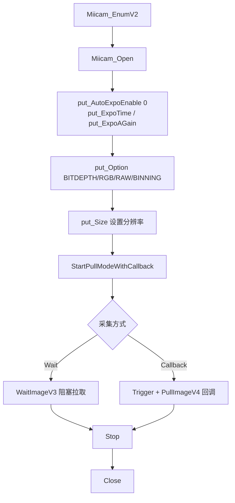

# MiiCam 相机驱动 Agent Wiki

> 本文件专为 AI coding agent 设计，提炼自官方 SDK 文档 (`miicamsdk.20240728`) 与项目实践，用于辅助修改、调试和扩展 `src/ao_shaping/drivers/ccd/miicam/driver.py`。
>
> SDK 版本：`57.26151.20240728`｜官方 SDK 位置：`D:\Projects\TIFO\ao\SDKs\CCD SDK\4100\SDK\miicamsdk.20240728`

---

## 1. 核心概念

| 术语 | 含义 |
|------|------|
| `HMiicam` | 相机句柄，`Miicam_Open()` 返回，失败返回 `NULL` |
| Pull 模式 | 连续拉流。`StartPullModeWithCallback` + `PullImage/WaitImage` |
| Snap 模式 | 拍摄高分辨率静止图像，完成时触发 `MIICAM_EVENT_STILLIMAGE` |
| Trigger 模式 | 软件/外部触发精确控制采集时机，触发后触发 `MIICAM_EVENT_IMAGE` |
| `bits` 参数 | `PullImageV4`/`WaitImageV4` 的输出位深：`0`=默认，`8`/`16`/`24`/`32`/`48`/`64` |
| `rowPitch` 参数 | 行跨度。`0`=默认（4 字节对齐），`-1`=最小（紧密打包，无填充） |
| `capture_mode` | 本项目 `driver.py` 的两种采集模式：`"wait"`（WaitImageV3 阻塞拉取）/ `"callback"`（回调 + 软件触发） |

---

## 2. 推荐调用流程



**核心生命周期约束（官方文档）**：
- `Miicam_Open`/`Miicam_Close` 和 `Miicam_Start`/`Miicam_Stop` 是**重量级操作**，禁止频繁调用；需要重新配置时优先 `Stop` → 设置 → `Start`，而非 `Close` → `Open`。
- `EnumV2` 在单相机时可省略（`Miicam_Open(NULL)` 自动选择）。

---

## 3. 关键 API 速查（C 签名）

### 3.1 生命周期

| C API | 用途 | 备注 |
|-------|------|------|
| `Miicam_EnumV2(arr)` | 枚举设备 | 单相机可省略 |
| `Miicam_Open(camId)` | 打开相机 | `NULL` 自动选择；支持 `;registry=;wb=rgb;json=` 附加参数 |
| `Miicam_Close(h)` | 关闭相机 | 句柄失效，此后不可再用 |
| `Miicam_Stop(h)` | 停止拉流 | 可重新配置后 `Start` |
| `Miicam_StartPullModeWithCallback(h, fun, ctx)` | 回调模式拉流 | 回调在内部线程触发 |
| `Miicam_StartPullModeWithWndMsg(h, hWnd, nMsg)` | 窗口消息模式拉流 | **仅 Windows**，最线程安全 |

### 3.2 图像拉取

| C API | 用途 | 参数要点 |
|-------|------|----------|
| `Miicam_PullImageV4(h, data, bStill, bits, rowPitch, &w, &h, &info)` | 立即拉取最新帧 | 无帧返回 `E_PENDING`；`data=NULL` 可仅查元数据 |
| `Miicam_WaitImageV4(h, nWaitMS, data, bStill, bits, rowPitch, &w, &h, &info)` | 等待帧 | `nWaitMS=0` 等同 Pull；`0xFFFFFFFF` 永久等待 |

**`PullImageV4` 完整签名**：
```c
HRESULT Miicam_PullImageV4(
    HMiicam h,                    // 相机句柄
    void* pImageData,             // 输出缓冲 (NULL = 仅查元数据)
    int bStill,                   // 1=静止图, 0=视频
    int bits,                     // 0=默认, 8/16/24/32/48/64
    int rowPitch,                 // 0=默认, -1=最小(紧密打包)
    unsigned* pnWidth,            // 输出: 宽
    unsigned* pnHeight,           // 输出: 高
    MiicamFrameInfoV4* pInfo      // 输出: 帧元数据
);
```

### 3.3 触发模式

| C API | 用途 | 备注 |
|-------|------|------|
| `Miicam_put_Option(h, TRIGGER, mode)` | 设置触发模式 | `0`=视频, `1`=软件, `2`=外部, `3`=外部+软件 |
| `Miicam_Trigger(h, n)` | 软件触发 | `0`=停止, `0xFFFF`=连续, `N`=N 张 |
| `Miicam_TriggerSyncV4(h, nWaitMS, data, bits, rowPitch, &info)` | 单触发+同步等待 | `nWaitMS=0` 默认超时 `(ExpoTime×102%) + 4000ms` |

### 3.4 静止图像 (Snap)

| C API | 用途 | 备注 |
|-------|------|------|
| `Miicam_Snap(h, index)` | 拍静止图 | `0xFFFFFFFF`=当前分辨率；`== SnapN(h, index, 1)` |
| `Miicam_SnapN(h, index, n)` | 连拍 n 张 | 完成后 `MIICAM_EVENT_STILLIMAGE` → 需 `PullStillImage` |

### 3.5 选项 (Option)

`Miicam_put_Option(h, iOption, iValue)` / `Miicam_get_Option(h, iOption, &iValue)`，70+ 选项。

| Option | 值 | 含义 |
|--------|-----|------|
| `MIICAM_OPTION_BITDEPTH` | `0`=8bit, `1`=16bit | 输出位深 |
| `MIICAM_OPTION_RGB` | `3`=8bit Grey, `4`=16bit Grey | 单色模式 |
| `MIICAM_OPTION_RAW` | `0/1` | Bayer 原始数据 |
| `MIICAM_OPTION_BINNING` | `0x80\|2` | 2×2 平均 binning |
| `MIICAM_OPTION_TRIGGER` | `0/1/2/3` | 触发模式 |
| `MIICAM_OPTION_FLUSH` | `3` | 清空帧缓冲 |
| `MIICAM_OPTION_CALLBACK_THREAD` | `1` | 用独立回调线程（拉流前设置） |
| `MIICAM_OPTION_HEARTBEAT` | — | 相机存活检测 |

---

## 4. HRESULT 错误码

**黄金规则**：`>= 0` 即成功（`S_FALSE`=`0x1` 也是成功 = no-op）。**绝不要**用 `==S_OK` 或 `==0` 判断。

```c
#define SUCCEEDED(hr)   (((HRESULT)(hr)) >= 0)
#define FAILED(hr)      (((HRESULT)(hr)) < 0)
```

| Code | 值 | 含义 |
|------|-----|------|
| `S_OK` | `0x00000000` | 成功 |
| `S_FALSE` | `0x00000001` | 成功但无操作（值未变） |
| `E_ACCESSDENIED` | `0x80070005` | 权限（Linux 需 udev/root） |
| `E_INVALIDARG` | `0x80070057` | 参数错误 |
| `E_NOTIMPL` | `0x80004001` | 该相机不支持此功能 |
| `E_POINTER` | `0x80004003` | 空指针 |
| `E_UNEXPECTED` | `0x8000ffff` | 状态不满足（如运行中设置非运行时选项） |
| `E_WRONG_THREAD` | `0x8001010e` | 在回调上下文调用（应被禁止的 API） |
| `E_GEN_FAILURE` | `0x8007001f` | 硬件故障（线缆/USB/端口） |
| `E_BUSY` | `0x800700aa` | 相机已被占用 |
| `E_PENDING` | `0x8000000a` | Pull 时无帧就绪 |
| `E_TIMEOUT` | `0x8001011f` | 操作超时 |

> **本项目 driver.py 处理的超时码**：`0x8000000A`（E_PENDING）与 `0x8001011F`（E_TIMEOUT）均被 `_FramePuller.wait_image` / `trigger_sync` 识别为重试条件。

---

## 5. 线程与回调注意事项（关键陷阱）

### 回调内部**严禁**：

| 禁止操作 | 后果 |
|----------|------|
| 调用 `Miicam_Stop` / `Miicam_Close` | **死锁**（两者须等待回调返回） |
| 调用 `put_Option(TRIGGER/BITDEPTH/PIXEL_FORMAT/BINNING/ROTATE)` | 返回 `E_WRONG_THREAD` |
| 调用 `put_Roi` | 返回 `E_WRONG_THREAD` |
| 获取被等待回调的操作所持有的锁 | **死锁** |

**缓解**：拉流前设置 `MIICAM_OPTION_CALLBACK_THREAD=1` 使用独立回调线程。

### 线程安全策略（类似 C++ STL）：
- ✅ 多线程可**同时读**同一相机对象
- ❌ 若一线程**写**，其它线程**不得读写**该对象
- ✅ 不同线程操作**不同**相机对象是安全的

---

## 6. 图像缓冲与格式

### `rowPitch` 缓冲容量（必须 `>= rowPitch × nHeight`）

| 格式 | rowPitch=0（默认） | rowPitch=-1（最小） |
|------|-------------------|---------------------|
| GREY8 | `TDIBWIDTHBYTES(8*W)` | `Width` |
| GREY16 | `TDIBWIDTHBYTES(16*W)` | `Width*2` |
| RGB24 | `TDIBWIDTHBYTES(24*W)` | `Width*3` |
| RAW 8-bit | `Width` | `Width` |
| RAW 10-16bit | `Width*2` | `Width*2` |

```c
#define TDIBWIDTHBYTES(bits) ((unsigned)(((bits) + 31) & (~31)) / 8)  // 4 字节对齐
```

> **建议**：与 NumPy/OpenCV 互操作时用 `rowPitch=-1`（紧密打包无填充），buffer 大小 = `宽度 × 每像素字节数`。本项目 driver.py 采用 `rowPitch=0` + `bufsize = W×H×nbytes`，在宽度为 4 的倍数时两值一致（MiiCam 分辨率宽通常为偶数且是 4 的倍数，安全）。

---

## 7. 运行时**不可修改**的选项（返回 `E_UNEXPECTED`）

必须在拉流**前**设置，运行时修改会失败：
`MIICAM_OPTION_RAW`、`MIICAM_OPTION_ISP`、`MIICAM_OPTION_RGB`、`MIICAM_OPTION_UPSIDE_DOWN`、`MIICAM_OPTION_FRAMERATE`、`MIICAM_OPTION_MULTITHREAD`、`MIICAM_OPTION_CALLBACK_THREAD`、`MIICAM_OPTION_FRONTEND_DEQUE_LENGTH`、`MIICAM_OPTION_BACKEND_DEQUE_LENGTH`。

> **这解释了本项目 `reset_exposure_time` 的 `Stop → put_ExpoTime → Start` 流程（2026-09 实验确认）**：`put_ExpoTime` 虽不在上表，但流运行中直接调用**不生效**，抓图仍是旧曝光残帧。必须先 `Stop` 再设置再重启拉流，并丢弃前 1-2 帧。

---

## 8. Python 驱动映射（本项目 driver.py）

| 官方 API / 概念 | Python 方法 | driver.py 行号 |
|-----------------|-------------|----------------|
| `Miicam_EnumV2` | `get_cam_list()` | 940 |
| `Miicam_Open` / `Miicam_Close` | `open()` / `close()` | 173 / 177 |
| `Miicam_StartPullModeWithCallback` | `_init_streaming()` | 392 |
| `Miicam_Stop` | `_stop_streaming()` / `pause()` | 894 / 889 |
| `Miicam_WaitImageV4` | `_FramePuller.wait_image()` | 72 |
| `Miicam_PullImageV4` | `_FramePuller.pull_image_v4()` | 108 |
| `Miicam_Trigger` | `trigger()` | 780 |
| Trigger+Wait 同步 | `trigger_sync()` | 793 |
| `Miicam_Snap` | `snap()` | 844 |
| `Miicam_TriggerSyncV4` → `PullStillImageV2` | `pull_still_image()` | 857 |
| `put_ExpoTime` | `reset_exposure_time()` | 420 |
| `put_AutoExpoEnable` | `enable_auto_exposure()` | 483 |
| `put_Option(BITDEPTH/RGB/RAW/BINNING)` | `_init_bit_depth/_init_pixel_format/_init_binning` | 292/314/345 |
| `put_Size` / `get_Size` / `get_Resolution` | `reset_window` / `_init_resolution` | 568 / 354 |
| 回调事件 | `_frame_callback(nEvent, ctx)` | 691 |

### driver.py 的两种采集模式

**`capture_mode="wait"`（默认）**—— `WaitImageV3` 阻塞拉取：

```python
def __take_one_shot_wait(self) -> np.ndarray:
    """WaitImageV3-based capture (blocking pull)."""
    return self._frame_puller.wait_image()
```

**`capture_mode="callback"`**—— 回调 + 软件触发（参考 C++ `demosofttrigger`）：

```python
def __take_one_shot_callback(self) -> np.ndarray:
    """Callback-based capture using PullImageV4 (software trigger mode)."""
    with self._callback_session as session:
        self.cam.Trigger(1)
        result = self.get_callback_frame(timeout=5.0)
        if result is None:
            raise MIICAMError("Timeout waiting for callback frame after trigger")
        img, _ = result
        return img
```

---

## 9. 本项目实验经验（写入代码注释，勿回退）

### 曝光控制（`reset_exposure_time`，2026-09 实验确认）
- **流运行中直接 `put_ExpoTime` 不生效** → 必须 `Stop → 设置 → 重启拉流` 并丢弃前 1-2 帧。
- 曝光量程经验（MiiCam + 1064nm 激光）：
  - 曝光 `<0.1ms` 时信号淹没在传感器噪声中（`max≤10`，无光斑特征），**不可用**；
  - 建议从 **≥0.2ms** 起调节；亮区宽度/均值正确响应曝光，而峰值（`max`）可能被锁在 `~85` —— 做质量指标时**优先 mean / 亮区包围盒而非 max**。

### 光路标定（gs-square）
- SLM→MiiCam 像素缩放 `k≈0.414`（每 SLM 8µm 像素 ≈ 2.417 相机像素）。**光路调整后必须重新标定**。
- 目标方形像素宽度应小于传感器高度（MiiCam 1520px），否则被裁剪失真。推荐显式指定，例如 `1200`。

---

## 10. 常见故障排查

| 症状 | 可能原因 | 解决方案 |
|------|----------|----------|
| `WaitImageV3` 超时 (`0x8000000A`/`0x8001011F`) | 曝光过短/流未就绪 | `_FramePuller` 已内置重试；检查曝光 ≥0.2ms |
| 抓图是旧曝光残帧（max 恒定、图像雷同） | 流运行中改曝光未 Stop | 按 `reset_exposure_time` 流程：Stop→设置→重启拉流 |
| 回调内死锁 | 回调里调 Stop/Close 或等锁 | 用 flag/event 通知主线程；勿在回调内调用 SDK |
| `E_WRONG_THREAD` | 回调内调 put_Option | 拉流前设 `CALLBACK_THREAD=1`，或把设置移到主线程 |
| `E_UNEXPECTED` 设置选项失败 | 运行中改非运行时选项 | 先 `Stop` 再设 RAW/RGB/BITDEPTH 等 |

---

## 11. 架构与依赖

```
ao_shaping.drivers.__init__ --> ccd.__init__ --> ccd.miicam.driver.CameraStreamManager
```

- `_sdk_setup.py`：SDK 路径发现（`MIICAM_SDK_PATH` 环境变量 → 项目内置 `_miicam_sdk` → `libs/miicamsdk.20240728/python`）+ `sys.path`/DLL 搜索路径设置。
- `driver.py` 顶部 `_MIICAM_AVAILABLE = _setup_miicam_sdk()`，成功后 `import miicam`。
- 直接导入 `from ao_shaping.drivers.ccd.miicam.driver import CameraStreamManager` 的文件：`gs_square_runner.py`, `slm_phase_capture.py`, `slm_gray_response.py`, `micro_dm_image_collect.py`, `validate_flat_phase_gray.py`, 各 miicam 测试。
- 通过回退层 `from ao_shaping.drivers import CameraStreamManager`（硬件无关）的文件：`pib.py`, `slm_zernike_pib.py`, `gready_cam.py`, `bayes_opt_lr_delta.py`, `combined_optimizer.py`, `rl/envs.py`, `train_data_collect.py`。
- GUI 文件（`ccd_analyzer.py`, `slm_calibration_ui.py`, `zernike_response_matrix_ui.py`) 在导入前 `sys.modules["miicam"]=types.ModuleType("miicam")` 打桩，避免无 SDK 时加载失败。

---

## 12. 参考文档

- 官方 C SDK 文档：`D:\Projects\TIFO\ao\SDKs\CCD SDK\4100\SDK\miicamsdk.20240728\doc\en.html` / `hans.html`（中英文镜像）
- 官方 Python wrapper：`...\python\miicam.py`（ctypes 封装）；`python\simplest.py`（最简单示例）
- 官方 C++ 样例：`...\samples\demosofttrigger\demosofttrigger.cpp`（callback + 软件触发，本项目 callback 模式参考）
- Python 驱动：`src/ao_shaping/drivers/ccd/miicam/driver.py`
- 遗留旧驱动（待删除）：`src/ao_shaping/drivers/ccd/miicam_driver.py`
