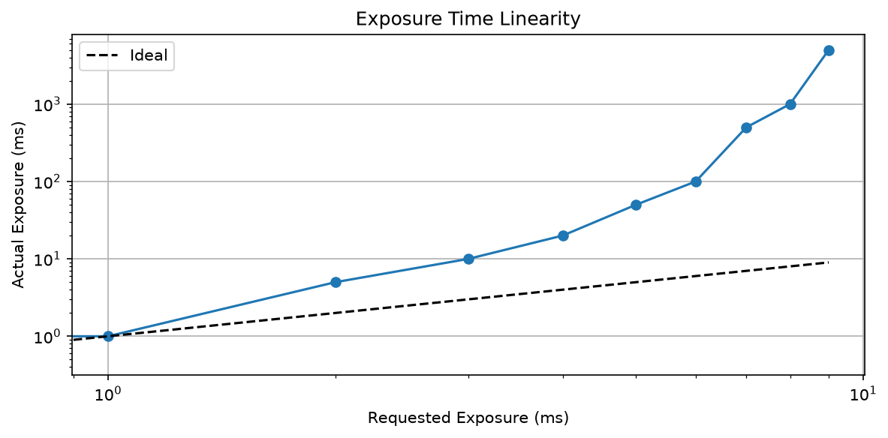
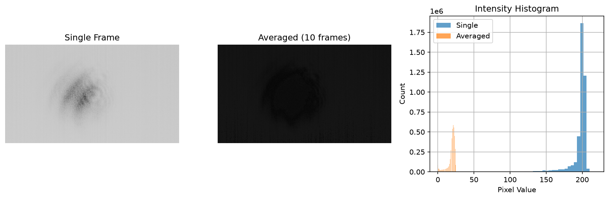
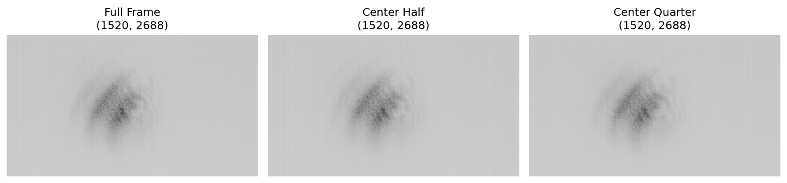

# MIICAM Hardware Test Report
**Generated:** 2026-09-17 21:38:26
**Device:** miicam
---

## MIICAM 4100 Series Camera Test Report
Testing MIICAM camera driver functionality with hardware.

### Camera Enumeration

**Cameras Found:** 1

**Camera 0:** <miicam.MiicamDeviceV2 object at 0x000001D3FFC2CA50>

**Status:** ✅ PASS

**Duration:** 0.04s

---

### Device Information

| Parameter | Value |
| --- | --- |
| Camera ID | 0 |
| Width | 2688 |
| Height | 1520 |
| Bit Depth | 8 |
| Serial Number | TP2408221418059418FD83E3A448D82 |
| Exposure Time | 20.0 ms |
| Max Exposure | 10000.0 ms |
| Min Exposure | 0.011 ms |

**Status:** ✅ PASS

**Duration:** 0.00s

---

### Exposure Time Control

| Requested | Actual | Set Time |
| --- | --- | --- |
| 0.5 ms | 0.500 ms | 797.4 ms |
| 1 ms | 1.000 ms | 793.8 ms |
| 5 ms | 5.000 ms | 799.4 ms |
| 10 ms | 10.000 ms | 794.7 ms |
| 20 ms | 20.000 ms | 797.4 ms |
| 50 ms | 50.000 ms | 795.4 ms |
| 100 ms | 100.000 ms | 798.8 ms |
| 500 ms | 500.000 ms | 797.9 ms |
| 1000 ms | 1000.000 ms | 795.0 ms |
| 5000 ms | 5000.000 ms | 795.1 ms |

*Exposure time linearity test*

**Status:** ✅ PASS

**Duration:** 8.47s

---

### Image Capture

**Single Frame Shape:** (1520, 2688)

**Single Frame Dtype:** uint8

**Min/Max:** 1 / 219

**Mean/Std:** 196.7 / 12.9

**Averaged (10) Shape:** (1520, 2688)

**Averaged Min/Max:** 0 / 25

**Averaged Mean/Std:** 18.8 / 5.5

*Image capture comparison*

**Status:** ✅ PASS

**Duration:** 60.29s

---

### ROI / Window Control

*ROI window test*

| ROI | Size | Center | Image Shape |
| --- | --- | --- | --- |
| Full Frame | (2688, 1520) | (1344, 760) | (1520, 2688) |
| Center Half | (2688, 1520) | (1344, 760) | (1520, 2688) |
| Center Quarter | (2688, 1520) | (1344, 760) | (1520, 2688) |

**Status:** ✅ PASS

**Duration:** 18.04s

---

### Auto Exposure

**Auto Exp Enabled:** True

**Mode:** 1

**Auto Exp Mean:** 18.2

**Auto Exp Max:** 51

**Target 100:** Actual 100

**Target 150:** Actual 150

**Target 200:** Actual 200

**Auto Exp Disabled:** False

**Status:** ✅ PASS

**Duration:** 5.34s

---

### Bit Depth Modes

**Status:** ❌ FAIL

**Duration:** 24.57s

**Error:** [Errno None] 请求的资源在使用中。

---
