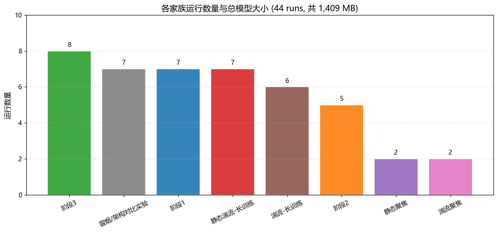
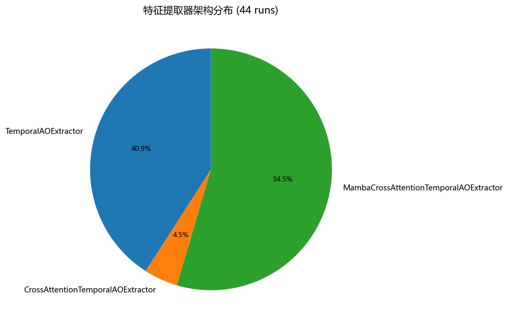
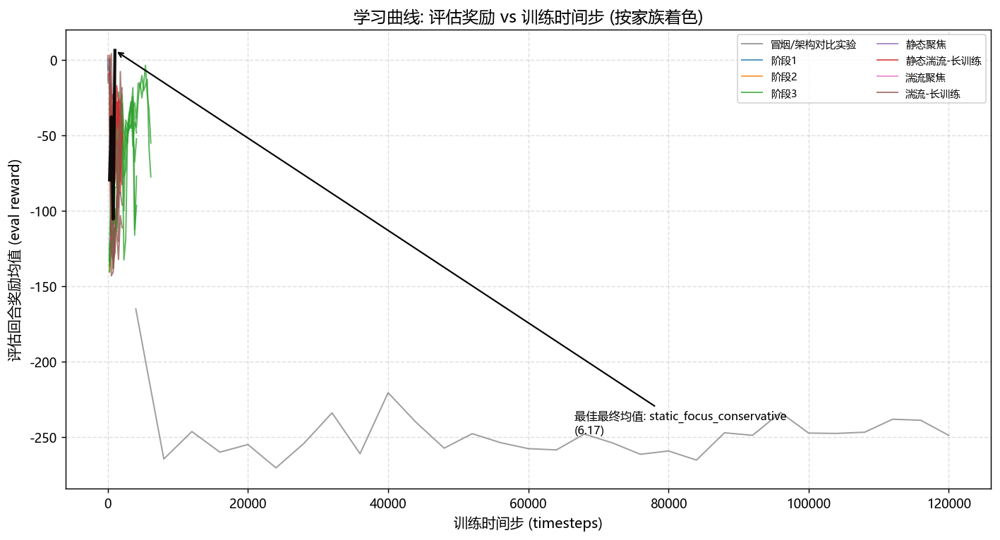
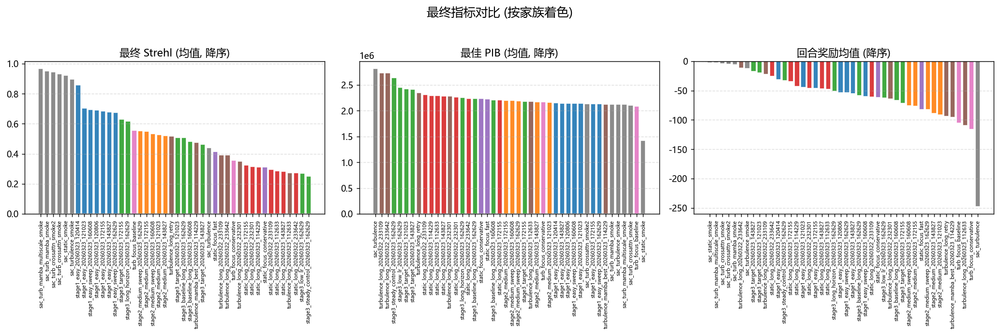
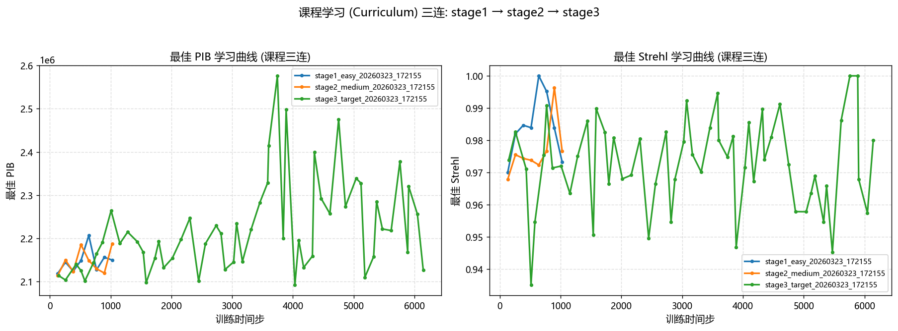
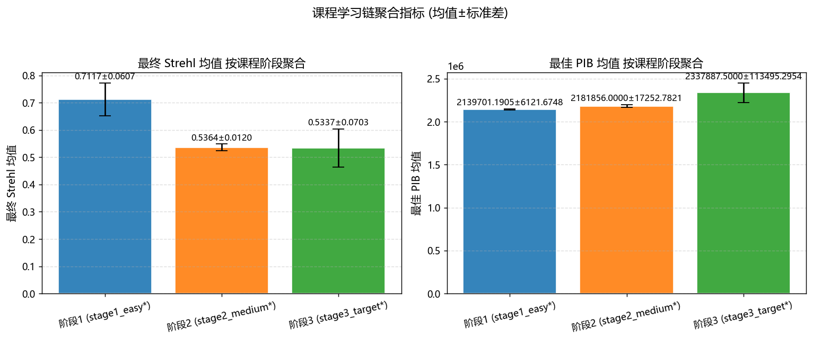

# SAC / Robust-RL 训练运行分析报告

- **生成时间**: 2026-09-17 14:28:54
- **数据来源**: `models/` 下全部 SAC 训练运行 (SB3 SAC 检查点) + `logs/<run>/` 旁路遥测 (config.json / summary.json / eval/evaluations.npz / TensorBoard tfevents)
- **运行总数**: 44 个
- **生成脚本**: `scripts/generate_models_report.py` (纯离线读取, 不导入 ao_shaping / stable_baselines3 / tensorboard)

---

## 1 概述

共分析 **44 个** SAC 训练运行, 模型检查点总大小约 **1,409 MB**。遥测完整性如下:

| 遥测项 | 完整运行数 | 完整率 |
|---|---:|---:|
| config.json (超参数) | 44 | 100.0% |
| summary.json (最终评估) | 44 | 100.0% |
| eval/evaluations.npz (学习曲线) | 44 | 100.0% |
| tfevents (TensorBoard 标量) | 44 | 100.0% |

> 全部 44 个运行的四种遥测 (config.json / summary.json / evaluations.npz / tfevents) 均完整。

## 2 家族构成

按 run 名前缀将 44 个运行划分为以下家族 (映射规则见文末附录):

| 家族 | 数量 | 代表 run | 提取器 | 说明 |
|---|---:|---|---|---|
| 阶段3 | 8 | `stage3_baseline_long_20260323_160608` | MambaCrossAttentionTemporalAOExtractor | 课程学习第 3 阶段 (stage3_target / baseline_long / long_horizon / low_lr / steady_control) |
| 冒烟/架构对比实验 | 7 | `sac_static_smoke` | TemporalAOExtractor | 冒烟测试与架构对比 (sac_turbulence* / sac_static_smoke / sac_turb_mamba* / sac_turb_crossattn*) |
| 阶段1 | 7 | `stage1_easy_20260323_120414` | MambaCrossAttentionTemporalAOExtractor | 课程学习第 1 阶段 (stage1_easy / stage1_easy_sweep), 简单湍流环境 |
| 静态湍流-长训练 | 7 | `static_long_20260322_232301` | TemporalAOExtractor | 静态湍流长训练 (static_long_*), 固定湍流屏 |
| 湍流-长训练 | 6 | `turbulence_long_20260322_232301` | TemporalAOExtractor | 湍流长训练 (turbulence_long_* / turbulence_mamba_best / turbulence_long_retry) |
| 阶段2 | 5 | `stage2_medium_20260323_121023` | MambaCrossAttentionTemporalAOExtractor | 课程学习第 2 阶段 (stage2_medium / stage2_medium_sweep), 中等湍流环境 |
| 静态聚焦 | 2 | `static_focus_conservative` | TemporalAOExtractor | 静态聚焦实验 (static_focus_*) |
| 湍流聚焦 | 2 | `turb_focus_baseline` | TemporalAOExtractor | 湍流聚焦实验 (turb_focus_*) |

## 3 提取器架构分布

从各 run 检查点的 `policy_kwargs` 序列化字节中解析出 `features_extractor_class` (不 import 任何库):

| 提取器 | 数量 | 占比 |
|---|---:|---:|
| MambaCrossAttentionTemporalAOExtractor | 24 | 54.5% |
| TemporalAOExtractor | 18 | 40.9% |
| CrossAttentionTemporalAOExtractor | 2 | 4.5% |

## 4 学习曲线分析

从 44 个运行的 `eval/evaluations.npz` 提取评估奖励曲线 (每次评估的回合奖励均值 vs 训练时间步)。
曲线按家族着色, 黑色粗线为最终评估奖励均值最高的运行。

## 5 最终指标对比 (全部 44 个运行)

下表列出全部运行的最终评估指标 (数据不足标 `-`):

| run | 家族 | 提取器 | total_timesteps | seed | init_model 源 | mean_reward | mean_final_strehl | mean_best_pib |
|---|---|---|---:|---:|---|---:|---:|---:|
| `sac_static_smoke` | 冒烟/架构对比实验 | TemporalAOExtractor | 64 | 42 | - | -2.44 | 0.9213 | 1422592 |
| `sac_turb_crossattn_smoke` | 冒烟/架构对比实验 | CrossAttentionTemporalAOExtractor | 32 | 42 | - | -4.58 | 0.9314 | 2107578 |
| `sac_turb_crossattn_smoke2` | 冒烟/架构对比实验 | CrossAttentionTemporalAOExtractor | 16 | 42 | - | -5.32 | 0.9439 | 2135605 |
| `sac_turb_mamba_multiscale_smoke` | 冒烟/架构对比实验 | MambaCrossAttentionTemporalAOExtractor | 24 | 42 | - | -2.61 | 0.9680 | 2117968 |
| `sac_turb_mamba_smoke` | 冒烟/架构对比实验 | MambaCrossAttentionTemporalAOExtractor | 24 | 42 | - | -6.12 | 0.9526 | 2121966 |
| `sac_turbulence` | 冒烟/架构对比实验 | TemporalAOExtractor | 120000 | 42 | - | -247.71 | 0.4412 | 2815000 |
| `sac_turbulence_smoke` | 冒烟/架构对比实验 | TemporalAOExtractor | 64 | 42 | - | -12.65 | 0.8979 | 2121755 |
| `stage1_easy_20260323_120414` | 阶段1 | MambaCrossAttentionTemporalAOExtractor | 1024 | 401 | - | -31.10 | 0.8589 | 2152075 |
| `stage1_easy_20260323_120806` | 阶段1 | MambaCrossAttentionTemporalAOExtractor | 1024 | 401 | - | -53.93 | 0.6907 | 2140898 |
| `stage1_easy_20260323_121023` | 阶段1 | MambaCrossAttentionTemporalAOExtractor | 1024 | 401 | - | -44.35 | 0.7026 | 2136785 |
| `stage1_easy_20260323_143827` | 阶段1 | MambaCrossAttentionTemporalAOExtractor | 1024 | 401 | - | -54.85 | 0.6784 | 2142473 |
| `stage1_easy_20260323_172155` | 阶段1 | MambaCrossAttentionTemporalAOExtractor | 1024 | 401 | - | -46.23 | 0.6841 | 2133372 |
| `stage1_easy_sweep_20260323_160608` | 阶段1 | MambaCrossAttentionTemporalAOExtractor | 1024 | 401 | - | -59.93 | 0.6934 | 2139781 |
| `stage1_easy_sweep_20260323_162629` | 阶段1 | MambaCrossAttentionTemporalAOExtractor | 1024 | 401 | - | -53.97 | 0.6739 | 2132524 |
| `stage2_medium_20260323_121023` | 阶段2 | MambaCrossAttentionTemporalAOExtractor | 1024 | 401 | stage1_easy_20260323_121023 | -91.02 | 0.5260 | 2156033 |
| `stage2_medium_20260323_143827` | 阶段2 | MambaCrossAttentionTemporalAOExtractor | 1024 | 401 | stage1_easy_20260323_143827 | -88.87 | 0.5221 | 2166982 |
| `stage2_medium_20260323_172155` | 阶段2 | MambaCrossAttentionTemporalAOExtractor | 1024 | 401 | stage1_easy_20260323_172155 | -76.57 | 0.5487 | 2200893 |
| `stage2_medium_sweep_20260323_160608` | 阶段2 | MambaCrossAttentionTemporalAOExtractor | 1024 | 401 | stage1_easy_sweep_20260323_160608 | -75.62 | 0.5330 | 2193962 |
| `stage2_medium_sweep_20260323_162629` | 阶段2 | MambaCrossAttentionTemporalAOExtractor | 1024 | 401 | stage1_easy_sweep_20260323_162629 | -82.13 | 0.5521 | 2191409 |
| `stage3_baseline_long_20260323_160608` | 阶段3 | MambaCrossAttentionTemporalAOExtractor | 4096 | 401 | stage2_medium_sweep_20260323_160608 | -67.04 | 0.4822 | 2208743 |
| `stage3_baseline_long_20260323_162629` | 阶段3 | MambaCrossAttentionTemporalAOExtractor | 4096 | 401 | stage2_medium_sweep_20260323_162629 | -58.87 | 0.5085 | 2231445 |
| `stage3_long_horizon_20260323_162629` | 阶段3 | MambaCrossAttentionTemporalAOExtractor | 6144 | 401 | stage2_medium_sweep_20260323_162629 | -51.16 | 0.6180 | 2253045 |
| `stage3_low_lr_20260323_162629` | 阶段3 | MambaCrossAttentionTemporalAOExtractor | 4096 | 401 | stage2_medium_sweep_20260323_162629 | -63.02 | 0.2713 | 2451640 |
| `stage3_steady_control_20260323_162629` | 阶段3 | MambaCrossAttentionTemporalAOExtractor | 4096 | 401 | stage2_medium_sweep_20260323_162629 | -32.81 | 0.2498 | 2638261 |
| `stage3_target_20260323_121023` | 阶段3 | MambaCrossAttentionTemporalAOExtractor | 2048 | 401 | stage2_medium_20260323_121023 | -19.78 | 0.5086 | 2424583 |
| `stage3_target_20260323_143827` | 阶段3 | MambaCrossAttentionTemporalAOExtractor | 2048 | 401 | stage2_medium_20260323_143827 | -17.62 | 0.4629 | 2411521 |
| `stage3_target_20260323_172155` | 阶段3 | MambaCrossAttentionTemporalAOExtractor | 6144 | 401 | stage2_medium_20260323_172155 | -71.82 | 0.6296 | 2177558 |
| `static_focus_conservative` | 静态聚焦 | TemporalAOExtractor | 1024 | 41 | - | -61.52 | 0.3106 | 2231015 |
| `static_focus_fast` | 静态聚焦 | TemporalAOExtractor | 1024 | 47 | - | -81.97 | 0.4155 | 2226558 |
| `static_long_20260322_232301` | 静态湍流-长训练 | TemporalAOExtractor | 2048 | 101 | - | -45.76 | 0.3155 | 2262222 |
| `static_long_20260322_233109` | 静态湍流-长训练 | TemporalAOExtractor | 2048 | 101 | - | -60.64 | 0.2962 | 2313094 |
| `static_long_20260322_233642` | 静态湍流-长训练 | TemporalAOExtractor | 2048 | 101 | - | -25.46 | 0.2745 | 2236894 |
| `static_long_20260323_112633` | 静态湍流-长训练 | TemporalAOExtractor | 2048 | 101 | - | -47.60 | 0.2861 | 2288950 |
| `static_long_20260323_114229` | 静态湍流-长训练 | TemporalAOExtractor | 2048 | 101 | - | -43.28 | 0.3120 | 2289491 |
| `static_long_20260323_143827` | 静态湍流-长训练 | TemporalAOExtractor | 2048 | 101 | - | -46.59 | 0.2828 | 2282166 |
| `static_long_20260323_172155` | 静态湍流-长训练 | TemporalAOExtractor | 2048 | 101 | - | -34.75 | 0.3255 | 2206938 |
| `turb_focus_baseline` | 湍流聚焦 | TemporalAOExtractor | 1024 | 53 | - | -105.31 | 0.5575 | 2083554 |
| `turb_focus_conservative` | 湍流聚焦 | TemporalAOExtractor | 1024 | 43 | - | -116.34 | 0.3559 | 2165359 |
| `turbulence_long_20260322_232301` | 湍流-长训练 | TemporalAOExtractor | 2048 | 103 | - | -63.99 | 0.3492 | 2280162 |
| `turbulence_long_20260322_233109` | 湍流-长训练 | TemporalAOExtractor | 2048 | 103 | - | -22.65 | 0.3926 | 2733969 |
| `turbulence_long_20260322_233642` | 湍流-长训练 | TemporalAOExtractor | 2048 | 103 | - | -11.83 | 0.3918 | 2726996 |
| `turbulence_long_20260323_112633` | 湍流-长训练 | MambaCrossAttentionTemporalAOExtractor | 2048 | 103 | - | -109.44 | 0.2748 | 2175005 |
| `turbulence_long_retry` | 湍流-长训练 | TemporalAOExtractor | 2048 | 107 | - | -93.71 | 0.5163 | 2347504 |
| `turbulence_mamba_best_20260323_114229` | 湍流-长训练 | MambaCrossAttentionTemporalAOExtractor | 2048 | 229 | - | -95.81 | 0.4751 | 2126212 |

## 6 课程学习 (Curriculum) 链分析

课程链由 `config.json` 的 `init_model` 字段追踪真实来源:

| 阶段 run | init_model 源 |
|---|---|
| `stage1_easy_20260323_172155` | 无 (从头训练) |
| `stage2_medium_20260323_172155` | stage1_easy_20260323_172155 |
| `stage3_target_20260323_172155` | stage2_medium_20260323_172155 |

## 7 tfevents 时间序列

课程三连各 run 的 tfevents 最终标量值 (最后记录点):

| run | ao/best_pib (最终) | ao/best_strehl (最终) | rollout/ep_rew_mean (最终) |
|---|---:|---:|---:|
| `stage1_easy_20260323_172155` | 2149675 | 0.9733 | -27.37 |
| `stage2_medium_20260323_172155` | 2187288 | 0.9767 | -63.49 |
| `stage3_target_20260323_172155` | 2126490 | 0.9800 | -21.83 |

> 完整曲线见图 5 (`turbulence_tfevents.png`)。`ao/best_pib` 为训练过程中观测到的最佳桶内功率, `ao/best_strehl` 为最佳 Strehl。

## 8 关键结论

### 8.1 Top-3 最佳运行 (按 mean_final_strehl)

| 排名 | run | 家族 | 提取器 | total_timesteps | mean_final_strehl | mean_best_pib | mean_reward |
|---|---|---|---:|---:|---:|---:|
| 1 | `sac_turb_mamba_multiscale_smoke` | 冒烟/架构对比实验 | MambaCrossAttentionTemporalAOExtractor | 24 | 0.9680 | 2117968 | -2.61 |
| 2 | `sac_turb_mamba_smoke` | 冒烟/架构对比实验 | MambaCrossAttentionTemporalAOExtractor | 24 | 0.9526 | 2121966 | -6.12 |
| 3 | `sac_turb_crossattn_smoke2` | 冒烟/架构对比实验 | CrossAttentionTemporalAOExtractor | 16 | 0.9439 | 2135605 | -5.32 |

### 8.2 观察到的规律

- **Mamba 提取器** (`MambaCrossAttentionTemporalAOExtractor`): 24 个有最终指标的运行, mean_final_strehl 均值 **0.5860**。
- **Plain 提取器** (`TemporalAOExtractor`): 18 个有最终指标的运行, mean_final_strehl 均值 **0.4246**。
- **CrossAttention 提取器** (`CrossAttentionTemporalAOExtractor`): 2 个有最终指标的运行, mean_final_strehl 均值 **0.9377**。
- 课程学习链 (stage1 → stage2 → stage3) 通过 `init_model` 逐级继承, 阶段 3 的 `ao/best_pib` 与 `ao/best_strehl` 在更长训练 (6144 步) 下保持高位 (见图 5/6)。
- 冒烟测试 run (16~64 步) 与 120000 步长训练 run 的指标**不可直接比较** (训练量差 3~4 个数量级)。

### 8.3 警告与注意事项

- 冒烟/架构对比 run (`sac_*`) 训练步数极少 (16~64 步), 其指标仅用于验证管线可用性, 不能与长训练 run 直接对比。
- `mean_best_pib` 为桶内功率 (PIB), 数值量级 ~1e6, 与 Strehl 无量纲指标含义不同, 对比时注意单位。
- 提取器解析基于检查点 `data` 成员的序列化字节 (cloudpickle 明文), 若未来 SB3 序列化格式变化, 解析结果可能失效。

---

## 附录: 家族映射规则

| 前缀 | 家族 |
|---|---|
| `stage1_easy*` | 阶段1 |
| `stage2_medium*` | 阶段2 |
| `stage3_*` | 阶段3 |
| `static_long*` | 静态湍流-长训练 |
| `static_focus*` | 静态聚焦 |
| `turbulence_long*` | 湍流-长训练 |
| `turbulence_mamba_best*` | 湍流-长训练 |
| `turbulence_long_retry*` | 湍流-长训练 |
| `turb_focus*` | 湍流聚焦 |
| `sac_*` | 冒烟/架构对比实验 |
| `tmp_sac_run*` | 临时调试 |

---

*报告由 `scripts/generate_models_report.py` 自动生成于 2026-09-17 14:28:54。*
