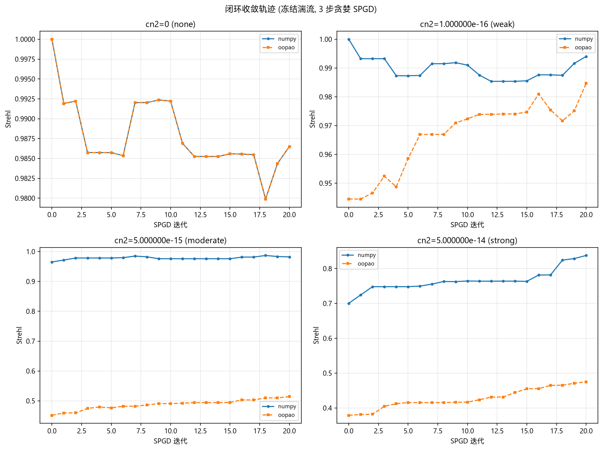

# AO_OOPAO_BACKEND 端到端影响报告 (SimTurbulenceAOEnv)

> 生成时间: 2026-09-29T14:00:22 | 脚本: `scripts/generate_oopao_impact_report.py` | OOPAO rev: `e8e9aa6` (2026-09-24, git 校验=是) | OOPAO 包目录: `/home/ws/code/AO-shaping/libs/OOPAO/OOPAO`

## 1. 适用范围 (路由红线)

`AO_OOPAO_BACKEND` 只路由 `beam_backend.turbulence_phase()` 与 `beam_backend.propagate()`; `focal_plane()` / `apply_lens()` 恒为 numpy。本报告驱动的是 `SimTurbulenceAOEnv` (RL AO 环境: DM 影响函数 + WFS 斜率 + 焦面 FFT), 其湍流相位屏经 `turbulence_phase()` 路由, 焦面/Strehl/PIB/RMS 下游计算是同一份代码。因此两臂差异**只来自湍流相位屏**。

## 2. 方法与指标定义

- 环境: `SimTurbulenceAOEnv` (n_grid=64, 4×4 DM, 4×4 子孔径, λ=1550nm, 口径 0.1m, 传播距离 1000m, PIB 桶半径 4px)
- 种子: `seed=42` (全局 `np.random.seed` + `env.reset(seed=...)`), steps=60
- 两种模式:
  - `open` 开环: 滑动湍流窗口 (screen_step_px=2), 零动作, 记录湍流演化下的端到端指标
  - `closed` 闭环: 冻结湍流 (screen_step_px=0), 3 步贪婪 SPGD (δ=0.03, 随机方向 ± 评估 + 回位到更优位置), 记录校正收敛
- 指标: Strehl (焦面峰值/理想峰值), PIB (桶内功率, r=4px), RMS (相位 RMS), best-Strehl (episode 内最优)
- 后端卫生: 每臂切换时 set/pop `AO_OOPAO_BACKEND` + `oopao_backend._get_backend.cache_clear()` (进入与退出都清); 每行记录实测 `_oopao_enabled()` 并校验与臂一致

## 3. Cn2 阶梯

| cn2 | 标签 | 说明 |
|-----|------|------|
| 0 | none | 对照组 (`turbulence_phase` 在 cn2<=0 短路为零屏) |
| 1.000000e-16 | weak |  |
| 5.000000e-15 | moderate |  |
| 5.000000e-14 | strong |  |

## 4. 汇总对比

### 4.1 开环 (open)

| cn2 | 臂 | init Strehl | best Strehl | init PIB | init RMS | disturbance RMS | Strehl 增益 |
|-----|-----|------------|-------------|----------|----------|-----------------|-------------|
| 0 | numpy | 1.0000 | 1.0000 | 2.818e+06 | 0.0000 | 0.0000 | +0.0000 |
| 0 | oopao | 1.0000 | 1.0000 | 2.818e+06 | 0.0000 | 0.0000 | +0.0000 |
| 1.000000e-16 | numpy | 0.9957 | 1.0000 | 2.821e+06 | 0.1922 | 0.1818 | +0.0043 |
| 1.000000e-16 | oopao | 0.9704 | 1.0000 | 2.227e+06 | 0.9592 | 0.9867 | +0.0296 |
| 5.000000e-15 | numpy | 0.8798 | 0.9630 | 2.859e+06 | 1.3592 | 1.2854 | +0.0831 |
| 5.000000e-15 | oopao | 0.3846 | 0.5283 | 1.902e+05 | 1.7204 | 6.9770 | +0.1437 |
| 5.000000e-14 | numpy | 0.3276 | 0.6887 | 2.589e+06 | 2.1649 | 4.0647 | +0.3610 |
| 5.000000e-14 | oopao | 0.4650 | 0.6034 | 2.284e+05 | 1.7985 | 22.0632 | +0.1384 |

### 4.2 闭环 (closed)

| cn2 | 臂 | init Strehl | best Strehl | init PIB | init RMS | disturbance RMS | Strehl 增益 |
|-----|-----|------------|-------------|----------|----------|-----------------|-------------|
| 0 | numpy | 1.0000 | 1.0000 | 2.818e+06 | 0.0000 | 0.0000 | +0.0000 |
| 0 | oopao | 1.0000 | 1.0000 | 2.818e+06 | 0.0000 | 0.0000 | +0.0000 |
| 1.000000e-16 | numpy | 1.0000 | 1.0000 | 2.815e+06 | 0.0335 | 0.0333 | +0.0000 |
| 1.000000e-16 | oopao | 0.9445 | 0.9847 | 2.721e+06 | 0.4421 | 0.4441 | +0.0402 |
| 5.000000e-15 | numpy | 0.9652 | 0.9931 | 2.794e+06 | 0.2370 | 0.2351 | +0.0278 |
| 5.000000e-15 | oopao | 0.4516 | 0.5140 | 3.946e+05 | 1.7272 | 3.1399 | +0.0625 |
| 5.000000e-14 | numpy | 0.7005 | 0.8377 | 2.485e+06 | 0.7494 | 0.7436 | +0.1372 |
| 5.000000e-14 | oopao | 0.3789 | 0.4777 | 3.019e+05 | 1.8230 | 9.9294 | +0.0988 |

### 4.3 关键分析: 相位屏强度差异是固定标定偏置

`disturbance_rms` 是被路由的 `turbulence_phase` 原始相位屏的 RMS —— 两臂**唯一**的物理输入差异, 所以它的 oopao/numpy 比值可以直接读作「同一 Cn2 下 OOPAO 相位起伏比 numpy 强多少倍」。cn2=0 已短路为零屏 (比值无定义), 从表中省略:

| mode | cn2=1.000000e-16 | cn2=5.000000e-15 | cn2=5.000000e-14 | 相对离散度 | 判定 |
|------|-----|-----|-----|--------|------|
| open | 5.428 | 5.428 | 5.428 | 1.11e-09 | **恒定** |
| closed | 13.354 | 13.354 | 13.354 | 1.16e-09 | **恒定** |

比值在跨越 3 个湍流档位 (两个数量级) 的阶梯上**恒定**: 各 mode 的相对离散度 (max−min)/mean ≤ 1.16e-09, 远低于判据 0.001 (浮点舍入量级)。若差异来自随机相位屏的采样噪声, 比值会随湍流强度漂移; 恒定比值指向两个实现之间的**乘性标定/偏置因子**。

两条独立证据支持「标定偏置」而非「统计涨落」的判断:

1. **与 Cn2 无关**: 跨越两个数量级的湍流阶梯比值不变 —— 标定系数不随 Cn2 变化。
2. **随 mode 改变**: 恒定比值逐 mode 不同 (open 5.428 / closed 13.354) —— 两者 `l_max` / `propagation_distance` 配置不同, 与前一份报告 `docs/oopao_vs_numpy/report.md` 「比值随配置变化」(该配置 8.72×–8.81×, 另一组配置 9.72×) 的结论一致。

⚠️ **`init_rms` 与 `disturbance_rms` 是两个不同的量, 不可互相推断**:
- `disturbance_rms` = `env._disturbance_rms` = **全网格未截瞳**的原始相位屏 RMS, 不含像差, 不含 DM 校正;
- `init_rms` = `info["rms"]` = `compat.py::_phase_rms()` = `angle(湍流 + 像差 + DM 校正)` 后按 `self._mask` **截瞳**的总波前 RMS。
因此即使 oopao 臂的相位屏强 5.428×, `init_rms` 仍可跨臂反向: 实测 open/5.000000e-14 numpy init_rms 2.1649 > oopao 1.7985, 而同一格的 disturbance_rms 是 4.0647 vs 22.0632。像差项与截瞳权重同时参与合成, 所以「相位屏更强 → init_rms 必然更大」不成立。
Strehl 同理 —— 它由截瞳后的**总**波前决定, 而不只是相位屏。

## 5. 收敛轨迹 (closed)

闭环模式下湍流被冻结, 3 步贪婪 SPGD 用 16 路 DM 校正静态像差。两臂的收敛轨迹差异直接反映相位屏强度差异: numpy 臂湍流弱 (init Strehl 高), 校正增益小; oopao 臂湍流强 (init Strehl 低), 校正增益大但绝对上限低。

## 6. cn2=0 对照组

cn2=0 时 `turbulence_phase` 短路为零屏, 两臂应**位级一致**。校验结果: **通过**。

## 7. 反空洞守卫

两臂在 cn2>0 下确实不同: **通过** (6 个 (mode, cn2>0) 单元格的 init/best Strehl 或 PIB/RMS 不同)。若此处失败, 说明后端开关 没有影响被测路径, 报告将拒绝写出。

## 8. 负发现: slm_shaping_bench 的 cn2 是死配置

`slm_shaping_bench.forward_intensity` 在 cn2=0 与 cn2=5e-14 下输出**字节一致** (max|ΔI| = 0)。它 import 了 `turbulence_phase` 但从不调用; 只调用 `focal_plane` (永不路由)。因此 `slm_shaping_bench` **不能**作为后端影响测试载体。

## 9. 非可比性声明

绝对 Strehl/PIB 不可跨臂直接比较 —— 同 Cn2 下 OOPAO 相位起伏远强于 numpy。
前一份报告 `docs/oopao_vs_numpy/report.md` 在其配置下测得 8.72×–8.81× (中位 8.77×); 本报告在端到端环境里**独立测得**的是逐位恒定的常数 (§4.3):
- `open` 模式: **5.428×** (相对离散度 1.11e-09, 在 3 个湍流档位上恒定)
- `closed` 模式: **13.354×** (相对离散度 1.16e-09, 在 3 个湍流档位上恒定)

这意味着表中某些行**看似「OOPAO 更优」, 但不可解读为后端更优**: 例如 open 模式 cn2=5.000000e-14 时, oopao 的 init Strehl (0.4650) 高于 numpy (0.3276)。但同一格的 disturbance_rms 是 22.0632 vs 4.0647 —— 两臂承受的相位屏强度本就不同; 且 init_rms 为 1.7985 vs 2.1649, Strehl 由**截瞳后总波前** (湍流 + 像差 + DM 校正) 决定, 而不是相位屏单独决定 (见 §4.3 注)。该行的 Strehl 高低主要反映**各自所受扰动的合成相位**, 无法据此判定哪一臂的传播核更优。

要判定哪一臂的绝对 Strehl 更接近物理真值, 需先把两臂的相位屏**标定到同一 r0 / 同一 phase_std**, 再重跑本矩阵 —— 当前数据不足以支持该结论。本报告对比的是「同一 Cn2 配置下, 切换后端对端到端行为的影响」, 不是「等价实现」。

## 10. 产物清单

- `summary.csv` — 每 (mode, cn2, arm) 一行
- `figures/strehl_by_cn2.png`
- `figures/convergence_trace.png`
- `figures/pib_rms_by_cn2.png`
