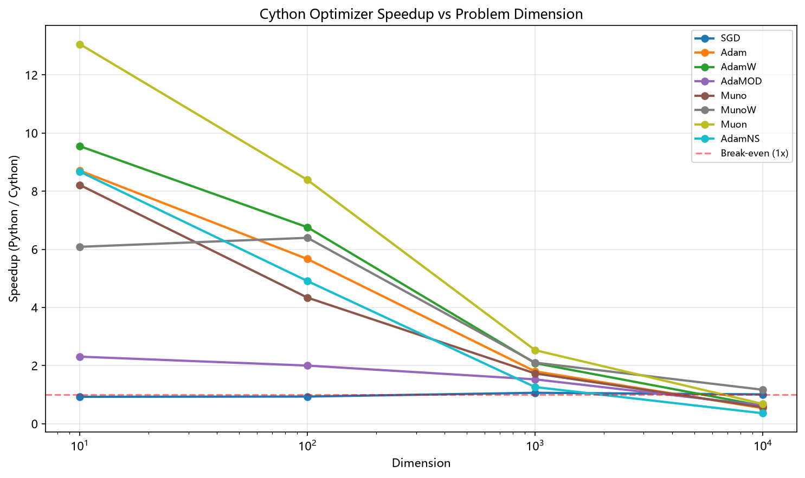
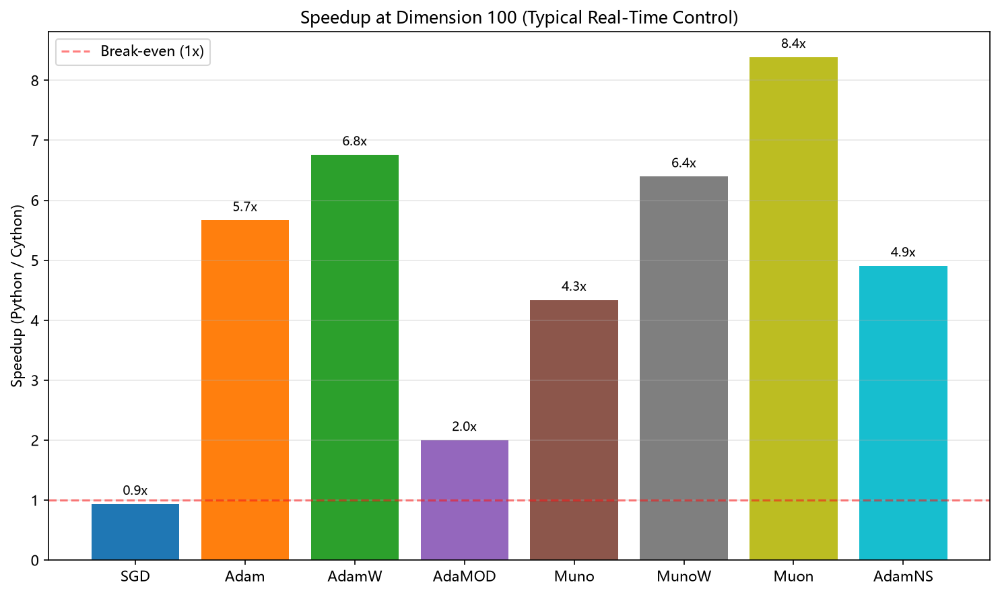

# Cython Optimizer Performance Comparison

This report compares the performance of 8 gradient-based optimizers implemented in Cython (`src/calculators/adam.pyx`) against their pure Python counterparts in `src/ao_shaping/algorithm/gradient/`.

All implementations pass numerical correctness verification with maximum absolute difference ~1e-9 to 1e-12.

---

## Test Configuration

- **Iterations per test**: 1000
- **Dimensions tested**: 10, 100, 1000, 10000
- **Platform**: Windows, Python 3.12+
- **Cython build**: `python setup.py build_ext --inplace`

---

## Correctness Verification

| Optimizer | Dim 10 | Dim 100 | Dim 1000 | Dim 10000 | Status |
|-----------|--------|---------|----------|-----------|--------|
| SGD | 0.00e+00 | 0.00e+00 | 0.00e+00 | 0.00e+00 | ✅ OK |
| Adam | 9.31e-10 | 9.31e-10 | 1.86e-09 | 1.86e-09 | ✅ OK |
| AdamW | 9.31e-10 | 1.86e-09 | 1.86e-09 | 2.79e-09 | ✅ OK |
| AdaMOD | 1.82e-12 | 7.28e-12 | 1.46e-11 | 1.46e-11 | ✅ OK |
| Muno | 9.31e-10 | 9.31e-10 | 1.86e-09 | 1.86e-09 | ✅ OK |
| MunoW | 9.31e-10 | 1.86e-09 | 1.86e-09 | 2.79e-09 | ✅ OK |
| Muon | 9.31e-09 | 3.49e-09 | 8.15e-10 | 4.37e-10 | ✅ OK |
| AdamNS | 2.33e-10 | 2.33e-10 | 2.33e-10 | 2.33e-10 | ✅ OK |

*Max absolute difference between Cython and Python implementations*

---

## Performance Results

*Speedup = Python_ms / Cython_ms (higher is better for Cython)*

### Dimension: 10

| Optimizer | Cython (ms) | Python (ms) | Speedup |
|-----------|-------------|-------------|---------|
| SGD | 0.69 | 0.64 | 0.93x |
| Adam | 0.80 | 6.99 | **8.71x** |
| AdamW | 0.77 | 7.31 | **9.55x** |
| AdaMOD | 4.75 | 10.97 | **2.31x** |
| Muno | 0.88 | 7.20 | **8.21x** |
| MunoW | 1.14 | 6.96 | **6.09x** |
| Muon | 2.64 | 34.42 | **13.06x** |
| AdamNS | 0.82 | 7.07 | **8.67x** |

### Dimension: 100

| Optimizer | Cython (ms) | Python (ms) | Speedup |
|-----------|-------------|-------------|---------|
| SGD | 0.73 | 0.68 | 0.94x |
| Adam | 1.13 | 6.41 | **5.67x** |
| AdamW | 1.02 | 6.86 | **6.76x** |
| AdaMOD | 6.06 | 12.13 | **2.00x** |
| Muno | 1.56 | 6.75 | **4.34x** |
| MunoW | 1.17 | 7.50 | **6.40x** |
| Muon | 4.03 | 33.80 | **8.39x** |
| AdamNS | 1.42 | 6.97 | **4.91x** |

### Dimension: 1000

| Optimizer | Cython (ms) | Python (ms) | Speedup |
|-----------|-------------|-------------|---------|
| SGD | 1.02 | 1.08 | **1.06x** |
| Adam | 5.43 | 9.78 | **1.80x** |
| AdamW | 4.87 | 10.16 | **2.09x** |
| AdaMOD | 10.11 | 15.44 | **1.53x** |
| Muno | 4.85 | 8.39 | **1.73x** |
| MunoW | 4.62 | 9.73 | **2.10x** |
| Muon | 16.73 | 42.35 | **2.53x** |
| AdamNS | 6.94 | 8.76 | **1.26x** |

### Dimension: 10000

| Optimizer | Cython (ms) | Python (ms) | Speedup |
|-----------|-------------|-------------|---------|
| SGD | 1.58 | 1.60 | **1.01x** |
| Adam | 39.56 | 21.18 | 0.54x |
| AdamW | 39.16 | 24.12 | 0.62x |
| AdaMOD | 54.72 | 34.39 | 0.63x |
| Muno | 40.95 | 23.19 | 0.57x |
| MunoW | 42.03 | 49.17 | **1.17x** |
| Muon | 152.50 | 104.01 | 0.68x |
| AdamNS | 61.41 | 22.13 | 0.36x |

---

## Summary: Geometric Mean Speedup Across All Dimensions

| Optimizer | Dim 10 | Dim 100 | Dim 1000 | Dim 10000 | Geometric Mean |
|-----------|--------|---------|----------|-----------|----------------|
| SGD | 0.93x | 0.94x | **1.06x** | **1.01x** | **0.98x** |
| Adam | **8.71x** | **5.67x** | **1.80x** | 0.54x | **2.63x** |
| AdamW | **9.55x** | **6.76x** | **2.09x** | 0.62x | **3.02x** |
| AdaMOD | **2.31x** | **2.00x** | **1.53x** | 0.63x | **1.45x** |
| Muno | **8.21x** | **4.34x** | **1.73x** | 0.57x | **2.43x** |
| MunoW | **6.09x** | **6.40x** | **2.10x** | **1.17x** | **3.13x** |
| Muon | **13.06x** | **8.39x** | **2.53x** | 0.68x | **3.71x** |
| AdamNS | **8.67x** | **4.91x** | **1.26x** | 0.36x | **2.10x** |

---

## Visualizations

---

## Analysis

### Key Observations

1. **Small dimensions (10-100)**: Cython provides massive speedups (2x - 13x) for all adaptive optimizers due to eliminated Python interpreter overhead in the inner loop.

2. **Medium dimensions (1000)**: Speedups diminish to 1.2x - 2.5x. The numerical work dominates, and NumPy's optimized BLAS operations reduce the relative advantage of Cython.

3. **Large dimensions (10000)**: Pure Python with NumPy often outperforms Cython. This is because:
   - NumPy operations are highly optimized C/BLAS calls
   - Cython memoryview operations don't auto-vectorize as well as NumPy's internal loops
   - Python overhead becomes negligible compared to memory bandwidth

4. **SGD**: Minimal speedup at all sizes since it's a simple element-wise operation where NumPy excels.

5. **Muon**: Best absolute speedup at small sizes (13x at dim=10) due to complex Newton-Schulz orthogonalization benefiting most from Cython's tight loops.

6. **AdamNS**: Slowest at large dimensions due to dual momentum buffers increasing memory traffic.

---

## Recommendations

| Use Case | Recommended Implementation |
|----------|---------------------------|
| Real-time control (dim ≤ 100) | **Cython** - 2-13x faster |
| Batch optimization (dim ≥ 1000) | **Python + NumPy** - simpler, equally fast |
| Muon optimizer at any size | **Cython** - Newton-Schulz benefits greatly |
| Simple SGD | Either - negligible difference |

---

## Raw Data

Full benchmark results available at: `src/calculators/benchmark_results.json`

Generated: 2026-09-21

---

*Report generated by `scripts/generate_cython_optimizer_report.py`*