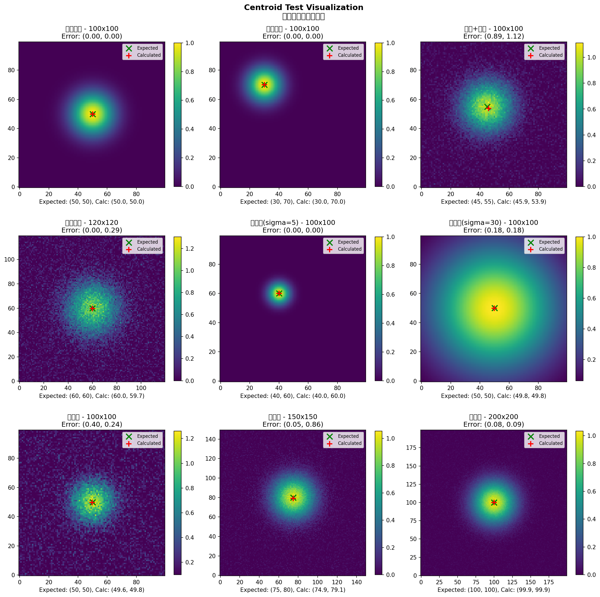
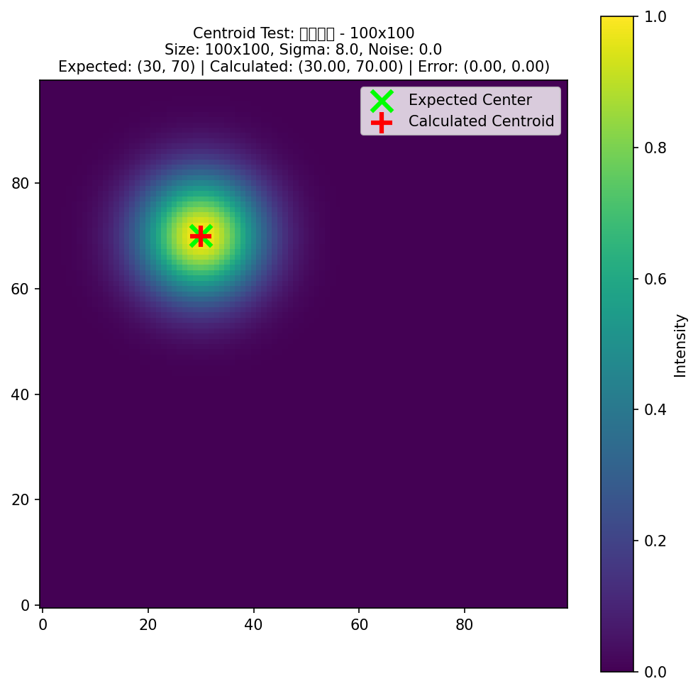
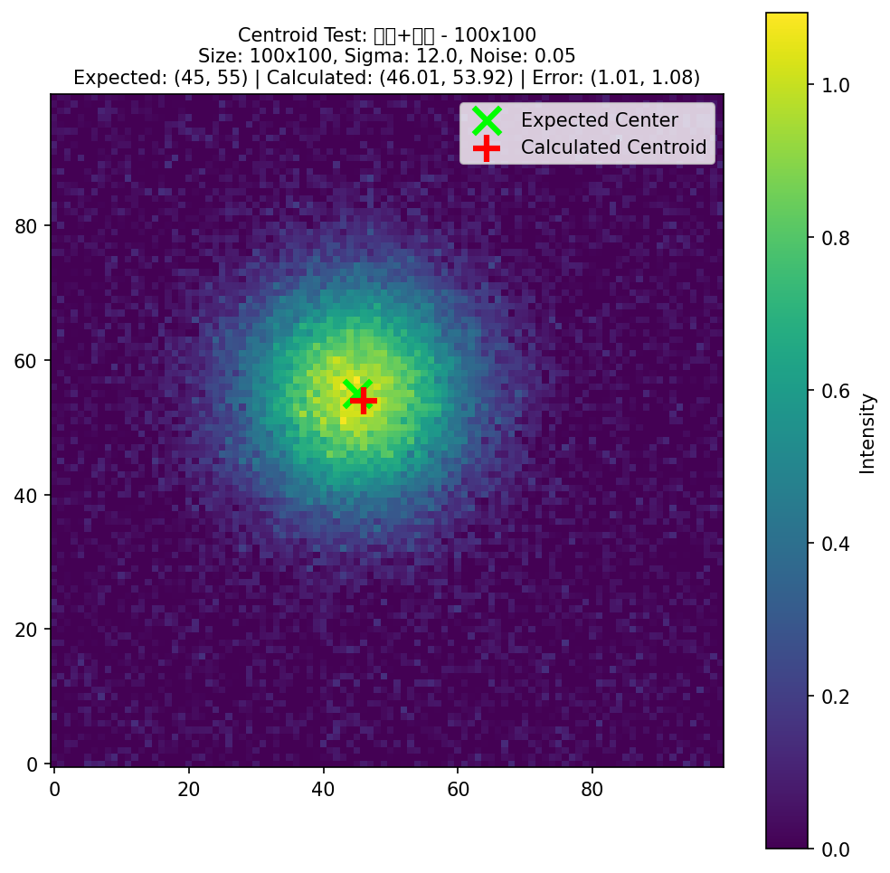
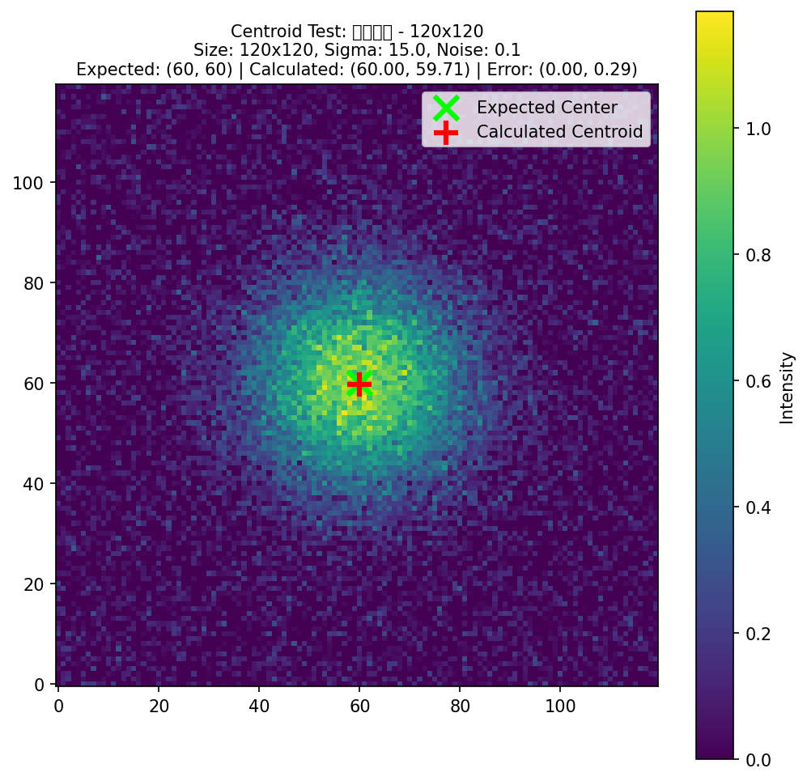
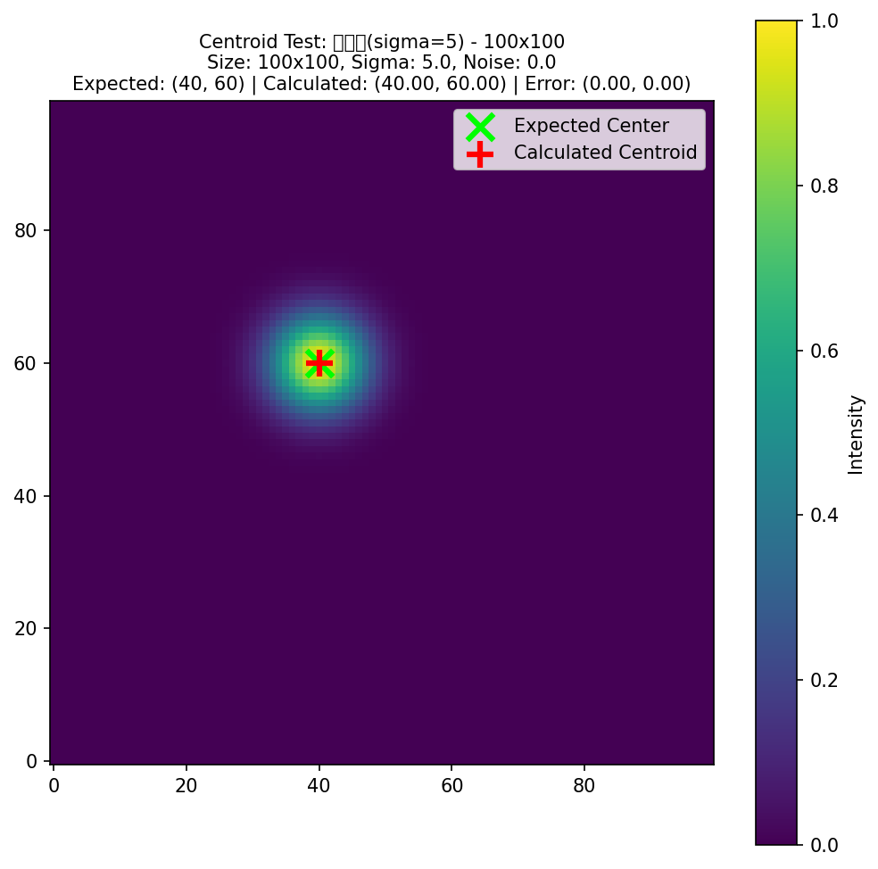
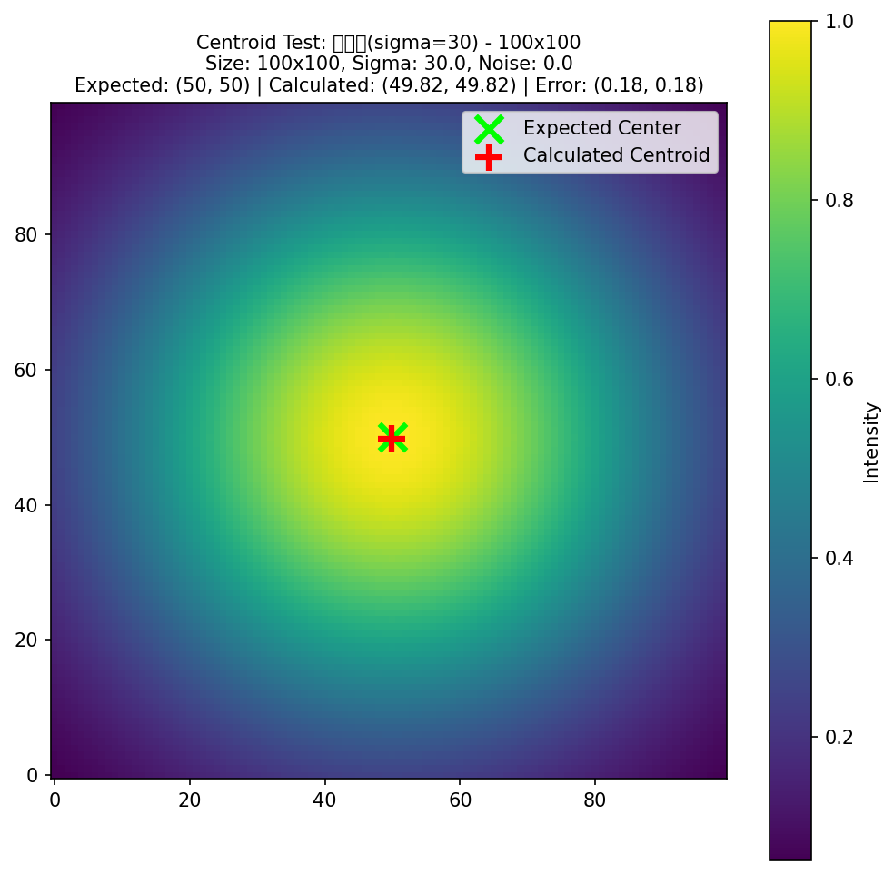
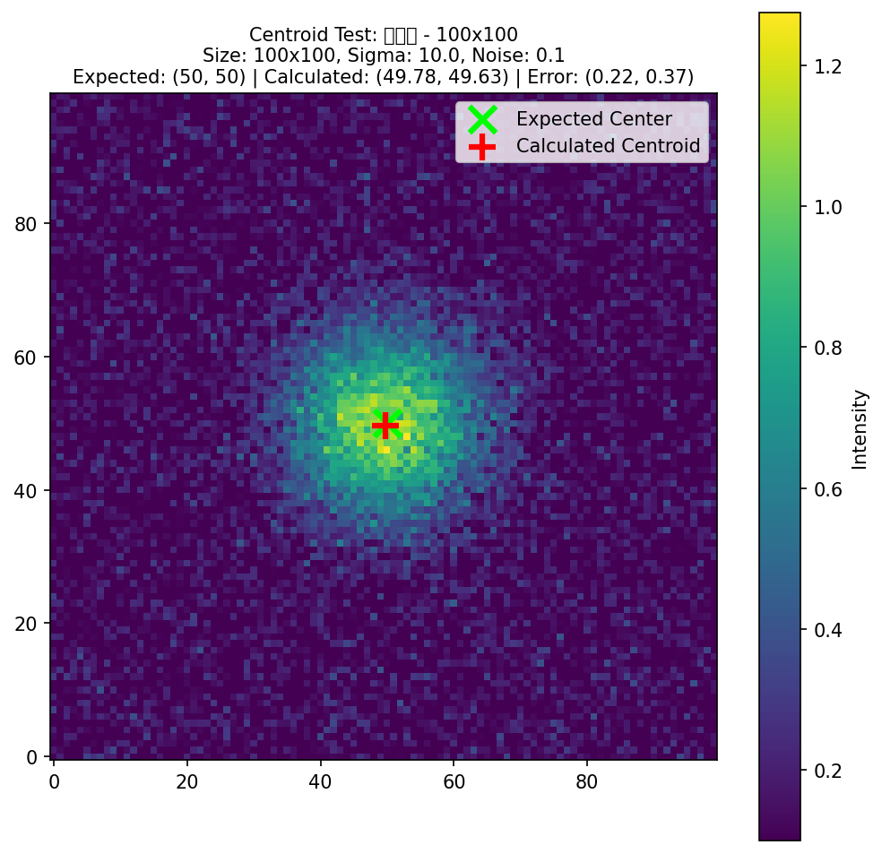
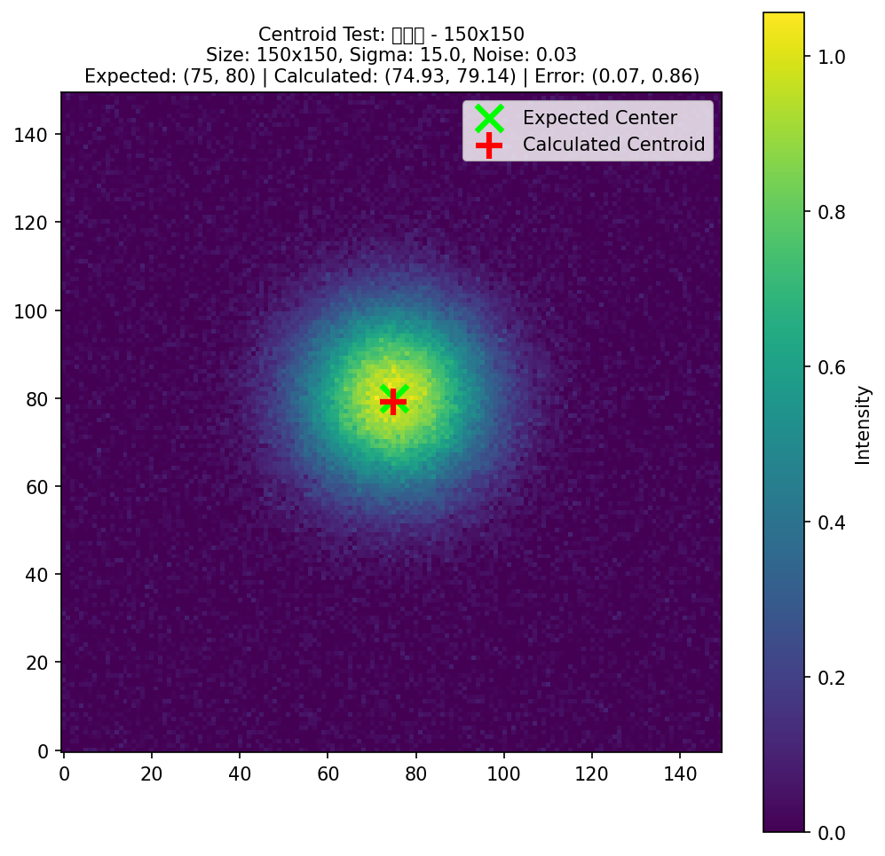
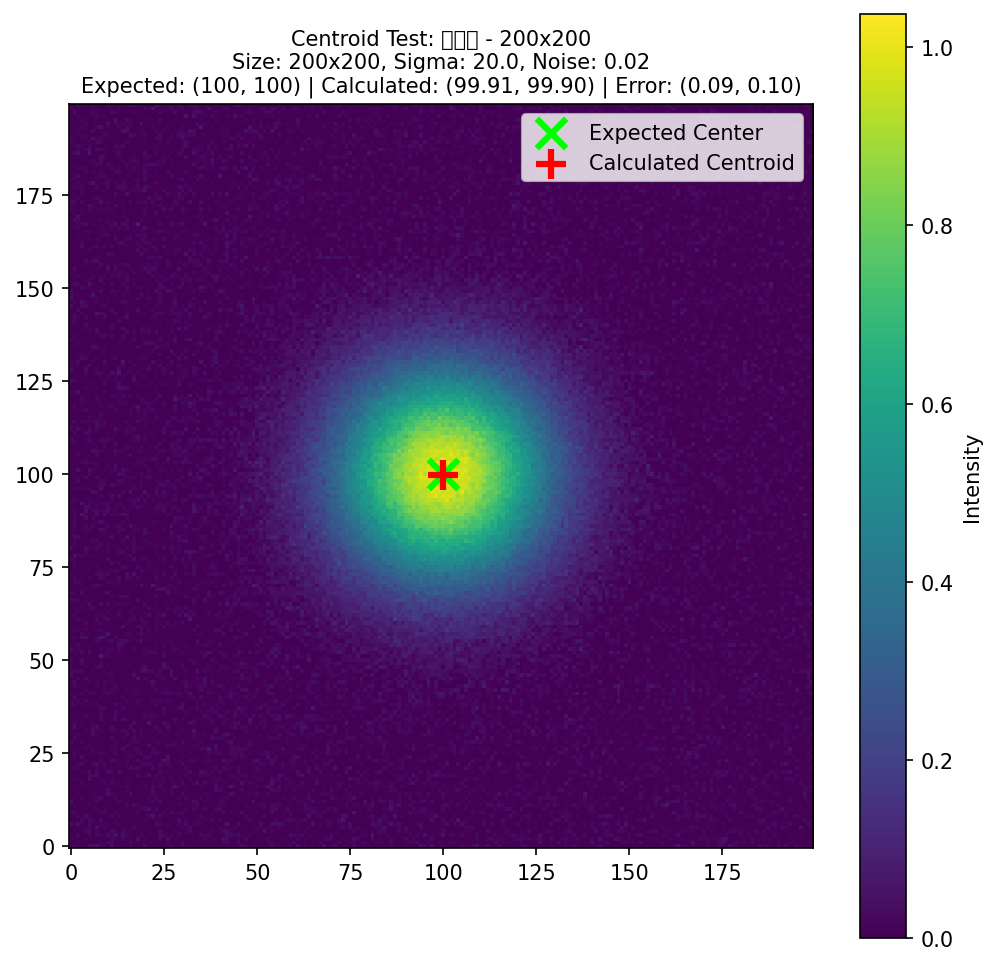

# Centroid Test Visualization Report

Generated: 2026-03-25 13:07:59

## Test Results Summary

| Test Case | Expected (x, y) | Calculated (x, y) | Error (x, y) |
|-----------|------------------|--------------------| ------------|
| 中心位置 - 100x100 | (50, 50) | (50.00, 50.00) | (0.00, 0.00) |
| 偏移位置 - 100x100 | (30, 70) | (30.00, 70.00) | (0.00, 0.00) |
| 高斯+噪声 - 100x100 | (45, 55) | (45.89, 54.00) | (0.89, 1.12) |
| 较大噪声 - 120x120 | (60, 60) | (60.00, 60.00) | (0.00, 0.29) |
| 窄高斯(sigma=5) - 100x100 | (40, 60) | (40.00, 60.00) | (0.00, 0.00) |
| 宽高斯(sigma=30) - 100x100 | (50, 50) | (49.82, 50.00) | (0.18, 0.18) |
| 带阈值 - 100x100 | (50, 50) | (49.60, 50.00) | (0.40, 0.24) |
| 大尺寸 - 150x150 | (75, 80) | (74.95, 79.00) | (0.05, 0.86) |
| 大尺寸 - 200x200 | (100, 100) | (99.92, 100.00) | (0.08, 0.09) |

## Visualizations

### Overview

### Individual Tests
#### 中心位置 - 100x100

#### 偏移位置 - 100x100

#### 高斯+噪声 - 100x100

#### 较大噪声 - 120x120

#### 窄高斯(sigma=5) - 100x100

#### 宽高斯(sigma=30) - 100x100

#### 带阈值 - 100x100

#### 大尺寸 - 150x150

#### 大尺寸 - 200x200

