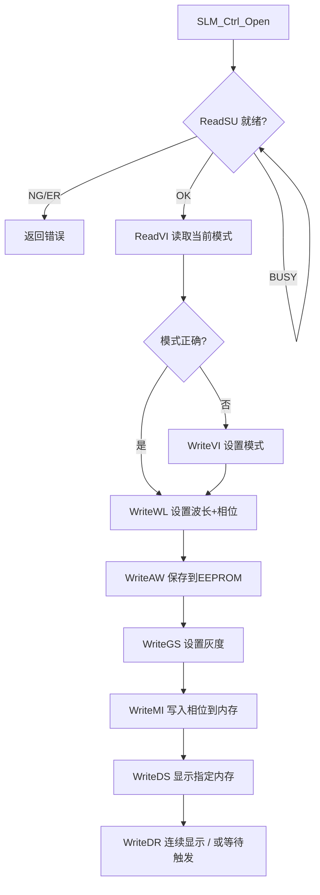

# Santec SLM-200 驱动 Agent Wiki

> 本文件专为 AI coding agent 设计，提炼自官方文档与项目实践，用于辅助修改、调试和扩展 `santec_slm200.py`。

---

## 1. 核心概念

| 术语 | 含义 |
|------|------|
| SLM Number | Windows 自动分配的 USB 设备编号，范围 `1-8` |
| Display Number | 系统显示编号，用于 DVI 显示模式 |
| Memory Number | 内部内存槽编号，范围 `1-128` |
| Table Number | 显示表编号，范围 `1-128`，默认 Table n → Memory n |
| Video Mode | `0` = 内存模式 (Memory)，`1` = DVI 模式 |

---

## 2. 推荐调用流程

---

## 3. 设备标识读取优先级

根据官方文档 `3.2.41-3.2.48`，按以下顺序尝试获取设备唯一标识：

1. **`SLM_Ctrl_ReadSDO`** — 读取 Drive board + Option board ID（各 16 字节）
2. **`SLM_Ctrl_ReadSD`** — 读取 Drive board ID（16 字节）
3. **`SLM_Ctrl_ReadSO`** — 读取 Option board ID（16 字节）
4. **`SLM_Ctrl_ReadPS`** — 读取产品标签序列号（12 位，Drive/Option board）
5. **`SLM_Ctrl_ReadLS`** — 读取 LCOS 产品序列号（最长 20 位）
6. **`SLM_Ctrl_ReadPN`** — 读取 Display Name / EDID（最长 13 位）
7. **`SLM_Ctrl_ReadVR`** — 读取版本信息（64 字节，格式 `DLL:x.x.x,Drive:xxxx,Option:xxxx,FPGA:xxxx`）

> **注意**: `SLM_Ctrl_ReadSD` 在快速连续 `open/close` 后可能挂起。本驱动已移除超时线程，改为同步调用并在失败时回退到其他方法。

---

## 4. 关键 API 速查

### 4.1 初始化与状态

| API | 用途 | 备注 |
|-----|------|------|
| `SLM_Ctrl_Open(SLMNumber)` | 打开 USB 接口 | 必须先调用 |
| `SLM_Ctrl_ReadSU(SLMNumber)` | 读取设备状态 | 启动后约 40 秒内返回 `SLM_BS` |
| `SLM_Ctrl_Close(SLMNumber)` | 关闭 USB 接口 | 退出前必须调用 |
| `SLM_Ctrl_Reboot(SLMNumber)` | 重启设备 | 需重新 `Open` |

### 4.2 显示控制

| API | 用途 | 备注 |
|-----|------|------|
| `SLM_Ctrl_WriteVI(SLMNumber, mode)` | 设置视频模式 | `0`=内存, `1`=DVI；切模式约需 40 秒 |
| `SLM_Ctrl_ReadVI(SLMNumber, &mode)` | 读取当前模式 | |
| `SLM_Ctrl_WriteWL(SLMNumber, wavelength, phase)` | 设置波长和相位 | `phase` 单位是 0.01π，`200` = 2π |
| `SLM_Ctrl_ReadWL(SLMNumber, &wl, &phase)` | 读取波长和相位 | |
| `SLM_Ctrl_WriteAW(SLMNumber)` | 保存波长/相位到 EEPROM | 断电不丢失，耗时约 40 秒 |
| `SLM_Ctrl_WriteGS(SLMNumber, GrayScale)` | 全屏均匀灰度 | `0-1023` |
| `SLM_Ctrl_ReadGS(SLMNumber, &gs)` | 读取当前灰度 | |

### 4.3 内存操作

| API | 用途 | 备注 |
|-----|------|------|
| `SLM_Ctrl_WriteMI(SLMNumber, mem, w, h, flags, data)` | 写入相位数据到内存 | 被显示的内存不可覆盖 |
| `SLM_Ctrl_WriteMI_BMP(SLMNumber, mem, flags, file)` | 加载 BMP 到内存 | Unicode 路径 |
| `SLM_Ctrl_WriteMI_CSV(SLMNumber, mem, flags, file)` | 加载 CSV 到内存 | Unicode 路径 |
| `SLM_Ctrl_WriteME(SLMNumber, mem)` | 使指定内存失效 | |
| `SLM_Ctrl_WriteMT(SLMNumber, table, mem)` | 替换显示表中的内存编号 | |
| `SLM_Ctrl_ReadMS(SLMNumber, table, &mem)` | 读取显示表映射的内存 | |
| `SLM_Ctrl_WriteMZ(SLMNumber)` | 显示表恢复默认 | |
| `SLM_Ctrl_WriteMP(SLMNumber, table)` | 设置首个显示的 Table | |
| `SLM_Ctrl_WriteMR(SLMNumber, start, end)` | 设置显示表有效范围 | |

### 4.4 显示触发

| API | 用途 | 备注 |
|-----|------|------|
| `SLM_Ctrl_WriteDS(SLMNumber, mem)` | 显示指定内存 | |
| `SLM_Ctrl_ReadDS(SLMNumber, &mem)` | 读取当前显示的内存 | |
| `SLM_Ctrl_WriteDR(SLMNumber, order)` | 连续播放 | `0`=降序, `1`=升序 |
| `SLM_Ctrl_WriteDB(SLMNumber)` | 停止连续播放 | |
| `SLM_Ctrl_WriteMW(SLMNumber, frames)` | 设置帧间隔 | `0-120` 帧 |
| `SLM_Ctrl_ReadMW(SLMNumber, &frames)` | 读取帧间隔 | |
| `SLM_Ctrl_WriteTI(SLMNumber, onoff)` | 触发输入使能 | |
| `SLM_Ctrl_WriteTM(SLMNumber, onoff)` | 触发输出使能 | |
| `SLM_Ctrl_WriteTC(SLMNumber, order)` | 触发显示顺序 | |
| `SLM_Ctrl_WriteTS(SLMNumber)` | 软件触发 | 等同于触发输入 |

### 4.5 诊断与信息

| API | 用途 | 备注 |
|-----|------|------|
| `SLM_Ctrl_ReadT(SLMNumber, &dTemp, &oTemp)` | 读取板卡温度 | 返回值需 `/10` |
| `SLM_Ctrl_ReadTD(SLMNumber, &dTemp)` | 读取 Drive 板温度 | |
| `SLM_Ctrl_ReadTO(SLMNumber, &oTemp)` | 读取 Option 板温度 | |
| `SLM_Ctrl_ReadEDO(SLMNumber, &err1, &err2)` | 读取板卡错误标志 | 十六进制 |
| `SLM_Ctrl_ReadED(SLMNumber, &err)` | 读取 Drive 板错误 | |
| `SLM_Ctrl_ReadEO(SLMNumber, &err)` | 读取 Option 板错误 | |
| `SLM_Ctrl_ReadSDO(SLMNumber, driveID, optionID)` | 读取板卡 ID | 各 16 字节 |
| `SLM_Ctrl_ReadSD(SLMNumber, driveID)` | 读取 Drive board ID | 16 字节 |
| `SLM_Ctrl_ReadSO(SLMNumber, optionID)` | 读取 Option board ID | 16 字节 |
| `SLM_Ctrl_ReadPS(SLMNumber, board, serial)` | 读取产品序列号 | 12 位，`board=0/1` |
| `SLM_Ctrl_ReadLS(SLMNumber, board, serial)` | 读取 LCOS 序列号 | 最长 20 位 |
| `SLM_Ctrl_ReadPN(SLMNumber, name)` | 读取 Display Name | 最长 13 位 |
| `SLM_Ctrl_ReadVR(SLMNumber, ver)` | 读取版本信息 | 64 字节 |

---

## 5. 状态码 (`SLM_STATUS`)

| 常量 | 值 | 含义 |
|------|-----|------|
| `SLM_OK` | `0` | 成功 |
| `SLM_NG` | `1` | 一般错误 |
| `SLM_BS` | `2` | 设备忙（启动/扩展相位表时约 40 秒） |
| `SLM_ER` | `3` | 参数错误 |
| `SLM_INVAID_MONITOR` | `-1` | 未找到显示设备 |
| `SLM_NOT_OPEN_MONITOR` | `-2` | 未打开显示 |
| `SLM_OPEN_WINDOW_ERR` | `-3` | 窗口打开错误 |
| `SLM_DATA_FORMAT_ERR` | `-4` | 数据格式错误 |
| `SLM_FILE_READ_ERR` | `-101` | 文件读取错误 |
| `SLM_NOT_OPEN_USB` | `-200` | 未打开 USB |
| `FT_DEVICE_NOT_FOUND` | `-10002` | 设备未找到，检查电源 |

---

## 6. 重要注意事项

### 6.1 时序要求
- **启动等待**：上电后约 40 秒内 `SLM_Ctrl_ReadSU` 返回 `SLM_BS`，需轮询等待
- **模式切换**：`WriteVI` 后约 40 秒才能进行后续操作
- **波长设置**：`WriteWL` 后约 40 秒才能写入相位数据
- **EEPROM 写入**：`WriteAW` 耗时约 40 秒，频繁操作会降低寿命

### 6.2 内存限制
- 内存编号范围：`1-128`
- **正在显示的内存不可覆盖**：写入前需切换显示目标或先显示灰度
- 默认显示表：Table n → Memory n

### 6.3 数据格式
- 灰度值范围：`0-1023`（10 bit），对应 `0-2π` 相位
- CSV 格式：每行 `Y, GrayScale0, GrayScale1, ...`
- BMP 仅支持 8bit/24bit，10bit 数据必须用 `SLM_Disp_Data` 或 CSV

### 6.4 线程安全
- `SLM_Ctrl_ReadSD` 在快速连续 `open/close` 后可能永久挂起
- 若发生挂起，调用 `SLM_Ctrl_Reboot` 后重新连接

---

## 7. Python 驱动映射

| 官方 API | Python 方法 | 文件位置 |
|----------|-------------|----------|
| `SLM_Ctrl_Open` | `open()` | `santec_slm200.py:548` |
| `SLM_Ctrl_Close` | `close()` | `santec_slm200.py:645` |
| `SLM_Ctrl_ReadSU` | `_check_status()` | `santec_slm200.py:664` |
| `SLM_Ctrl_WriteVI` | `_set_memory_mode()` | `santec_slm200.py:706` |
| `SLM_Ctrl_WriteWL` | `set_wavelength()` | `santec_slm200.py:731` |
| `SLM_Ctrl_ReadWL` | `get_wavelength_info()` | `santec_slm200.py:779` |
| `SLM_Ctrl_WriteGS` | `set_grayscale()` | `santec_slm200.py:1025` |
| `SLM_Ctrl_ReadGS` | `get_current_grayscale()` | `santec_slm200.py:1065` |
| `SLM_Ctrl_WriteMI` | `write_phase()` | `santec_slm200.py:884` |
| `SLM_Ctrl_WriteDS` | `display_memory()` | `santec_slm200.py:946` |
| `SLM_Ctrl_ReadDS` | `get_displayed_memory_number()` | `santec_slm200.py:1056` |
| `SLM_Ctrl_WriteDR` | 内部连续显示逻辑 | |
| `SLM_Ctrl_ReadSD` | `get_serial_number()` | `santec_slm200.py:219` |
| `SLM_Ctrl_ReadSDO` | `get_serial_number()` | `santec_slm200.py:219` |
| `SLM_Ctrl_ReadPS` | `get_product_serial_number()` | `santec_slm200.py:303` |
| `SLM_Ctrl_ReadLS` | `get_lcos_serial_number()` | `santec_slm200.py:321` |
| `SLM_Ctrl_ReadPN` | `get_display_name()` | `santec_slm200.py:339` |
| `SLM_Ctrl_ReadVR` | `get_version()` | `santec_slm200.py:354` |

---

## 8. 常见故障排查

| 症状 | 可能原因 | 解决方案 |
|------|----------|----------|
| `SLM_Ctrl_ReadSD` 超时/挂起 | USB 通信异常 | 调用 `reboot()` 后重新 `open()` |
| `save_config` 跳过 | `_serial_number` 为空 | 检查 `get_serial_number()` 返回，确认 USB 连接 |
| 模式切换后显示异常 | 等待时间不足 40 秒 | 增加 `_wait_for_ready()` 重试次数 |
| 写入相位失败 | 内存正在显示 | 先 `display_memory(其他槽)` 或 `set_grayscale(0)` |
| 灰度值不匹配 | 波长未设置 | 调用 `set_wavelength()` 后重新读取 |

---

## 9. 参考文档

- 官方文档：`docs/slm-200/SLMFuncDLL_Programmer's_Guide(v2.5).md`
- 官方 C++ 样例：`D:/Projects/TIFO/ao/SDKs/SLM drivers/SLM_DLL_ver.2.51/sample/CPP/SLMDLLTestCPP2/SLMDLLTestCPP/SLMDLLTestCPP.cpp`
- Python 驱动：`src/ao_shaping/drivers/slm/santec_slm200.py`
