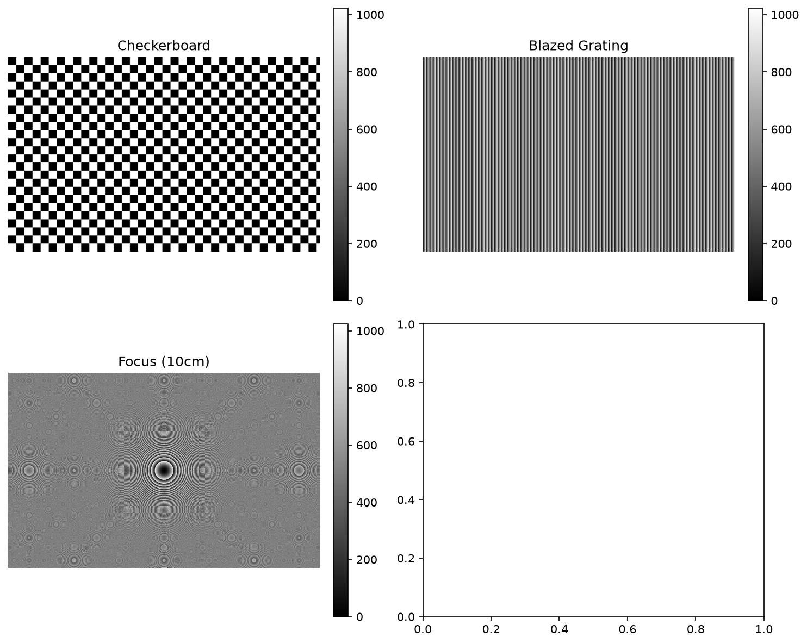
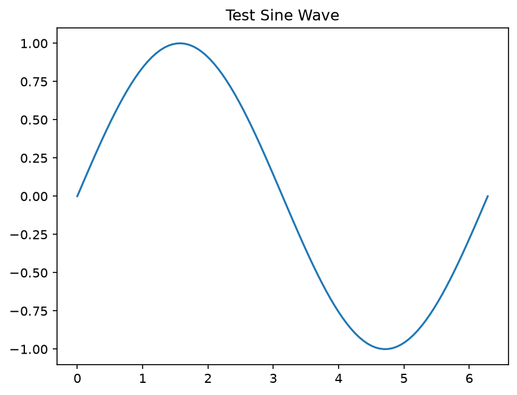

# SLM-200 Hardware Test Report
**Generated:** 2026-09-12 20:33:15
**Device:** slm-200
---

## SLM-200 Simulation Test
This test runs without hardware using simulated data.

**Mode:** Simulation (no hardware)

**Hardware Error:** 无法打开SLM #1 (错误码: <MagicMock name='mock.SLM_Ctrl_Open()' id='2761905448544'>, 未知错误码 (<MagicMock name='mock.SLM_Ctrl_Open()' id='2761905448544'>))

### Simulated Pattern Generation

*Simulated phase patterns*

| Period | Grating Spacing | Δx (mm) | Δx (pixels) |
| --- | --- | --- | --- |
| 10px | 80.0 µm | 1.66 mm | 207.8 px |
| 20px | 160.0 µm | 0.83 mm | 103.9 px |
| 40px | 320.0 µm | 0.42 mm | 52.0 px |
| 80px | 640.0 µm | 0.21 mm | 26.0 px |
| 160px | 1280.0 µm | 0.10 mm | 13.0 px |

**Status:** ✅ PASS

**Duration:** 0.81s

---

*Test sine wave plot*
