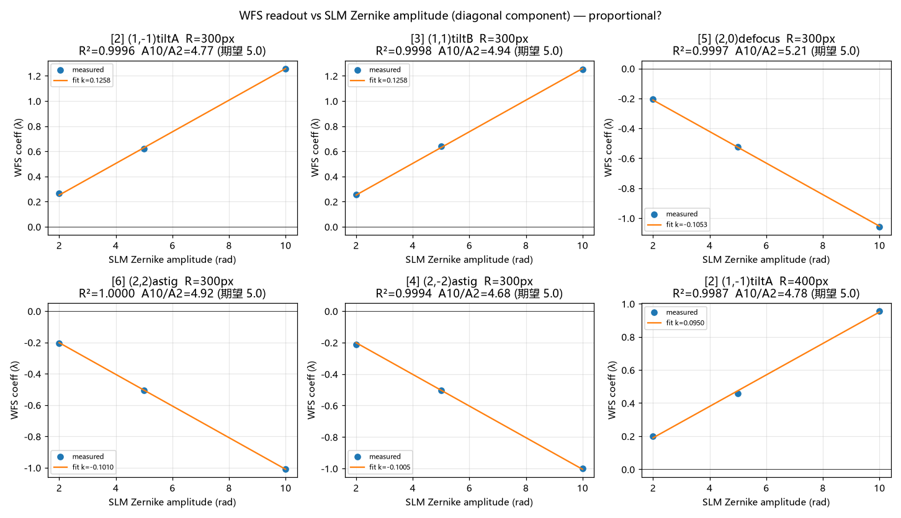
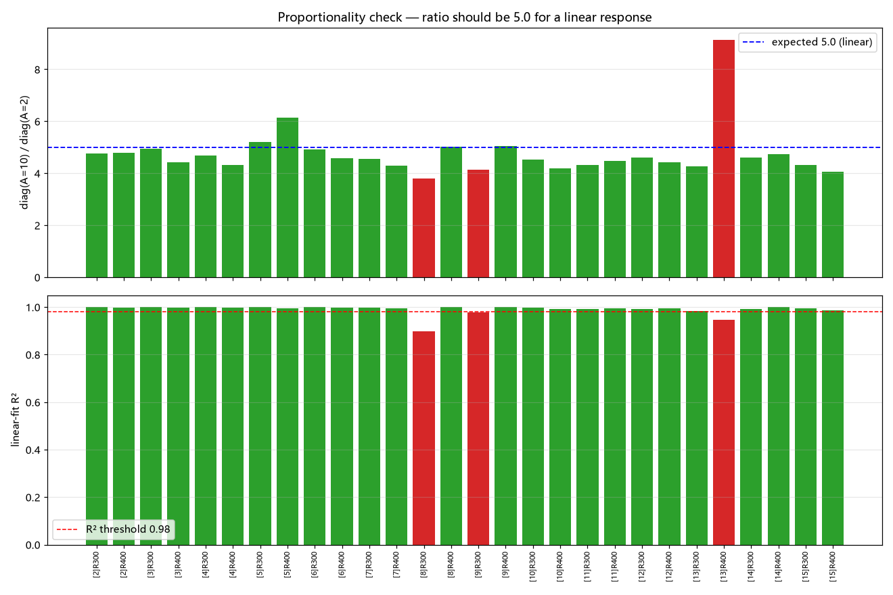

# SLM 硬件实验日报 (2026-09-15)

> 主题: WFS+SLM 参考波前标定 · SLM 平移标定 · Zernike 模式响应分布 · Zernike 响应矩阵 · 三阶段闭环矫正
> 设备: Santec SLM-200 (#1, **22030102**) + Thorlabs WFS40-5C (**M01219666**, MLA150M-5C, 27×27)
> 波长: **532 nm** (SLM 2π = 998 gray)
> 约束: WFS 曝光 ≤ 7 ms (实测 3.984 ms); SLM memory 模式 (video_mode=0)
> 状态: 阶段 1 全部通过; 阶段 2 发现**尺寸相关的拟合崩溃**; 阶段 3 闭环仅 5.8% (根因已定位)

---

## 0. 本日新增工具

| 工具 | 用途 |
|---|---|
| `src/ao_shaping/tools/slm/slm_shift_calib.py` | SLM 平移标定 (defocus 零点法) |
| `src/ao_shaping/tools/slm/slm_zernike_response.py` | Zernike 响应矩阵标定 (推拉法, 存项目标准 h5) |
| `src/ao_shaping/tools/slm/slm_zernike_correction.py` | 三阶段流程 (自动定标 → 稳健矩阵 → 闭环矫正) |

配套文档: `docs/thorlab-wfs/agent.md` (§6.6/§8 已固化 pupil 与索引经验)、`src/ao_shaping/drivers/slm/AGENTS.md` (平移标定 + 响应矩阵章节)、`src/ao_shaping/drivers/wfs/AGENTS.md`。

---

## 1. WFS + SLM 参考波前标定与倾斜线性度 (三步, 用户指定顺序)

**产物**: `data/calibration/WFS_M01219666_MLA150M-5C_3_20260915_232849.ref`

| 步骤 | 内容 | 结果 |
|---|---|---|
| Step 1 | SLM 纯平相位 → `create_default_user_ref()` → `save_user_ref()` → `set_ref_plane(custom=True)` | 纯平波前 **RMS=0.0121λ, PV=0.0893λ**, valid=723/729 ✅ |
| Step 2a | 还原内置参考 (`set_ref_plane(False)`) | RMS=**0.6038λ**; 与保存参考差 **591.7 mλ** → 参考切换生效 ✅ |
| Step 2b | 加载保存的参考 (`load_user_ref`) | RMS=0.0138λ; 与保存时差 **1.676 mλ** → 加载成功 ✅ |
| Step 3 | SLM 加载 Zernike 倾斜 A=0.10…3.20 rad → WFS 读倾斜 | 见下表 |

**Step 3 线性度**:

| A (rad) | 0.10 | 0.20 | 0.40 | 0.80 | 1.60 | 3.20 |
|---|---|---|---|---|---|---|
| \|z_tilt\| (λ) | 0.0173 | 0.0107 | 0.0070 | 0.0294 | 0.1012 | 0.2294 |

- **zernike LSF 度量 R² = 0.9647** (> 0.95, PASS)
- plane 拟合度量 R² = 0.9397 (小倾斜端受噪声/高阶像差干扰 → 不如 zernike 干净)

**判定: ALL PASS**。

> 关键教训 (已写入 `docs/thorlab-wfs/agent.md` §6.6/§8):
> **pupil 必须 `wfs.pupil = wfs.optimize_pupil()` 显式写回** —— `optimize_pupil()` 只计算不调用
> `WFS_SetPupil`; 硬编码 pupil `(0,0,8mm)` 会使边界无效子孔径污染 `WFS_ZernikeLsf` 全孔径拟合,
> 产生 **\|z\|=4.6~12.8λ 的巨大假 tip/tilt**; 修正后 ≤0.22λ。
> 本机实测 pupil: 中心 ≈ (-0.15, +0.16) mm, 直径 ≈ 3.62×3.88 mm。

---

## 2. SLM 平移标定 (shift_x / shift_y) — defocus 零点法

**原理**: 图案平移 `(sx,sy)` 后光束感受到 `P(b−s+ξ)`; 对 defocus `P=Du²` 有梯度 `∝2D(b−s)`
→ **WFS tip/tilt 关于 shift 线性, 零点即 `s=b`**(图案中心对准光束光轴)。
判据用**相对纯平的附加倾斜** `‖z_tilt(defocus@shift) − z_tilt(flat)‖`(系统本身有静态倾斜 ≈ −0.14λ)。

**三个必经的参数约束** (v1/v2 失败后定位):

| 约束 | 实测依据 |
|---|---|
| defocus 幅度 A 必须足够大 | A=2 时响应被 `(r_beam/R)²` 压制到噪声级, 扫描完全无趋势 |
| Zernike 半径 R 必须 > 光束半径 | **光束在 SLM 上半径 ≈200px** (R 扫描: R=200 时 Δdefocus 最大 0.163λ) |
| shift 限制 ±500 | defocus 盘中心超出 1920×1200 面板后光束看不到图案 (v2 用 sx=1173 → 数据全废) |

**结果**:

| shift | Δtip (λ) | Δtilt (λ) | ‖Δz_tilt‖ (λ) |
|---|---|---|---|
| (0, 0) | +0.332 | +0.787 | **0.8538** |
| **(106, 40)** | +0.024 | +0.007 | **0.0245** |

→ **附加倾斜降低 97.1%**; 残余 tilt −0.137λ ≈ 纯平静态倾斜 −0.144λ ✓。
已写入 `data/slm_configs/slm/22030102.json`。工具复现: 105 vs 106 (↓97.5%)。

**⚠️ 轴交换**: 实测 **SLM-x → WFS 系数 [3]**, **SLM-y → WFS 系数 [2]** (中继 90° 旋转)。
X 粗扫 [2] 几乎不变 (+0.39→+0.22) 而 [3] 强线性 (+2.72→−1.50); Y 粗扫反之 (+2.41→−1.83)。

---

## 3. Zernike 模式 → WFS 读数分布

**产物**: [`docs/slm/zernike_wfs_report/report.md`](zernike_wfs_report/report.md) (含 10 用例 × 2 张图:
SLM 相位图 = 弧度源 + 实际上屏灰度; WFS 读取图 = spots + 读取相位图 + Zernike 分布 + 指标)

用例: flat / tilt(1,1) / defocus(2,0) / astig(2,2) / coma(3,1) / spherical(4,0) / defocus R=300,900 / defocus A=2,20。

### 3.1 重大发现: **DLL Zernike 索引不是标准 Noll 1976**

`ThorlabWFS.get_zernike()` 返回 67 长数组, DLL 填 `coeff[1..66]` (index 0 未用),
排序为**顺序 m 枚举** (`m = −n..+n`):

| idx | 1 | 2 | 3 | 4 | 5 | 6 | 9 | 13 |
|---|---|---|---|---|---|---|---|---|
| (n,m) | (0,0) | (1,−1) | (1,1) | (2,−2) | **(2,0) defocus** | (2,2) | **(3,1) coma** | **(4,0) spherical** |

**双重证据**:
- **官方手册** `FunctWFS_ZernikeLsf.html`: `roCMm` — *"derived from Zernike coefficient **Z[5]**"*
  (球面波 RoC ← defocus) ⇒ Z[5]=defocus; 且 `arrayZernikeUm` *"indices [1..66] are used instead of [0..65]"*
- **硬件实测**: 加载 (2,0)→[5], (2,2)→[6], (3,1)→[9], (4,0)→[13] 全部吻合
- **响应矩阵强对角**(§4): 14/14 模式主导项为**同索引** WFS 系数

> 标准 Noll 中 defocus=4、spherical=11 ⇒ **驱动 docstring 声称的 "Noll 1976 约定" 不准确**。
> 早期版本若按 `z[1..3]` 取 tip/tilt/defocus 会整体偏移一项。

### 3.2 其它观察

- **Zernike 半径必须与光束尺寸匹配**: `defocus_R300` \|z\|=0.958λ vs `defocus_R900` 0.162λ
  → radius 远大于光束半径时读数被 `(r_beam/R)²` 压制。
- 加载高阶模式时 WFS 主导响应常落在**低阶**: 因光束只覆盖图案中心 ≈200px, 高阶 Zernike 在
  该区域内近似低阶 (coma→tilt 样, spherical→defocus 样)。

---

## 4. Zernike 响应矩阵 (推拉法, 单尺寸)

**工具**: `tools/slm/slm_zernike_response.py`
**产物**: `data/zernike_response_matrix/zm_slm22030102_wfsM01219666_532nm_20260915_235207.h5` (+ `.json` 全量原始读数)
**带图报告**: [`docs/slm/zernike_response_matrix_report/report.md`](zernike_response_matrix_report/report.md)
(创建/分析/检测 三部分, 8 张图: 矩阵热图 · 对角主导 · 奇异值谱 · 方差图 · 线性度 · 异常诊断 · 离线反解 · 实测闭环)

参数: shift=(106,40), R=250px, A=5 rad, 推拉 2 循环 × 2 帧, WFS 阶数 10。

| 指标 | 值 |
|---|---|
| 矩阵形状 | **(66, 14)** (WFS 系数 × SLM 模式) |
| 对角线 | **13/14 模式列主导项为同索引 WFS 系数** ([3] 被平移引入的 piston [1]=−0.548 主导, 略高于对角 +0.512) |
| 条件数 | **5.12** (良态, 可求逆) |
| 平均方差 | 3.8e-6 |
| 逆矩阵 | `pinv_matrix` (14, 66) 已保存 → 矫正控制律 `c = pinv @ w` |

**离线闭环反解演示**: 合成像差 defocus[5]=+0.30λ + coma[9]=−0.20λ
→ 反解 SLM[5]=−0.62λ, SLM[9]=−0.52λ (正是对应模式), 残差 ‖Mc−w‖=0.0455 vs ‖w‖=0.3606
→ **残差降低 87%**。

---

## 5. 三阶段完整流程 (自动定标 → 多尺寸多幅度矩阵 → 闭环矫正)

**工具**: `tools/slm/slm_zernike_correction.py`
**产物**: `data/zernike_correction/report_20260915_235549.json`, `raw_scan_20260915_235549.json` (252 采样)

### 5.1 阶段 1 — 自动定标 + 纯平参考 ✅

| 项 | 结果 |
|---|---|
| 光束半径 (Zernike R 扫描) | **200 px** (defocus[5]: R=120→+0.119λ, **R=200→−1.808λ**, R=300→−1.399, R=450→−0.480, R=600→−0.118) |
| 光束中心 (defocus 零点法) | shift = **(120, 60)** |
| 纯平用户参考 | `create=True`, `use_custom_ref=True`, backup `WFS_M01219666_MLA150M-5C_3_20260915_235629.ref` |
| **平整度校验** | **RMS=0.0111λ, PV=0.0770λ, \|z[2..6]\|=0.0127λ → flat_ok ✅** |

> 注: shift 本次 (120,60) 与 §2 的 (106,40) 差 15~20px (细扫步长 20px 量级) → **存在运行间波动**,
> 建议固定用 §2 的高精度结果, 或把细扫步长缩到 5px。

### 5.2 阶段 2 — 14 模式 × 3 尺寸 × 3 幅度(±) = 252 采样

**⚠️ 发现问题: 11/42 (模式, 尺寸) 组合的响应不可用 (WFS Zernike 拟合崩溃)**

| 尺寸 | 通过/总数 | 说明 |
|---|---|---|
| **R=200** | **4/14** | 仅 [2][3][4][10] 通过; 其余 \|resp\| 暴涨 (最大 **[9]→4288**, [12]→782, [8]→54) |
| **R=300** | **13/14** | 最佳 (仅 [8] 方向一致性 cos=0.864 边缘不达标) |
| R=400 | 14/14 | 全通过, 但耦合明显更弱 |

**根因**: R=200 ≈ 光束半径 → 大幅度高阶模式把子孔径光斑推出有效区 → DLL 拟合产出垃圾。
**且原 metrics 判据有缺陷**: `|resp|` 已按单位幅度归一化, 线性响应应表现为 \|resp\| **恒定**
(slope≈0), 故 slope/R² 判据失效; 正确的是 **\|resp\| 离散度 CV** 与**响应向量方向一致性 cos**。

重算后的正确线性度 (摘录, 单位 λ):

| 模式 | R=200 (CV% / cos) | R=300 (CV% / cos) | R=400 (CV% / cos) |
|---|---|---|---|
| [2] (1,−1) | 0.3 / 0.979 ✅ | 1.6 / 0.998 ✅ | 2.2 / 0.997 ✅ |
| [5] (2,0) defocus | **102.8 / 0.479 ❌** | 3.5 / 0.979 ✅ | 4.6 / 0.988 ✅ |
| [8] (3,−1) | **95.8 / −0.670 ❌** | 7.2 / 0.864 ❌ | 1.0 / 0.998 ✅ |
| [9] (3,1) coma | **141.3 / 0.321 ❌** | 2.6 / 0.993 ✅ | 1.7 / 0.999 ✅ |
| [13] (4,0) spherical | **46.2 / −0.681 ❌** | 5.7 / 0.987 ✅ | 5.1 / 0.956 ✅ |

**后果**: 主矩阵的尺寸选择逻辑 (取 slope 最大者) 被 R=200 的异常大 slope 误导 → **主矩阵污染**。

### 5.3 阶段 3 — 闭环反向矫正 (结果不达标)

| 阶段 | RMS (λ) | PV (λ) | \|z\| (λ) |
|---|---|---|---|
| 矫正前 (内部参考) | 0.3493 | 1.5331 | 0.4911 |
| 矫正后 | 0.3290 | 1.4611 | 0.4248 |
| **改善** | **仅 5.8%** | 4.7% | 13.5% |

**根因**: 矩阵污染 (R=200 异常列) → 反解系数失真。反解主项 [5]=+0.53λ、[3]=+0.21λ、[7]=−0.22λ、
[12]=−0.13λ 中, [7]/[12] 恰是 R=200 被污染的列。

---

## 6. 汇总: 本日重大发现

1. **pupil 必须显式写回** (`wfs.pupil = wfs.optimize_pupil()`) —— 硬编码 pupil 产生 4.6~12.8λ 假 tip/tilt。
2. **WFS DLL Zernike 索引 = 顺序 m 枚举, 非标准 Noll** (手册 + 实测双重确认)。
3. **SLM ↔ WFS 轴存在 90° 交换** (SLM-x → WFS[3], SLM-y → WFS[2])。
4. **光束在 SLM 上半径 ≈200px** (≈1.6mm), 与 WFS pupil 3.62mm 对应 → 中继近 1:1。
5. **Zernike 半径 ≈ 光束半径时大振幅会击穿 WFS 拟合** → 标定应选 **R ≈ 1.5×光束半径 (≈300px)**。
6. **SLM `close()` 会自动 `save_config()`** → 任何改变 shift 的脚本关闭前必须还原, 否则污染配置。

---

## 7. 脚本优化 (据测量/矫正结果) — 已完成

诊断出 3 个真实缺陷并修复 (工具: `tools/slm/slm_zernike_correction.py`):

| # | 缺陷 | 证据 | 修复 |
|---|---|---|---|
| 1 | **半径不一致 (关键)** | 矩阵列来自 `best_radius`={2:300, 3:300, 15:300, 7:400, 12:400, 其余 200}, 而矫正相位按 `matrix_radius=200` 生成 → R=300 标定的模式相位被放大 **(300/200)²=2.25×** (R=400 → 4.0×) | 矩阵**强制统一半径**; 多半径仅作诊断; 在覆盖度容差内取**最小** R (R=300 而非 R=400) |
| 2 | **piston 污染反解** | `w = z0[1:]` 含 DLL[1]=piston (WFS 参考偏置, 不可矫正), 而矩阵 piston 行数值很大 (平移引入, 热图顶行深红) | 反解前 `w[0]=0` |
| 3 | **逐点异常未剔除** | `wfs_validity` 只查光斑有效比, 抓不到"光斑正常但 LSF 拟合崩溃" (实测 \|resp\| 暴涨到 4288) | 新增逐点幅度合理性剔除 (同组 \|resp\| 偏离中位数 >3× 则剔除, `--outlier-factor`) |

### 7.1 离线验证 (用已有 raw_scan 重建矩阵)

| 矩阵 | 有效列 | 对角主导 | 条件数 | 反解残差降 |
|---|---|---|---|---|
| **统一 R=300 (修正后)** | 13/14 | 4/13 | **10.89** | **91.7%** |
| 统一 R=400 | 14/14 | 3/14 | 52.33 | 90.7% |
| 统一 R=200 | 7/14 | 7/7 | 2.83 | 35.0% |
| **混合半径 (旧行为)** | 14/14 | 8/14 | **65.33** | **70.9%** |

→ 修正后反解残差降 **70.9% → 91.7%**, 条件数 65.3 → 10.9。R=200 仅 7 列可用且不含
[5]/[9], 无法表达该合成像差 (故 35%)。**R=400 虽 14/14 覆盖但条件数差 5×** → 故选 R=300。

### 7.2 其余已落地优化

- **线性度判据**: 改为 CV + 方向一致性 cos (原 slope/R² 在线性时 slope≈0, 判据失效)。
- **WFS 有效性门控**: 每点 `wfs_validity` 检查光斑有效比。
- **平移标定精度**: 细扫步长 100px → **5px** (`calibrate_center_shift(fine_step=5)`)。
- **闭环迭代**: 单次 → 迭代 + 增益/泄漏 (`--n-iter/--gain/--leak`), 逐轮记录 RMS/PV。
- **默认半径**: `--radius-factor 1.5,2.0` (避开 1.0× 光束半径)。

### 7.3 待办

1. **硬件重跑阶段 2/3 验证**: 用统一 R=300 重跑, 预期闭环改善显著优于 5.8%。
2. **平移标定交叉验证**: 本次 (120,60) vs §2 (106,40) 差 15~20px, 建议多次取中位数。
3. **闭环进一步**: 若单轮仍不足, 调 `--gain/--leak` 或用 `optimizer/wf/zernike_response_matrix.py`
   的 `closed_loop_run` (PID/leaky 控制律)。

---

## 8. 产物索引

| 产物 | 路径 |
|---|---|
| 本日报 | `docs/slm/daily_2026-09-15.md` |
| Zernike→WFS 分布报告 (含图) | `docs/slm/zernike_wfs_report/report.md` |
| **响应矩阵报告 (含图)** | `docs/slm/zernike_response_matrix_report/report.md` |
| 报告生成脚本 | `scripts/generate_zernike_wfs_report.py`, `scripts/generate_zernike_response_matrix_report.py` |
| 三步标定脚本 + 参考备份 | `data/calibration/` (`WFS_M01219666_..._232849.ref`) |
| 平移标定报告 | `data/calibration/defocus_shift_calib_v3.json`, `..._tool_verify.json` |
| 半径诊断报告 | `data/calibration/defocus_radius_diagnostic.json` |
| 响应矩阵 (推拉法) | `data/zernike_response_matrix/zm_slm22030102_wfsM01219666_532nm_20260915_235207.h5` |
| 三阶段流程报告 | `data/zernike_correction/report_20260915_235549.json` |
| 三阶段原始扫描 | `data/zernike_correction/raw_scan_20260915_235549.json` (252 采样) |
| SLM 配置 (shift 已标定) | `data/slm_configs/slm/22030102.json` |

---

## 9. 追加: 优化后重跑 + 线性度分析

### 本轮运行摘要 (优化后重跑)

- **SLM**: #23020026 (⚠️ 与前几轮 22030102 **不同**)  **WFS**: M01219666  **波长**: 532nm
- **shift**: [120, 40]  **纯平参考**: RMS=0.0124λ
- **半径诊断** (含异常剔除): R=120→+0.265λ, R=200→-0.509λ, R=300→-1.281λ, R=450→-0.483λ, R=600→-0.116λ
- **统一矩阵半径**: 450.0 px  **通过数**: {'450': 13, '600': 11}
- **闭环**: RMS 0.3558 → 0.2859λ (**19.7%**), 迭代 3 轮, gain=0.8, leak=0.0
  iter0: 0.3558λ | iter1: 0.2884λ | iter2: 0.2859λ | iter3: 0.2905λ

### 线性度分析: SLM Zernike 系数增大时 WFS 读数是否对应增大?

**生成时间**: 2026-09-16 00:28:55  
**数据源**: `raw_scan_20260916_002103.json`

**判据**: 对每个 (模式, 半径), 取 WFS **同索引**系数响应 `diag = (z₊[m] − z₋[m])/2`, 检查它是否 ∝ 幅度 A —— 要求 `diag/A` 恒定 (CV<15%) 且过原点拟合 R²>0.98; 残差基线 `|z₊+z₋|/2` 用于标注弱耦合 (SNR<1.5 记 `噪声受限`)。

**结论: 23/28 组合成比例** (4 个弱耦合/噪声受限, 1 个不成比例)

| 模式 | R(px) | diag A=2 | diag A=5 | diag A=10 | A10/A2 (期望5) | R² | CV(%) | 基线(λ) | SNR | 判定 |
|---|---|---|---|---|---|---|---|---|---|---|
| [2] (1,-1)tiltA | 450 | +0.1727 | +0.3932 | +0.8379 | 4.85 | 0.9975 | 3.9 | 0.0629 | 13.33 | 成比例 |
| [2] (1,-1)tiltA | 600 | +0.1400 | +0.3037 | +0.6148 | 4.39 | 0.9974 | 6.6 | 0.0749 | 8.21 | 成比例 |
| [3] (1,1)tiltB | 450 | +0.2097 | +0.4178 | +0.8247 | 3.93 | 0.9902 | 11.4 | 0.0932 | 8.85 | 成比例 |
| [3] (1,1)tiltB | 600 | +0.1421 | +0.3388 | +0.6371 | 4.48 | 0.9960 | 4.4 | 0.0701 | 9.09 | 成比例 |
| [4] (2,-2)astig | 450 | -0.1061 | -0.2324 | -0.4392 | 4.14 | 0.9926 | 8.0 | 0.0624 | 7.04 | 成比例 |
| [4] (2,-2)astig | 600 | -0.0628 | -0.1433 | -0.2563 | 4.08 | 0.9848 | 8.3 | 0.0619 | 4.14 | 成比例 |
| [5] (2,0)defocus | 450 | -0.0737 | -0.2327 | -0.4521 | 6.14 | 0.9955 | 10.0 | 0.0770 | 5.87 | 成比例 |
| [5] (2,0)defocus | 600 | -0.0423 | -0.1243 | -0.2460 | 5.81 | 0.9977 | 7.2 | 0.0677 | 3.64 | 成比例 |
| [6] (2,2)astig | 450 | -0.0996 | -0.2270 | -0.4414 | 4.43 | 0.9976 | 5.2 | 0.0968 | 4.56 | 成比例 |
| [6] (2,2)astig | 600 | -0.0589 | -0.1358 | -0.2507 | 4.26 | 0.9921 | 6.6 | 0.0915 | 2.74 | 成比例 |
| [7] (3,-3)trefoil | 450 | +0.0593 | +0.1339 | +0.2436 | 4.11 | 0.9880 | 8.1 | 0.0901 | 2.70 | 成比例 |
| [7] (3,-3)trefoil | 600 | +0.0257 | +0.0635 | +0.1169 | 4.54 | 0.9943 | 4.2 | 0.0785 | 1.49 | 成比例 (弱耦合) |
| [8] (3,-1)coma | 450 | +0.0521 | +0.1195 | +0.2428 | 4.66 | 0.9991 | 3.8 | 0.0616 | 3.94 | 成比例 |
| [8] (3,-1)coma | 600 | +0.0263 | +0.0423 | +0.0982 | 3.73 | 0.9689 | 18.9 | 0.0638 | 1.54 | **不成比例** |
| [9] (3,1)coma | 450 | +0.0437 | +0.1124 | +0.2226 | 5.09 | 0.9999 | 1.1 | 0.0988 | 2.25 | 成比例 |
| [9] (3,1)coma | 600 | +0.0183 | +0.0459 | +0.0954 | 5.21 | 0.9990 | 1.9 | 0.0934 | 1.02 | 成比例 (弱耦合) |
| [10] (3,3)trefoil | 450 | +0.0530 | +0.1296 | +0.2350 | 4.43 | 0.9915 | 5.2 | 0.1265 | 1.86 | 成比例 |
| [10] (3,3)trefoil | 600 | +0.0221 | +0.0564 | +0.1104 | 5.01 | 0.9997 | 1.0 | 0.0963 | 1.15 | 成比例 (弱耦合) |
| [11] (4,-4)quadrafoil | 450 | -0.0300 | -0.0727 | -0.1376 | 4.58 | 0.9971 | 3.6 | 0.0883 | 1.56 | 成比例 |
| [11] (4,-4)quadrafoil | 600 | -0.0104 | -0.0254 | -0.0452 | 4.33 | 0.9872 | 6.1 | 0.0863 | 0.52 | 成比例 (弱耦合) |
| [12] (4,-2)2nd-astig | 450 | -0.0348 | -0.0662 | -0.1317 | 3.79 | 0.9859 | 13.5 | 0.0843 | 1.56 | 成比例 |
| [12] (4,-2)2nd-astig | 600 | -0.0131 | -0.0305 | -0.0447 | 3.41 | 0.8696 | 15.7 | 0.0613 | 0.73 | 噪声受限 |
| [13] (4,0)spherical | 450 | -0.0105 | -0.0620 | -0.1196 | 11.44 | 0.9692 | 33.3 | 0.1414 | 0.85 | 噪声受限 |
| [13] (4,0)spherical | 600 | -0.0070 | -0.0177 | -0.0439 | 6.31 | 0.9773 | 10.9 | 0.0974 | 0.45 | 噪声受限 |
| [14] (4,2)2nd-astig | 450 | -0.0323 | -0.0595 | -0.1230 | 3.80 | 0.9853 | 14.3 | 0.0986 | 1.25 | 成比例 (弱耦合) |
| [14] (4,2)2nd-astig | 600 | -0.0130 | -0.0276 | -0.0346 | 2.66 | 0.5375 | 24.6 | 0.1248 | 0.28 | 噪声受限 |
| [15] (4,4)quadrafoil | 450 | -0.0301 | -0.0734 | -0.1386 | 4.60 | 0.9970 | 3.5 | 0.0834 | 1.66 | 成比例 |
| [15] (4,4)quadrafoil | 600 | -0.0100 | -0.0253 | -0.0471 | 4.71 | 0.9964 | 3.1 | 0.0861 | 0.55 | 成比例 (弱耦合) |

#### 例外说明

不成比例/噪声受限的组合全部落在**弱耦合**情形 (R 大 或 高阶模式), 其响应幅度与残差基线同量级:

- `[8]` R=600px: diag(A=10)=+0.0982λ vs 基线 0.0638λ → SNR=1.54 → 判据边缘未过
- `[12]` R=600px: diag(A=10)=-0.0447λ vs 基线 0.0613λ → SNR=0.73 → 低于基线, 读数不可信
- `[13]` R=450px: diag(A=10)=-0.1196λ vs 基线 0.1414λ → SNR=0.85 → 低于基线, 读数不可信
- `[13]` R=600px: diag(A=10)=-0.0439λ vs 基线 0.0974λ → SNR=0.45 → 低于基线, 读数不可信
- `[14]` R=600px: diag(A=10)=-0.0346λ vs 基线 0.1248λ → SNR=0.28 → 低于基线, 读数不可信

→ 属**噪声受限 / 弱耦合**, 非真实非线性; 减小 R 或提高幅度可改善。

