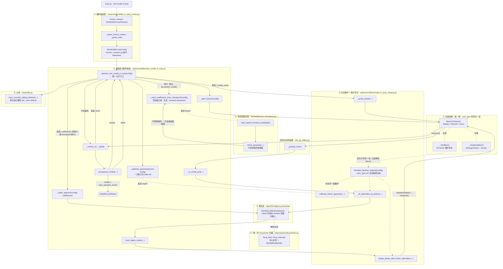
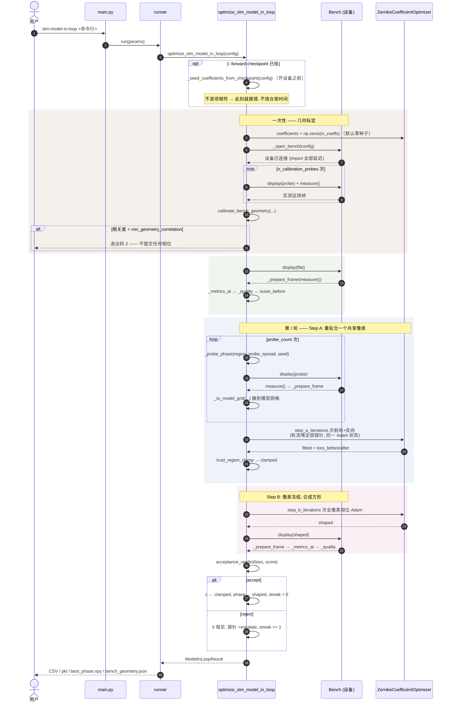
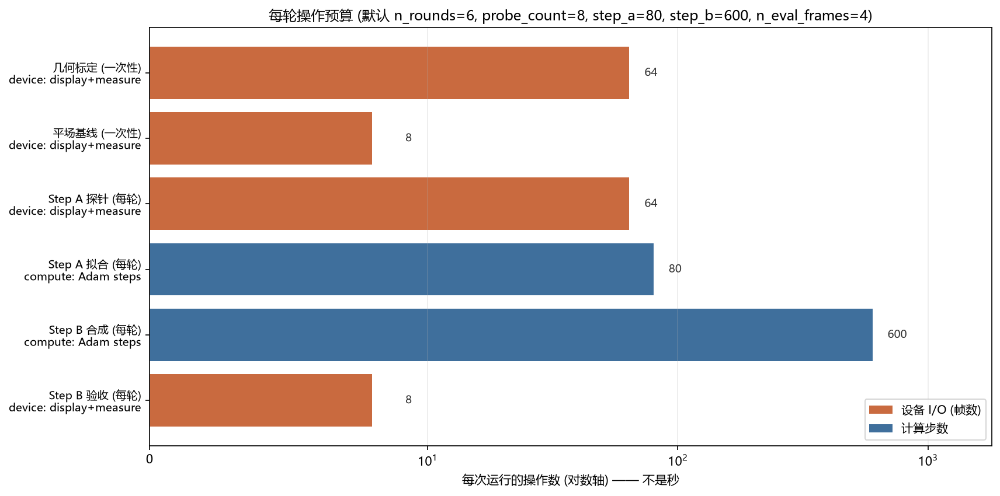
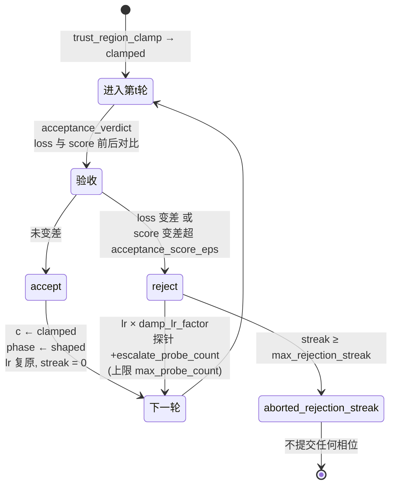
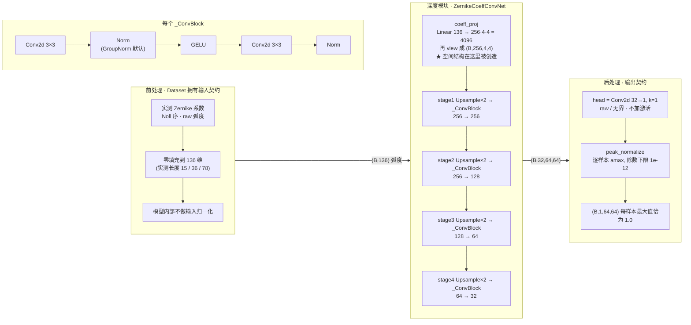

# 正向模型闭环整形 (slm-model-in-loop) —— 调用关系 / 计算时序 / 算法说明

> **生成脚本**: [`scripts/generate_model_in_loop_report.py`](../../scripts/generate_model_in_loop_report.py)
> **复现命令**: `python scripts/generate_model_in_loop_report.py`
> **运行环境**: 离线 (纯源码静态分析 + 可选 torch 实测; 不开设备)
> **说明**: 本文档是**使用/结构说明**, 不是测量结论 —— 硬件实测另见
> [`report/slm/model_in_loop_bench_calibration.md`](../../report/slm/model_in_loop_bench_calibration.md)。

本报告描述 `slm-model-in-loop` 的**结构与算法**, 不是一次测量的结论。
全文离线可重生成: 图中的每个符号都对着源码解析过, 表格里的默认值是从 dataclass
的 AST 里读出来的 —— 改名会让生成失败, 而不是留下一份看起来仍然权威的旧文档。

> **口径声明: 本报告不含任何壁钟耗时。** 每轮的设备往返次数与计算步数可由配置
> 推出, 因此给出; 耗时取决于台架, 在这里写就是编造。

## 1. 这条命令做什么

每轮交替两步, 用实测数据在闭环里持续修正正向模型, 再用修正后的模型合成相位:

1. **Step A —— 拟合正向模型.** 显示若干个**强随机探针**相位, 把每个探针的远场实测帧
   与正向模型的预测对比, 重拟合**一个共享的 Zernike 像差向量**。
2. **Step B —— 合成方形.** **冻结**刚拟合出的像差, 优化**全像素 SLM 相位**逼近方形目标,
   下发实测; 本轮相位成为下一轮的热启动。

两个守卫 (§6) 抑制两步互相追逐; 最终相位只有**实测优于平场基线**才提交。

## 2. 调用关系图

每个节点都是真实符号, ①…⑥ 标出它归哪一层。虚线 = 延迟 import (硬件栈在 import 期就碰硬件, 所以这些 import 全在函数内部)。

孪生与硬件的关系是这个模块的全部设计要点: 标 `[孪生]` 的行**不是**一份会腐烂的平行实现,
而是硬件层 import 进来的共享数学 (`model_in_loop_shaping`), 且 import 全部延迟到函数内 ——
`ao_shaping.drivers` 在 import 期就会碰硬件。于是 `--cam_type sim` 只替换 `Bench` 的实现,
其余数学逐位相同; 反过来, 仿真里验证过的 Step A/B 逻辑不会在硬件路径上悄悄漂移。

两个模块共享数学, 共享的**不是** config/result 类型 —— 孪生用
`ModelParams`/`StepAConfig`/`StepBConfig`/`ModelInLoopResult`, 硬件用扁平的
`SlmModelInLoopConfig`/`RoundRecord`/`ModelInLoopResult`, 因为硬件侧要把设备生命周期、
settle 判据和 recorder 行一并塞进一个可序列化的配置里。

## 3. 计算时序图

一轮的完整时序。`rect` 的底色区分阶段, 与 §3 的操作预算图配色一致: 米色 = 一次性几何标定, 浅绿 = 平场基线, 蓝 = Step A, 粉 = Step B。

### 顺序里三个容易看漏的点

**几何标定在最前面, 且只做一次.** 它自己也要 display+measure, 但它解的是
`BenchGeometry` —— 没有它, Step A 的 loss 会把「模型预测错」和「几何标定错」混在同一个残差里,
梯度方向是错的。相关度低于 `min_geometry_correlation` 直接以退出码 2 中止, **不提交任何相位**。

**Step A 的所有探针喂进同一个 Adam 状态, 不是每帧各跑一次优化.** 焦面强度是瞳面相位的
非凸函数, 单个探针留下大量驻点, Adam 会停在它进去的那一个; 轮流喂多个独立探针提供的是
消掉这些驻点所需的*多样性*。另外 `update` 在连续 30 步无改善后会锁存
(`PLATEAU_PATIENCE`), 且没有任何东西清这个锁存 —— `reset()` 会把系数倒回 `__init__` 的值, 所以
re-arm 必须绕着**当前**系数重建优化器。

**Step B 只在最后测一次, 不在每次迭代里测.** Step B 是纯计算 (可微前向模型过 FFT),
硬件上不可微的只有「真实测量」本身, 所以梯度来自模型而不是测量; 实测只在末尾做一次,
交给验收测试。因此 `step_b_iterations=600` 不产生 600 次设备往返。

## 4. Step A 详细: 共享像差拟合

### 4.1 为什么必须用探针, 不能直接用整形相位

平瞳孔 (或光滑整形后的瞳孔) 聚焦成近似 δ 函数, 其**归一化**强度对光滑低阶像差几乎不响应 ——
像差因此不可辨识。探针相位 std 高于约 3 rad 时信号才越过 16-bit 量化本底两个数量级, 拟合才良态。
这也解释了 `probe_spread` 不是一个可以随手调小的正则项。

### 4.2 逐步

1. `_probe_phase(region, probe_spread, seed)` 生成零均值高斯**瞳面相位** (raw 未包裹弧度)。
2. `bench.display(probe)` 下发, `bench.measure()` 读一帧, `_prepare_frame` 逐帧去背景再裁剪
   —— 直接对原始帧算指标会被读出噪声污染 (对称读出噪声让约一半像素为负)。
3. `_to_model_grid` 把实测帧搬到**模型自己的网格**上。Step A 的 loss 比较的是
   「实测 CCD」与「模型预测」, 两者必须逐像素可比, 所以这一步的尺度关系必须由几何标定保证。
4. `_fit_aberration_at_probes` 把 `(实测远场, 探针相位)` 对**循环**喂进同一个
   `ZernikeCoefficientOptimizer` 的 `update`, 跑满 `step_a_iterations` 步。
5. 输出 `fitted` 与本轮 loss 首末值, 供验收测试使用。

### 4.3 冻结哪些模式, 以及为什么

`frozen_modes` 默认 `(1, 2, 3)`, 即 **Noll 1/2/3 = piston/tip/tilt**。它们**无法从远场
强度辨识**: piston 在瞳孔上是常数, 对焦面强度无贡献; tip/tilt 只是把 0 阶搬个位置。
放开它们的实测后果是 56% 的系数范数被灌进这些简并方向而**不带来任何收益** ——
即拟合在噪声方向上花掉了 trust region 的预算。

### 4.4 系数个数

`n_coefficients = calc_n_zernike_terms(n_orders)`, **含 piston**。
这与 `ml/zernike` 的离线约定**差一位**, 差异如何对齐见 §9.2。

**远场传播只有一份实现.** Step A 的解析远场、Step B 的可微远场, 以及离线 `ZernikeAmpModel`
的 `_propagate`, 三者都调用 `utils/wavefront/fraunhofer.py` 的 `focal_intensity` /
`focal_field`(中心补零 + `fftshift(fft2(ifftshift(·), norm="ortho"))` + `re²+im²`)。
改动前这三处是三份彼此独立的拷贝; 现在只有目标网格尺寸不同(绝对 `far_field_size` vs
`n × far_field_padding`), 其余完全相同 —— 收敛前逐位比对过。物理参数化差异(piston 处理、
瞳面振幅、孔径掩模、是否中心裁回 `grid`)**刻意不统一**, 那是模型差异不是复制粘贴。

## 5. Step B 详细: 冻结像差下的全像素相位合成

`shape_phase_with_frozen_aberration(optimizer, clamped, target, warm_start, step_b_cfg)`:
像差 `clamped` 作为**固定**的物理项进入正向模型, 自由变量是**整个 region×region 的相位网格**。
梯度穿过相干传播 + FFT 解析求出 (torch autograd), 所以这 600 步是纯 GPU/CPU 计算。

**为什么必须是全像素而不是低阶 Zernike.** Zernike 是圆对称光滑基, 物理上无法合成方形远场
(方形需要类 sinc 的近场结构 / 高空间频率)。这是 `slm-gs-refine` / `slm-gsnet` 同样遵守的约定。

**目标函数必须含能量项.** `_quality` 组合 `w_efficiency`/`w_uniformity`;
`w_efficiency` 必须非零 —— 只优化 `-CV` 会把能量推出目标框 (硬件实测 EE → 0.002)。

**热启动.** `warm` 取上一轮 `phase` (`--no-warm-start` 则退回平场)。实测分数**没有**变好时,
验收测试会 reject 该轮, 于是 `phase` 不前移 —— 被 reject 的那一轮不会污染下一轮的热启动。

## 6. 两个守卫: 为什么必须有

Step A 产出 `c_t`; Step B 产出以 `c_t` 为条件的 `phi_t`; 下一轮又通过 `phi_t` 的校正去重拟合
`c_{t+1}`。放任两者互相追逐 —— 像差吸收一部分整形相位, 整形相位又补偿像差 —— 在硬件上
(漂移、LCOS 弛豫误差、读出噪声) 表现为**缓慢发散而不是崩溃**, 所以必须有廉价的上界。

**守卫 1 —— trust region.** 逐轮系数变化的 L2 范数被 `trust_region_c_l2` 截断。
**守卫 2 —— 逐轮验收.** `acceptance_verdict(loss_before, loss_after, score_before, score_after)`:
拟合 loss 变差、或实测综合分变差 (容差 `acceptance_score_eps`), 该轮就被 reject。

持续 reject 意味着台架落在模型描述之外 (瞳孔配准、面板倾斜、离面离焦、渐晕), 此时运行
**中止**而不是提交一个「模型自己喜欢」的相位。

## 7. 默认配置 (从 dataclass AST 读出, 非手抄)

| 项 | 值 |
|---|---|
| `n_rounds` | `6` |
| `probe_count / probe_spread` | `8 / 4.0 rad` |
| `step_a_iterations / step_a_lr` | `80 / 0.05` |
| `step_b_iterations / step_b_lr` | `600 / 0.05` |
| `n_orders` | `10` |
| `frozen_modes` | `(1, 2, 3)` |
| `region / far_field_padding` | `64 / 8` |
| `target_side` | `60` |
| `w_uniformity / w_efficiency` | `0.4 / 0.6` |
| `warm_start` | `True` |
| `n_calibration_probes` | `8` |
| `min_geometry_correlation` | `0.5` |
| `acceptance_loss_delta` | `0.0001` |
| `acceptance_score_eps` | `0.001` |
| `damp_lr_factor` | `0.5` |
| `escalate_probe_count / max_probe_count` | `2 / 16` |
| `max_rejection_streak` | `3` |
| `settle_discard / n_eval_frames` | `2 / 4` |
| `cam_type / cam_id / cam_size` | `daheng / 0 / 300` |
| `panel_span_px / pupil_center` | `900.0 / BEAM_CENTER_PANEL` |
| `camera_pixel_um / slm_pixel_um` | `2.2 / 8.0` |
| `wavelength_nm / focal_length_m` | `1064 / 0.0` |

孪生侧的 `region` 原生光斑腰 `native_w0(region)` 由 `TWIN_REGION = 512` 线性缩放;
硬件路径不强制这个等式 —— 它标定自己的几何。

## 8. 正向预测模型的结构 (前处理 / 深度模块 / 后处理)

本仓有**三个**都叫「正向模型」的东西, 用途完全不同。先分清, 再讲结构 —— 混淆这三者
本项目已经付出过代价: 离线 checkpoint 的 piston 约定与闭环约定差一位 (§9)。

| 模型 | 模块 | 形态 | 谁在用 |
|---|---|---|---|
| **解析 FFT** (闭环使用) | `utils/wavefront/fraunhofer.focal_intensity` | 无参数: `exp(i·patch)` → 中心补零 → `fftshift(fft2(ifftshift))` → `\|F\|²` | **`slm-model-in-loop` 的 Step A 真正在优化的那个**; Step B 的梯度也穿过它 |
| **物理 + 可学习系数** | `ZernikeAmpModel` | 整个数据集共享**一个**系数向量 (`nn.Parameter`, 零初始化) | 离线标定与逆向设计; `K = calc_n_zernike_terms(n_max) − 1` (不含 piston) |
| **学习式前向网络** | `ZernikeCoeffConvNet` / `ZernikeCoeffMLP` | 系数投影 + 卷积解码器 | 离线训练与评测; 本节余下部分讲它 |

> 也就是说: **闭环跑的是解析 FFT 那一个**, 不是下面的神经网络。讲后者是因为 §9 的
> checkpoint 来自它, 而它与闭环约定的差异正是那条坑。

解析那一条的完整链条很短, 也正因如此才值得写下来: `patch = (phase_slm + aberration) × aperture_t` → `field = amplitude × exp(i·patch)`
→ 中心补零到 `far_field_size` → `focal_field(field, far_field_size)`, 即
`fftshift(fft2(ifftshift(field), norm="ortho"))` → `focal_intensity` 取 `re² + im²`。
预测入口是 `forward_intensity`, 损失是 `_intensity_loss` —— 它把强度
按 `intensity / (max + PEAK_EPS)` 归一化后取 MSE(`PEAK_EPS = 1e-8`)。
**这条链不再内联在闭环里**: 传播本身只有 `utils/wavefront/fraunhofer.py` 一份实现, 闭环与
离线 `ZernikeAmpModel` 都调它(改动前是各写一份)。
**这里没有可学参数**: Step A 拟合的是那一个共享 Zernike 像差向量, 不是网络权重。

### 8.1 前处理: 输入侧刻意不归一化

输入是 `(B, 136)` 的 **Noll 序、raw 弧度**系数向量(`DEFAULT_N_COEFFS = calc_n_zernike_terms(15)`)。实测语料里的向量长度不一
(15 / 36 / 78), 统一**零填充**到 136 维 —— 于是有 58–121 个输入维**结构上恒为零**。

**`forward` 内部不做任何输入归一化**, 这是有意的: 输入契约归 Dataset 所有, 模型不该
偷偷再缩一次。代价是语料系数本身很小 —— 实测 `max|c| = 0.0617 rad`、`rms = 0.0142` ——
所以桥接层用 `nn.init.xavier_uniform_` 而不是零/极小初始化, 让 `Linear` 去学这些小尺度。

### 8.2 深度模块: 系数投影 + 卷积解码器

**为什么是「系数投影 + 卷积解码」而不是 flatten 到 `grid*grid` 的 MLP.** 这个映射是确定性的、
光滑的, 而且它的输出有**真实的二维局部性**: 类 Airy 光斑的位置跟着 tip/tilt 走, 径向结构跟着
高阶模式走。flatten 到向量的 MLP 把这个几何丢掉, 得靠单个权重矩阵重新学出平移等变性。
于是 `coeff_proj` 先把一个裸向量**创造**成常数特征图, 之后交给平移等变的卷积解码。

**可达性是一个被强制的不变量**: `grid == bottleneck · 2^len(features)`。默认
`grid=64`、`features=(256,128,64,32)` → `len=4` 个 2 倍上采样级, 于是 `bottleneck` 被**推导**为
`64 // 16 = 4`, 不是挑出来的。`grid` 是这个等式里动不了的一边(它是数据集物化的网格, 也是
`(B,1,grid,grid)` 的输出契约), 所以让路的一定是 `bottleneck`。`__init__` 里不满足就报错, 并
直接告诉你该拧哪个旋钮。

**每个 `_ConvBlock` 是 `Conv3×3 → Norm → GELU → Conv3×3 → Norm`.** 三点讲究:
- **先上采样再细化**: 最近邻上采样不引入新的可平均的值, 所以随后的 3×3 在更细的尺度上
  看到的是**真实邻域**, 而不是插值出来的平台。
- **默认 GroupNorm 而不是 BatchNorm**: 目标是逐帧 peak 归一化的, 逐样本尺度已经被归一化掉了;
  而 `BatchNorm` 还带每步更新的 running 统计量, 在 `eval()` 里被消费, 这会让训练时的行为
  **耦合**到它见过的 batch 顺序与历史。在几百条 64×64 记录上, 这种耦合是纯方差。
  `GroupNorm` 逐样本按通道组归一化, train/eval 行为一致, 跨 epoch 不带状态。
  `batch` / `none` 仍可选, 是为了让这个选择**可测**而不是只能被断言。
- `_make_norm` 在通道宽度不被 `norm_groups` 整除时按 `gcd(channels, norm_groups)` **降组**
  并记一条 debug, 而不是静默取整 —— 静默取整会把「你要求的组数根本不可用」藏起来。

### 8.3 后处理: 输出契约是 raw + peak 归一化

`head` 是 `Conv2d(32, 1, kernel_size=1)`, **raw 且无界, 刻意不加激活**。这一点是硬要求:
`ml.phase.unet.UNetGenerator` 的图像头字面就是 `self.sigmoid(self.final_conv(x))`, 出不来
`(0,1)` 之外的值, 会把动态范围**压平** —— 越过轨道的值全被压成同一个数, 模型就再也分不出
「很亮的核」和「亮的核」。`test_forward_model.py::TestAntiSigmoidHead` 是让未来有人
「顺手复用 U-Net」而大声失败的回归守卫。

逐帧尺度由调用方施加: `peak_normalize(x) = x / clamp(amax(x, dim=(-2,-1)), min=1e-12)`。
它的三条性质都是契约的一部分: **负值不裁掉**; **除数不跨 batch 共享**, 只逐样本;
下界 `1e-12` 与 `ml.zernike.models._EPS` 一致, 免得两个归一化器漂移。

**由此得到一个必须记住的推论**: `denormalized()` 返回的张量 `argmax` **按构造恰为 1.0**。
所以这个模型的输出**回答不了任何绝对亮度问题**(到了传感器多少光、激光漂没漂), 只回答
相对结构。

### 8.4 基线臂与参数量

`build_forward_model(config)` 按 `config.architecture` (`"conv"` / `"mlp"`) 实例化其中一条臂。
`ZernikeCoeffMLP` 是**刻意的对照组**: 输出契约与 conv 臂完全一致 (raw、无界、`(B,1,g,g)`),
但把 `grid*grid` 全部从一个 `Linear` 里吐出来 —— 丢掉的正是 2-D 局部性, 而这正是该对照要
检验的假设。

默认 `ZernikeCoeffConfig()` 下用 `count_parameters` **实测**: **conv 2,324,321**, **mlp 4,793,856** —— MLP 参数量更大而输出更差,
这正是「结构对, 而不是容量大」的论据。

### 8.5 评测口径

**只看 R² / correlation / 光斑域指标, 永远不要用 MSE/PSNR/SSIM 给这个模型选超参。**
目标是逐帧 peak 归一化的, 预测与目标的 `max` 都被钉在 1.0, 于是那三个指标主要在度量
**归一化本身**而不是拟合质量。实测反例: 某个 sibling 任务上「总能量」归一化给出
PSNR 72 dB、SSIM 0.9996, 而 R² 反而**更差**。

## 9. 加载预训练权重: 已接好的那条路

`--forward-checkpoint <best_coefficients.pt>` 让 Step A 从 `train_amp` 学到的系数起步, 而不是
从零。**默认关闭** —— 不给这个参数时种子逐位仍是 `np.zeros(n_coeffs)`, 与本特性之前完全一致。

读缝是 `ml/zernike/amp_checkpoint.py`(只读, 不认识硬件): `load_trained_forward_model(path)` 重建
一个 `ZernikeAmpModel` 并把系数**原地 copy 进**它自己的 `Parameter`(不替换对象, 否则任何持有该
引用的优化器会被悄悄脱钩), 返回一个冻结的 `TrainedForwardModel`; `check_geometry(...)` 决定这份
权重**能不能**用。被核对不了的三个字段集中在模块常量 `UNVERIFIED_GEOMETRY_FIELDS` 里。

### 9.1 严格相等: 能核对的逐项核对, 核不了的显式承认

checkpoint 只记录 7 个键, `check_geometry` 对其中能对照的**逐项硬相等**, 不符即报错:
`grid`↔`region`、`n_max`↔`n_orders`、有效补零倍数↔`far_field_padding`、
`observable` 必须 `intensity`、`normalization` 必须 `peak`。每条消息都同时写出两边的数字。

但 `radius` / `center_crop` / `conserve_energy` **checkpoint 根本没有记录**(实测 `config` 里
没有这三个键), 所以「严格」对它们只能诚实地做不到。因此它们不是被核对, 而是被**要求承认**:
不给 `--assume-unverified-geometry` 就直接拒绝这份权重, 给了才记一条 note。**「不知道」不能被
装成「核对过」** —— 测试专门断言未记录字段永远不会因为「与本机不同」而进 `errors`。

### 9.2 两侧差一位 piston, 以及为什么这不危险

离线 `K = calc_n_zernike_terms(n_max) - 1`(排除 Noll 1), 硬件
`n_coefficients = calc_n_zernike_terms(n_orders)`(包含 Noll 1):

| | 系数个数 |
|---|---|
| 离线 `n_max=4` → K | **14** |
| 硬件 `--n-orders 4` | **15** |

所以装载器把离线向量放在**偏移 1** 处(前面补 `0.0` 当 piston), 两侧随即按 Noll 序精确对齐。
补 0 恰好无害: `--frozen-modes` 默认已把 piston 冻在 0, 且装载器**再施加一次**冻结 ——
`ZernikeCoefficientOptimizer.__init__` 只校验种子的形状与有限性, 并不会把冻结项清零(它只为
更新路径建了掩码), 所以不清就会让第 1 轮从一个 Noll 2/3 非零的种子上开跑。

### 9.3 权重只是**初值**, 不绕过拟合

Step A 仍然每轮从探针重拟合, 预训练权重只影响第 1 轮的起点 —— 收益是「起步在正确的盆地」,
不是「跳过拟合」。trust region 与逐轮验收照样审它: 种子给错了, 验收测试仍然会 reject。

### 9.4 两个会让加载白做的前提

- **几何必须逐项相符**, 见 §9.1。现成的 `logs/*/best_coefficients.pt` 实测是
  `n_max=4, grid=64, far_field_padding=1`, 而硬件默认 `far_field_padding=8` —— **默认值下这份
  权重会被拒绝**, 这是设计如此而非故障。要么按 checkpoint 的几何显式传参, 要么离线按
  `--far-field-padding 8` 重训一份。
- `observable` 必须是 `intensity`。本仓实测 `amplitude` 在三个 `n_max` 上都落后 `intensity`
  约 0.12 R²; 现成的 `logs/amp_wandb/` 恰好是 `amplitude`, 属较弱变体。

几何核对与路径存在性都发生在**开设备之前**: 路径不存在在 `__post_init__` 就报错, 几何不符在
开设备前报错。写错一个参数不该用一次校准 + 一帧实测来发现。

## 10. 上机后的 TODO (尚未验证的部分)

本节列的是**代码之外、只能在台架上回答**的问题。离线与 `cam_type=sim` 已覆盖的是「接线是否正确、
几何不符是否报错、种子是否按位移 1 放置且冻结项被清零」, **不是**「这份权重对最终整形质量有多大
好处」。后者需要下面的对照实验, 目前**没有任何数据**。

1. **权重迁移到底有没有用 (唯一真正的问题).** 同 seed、同参数跑两次: 一次带

   `--forward-checkpoint`, 一次不带。比较第 1 轮系数变化量与最终实测分数。

   判据不是「带种子的分数更高」, 而是**带种子的坏起点能被验收测试恢复** —— 如果带种子的 run
   反而更差, 说明离线权重与本台架的物理不一致 (几何相符 ≠ 物理相符), 那就该先重训而不是调参数。

2. **默认 padding 的矛盾要不要在代码层面解决.** 现成权重是 `far_field_padding=1`, 闭环默认 8。
   目前靠使用者自己读 §9.4 对齐; 如果实际使用中经常踩到, 应考虑让 CLI 在拒绝时**直接打印该传什么**,
   而不是只报「effective padding 1 != 8」。

3. **未记录几何的假设到底成不成立.** `radius=None` / `center_crop=True` / `conserve_energy=False`
   是装载器的默认值, 不是 checkpoint 的记录。台架上如果装配口径与之不同 (例如实际有效口径不是
   内切圆), `--assume-unverified-geometry` 会掩盖这个差异 —— 需要一次**不带**该开关、改为显式
   指定真实口径的对照。

4. **每轮重拟合会不会把种子吃掉.** §9.3 断言种子只影响第 1 轮, 这一点在 sim 里可测; 台架上
   要确认的是漂移与 LCOS 弛豫下, 「正确盆地」的收益能否撑过多轮漂移。

5. **真机前置条件不变.** 曝光不可留 `0`(大恒会钳到量程端点, 暗 20–75 倍); 开机前按
   `slm_drift_probe` → `slm_floor_probe` → `slm_abba_probe` 顺序表征(顺序不可反)。

## 11. 输出契约

- `data/slm_model_in_loop/<日期>/`: 逐轮历史 CSV、`best_phase.npy` (**raw 未包裹弧度**, 用
  `Santec.create_phase_from_array()` 下发)、`bench_geometry.json` (拟合出的几何, 供复现)、
  可选最优远场图 PNG。
- `data/debug/slm_model_in_loop_<ts>/<ts>/*.pkl`: **每次运行都写**, 不依赖 `--debug`。
  结构 `{epoch: record}`, 带 `_epoch` 索引键, 配 `.json` sidecar (含完整已解析配置)。
  ⚠️ 行内**只有标量** (由测试锁定), 逐帧图像不在其中; 最优帧另存 PNG。
  CSV 额外保留字符串列 `reason`, 它不能进 pkl 的标量集 (writer 用 `float()` 转换)。

## 12. 终止状态

| 状态 | 含义 |
|---|---|
| `completed` | 至少一轮被接受 (或正确地保留了平场) |
| `aborted_unidentifiable` | 几何标定从未达到要求的相关度 |
| `aborted_rejection_streak` | 连续 reject 达上限 —— 台架落在模型之外 |

退出码 `2` = 几何 bake-off 失败或持续落在模型之外, 该轮**没有**提交任何相位;
这种台架应改用 `slm-gs-refine`。

## 13. 本报告**不**主张什么

- **不含壁钟耗时。** §3 的图是操作数, 不是秒。
- **不含真机结论。** 环境是 `离线`; 本报告描述代码, 没有任何一次硬件运行的数据 ——
  §10 列的就是必须上台架才能回答的问题。
- **不含收敛保证。** Step A 是非凸拟合, 探针多样性降低但**不消除**局部驻点;
  报告不主张给定轮数内必然收敛。
- **不主张离线权重对最终整形质量有确定好处。** §9 只主张接线正确、几何不符会报错;
  有没有收益是 §10 的第 1 条, 目前无数据。
- **孪生上的分数不可与硬件分数直接比较**: 孪生用 `TWIN_REGION = 512` 的
  解析光路, 硬件侧的标度来自 bake-off, 二者的绝对强度标度不同。
