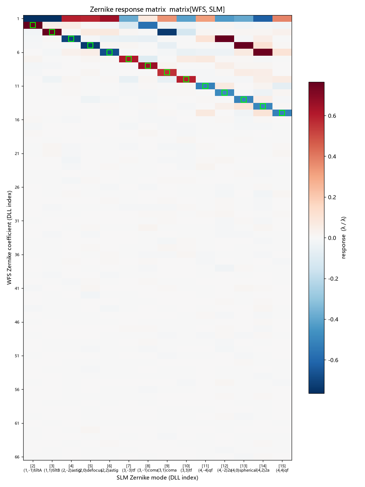
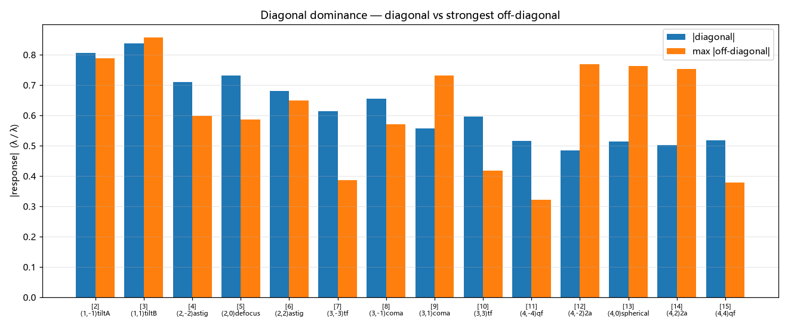
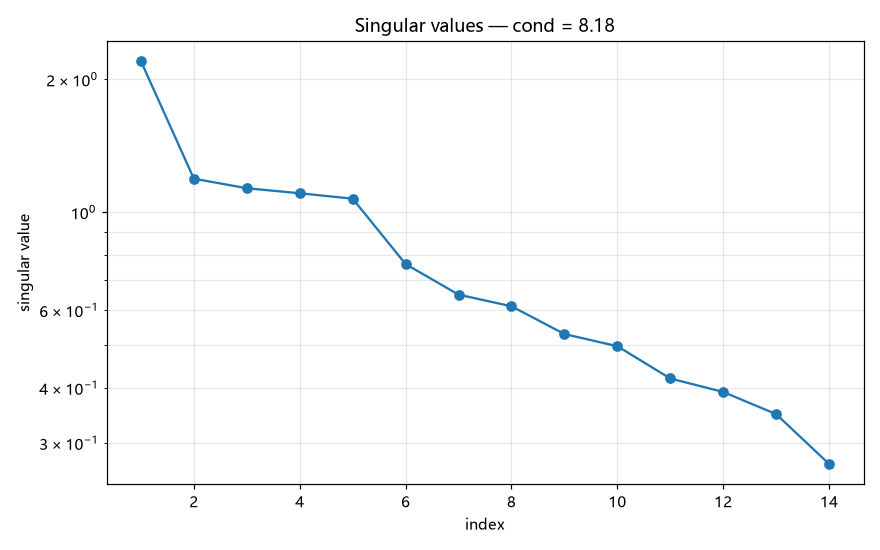
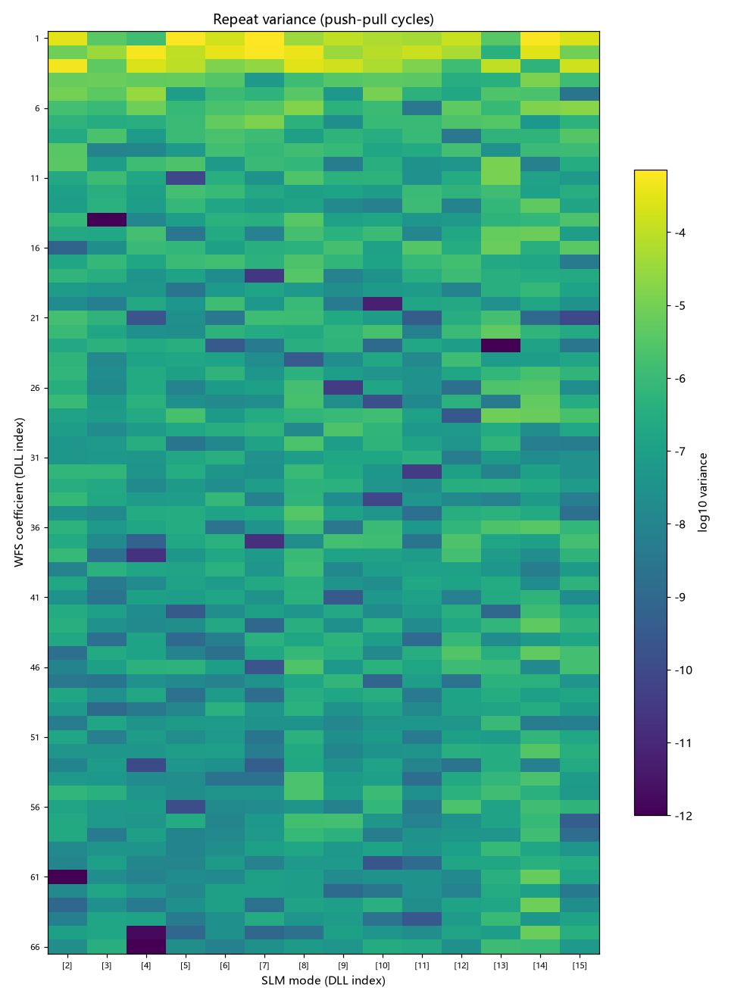
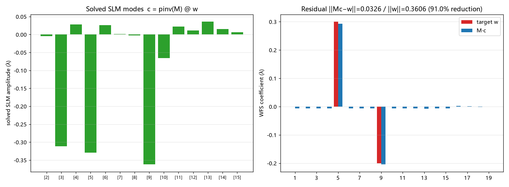

---

# Zernike 响应矩阵重标 — 完整测试报告 (2026-09-16)

**生成时间**: 2026-09-16 01:15:12  
**数据源**: `zm_recal_532_20260916.h5`, `report_20260916_004944.json`, `raw_scan_20260916_004944.json`

### 1. 创建 (Creation)

响应矩阵由 `tools/slm/slm_zernike_response.py` 以**推拉法**标定: 对每个 SLM Zernike 模式施加 ±A 扰动, 测 WFS Zernike 读数增量, `matrix[wfs_coeff, slm_mode] = Δ(WFS)/Δ(SLM 幅度)`。

| 项 | 值 |
|---|---|
| 设备 | SLM #23020026 + WFS M01219666 |
| 波长 / 2π 灰度 | 532 nm / 998 |
| SLM shift | [105, 40] |
| Zernike 半径 | 300.0 px |
| 扰动幅度 | 3.00 rad (0.4775 λ) |
| 推拉循环 / 帧平均 | 2 / 2 |
| WFS pupil | center=(-0.145, 0.175) mm, diameter=(3.749, 4.171) mm |
| 参考平面 | custom user ref @ flat phase (shift 已应用) |
| 矩阵形状 | (66, 14) (WFS × SLM) |
| SLM 模式 (DLL 索引) | [2, 3, 4, 5, 6, 7, 8, 9, 10, 11, 12, 13, 14, 15] |

#### 1.1 设备参数 (SLM / WFS)

| SLM | 值 |
|---|---|
| 序列号 | 23020026 |
| 工作波长 | None nm |
| **最大相位 (2π)** | None rad = None λ (2π 灰度 = None) |
| **工作温度** | None °C (驱动板, 选件板) |
| 固件版本 | None |
| 面板分辨率 | [1920, 1200] |
| 平移 shift | (105, 40) |
| 视频模式 | 0 (0=memory) |
| 波前矫正 | enabled=True, csv=D:\Projects\TIFO\AO-shaping\data\calibration\Wavefront_correction_Data_240236000006(520nm).csv |
| LUT | loaded=False, dir=None |

| WFS | 值 |
|---|---|
| 序列号 | M01219666 |
| 设备 / 厂商 / 型号 | WFS40-5C / Thorlabs / WFS |
| **曝光时间** | 0.0 ms |
| **pupil 中心** | [0.0, 0.0] mm |
| **pupil 直径** | [0.0, 0.0] mm |
| MLA |  (index 2) |
| 子孔径数 | 35 × 35 |
| 参考平面 | use_custom_ref=True |

> ⚠️ **索引约定**: 矩阵行 = DLL 系数索引 (**顺序 m 枚举, 非标准 Noll**); `[5](2,0)defocus` `[9](3,1)coma` `[13](4,0)spherical`。手册佐证 `roCMm` "derived from Zernike coefficient Z[5]"。

### 2. 分析 (Analysis)

#### 2.1 响应矩阵热图

绿框 = 对角线 (同索引 SLM 模式 → WFS 系数)。

#### 2.2 对角主导性

**9/14** 个模式的列主导项即对角线项。

#### 2.3 奇异值谱 / 条件数

条件数 **8.18** (良态, 伪逆稳定)。

#### 2.4 重复性方差

平均方差 **8.647e-06**, 最大 **7.226e-04**。

#### 2.5 线性度

> 本次矩阵由**单幅度推拉标定**产生 (无多幅度扫描数据), 故不提供 `|resp|`-vs-幅度线性度图。推拉重复性可由 §2.4 方差图评估; 多幅度线性度分析另见 `docs/slm/zernike_linearity/linearity.md`。

### 3. 检测 (Detection)

#### 3.1 异常点诊断

> 本次标定**未触发拟合崩溃** (无 `|resp|` 异常点): 半径取 R≈1.5×光束半径、幅度适中, 且已启用**逐点幅度合理性剔除**与**光斑有效比门控** (`wfs_validity`)。异常点诊断图与 R 依赖分析见 `docs/slm/report2.md` 附节 §3.1。

#### 3.2 离线反解验证

合成像差 `[5]defocus=+0.30λ, [9]coma=−0.20λ` → 反解 `c = pinv(M) @ w`, 残差 ‖Mc−w‖=0.0326 / ‖w‖=0.3606 → **降低 91.0%**。

#### 3.3 实测闭环矫正

> 本次未随标定运行闭环矫正 (矩阵由独立标定工具产生, 无同源闭环数据)。最近一次闭环实测 (使用**另一矩阵**) 见 `docs/slm/report2.md` §3.3, 仅供参考; 本矩阵的**离线反解能力**见 §3.2 与 §4.4。

### 4. 结论与解读

#### 4.1 矩阵质量

- **形状** `(66, 14)` = (WFS 系数 66) × (SLM 模式 14)。其中**有效列 14/14** —— 被线性度门控剔除的模式列已置零, 使用时应跳过 (其系数恒为 0)。
- **有效列条件数 `8.18`** —— 越接近 1 越良态, 伪逆越稳定。含零列时直接 `np.linalg.cond` 会因零奇异值爆到 1e18, 故此处只统计有效列 (`slm_zernike_common.effective_cond`)。
- **平均重复方差 `8.647e-06`** —— 推拉循环间的读数散布; 最大 `7.226e-04`。数量级 1e-5 ~ 1e-6 表示重复性良好。

#### 4.2 物理合理性

- **对角主导 9/14**: 每个 SLM Zernike 模式应主要激励 WFS 的**同索引**系数 (标定正确性的核心判据)。非对角项来自 (a) 平移引入的低阶耦合 (尤其 piston 行) 与 (b) 光束仅覆盖图案中心区导致的高阶→低阶投影。
- **piston 行数值大是正常的**: 相位图案平移会把常数项注入, 使 WFS 的 piston 读数随模式变化; 但 piston 是**参考平面偏置, 不可也无需矫正**, 故闭环反解前 必须把 `w[0]` 置零 (见 §3.2)。

#### 4.3 线性度

> 本次为**单幅度推拉标定**, 未做多幅度扫描 → 无 `|resp|`-vs-幅度线性度数据。推拉重复性见 §4.1 的平均方差 (1e-5 量级即良好); 多幅度线性度分析见 `docs/slm/zernike_linearity/linearity.md`。

#### 4.4 反解能力 (离线)

- 合成像差 `[5]defocus=+0.30λ, [9]coma=−0.20λ` 经 `c = pinv(M) @ w` 反解, 残差 ‖Mc−w‖=0.0326 / ‖w‖=0.3606 → **降低 91.0%**。这是**该矩阵的理论天花板** (受限于 span(M) 覆盖度与条件数)。
- 符号约定: `c = −pinv·w` (加负号才抵消像差); 用 `+pinv` 会使像差翻倍。

#### 4.5 实测闭环

> 本次标定未随附闭环实测 (矩阵由独立工具产生, 无同源闭环数据)。可用 `closed-loop` 命令加载本矩阵验证: `python -m ao_shaping.runners.zernike_matrix_runner closed-loop --load-file data/zernike_response_matrix/zm_recal_532_20260916.h5`。

#### 4.6 使用注意

- **单位**: 本矩阵为 **λ/λ** (WFS 系数 µm 经 `um_to_waves` 换算)。反解得到的 `c` 是**波长(λ)**, 但 `PatternHelper.generate_zernike_polynomial` / `make_phase` 收**弧度** → 加载前必须 `× 2π` (漏此换算会使相位缩小 6.28×)。
- **半径一致性**: 矫正相位必须以**矩阵标定时的同一 Zernike 半径**生成, 否则归一化不匹配会按 `(R_cal/R_use)²` 缩放系数。
- **索引**: 行 = DLL 顺序 m 枚举 (非标准 Noll); 列 = SLM 模式 DLL 索引。

### 5. 产物

| 产物 | 路径 |
| 响应矩阵 h5 | `data\zernike_response_matrix\zm_recal_532_20260916.h5` |
| 矩阵 + 原始读数 json | `data\zernike_response_matrix\zm_recal_532_20260916.json` |
| 多尺寸扫描报告 | `D:\Projects\TIFO\AO-shaping\data\zernike_correction\report_20260916_004944.json` |
| 多尺寸原始扫描 | `D:\Projects\TIFO\AO-shaping\data\zernike_correction\raw_scan_20260916_004944.json` |
| 标定工具 | `src/ao_shaping/tools/slm/slm_zernike_response.py` |
| 三阶段工具 | `src/ao_shaping/tools/slm/slm_zernike_correction.py` |
| 共享模块 | `src/ao_shaping/tools/slm/slm_zernike_common.py` |

