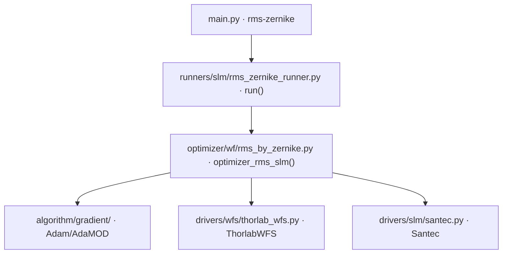

# SLM Zernike RMS 优化 (rms-zernike)

> **生成脚本**: [`scripts/generate_rms_zernike_report.py`](../../scripts/generate_rms_zernike_report.py)
> **复现命令**: `python scripts/generate_rms_zernike_report.py`
> **运行环境**: 离线 (纯源码静态分析; 不开设备)

## 1. 这条命令做什么

通过 SLM 加载 Zernike 相位，以 WFS 测量的 RMS 为目标进行梯度优化 (SPGD/Adam/AdaMOD)，实现波前校正。

支持：
- delta 自动检测 (数量级扫描)
- 多起点优化
- 学习率/δ 调度 (static/cosine/exp/linear)
- 停滞检测与自动 δ 倍增
- 高阶模式冻结阈值

## 2. 调用关系

## 3. 算法流程

1. **初始化**：打开 SLM 与 WFS，设置波长、瞳孔参数
2. **Delta 自动检测** (可选)：在 `[min_delta, max_delta]` 范围按 `delta_step` 级数量级扫描，每级 `n_directions` 次采样，选梯度信号最强的 δ
3. **多起点优化** (可选)：随机初始化 `n_init_positions` 个位置，各自优化，取最优
4. **主优化循环**：
   - 当前系数 `c` 下发 SLM
   - `+δ` 扰动每个模式，读 WFS 计算 RMS
   - `-δ` 扰动每个模式，读 WFS 计算 RMS
   - 中心差分估梯度：`g_i = (RMS(+δ_i) - RMS(-δ_i)) / (2δ)`
   - 优化器更新：`c ← optimizer.update(g)`
   - 学习率/δ 按调度衰减
   - 停滞检测：连续 `stagnation_patience` 轮无改善 → δ × `stagnation_delta_boost`
   - 冻结：`|c_i| < freeze_threshold` 的高阶模式置零
   - 早停：滑动窗口 `early_stop_window` 内改善 < `early_stop_threshold` 且轮数 ≥ `early_stop_min_epochs`

## 4. 主要选项

| 选项 | 说明 | 默认值 |
|------|------|--------|
| `-e, --epochs` | 优化迭代次数 | 20000 |
| `-n, --n-max` | Zernike 最大阶数 | 4 |
| `--lr` | 学习率 | 0.01 |
| `--delta` | 初始 δ 值 (0=自动检测) | 0.0 |
| `-r, --wfs_res` | WFS 分辨率 | 1024 |
| `-p, --pupil_diameter` | 瞳孔直径 | 2.7 |
| `--early_stop_threshold` | 早停阈值 | 0.12 |
| `--wavelength` | SLM 波长 (nm) | 532 |
| `--shift-x/y` | SLM 相位平移 (像素) | 0 |
| `--wait-time` | LCOS 翻转等待 (s) | 0.3 |
| `--slm-number` | SLM 设备编号 | 1 |
| `--remove-tilt` | 移除波前倾斜项 | False |
| `--min-delta/--max-delta/--delta-step` | 自动检测 δ 范围与步数 | - |
| `--n-directions` | 每 δ 采样次数 | 5 |
| `--n-init-positions` | 多起点数量 (0=禁用) | 0 |
| `--lr-schedule` | lr 调度 (static/cosine/exp/linear) | static |
| `--delta-schedule` | δ 调度 | static |
| `--optimizer` | 优化器类型 (adamod/adamw) | adamod |
| `--stagnation-patience` | 停滞检测轮数 | 30 |
| `--stagnation-delta-boost` | 停滞时 δ 倍增 | 1.5 |
| `--freeze-threshold` | 冻结高阶模式阈值 | None |
| `--n-frames` | WFS 帧平均数 | 10 |

## 5. 单位约定 (红线)

- WFS `get_zernike()` 返回 **µm**
- 优化器内部系数单位：**λ (waves)** = µm ÷ 0.532
- 下发 SLM 前：系数 × 2π → **rad** → `generate_zernike_phase` → `Santec.create_phase_from_array()`
- 2026-09-16 修复单位混用后闭环 RMS 改善 13.8% → 42.1%

## 6. 输出契约

- `data/rms_zernike/<日期>/`：优化历史 CSV、最优系数 NPY、最优相位 NPY (raw 弧度)
- `--debug` 时额外保存逐轮 WFS 帧

## 7. 函数名区分

| 文件 | 函数 | 用途 |
|------|------|------|
| `optimizer/wf/rms.py` | `optimizer_rms_dm()` | DM 电压控制 + WFS (用于 `wf`, `pipeline`) |
| `optimizer/wf/rms_by_zernike.py` | `optimizer_rms_slm()` | SLM Zernike 相位控制 + WFS (用于 `rms-zernike`) |