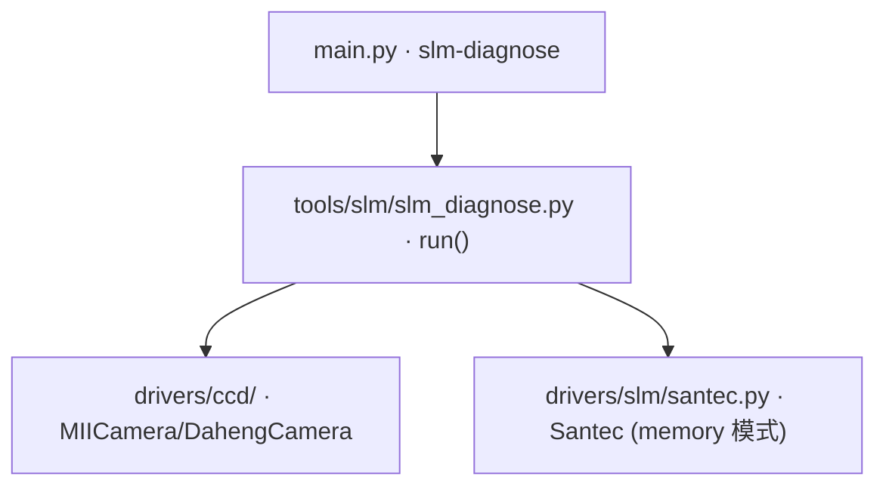

# SLM 硬件自检 (slm-diagnose)

> **生成脚本**: [`scripts/generate_slm_diagnose_report.py`](../../scripts/generate_slm_diagnose_report.py)
> **复现命令**: `python scripts/generate_slm_diagnose_report.py`
> **运行环境**: 离线 (纯源码静态分析; 不开设备)

## 1. 这条命令做什么

在 2f Fourier 光路下对 SLM + MiiCam/Daheng 做逐级硬件自检，定位"面板不调制光"类故障 (2026-09 诊断固化，三步证据链)：

1. **freeze (面板冻结检测)**: flat/全屏光栅/上下半屏光栅写入**轮换内存槽**，对比各帧是否随图案变化 — 全同 ⇒ LCOS 冻结
2. **modulate (调制能力检测)**: `set_grayscale` 0→1023 扫描，0 级桶能量须有 ~993 灰度周期 — 无周期 ⇒ 面板不调制光。此模式下 `get_displayed_memory_number` 报错码 1 是**正常**行为
3. **linearity (到达光强检测)**: 曝光 ×4/×20，峰值亮度须增长 — 恒定峰值 ⇒ 到达相机光强比已知 ~0.02ms 近饱和基线弱 >100×

## 2. 调用关系



## 3. 三步证据链详解

### Step 1: Freeze (面板冻结检测)
- 向 SLM 依次写入：平场、全屏光栅、上半屏光栅、下半屏光栅
- **关键**：每次写入使用**不同的内存槽** (`display_data` 自动轮换)
- 读取 CCD 帧，计算帧间差异 (MSE/SSIM/直方图距离)
- **判据**：≥2/3 帧对有显著差异 → 面板未冻结；全同 → LCOS 冻结

### Step 2: Modulate (调制能力检测)
- `set_grayscale` 模式扫描 0→1023 (步长可配)
- 测量 0 级衍射桶内能量随灰度变化
- **判据**：桶能量呈现 ~993 灰度周期 (2π 对应灰度) → 面板在调制；无周期/平线 → 面板不调制光
- **注意**：`set_grayscale` 模式下 `get_displayed_memory_number` 返回错误码 1 是**正常**行为 (无内存槽概念)

### Step 3: Linearity (到达光强检测)
- 固定灰度 (如 512)，曝光 ×1 / ×4 / ×20
- 测量峰值亮度
- **判据**：峰值随曝光线性增长 → 光路正常；峰值恒定 → 到达光强极弱 (>100× 低于基线)

## 4. 已知约束 (红线)

### DVI 模式 (`video_mode=1`) 的 `open()` 可能挂起
- 观测到 120s/300s 超时
- 挂起后 memory 模式 `open()` 也挂，直到**物理断电重置**
- **本工具只用 memory 模式 (`video_mode=0`)，绝不自动尝试 DVI**

### `--camera-type` 必须与本台相机一致
- 默认值 `miicam`；大恒台架上**必须**加 `--camera-type daheng`
- 不加会直接失败：`miicam.HRESULTException: 请求的资源在使用中`

## 5. 主要选项

| 选项 | 说明 | 默认值 |
|------|------|--------|
| `--slm-number` | SLM 设备编号 | 1 |
| `--slm-wavelength` | SLM 工作波长 nm | 1064 |
| `--camera-type` | 相机类型 (miicam/daheng) | **miicam** |
| `--cam-id` | 相机 ID | 0 |
| `--period-ref` / `--period-test` | 光栅周期 px | 64 / 32 |
| `--exposure-ms` | 自检曝光 ms | 2.0 |
| `--settle-s` | SLM/相机稳定等待 s | 1.0 |
| `--step` | 只跑某步 (freeze/modulate/linearity/all) | all |
| `-o, --output` | 保存诊断报告目录 | 不保存 |

## 6. 台架铁律 (违反会得到看似可信的错结论)

1. **暗帧不可用裸 `argmax` 定位光斑** —— peak 22~46 而帧均值 0.26 时单个热像素就能抢到 argmax；参考帧质心曾在 60 px 内自漂，足以把健康的板判成"没动"
2. **SLM 保留上次显示的图案** —— 下发平场**之前**读到的"平场"其实是上一轮的散斑，同一 3 ms 设置因此测出 100 与 23 两个值
3. **固定 `memory_number=` 是固件 no-op** —— 同一槽连续 `display_memory` 不刷新面板，之后每帧都是旧图。用 `display_data()` 不传 `memory_number`，让驱动自己轮换
4. **液晶要等"稳定"，不是等"够久"** —— 驱动自动翻转时间估算按灰度图变化量给等待，两个灰度统计相近的相位会让它报 **0.0 ms**。实测同一斜坡首次读 fwhm 43.2px、3 秒后 12.8px、质心移 62px —— 单次采集会静默记录未稳定帧。`display_and_average` / `capture_settled` 改为丢弃帧直到连续两次读数一致

## 7. 实测台架几何 (不得用第一性原理重新推导)

- 光斑中心 (960, 600)、半径 450 面板 px
- **panel↔camera 轴互换 90°**
- 焦面尺度 `shift_px ≈ 7600/period` (两条独立路线一致到 0.5%)

详见 [`report/slm/model_in_loop_bench_calibration.md`](../../report/slm/model_in_loop_bench_calibration.md)。

## 8. 示例

```bash
# 全量三步自检 (大恒台架)
python src/ao_shaping/main.py slm-diagnose --camera-type daheng --exposure-ms 1.1

# 只查面板是否冻结
python src/ao_shaping/main.py slm-diagnose --step freeze

# 保存诊断报告
python src/ao_shaping/main.py slm-diagnose --camera-type daheng -o logs/slm_diagnose_20260101
```

## 9. SLM 台架探针 (独立运行，不注册为 CLI)

以下探针固化了 2026-09-30 在大恒 + Santec SLM-200 台架上踩出来的台架常数与测量陷阱，**不要用第一性原理重新推导几何**：

| 工具 | 用途 |
|------|------|
| `slm_tilt_probe` | **判定面板是否真的在调制** (倾斜斜坡)。比光栅可靠：光斑位移只取决于斜坡周期，与衍射效率无关。推翻过一次"面板冻结"假故障 |
| `slm_panel_locate` | 面板坐标上定位光斑中心。相机 0 阶**不是**面板坐标 (两轴互换 90°，尺度差 >10 倍) |
| `slm_beam_extent` | 半平面随机相位边界扫描测光斑中心/半径。实测 r=450 px @ (960,600) |
| `slm_phase_resolution` | 比较逐像素随机相位与光滑 Zernike 相位，判定面板**等效相位分辨率** |
| `slm_exposure_check` | 相机自动曝光状态 + 固定设置下漂移 (区分"相机漂移"与"SLM 保留上次图案") |
| `slm_zernike_sweep_probe` | **光滑 Zernike 扫描探针**：ramp + tilt + defocus + astig + coma + spherical 共 42 点，逐点稳定判据读帧，落盘 npz + Recorder |
| `slm_drift_probe` | **平场漂移 + 曝光阶梯线性**。用区域范数判漂移 (**不用峰值**)，判据 `monotonic`/`non_monotonic`/`saturated` |
| `slm_floor_probe` | **测量本底 + 稳定时间 + SNR-vs-K**。回答噪声是读噪声 (`noise_limited`) 还是漂移 (`drift_limited`) |
| `slm_abba_probe` | **稠密随机相位是否可分辨**。ABBA (`+ - - +`) 消一阶漂移并先量本底。`verdict=unusable` 时不要去测转移矩阵 |
| `slm_bench_metrics` | 上面三个探针的**纯 numpy 分析内核** (无设备/无 I/O，CI 可跑) |

> **启动 GS / GSNet / SPGD runner 之前先跑表征探针**：
> `slm_drift_probe` → `slm_floor_probe` → `slm_abba_probe`。
> 完整流程、验收阈值与**危险默认值清单**见 [`docs/slm/pre_run_characterization.md`](docs/slm/pre_run_characterization.md)。

### 运行示例

```bash
# 面板是否在调制 (最常用，优先跑这个)
python -m ao_shaping.tools.slm.slm_tilt_probe --exposure-ms 3.0

# 定位光斑 (面板坐标)
python -m ao_shaping.tools.slm.slm_panel_locate --exposure-ms 3.0

# 测光斑半径
python -m ao_shaping.tools.slm.slm_beam_extent --axis x --exposure-ms 3.0

# 面板能否分辨像素级相位?
python -m ao_shaping.tools.slm.slm_phase_resolution --exposure-ms 3.0

# 相机是否手动曝光 / 漂移多少
python -m ao_shaping.tools.slm.slm_exposure_check --exposure-ms 3.0

# 完整光滑 Zernike 扫描 (硬件; 先用 --no-hw 确认采集计划)
python -m ao_shaping.tools.slm.slm_zernike_sweep_probe --no-hw
python -m ao_shaping.tools.slm.slm_zernike_sweep_probe --exposure-ms 3.0 --pupil-center 960,600 --zernike-radius 450
```