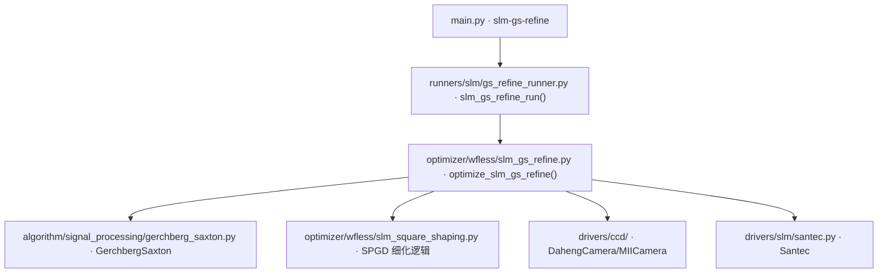

# GS 预整形 + 自由相位 SPGD 细化 (slm-gs-refine)

> **生成脚本**: [`scripts/generate_slm_gs_refine_report.py`](../../scripts/generate_slm_gs_refine_report.py)
> **复现命令**: `python scripts/generate_slm_gs_refine_report.py`
> **运行环境**: 离线 (纯源码静态分析; 不开设备)

## 1. 这条命令做什么

`iterative_zernike_shaping` 仿真流水线 (initial 0.662 → GS 0.812 → 细化 0.849) 的**硬件移植**：Santec SLM 自由相位 + Daheng CCD (也支持 MiiCam) 闭环。

流程与仿真胜出配方一一对应：
1. **平场基线**：下发平场读一帧，`argmax` 定位 0 阶，**冻结**方形 ROI
2. **GS 预矫正 (bake-off)**：用 bench 前向模型算 GS 相位实测；**不优于平场就丢弃**
3. **自由相位 SPGD 细化**：粗网格 (默认 24×24 = 576 自由度) 扰动正负两次读帧，差分估梯度，Adam 更新 + cosine 衰减

## 2. 调用关系



## 3. 关键设计决策

### 细化在硬件上换了形式
- 仿真：torch autograd 穿过解析远场 FFT 求梯度
- 硬件：唯一的前向模型就是测量本身、不可微 → 改为**无感知 (SPGD)**
- 与既有 `spgd-square` / `slm-gsnet` 一致
- GS 是开环计算 (只需模型、不需测量)，原样移植

### 目标函数与仿真同一个
`composite_from_pib_cv(PIB, CV)`，只是喂真实 CCD 帧，所以硬件分数可与仿真的 0.849 直接对比。

### 强制 bake-off
GS 相位来自模型 (光阑、焦距、像素间距)。若任何输入错，GS 会让真实光斑**更差**。
→ 测平场与 GS 实测比分，**取优者**。模型错最多浪费两次测量，而不是跑坏整轮。

### 每帧等"稳定"而非等固定时长
驱动自动翻转时间估算按灰度图变化量给等待，两个灰度统计相近的相位会让它报 **0.0 ms** 而面板还在弛豫 (实测同一斜坡首读 fwhm 43.2px、3 秒后 12.8px、质心移 62px)。
→ `display_and_average` / `capture_settled` 改为丢弃帧直到连续两次读数一致。

### 逐帧去背景后再算指标
对称读出噪声让约一半像素为负，直接算 `PIB` 会 **>1** (实测 7164/14400 负像素 → `PIB=1.0120`)。
→ `_prepare_frame`：减中位数 + clip(min=0) + 裁剪到冻结 ROI。

## 4. 主要选项

| 选项 | 说明 | 默认值 |
|------|------|--------|
| `-e, --epochs` | SPGD 细化轮数 (每轮 2 次远场读帧) | 400 |
| `--target-side` | 目标方形边长 (相机像素, 0=由 `D·f/(d_SLM·p_cam)` 推导) | 0 |
| `--phase-grid` | 自由相位粗网格边长 (默认 24 → 576 DOF) | 24 |
| `--delta` / `--lr` / `--optimizer [adam\|adamw\|adamod\|sgd]` / `--lr-schedule` | SPGD 超参 | - |
| `--gs-iters` / `--gs-warm-start/--no-gs-warm-start` | GS 迭代数 / 是否用平场热启动 | - |
| `--beam-radius-px` | 面板上照明光斑**半径** (实测台架值) | 450 |
| `--camera-pixel-um` | 相机像素间距 (um) —— **光路模型的测量锚点** | 2.2 |
| `--focal-length-m` | 2f 透镜焦距 (m)。默认 0 = 由实测焦点标度 + `--camera-pixel-um` 派生 (本台架 ⇒ 0.1224 m) | 0 |
| `--slm_wavelength` | SLM 工作波长 (nm)。默认 0 = 询问设备实际编程波长 | 0 |
| `--far-field-padding` | GS 远场补零倍数 (默认 3; **代价是平方级**) | 3 |
| `--cam_type [daheng\|miicam\|sim]` / `--cam-id` / `--exposure_time_ms` / `--cam_size` | 相机配置 | - |
| `--slm_number` / `--slm_wavelength` | SLM 配置 | - |
| `--n-eval-frames` / `--settle-wait-s` / `--settle-tol` / `--settle-max-wait-s` | 稳定判据 | - |
| `--early-stop-score` / `--seed` / `--save-best-image` | 早停/种子/保存图 | - |

> **`--dir` 是组级选项**，必须写在子命令之前：
> `python src/ao_shaping/main.py --dir data slm-gs-refine ...`

## 5. 关键参数说明

### `--camera-pixel-um` 与 `--beam-radius-px` (红线)
两者任一错，GS 相位会让真实光斑**更差** —— 因此强制 bake-off。
- `--camera-pixel-um`：相机数据手册常数 (大恒 MER2-507-23GM = 2.2 µm)
- `--beam-radius-px`：面板照明半径 (实测 450 px)

### `--focal-length-m` 派生逻辑
默认 0 = 由实测焦点标度 `K` + `--camera-pixel-um` 派生。
本台架实测 `K` ⇒ 0.1224 m (与 125 mm 标称差 2%)。
显式传值可锁定具体镜头。

### `--slm_wavelength` 默认 0 = 询问设备
实验室有 532/1064 两台 SLM。焦点标度 `K ∝ λ`，换波长须先把 `K` 折算过去，否则派生焦距会按 `λ/λ_ref` 整体缩放 (532 nm 会整整大 2×)。

## 6. 仿真模式

```bash
python src/ao_shaping/main.py slm-gs-refine --cam_type sim -e 20
```

## 7. 硬件示例

```bash
# 大恒 CCD + Santec SLM #1 @1064nm
python src/ao_shaping/main.py slm-gs-refine --cam_type daheng --cam-id 0 -e 400

# 显式指定目标方形边长 (相机像素)
python src/ao_shaping/main.py slm-gs-refine --target-side 90

# 从平场起步 (跳过 GS 预矫正)
python src/ao_shaping/main.py slm-gs-refine --no-gs-warm-start
```

## 8. 上机前必跑表征探针 (顺序不能反)

```bash
python -m ao_shaping.tools.slm.slm_drift_probe --exposure-ms 3.0
python -m ao_shaping.tools.slm.slm_floor_probe --exposure-ms 3.0
python -m ao_shaping.tools.slm.slm_abba_probe --exposure-ms 3.0
```

完整流程与危险默认值清单见 [`docs/slm/pre_run_characterization.md`](docs/slm/pre_run_characterization.md)。

## 9. 输出契约

- `data/slm_gs_refine/<日期>/`：优化历史 CSV (每轮一行标量)、`best_phase.npy` (**raw 未包裹弧度**，用 `Santec.create_phase_from_array()` 下发)、最优远场图 PNG

## 10. 同一 seed 不保证逐帧复现

Seed 只锁定 SPGD 扰动符号，锁定不了测量 —— 每次远场读帧都带器件噪声。两次同 seed 运行在**平场基线**处就已相差 ~1e-3。断言近似可复现，不要断言相等。