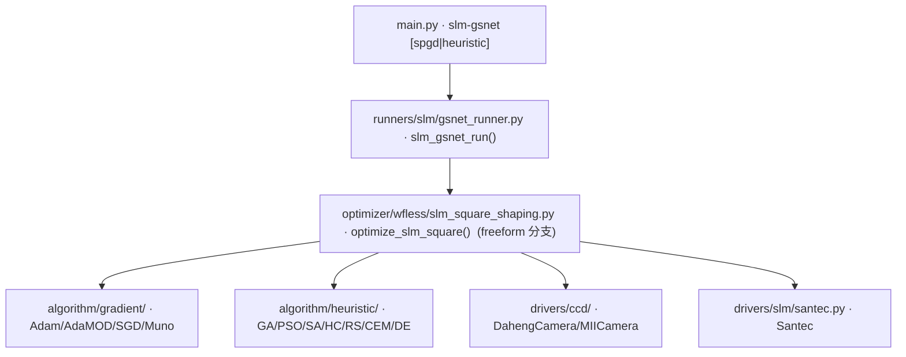

# SLM 自由相位方形光斑整形 (slm-gsnet)

> **生成脚本**: [`scripts/generate_slm_gsnet_report.py`](../../scripts/generate_slm_gsnet_report.py)
> **复现命令**: `python scripts/generate_slm_gsnet_report.py`
> **运行环境**: 离线 (纯源码静态分析; 不开设备)

## 1. 这条命令做什么

通过 **FREEFORM 自由相位** (full-pixel, 逐像素) 将远场光斑整形为**均匀方形** (SLM+CCD 闭环)。

相位自由度始终为 freeform (per-pixel) —— 这是**唯一能合成真正方形远场**的自由度 (低阶 Zernike 是圆对称光滑基，无法合成方形)。

两个子命令：
- `spgd` (默认推荐)：梯度搜索 (SPGD + Adam/AdaMOD)
- `heuristic`：黑盒启发式搜索 (GA/PSO/SA/HC/RS/CEM/DE)

目标方形边长由 `--target-side` 显式指定或 `--target-mean-brightness` 按总亮度能量守恒自动推导。

`--cam_type sim` 走 2f-Fourier 数值仿真 (无需硬件)。

## 2. 调用关系



## 3. 与 spgd-square 的区别

| 项 | `spgd-square` | `slm-gsnet` |
|------|---------------|-------------|
| 相位参数化 | `--basis zernike/freeform` | **固定 freeform** |
| 子命令 | 无 (单命令) | `spgd` / `heuristic` |
| 优化器 | SPGD (adamod/adam/sgd/muno) | SPGD + 启发式 |
| 历史定位 | slm_shaping_runner square | gsnet_runner |

> **注意**：`slm-gsnet` 的底层优化器复用 `slm_square_shaping.py` 的 freeform 分支，只是 CLI 组装方式不同。

## 4. 算法流程 (SPGD)

1. **初始化**：打开 CCD 与 SLM，读取平场帧定位 0 阶中心，**冻结方形 ROI**
2. **初始相位**：零相位 (或加载 `--init-coeffs` 作为 freeform 网格)
3. **主循环** (每轮 2 帧 SPGD)：
   - 生成扰动场 `u ∈ ℝ^{grid×grid}` (高斯白噪声)
   - `phase ± δ·u` 下发 SLM (`display_data` 自动轮换内存槽)
   - 读 CCD，`_prepare_frame` (去背景+裁剪到冻结 ROI)
   - 计算 CV, EE, AR → 综合 `score`
   - 梯度估计：`g = (score(+) - score(-)) / (2δ) * u`
   - Adam/AdaMOD 更新相位网格
   - 记录最优相位与分数
4. **输出**：最优相位 (raw 弧度)、最优远场图、历史 CSV

## 5. 算法流程 (Heuristic)

同一目标函数，算法由 `--algorithm` 指定：
- `GA/PSO/CEM/DE`：种群搜索，`--pop_size` 控制规模
- `SA/HC/RS`：单轨迹搜索
- 直接评估 `J(phase)` 无梯度

## 6. 主要选项

### 共享选项 (spgd/heuristic)
| 选项 | 说明 | 默认值 |
|------|------|--------|
| `-e, --epochs` | 优化迭代次数 | 2000 |
| `-c, --center` | 光斑中心检测 (shape/centroid_thresh/max/mass/'x,y') | shape |
| `--target-side` | 目标方形边长 (px, 0=自动) | 0 |
| `--target-mean-brightness` | 目标平均亮度 (>0 自动推导边长) | 0 |
| `--side-factor` | 自动边长倍率 | 1.5 |
| `--w-uniformity` | 均匀性权重 | 0.4 |
| `--w-efficiency` | 能量效率权重 | 0.6 |
| `--w-aspect` | 宽高比权重 | 0.0 |
| `--cam_type` | 相机后端 (miicam/daheng/sim) | daheng |
| `-t, --exposure_time_ms` | CCD 曝光 ms (0=不固定) | 0 |
| `--cam-id` | CCD 设备 ID | 0 |
| `--cam_size` | CCD 开窗大小 (像素) | - |
| `--slm_number` | SLM 设备编号 | 1 |
| `--slm_wavelength` | SLM 波长 nm | 1064 |
| `--zernike_radius` | Zernike 孔径半径 px (0=SLM短边/2) | 0 |

### SPGD 专属
| 选项 | 说明 | 默认值 |
|------|------|--------|
| `--delta` | 扰动幅度 (rad)。省略=交给自适应调度；显式传值则**固定**该值 | 省略 |
| `--lr` | 学习率 (0=自动) | 0 |
| `--optimizer_type` | adam/adamw/adamod/sgd/muno/munow | adamod |

### Heuristic 专属
| 选项 | 说明 | 默认值 |
|------|------|--------|
| `--algorithm` | ga/pso/sa/hc/rs/cem/de | ga |
| `--pop_size` | 种群大小 (ga/pso/cem/de) | - |

## 7. 仿真模式

```bash
# SPGD 仿真
python src/ao_shaping/main.py slm-gsnet spgd --cam_type sim --epochs 100

# GA 启发式仿真
python src/ao_shaping/main.py slm-gsnet heuristic --algorithm ga --cam_type sim --epochs 500
```

`--cam_type sim` 走 2f-Fourier 数字孪生 (无硬件)。

## 8. 曝光默认值陷阱 (红线)

同 `spgd-square`：**`--exposure_time_ms 0` = "不固定"，大恒驱动钳到 ~0.02 ms**。上机前必须显式传入实测曝光。

## 9. 关键反模式 (红线)

| 反模式 | 后果 | 正确做法 |
|--------|------|----------|
| 目标函数无 EE 项 | 能量被推出目标框 (EE→0.002) | `w_efficiency` 必须非零 |
| 每轮重定位 ROI | 斑粒场下指标不连续 | 首帧定位后冻结 ROI |
| 原始帧直接算指标 | 读出噪声负像素污染 PIB/CV | `_prepare_frame` 先减中位数再 clip≥0 |

## 10. 输出契约

- `data/slm_gsnet/<日期>/`：历史 CSV、`best_phase.npy` (raw 弧度, grid×grid)、最优远场图 PNG
- `--debug`：逐轮帧、相位、Recorder pkl

## 11. 同一 seed 不保证逐帧复现

Seed 只锁定 SPGD 扰动符号，**锁定不了测量** —— 每次远场读帧都带器件噪声。两次同 seed 运行在**平场基线**处就已相差 ~1e-3。断言近似可复现，不要断言相等。