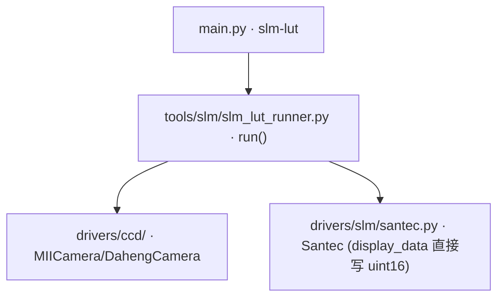

# SLM 灰度→相位 LUT 校准 (slm-lut)

> **生成脚本**: [`scripts/generate_slm_lut_report.py`](../../scripts/generate_slm_lut_report.py)
> **复现命令**: `python scripts/generate_slm_lut_report.py`
> **运行环境**: 离线 (纯源码静态分析; 不开设备)

## 1. 这条命令做什么

在 SLM 上同时写入**半屏参考光栅 + 半屏测试光栅** (上半屏恒定满深度闪耀参考，下半屏扫描深度/偏移)，同帧测量两半 +1 级衍射效率的比值 (相互抵消激光漂移)，由 sinc² 效率曲线反演灰度→相位映射，输出正向/逆向 LUT (`lut_forward.csv`/`lut_inverse.csv`/`lut.npz`)，之后可通过 `slm.load_lut(dir)` 加载，由驱动在相位写入时自动补偿灰度↔相位非线性。

## 2. 调用关系



## 3. 校准原理

- **参考半屏**：周期 `period-ref`，固定最大闪耀深度 (2π 相位包裹)
- **测试半屏**：周期 `period-test`，扫描灰度/偏移
- 同帧测量两半 +1 级衍射光斑能量比 `η_test / η_ref`
- 激光功率漂移在同一帧内相互抵消
- 由理论效率曲线 `η(φ) = sinc²(φ/2π)` 反演 `φ(gray)`
- 输出：`gray → phase` (正向 LUT)、`phase → gray` (逆向 LUT)

## 4. 两种扫描方法

| 方法 | 说明 | 适用场景 |
|------|------|----------|
| `depth` (默认) | 缩放闪耀峰值灰度，保持相位斜率 | 标准校准，覆盖全 2π 范围 |
| `offset` | 均匀灰度偏移，相位斜率固定 | 对照实验，验证幅度非线性 |

## 5. 主要选项

| 选项 | 说明 | 默认值 |
|------|------|--------|
| `--method` | 扫描方法 (depth/offset) | depth |
| `--period-ref` | 参考半屏闪耀光栅周期 (SLM px) | 64 |
| `--period-test` | 测试半屏闪耀光栅周期 (SLM px) | 32 |
| `--gray-step` | 灰度扫描步长 | 16 |
| `--exposure-ms` | 初始相机曝光 (ms) | 0.03 |
| `--n-frames` | 每灰度点平均帧数 | 10 |
| `--camera-type` | 相机类型 (miicam/daheng) | miicam |
| `--cam-id` | 相机 ID | 0 |
| `--settle-time` | SLM 写入后稳定等待 (s) | 0.3 |
| `--slm-number` | SLM 设备编号 | 1 |
| `--slm-wavelength` | SLM 工作波长 nm；2π 对应灰度由设备动态查询 | 1064 |
| `--spot-window` | 光斑 ROI 窗口 (奇数) | 41 |
| `--bright-floor` / `--saturation-stop` | 联合自动曝光阈值 | 0.02 / 0.9 |
| `-o, --output` | 输出目录 | data/slm_lut |
| `--display/--no-display` | 是否弹出 matplotlib 图窗 | False |

## 6. 关键实现细节 (红线)

### 校准图案使用 uint16 原始灰度直接 `display_data` 写入
**严禁经过 `create_phase_from_array()`** —— 弧度转换会损坏灰度值：
- `create_phase_from_array()` 将输入作为**弧度**处理 (mod 2π → 弧度/2π × 1023)
- uint16 灰度值会经过不必要的弧度转换而被静默损坏

### 同帧差分消除漂移
参考与测试光栅在**同一帧**同曝光下测量，激光功率漂移、相机增益漂移全抵消。

### 自动曝光联合判据
`bright_floor` (最低亮度阈值) + `saturation_stop` (饱和停止阈值) 双门控，避免欠曝/过曝。

## 7. 输出契约

输出目录 `data/slm_lut/run-<时间戳>/`：
- `lut_calibration.png`：η/g、φ/g、逆 LUT 三图
- `lut/`：`lut_forward.csv` (gray→phase)、`lut_inverse.csv` (phase→gray)、`lut.npz` (NPZ 归档)
- `calibration_frame.npy`：校准帧
- `records.pkl`：g/eta/phi/inverse_gray/meta/p_ref/p_test 全量记录

## 8. 加载与使用

```python
slm = Santec(slm_number=1)
slm.open()
slm.load_lut("data/slm_lut/run-20260101_120000/lut")  # 加载 LUT 目录
# 之后 create_phase_from_array() 内部自动应用 LUT 补偿
```

## 9. 示例

```bash
# 默认 depth 扫描 (推荐)
python src/ao_shaping/main.py slm-lut --period-ref 64 --period-test 32 -o data/slm_lut

# offset 对照方法
python src/ao_shaping/main.py slm-lut --method offset -o data/slm_lut
```

## 10. 注意事项

- `--camera-type` 必须与本台相机一致。默认 `miicam`；大恒台架上不加 `--camera-type daheng` 会直接失败 (`miicam.HRESULTException: 请求的资源在使用中`)
- 曝光时间建议从 0.03 ms 起步，自动曝光会自动调整
- 校准耗时约 (1024/16) × 10 帧 × 0.3s ≈ 32 分钟