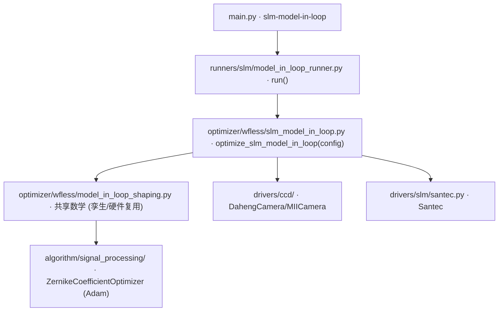

# 正向模型闭环整形 (slm-model-in-loop)

> **生成脚本**: [`scripts/generate_model_in_loop_report.py`](../../scripts/generate_model_in_loop_report.py)
> **复现命令**: `python scripts/generate_model_in_loop_report.py`
> **运行环境**: 离线 (纯源码静态分析 + 可选 torch 实测; 不开设备)
> **详细算法文档**: [`docs/slm/model_in_loop_algorithm.md`](model_in_loop_algorithm.md)

## 1. 这条命令做什么

每轮交替两步，用实测数据在闭环里持续修正正向模型，再用修正后的模型合成相位：

1. **Step A —— 拟合正向模型**：显示若干个**强随机探针**相位，把每个探针的远场实测帧与正向模型的预测对比，重拟合**一个共享的 Zernike 像差向量**。
2. **Step B —— 合成方形**：**冻结**刚拟合出的像差，优化**全像素 SLM 相位**逼近方形目标，下发实测；本轮相位成为下一轮的热启动。

两个守卫 (§6) 抑制两步互相追逐；最终相位只有**实测优于平场基线**才提交。

## 2. 调用关系



## 3. 计算时序 (每轮)

```
一次性几何标定 (米色)
  └─ n_calibration_probes × display(probe) + measure() → calibrate_bench_geometry()
     └─ 相关度 < min_geometry_correlation → 退出码 2，不提交任何相位

平场基线 (浅绿)
  └─ display(flat) → measure() → _metrics_at → _quality → score_before

第 t 轮 Step A (蓝)
  ├─ probe_count 次:
  │   ├─ _probe_phase(region, probe_spread, seed) → 零均值高斯瞳面相位
  │   ├─ display(probe) + measure() → _prepare_frame
  │   └─ _to_model_grid() 搬到模型网格
  └─ step_a_iterations 次 Adam 更新 (轮流喂全部探针，同一 Adam 状态)
     └─ trust_region_clamp → clamped

第 t 轮 Step B (粉)
  ├─ step_b_iterations 次全像素相位 Adam (梯度穿过解析 FFT)
  ├─ display(shaped) + measure() → _prepare_frame → _metrics_at → _quality
  └─ acceptance_verdict(loss, score)
     ├─ accept: c←clamped, phase←shaped, lr 复原, streak=0
     └─ reject: lr×damp_lr_factor, 探针+escalate, streak+=1
        └─ streak ≥ max_rejection_streak → 中止 (退出码 2)
```

## 4. 关键设计点

### 为什么必须用探针 (Step A)
平瞳孔聚焦成近 δ 函数，归一化强度对光滑低阶像差几乎不响应 —— 像差不可辨识。
探针相位 std > ~3 rad 时信号才越过 16-bit 量化本底两个数量级，拟合才良态。

### Step A 所有探针喂同一个 Adam 状态
焦面强度是瞳面相位的非凸函数，单个探针留下大量驻点。轮流喂多个独立探针提供消掉驻点所需的多样性。
`update` 连续 30 步无改善会锁存 (`PLATEAU_PATIENCE`)，无东西清锁存 → re-arm 必须绕**当前**系数重建优化器。

### Step B 只在最后测一次
Step B 是纯计算 (可微前向模型过 FFT)，硬件上不可微的只有「真实测量」。
实测只在末尾做一次，交给验收测试。因此 `step_b_iterations=600` 不产生 600 次设备往返。

### 冻结 Noll 1,2,3 (piston/tip/tilt)
它们**无法从远场强度辨识**：piston 常数无贡献；tip/tilt 只是搬 0 阶位置。
放开实测后果：56% 系数范数被灌进这些简并方向而不带来收益。

### 孪生与硬件共享数学
`model_in_loop_shaping.py` 含 `calibrate_bench_geometry` / `_probe_phase` / `_fit_aberration_at_probes` / `shape_phase_with_frozen_aberration` / `simulate_iterative_shaping`。
`--cam_type sim` 只替换 `Bench` 实现 (`_SimBench` vs `_HardwareBench`)，数学逐位相同。

## 5. 主要选项

| 选项 | 说明 | 默认值 |
|------|------|--------|
| `-r, --n-rounds` | 迭代轮数 (拟合→整形→复测) | 6 |
| `--probe-count` / `--probe-spread` | 每轮探针数 / 探针相位 std (rad) | 8 / 4.0 |
| `--step-a-iterations` / `--step-a-lr` | Step A Adam 步数/学习率 | 80 / 0.05 |
| `--n-orders` | 拟合 Zernike 阶数 | 10 |
| `--step-b-iterations` / `--step-b-lr` | Step B Adam 步数/学习率 | 600 / 0.05 |
| `--frozen-modes` | 冻结的 1-based Noll 序号 | 1,2,3 |
| `--region` / `--far-field-padding` | 正向模型瞳孔网格 / 远场补零倍数 | 64 / 8 |
| `--panel-span-px` / `--pupil-center` | 探针覆盖面板宽度 / 光斑面板坐标 | 900 / (960,600) |
| `--camera-pixel-um` / `--slm-pixel-um` / `--focal-length-m` | 光路模型测量锚点 | 2.2 / 8.0 / 0.0 |
| `--target-side` | 目标方形边长 (相机像素) | 60 |
| `--w-efficiency` / `--w-uniformity` | 质量分权重。**w-efficiency 必须非零** | 0.6 / 0.4 |
| `--min-geometry-correlation` | 几何 bake-off 阈值；低于直接中止 (退出码 2) | 0.5 |
| `--warm-start/--no-warm-start` | 热启动 | True |
| `--early-stop-score` / `--save-best-image` | 早停分数 / 保存最优图 | - |
| `--cam_type [daheng\|miicam\|sim]` / `--cam-id` / `--exposure_time_ms` / `--cam_size` | 相机配置 | - |
| `--slm_number` / `--slm_wavelength` / `--device` / `--dtype` / `--seed` | SLM/设备/种子 | - |

## 6. 两个守卫

### 守卫 1：Trust Region
逐轮系数变化 L2 范数被 `trust_region_c_l2` 截断。

### 守卫 2：逐轮验收
`acceptance_verdict(loss_before, loss_after, score_before, score_after)`：
- 拟合 loss 变差、或实测综合分变差 (容差 `acceptance_score_eps=0.001`) → reject
- 连续 reject ≥ `max_rejection_streak=3` → 中止 (台架落在模型之外)

## 7. 曝光默认值陷阱 (红线)

> **`--exposure_time_ms 0` = "不固定"，大恒驱动钳到 ~0.02 ms** (比可用区间 0.4–1.5 ms 暗 20–75×)。
> **上机前必须显式传入按当前激光功率实测的曝光** (本台架历史参考 1.5 ms)。

## 8. 仿真模式

```bash
python src/ao_shaping/main.py slm-model-in-loop --cam_type sim -r 2
```

## 9. 硬件示例

```bash
python src/ao_shaping/main.py slm-model-in-loop \
    --cam_type daheng --cam-id 0 --exposure_time_ms 1.5 \
    --slm_number 1 --slm_wavelength 1064 \
    --panel-span-px 900 --pupil-center 960,600 --camera-pixel-um 2.2 \
    -r 6
```

## 10. 上机前必跑表征探针 (顺序不能反)

```bash
python -m ao_shaping.tools.slm.slm_drift_probe --exposure-ms 3.0
python -m ao_shaping.tools.slm.slm_floor_probe --exposure-ms 3.0
python -m ao_shaping.tools.slm.slm_abba_probe --exposure-ms 3.0
```

见 [`docs/slm/pre_run_characterization.md`](docs/slm/pre_run_characterization.md)。

若台架无法被正向模型描述 (bake-off 失败)，改用 `slm-gs-refine`。

## 11. 输出契约

- `data/slm_model_in_loop/<日期>/`：逐轮历史 CSV、`best_phase.npy` (**raw 未包裹弧度**)、`bench_geometry.json` (拟合出的几何，供复现)、可选最优远场图 PNG
- `data/debug/slm_model_in_loop_<ts>/<ts>/*.pkl`：**每次运行都写**，不依赖 `--debug`。结构 `{epoch: record}`，带 `_epoch` 索引键，配 `.json` sidecar。行内只有标量 (由测试锁定)，逐帧图像不在其中；最优帧另存 PNG。

## 12. 终止状态

| 状态 | 含义 |
|------|------|
| `completed` | 至少一轮被接受 (或正确地保留了平场) |
| `aborted_unidentifiable` | 几何标定从未达到要求的相关度 |
| `aborted_rejection_streak` | 连续 reject 达上限 —— 台架落在模型之外 |

退出码 `2` = 几何 bake-off 失败或持续落在模型之外，该轮**没有**提交任何相位。