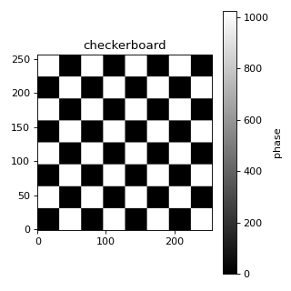
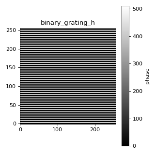
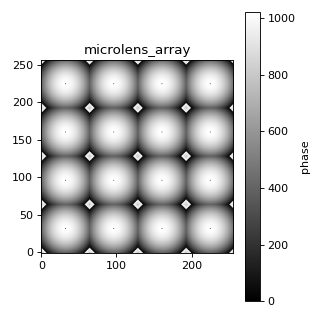
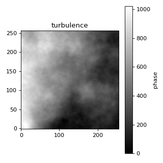
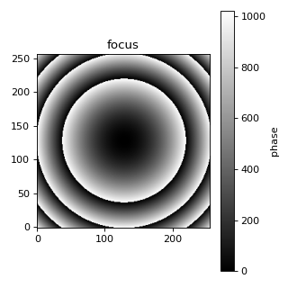
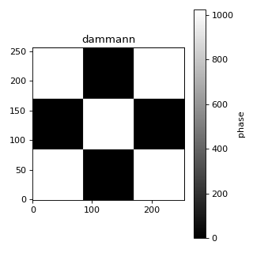
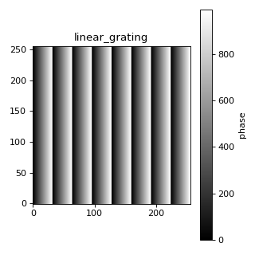
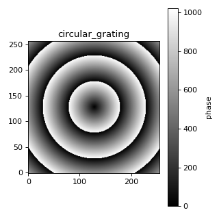
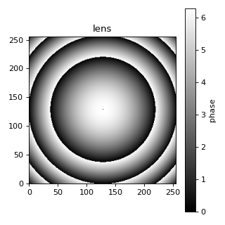
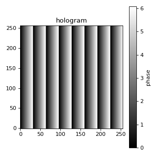

# PatternHelper 类使用指南

`PatternHelper` 是 AO-Shaping 项目中的光学相位图案生成工具类，提供多种光学相位图案的生成方法。

## 导入

```python
from ao_shaping.utils.pattern_helper import PatternHelper
```

```python
from ao_shaping.utils.pattern_helper import PatternHelper

# 创建 PatternHelper 实例
# resolution: (width, height) - 图案分辨率
# bits: 位深度，默认 10 位 (0-1023)
ph = PatternHelper(resolution=(256, 256), bits=10)
```

## 图案类型

### 1. 棋盘格图案 (Checkerboard)

```python
ph.generate_checkerboard(period=32)
```



**参数：**
- `period`: 棋盘格周期（像素）

---

### 2. 二值光栅 (Binary Grating)

```python
# 水平光栅
ph.generate_binary_grating(a=2, b=3, direction="horizontal")

# 垂直光栅
ph.generate_binary_grating(a=2, b=3, direction="vertical")
```




**参数：**
- `a`: 明条纹宽度
- `b`: 暗条纹宽度
- `direction`: "horizontal" 或 "vertical"

---

### 3. 微透镜阵列 (Microlens Array)

```python
ph.generate_microlens_array(
    lens_size=64,       # 单个透镜尺寸
    focal_length=0.1,    # 焦距 (m)
    wavelength=532e-9,   # 波长 (m)
    pixel_size=8e-6       # 像素大小 (m)
)
```



---

### 4. 湍流相位屏 (Turbulence Screen)

```python
ph.generate_turbulence_screen(
    Cn2=1e-14,        # 折射率结构常数
    L=1000,            # 传播路径长度 (m)
    wavelength=532e-9,  # 波长 (m)
    pixel_size=8e-6,     # 像素大小 (m)
    random_seed=42,       # 随机种子
    method="kolmogorov"  # "kolmogorov" 或 "vankarman"
)
```



---

### 5. Zernike 模式 (单个)

```python
# n: 径向阶数
# m: 角向阶数  
# amplitude: 振幅

ph.generate_zernike(n=0, m=0, amplitude=1.0)   # 活塞 (Piston)
ph.generate_zernike(n=1, m=-1, amplitude=1.0)  # X 倾斜
ph.generate_zernike(n=1, m=1, amplitude=1.0)   # Y 倾斜
ph.generate_zernike(n=2, m=0, amplitude=1.0)   # 离焦
ph.generate_zernike(n=2, m=-2, amplitude=1.0)  # 像散 X
ph.generate_zernike(n=2, m=2, amplitude=1.0)   # 像散 Y
ph.generate_zernike(n=3, m=-1, amplitude=1.0)  # 彗差 X
ph.generate_zernike(n=3, m=1, amplitude=1.0)   # 彗差 Y
ph.generate_zernike(n=3, m=-3, amplitude=1.0)  # 三叶草 X
ph.generate_zernike(n=3, m=3, amplitude=1.0)   # 三叶草 Y
```

Zernike 1 (活塞):


Zernike 2 (X 倾斜):


Zernike 3 (Y 倾斜):


Zernike 4 (像散 X):


Zernike 5 (离焦):


Zernike 6 (像散 Y):


Zernike 7 (三叶草 X):


Zernike 8 (彗差 X):


Zernike 9 (彗差 Y):


Zernike 10 (三叶草 Y):


---

### 6. Zernike 多项式 (组合模式)

```python
ph.generate_zernike_polynomial({
    (0, 0): 0.5,    # 活塞
    (1, -1): 0.3,   # X 倾斜
    (1, 1): 0.2,    # Y 倾斜
    (2, 0): 0.1,    # 离焦
})
```


---

### 7. 聚焦透镜 (Focus)

```python
ph.generate_focus(
    focal_length=0.5,    # 焦距 (m)
    wavelength=532e-9,   # 波长 (m)
    pixel_size=8e-6,     # 像素大小 (m)
    wrap_phase=True        # 是否包裹相位
)
```



---

### 8. Dammann 光栅

```python
ph.generate_dammann_grating(order=3)
```



**参数：**
- `order`: 衍射级次数量

---

### 9. 线性光栅

```python
ph.linear_grating(period=32)
```



**参数：**
- `period`: 光栅周期

---

### 10. 圆形光栅

```python
ph.circular_grating(radius=50)
```



---

### 11. 透镜模式

```python
ph.lens(
    focal_length=0.5,    # 焦距 (m)
    wavelength=532e-9,    # 波长 (m)
    pixel_size=8e-6          # 像素大小 (m)
)
```



**注意:** 此方法返回未包裹的相位（弧度），需要用 `to_uint16()` 转换。

---

### 12. 全息图

```python
ph.hologram(period=32)
```



---

## 坐标属性

PatternHelper 提供以下坐标属性：

| 属性 | 描述 |
|------|------|
| `x` | 1D x 坐标（中心为0）|
| `y` | 1D y 坐标（中心为0）|
| `xx` | 2D x 网格坐标 |
| `yy` | 2D y 网格坐标 |
| `R` | 径向距离 |
| `Theta` | 角向坐标 |
| `mask` | 圆形光阑掩模 |
| `pixel_x` | 像素 x 坐标 |
| `pixel_y` | 像素 y 坐标 |

---

## Noll 索引参考

| Noll j | (n, m) | 名称 |
|--------|----------|------|
| 1 | (0, 0) | 活塞 (Piston) |
| 2 | (1, -1) | X 倾斜 (Tilt X) |
| 3 | (1, 1) | Y 倾斜 (Tilt Y) |
| 4 | (2, -2) | 像散 X (Astig X) |
| 5 | (2, 0) | 离焦 (Defocus) |
| 6 | (2, 2) | 像散 Y (Astig Y) |
| 7 | (3, -3) | 三叶草 X (Trefoil X) |
| 8 | (3, -1) | 彗差 X (Coma X) |
| 9 | (3, 1) | 彗差 Y (Coma Y) |
| 10 | (3, 3) | 三叶草 Y (Trefoil Y) |
| 11 | (4, -4) | |
| 12 | (4, -2) | |
| 13 | (4, 0) | |
| 14 | (4, 2) | |
| 15 | (4, 4) | |

---

## 依赖

- `numpy`
- `aotools` - 用于湍流相位屏生成
- `ao_shaping.utils.zernike_calc` - 用于 Zernike 模式生成