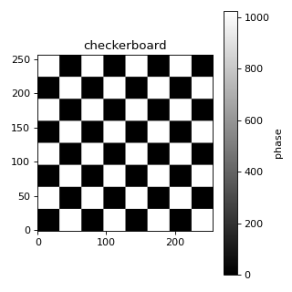
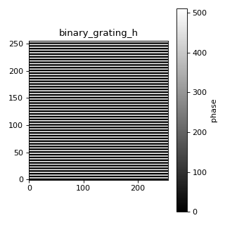
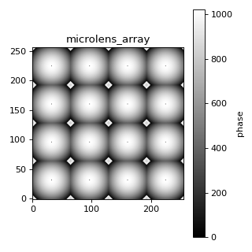
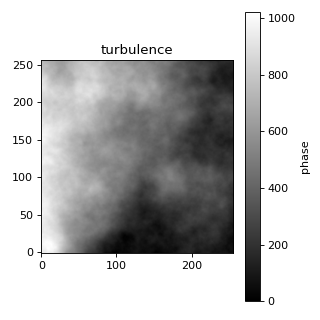
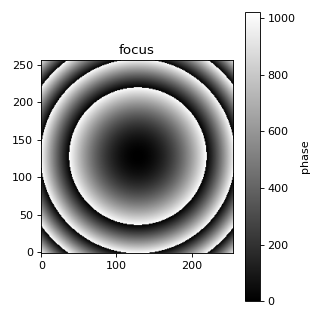
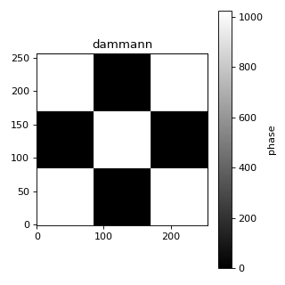
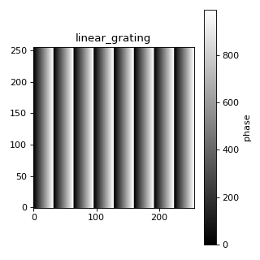
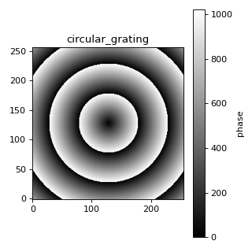
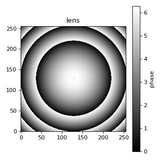
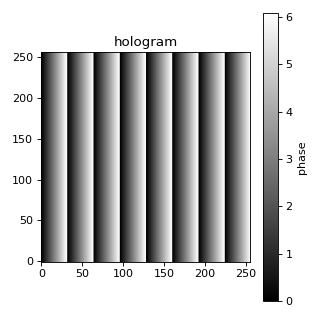

# PatternHelper 类使用指南

`PatternHelper` 是 AO-Shaping 项目中的光学相位图案生成工具类，提供多种光学相位图案的生成方法。

## 导入

```python
from ao_shaping.utils.wavefront.pattern_helper import PatternHelper
```

```python
from ao_shaping.utils.wavefront.pattern_helper import PatternHelper

# 创建 PatternHelper 实例
# resolution: (width, height) - 图案分辨率
# bits: 位深度，默认 10 位 (0-1023)
ph = PatternHelper(resolution=(256, 256), bits=10)
```

## 图案类型

### 1. 棋盘格图案 (Checkerboard)

```python
ph.generate_checkerboard(period=32)
```



**参数：**
- `period`: 棋盘格周期（像素）

---

### 2. 二值光栅 (Binary Grating)

```python
# 水平光栅
ph.generate_binary_grating(a=2, b=3, direction="horizontal")

# 垂直光栅
ph.generate_binary_grating(a=2, b=3, direction="vertical")
```




**参数：**
- `a`: 明条纹宽度
- `b`: 暗条纹宽度
- `direction`: "horizontal" 或 "vertical"

---

### 3. 微透镜阵列 (Microlens Array)

```python
ph.generate_microlens_array(
    lens_size=64,       # 单个透镜尺寸
    focal_length=0.1,    # 焦距 (m)
    wavelength=532e-9,   # 波长 (m)
    pixel_size=8e-6       # 像素大小 (m)
)
```



---

### 4. 湍流相位屏 (Turbulence Screen)

```python
# ⚠️ 2026-10-01 修正：相位屏参数在**初始化**时传入，不在生成时。
# 原文把 6 个参数写在 generate_turbulence_screen() 上，照抄会 TypeError
# （实际签名 `def generate_turbulence_screen(self) -> np.ndarray`，零参数）。

ph.init_turbulence_screen(
    r0=1e-14,           # Fried 参数 (m) —— 注意不是 Cn2
    L0=100,             # 外尺度 (m)
    pixel_scale=8e-6,   # 每像素物理尺寸 (m)
    random_seed=42,     # 可选
)
ph.generate_turbulence_screen()   # -> 2D float64 数组 (弧度)
```



> ⚠️ `r0` 是 Fried 参数，**不是** `Cn2` 结构常数常量；原文档把 `Cn2=1e-14` 直接当
> `r0` 用，物理上不对等。

---

### 5. Zernike 模式 (单个)

```python
# n: 径向阶数
# m: 角向阶数  
# amplitude: 振幅

ph.generate_zernike(n=0, m=0, amplitude=1.0)   # 活塞 (Piston)
ph.generate_zernike(n=1, m=-1, amplitude=1.0)  # X 倾斜
ph.generate_zernike(n=1, m=1, amplitude=1.0)   # Y 倾斜
ph.generate_zernike(n=2, m=0, amplitude=1.0)   # 离焦
ph.generate_zernike(n=2, m=-2, amplitude=1.0)  # 像散 X
ph.generate_zernike(n=2, m=2, amplitude=1.0)   # 像散 Y
ph.generate_zernike(n=3, m=-1, amplitude=1.0)  # 彗差 X
ph.generate_zernike(n=3, m=1, amplitude=1.0)   # 彗差 Y
ph.generate_zernike(n=3, m=-3, amplitude=1.0)  # 三叶草 X
ph.generate_zernike(n=3, m=3, amplitude=1.0)   # 三叶草 Y
```

Zernike 示例（参数是 **(n, m)**，不是 Noll 序号 —— 见文末 Noll 参考表）:

```python
ph.generate_zernike(n=0, m=0, amplitude=1.0)   # 活塞 (Piston)
ph.generate_zernike(n=1, m=1, amplitude=1.0)   # Y 倾斜
ph.generate_zernike(n=1, m=-1, amplitude=1.0)  # X 倾斜 (Tip)
ph.generate_zernike(n=2, m=0, amplitude=1.0)   # 离焦
ph.generate_zernike(n=2, m=-2, amplitude=1.0)  # 45° 像散
ph.generate_zernike(n=2, m=2, amplitude=1.0)   # 0° 像散
ph.generate_zernike(n=3, m=-1, amplitude=1.0)  # Y 彗差
ph.generate_zernike(n=3, m=1, amplitude=1.0)   # X 彗差
ph.generate_zernike(n=3, m=-3, amplitude=1.0)  # Y 三叶像差
ph.generate_zernike(n=3, m=3, amplitude=1.0)   # X 三叶像差
```

> ⚠️ **2026-10-01 删除**：本节原有 11 个 `slm_patterns/zernike_*.png` 插图链接，
> 但**该目录下不存在任何 `zernike_*.png` 文件**（实际只有 checkerboard / grating /
> microlens / turbulence / lens / focus / dammann / circular / linear / hologram），
> 全是死链。重新生成需用 `scripts/` 下的绘图脚本，勿手工补图。

---

### 6. Zernike 多项式 (组合模式)

```python
ph.generate_zernike_polynomial({
    (0, 0): 0.5,    # 活塞
    (1, -1): 0.3,   # X 倾斜
    (1, 1): 0.2,    # Y 倾斜
    (2, 0): 0.1,    # 离焦
})
```

> ⚠️ **2026-10-01 删除**：`slm_patterns/zernike_combo.png` 不存在（死链）。
>
> ⚠️ **返回值是 raw 未包裹弧度**（float64），不是 uint16。转灰度走
> `PatternHelper.to_uint16()`（内部委托 `utils/slm/phase_display.phase_to_slm_grayscale`）
> 或直接 `slm.create_phase_from_array()`。见 `AGENTS.md` 的 raw-only 契约红线。

---

### 7. 聚焦透镜 (Focus)

```python
# ⚠️ 2026-10-01 修正：实际签名无 `wrap_phase` 参数
# （`def generate_focus(self, focal_length, wavelength=532e-9, pixel_size=8e-6, lens_radius=None)`）
# 相位是 raw 未包裹弧度，全项目唯一 mod-2π 点在 SLM 驱动的 create_phase_from_array()
ph.generate_focus(
    focal_length=0.5,    # 焦距 (m)
    wavelength=532e-9,   # 波长 (m)
    pixel_size=8e-6,     # 像素大小 (m)
)
```



---

### 8. Dammann 光栅

```python
ph.generate_dammann_grating(order=3)
```



**参数：**
- `order`: 衍射级次数量

---

### 9. 线性光栅

```python
ph.linear_grating(period=32)
```



**参数：**
- `period`: 光栅周期

---

### 10. 圆形光栅

```python
ph.circular_grating(radius=50)
```



---

### 11. 透镜模式

```python
ph.lens(
    focal_length=0.5,    # 焦距 (m)
    wavelength=532e-9,    # 波长 (m)
    pixel_size=8e-6          # 像素大小 (m)
)
```



**注意:** 此方法返回未包裹的相位（弧度），需要用 `to_uint16()` 转换。

---

### 12. 全息图

```python
ph.hologram(period=32)
```



---

## 坐标属性

PatternHelper 提供以下坐标属性：

| 属性 | 描述 |
|------|------|
| `x` | 1D x 坐标（中心为0）|
| `y` | 1D y 坐标（中心为0）|
| `xx` | 2D x 网格坐标 |
| `yy` | 2D y 网格坐标 |
| `R` | 径向距离 |
| `Theta` | 角向坐标 |
| `mask` | 圆形光阑掩模 |
| `pixel_x` | 像素 x 坐标 |
| `pixel_y` | 像素 y 坐标 |

---

## Noll 索引参考

> ✅ 权威表见 `utils/wavefront/zernike_utils.py` 模块 docstring；由 `list_zernike_modes()` 生成。
> 数值以 `zernike_calc.noll_to_nm`（aotools `RZern.noll2nm`）为准。
> ⚠️ **本表原为「像散 4 / 离焦 5」的旧 (n,m)，与本仓 canonical 相反，已按实际输出改正**
> (Noll 4 = (2,0) 离焦，Noll 5 = (2,-2) 45° 像散)。历史上的 `noll_to_nm_legacy`
> 已删除，不要引用。

| Noll j | (n, m) | 名称 |
|--------|----------|------|
| 1 | (0, 0) | 活塞 (Piston) |
| 2 | (1, 1) | Y 倾斜 (Tilt Y) |
| 3 | (1, -1) | X 倾斜 (Tip / Tilt X) |
| 4 | (2, 0) | 离焦 (Defocus) |
| 5 | (2, -2) | 45° 像散 (Astigmatism 45°) |
| 6 | (2, 2) | 0° 像散 (Astigmatism 0°) |
| 7 | (3, -1) | Y 彗差 (Coma Y) |
| 8 | (3, 1) | X 彗差 (Coma X) |
| 9 | (3, -3) | Y 三叶像差 (Trefoil Y) |
| 10 | (3, 3) | X 三叶像差 (Trefoil X) |
| 11 | (4, 0) | 球差 (Spherical) |
| 12 | (4, 2) | 二级 0° 像散 (Secondary Astig 0°) |
| 13 | (4, -2) | 二级 45° 像散 (Secondary Astig 45°) |
| 14 | (4, 4) | X 四叶像差 (Tetrafoil X) |

> ⚠️ 注意与 **SLM DLL 索引**区分：`zernike-matrix` / `slm_zernike_response` 走的
> `matrix` 行序是 **DLL 自有 m 枚举**（`[5]=(2,0) defocus`、`[13]=(4,0) spherical`），
> **不是** 标准 Noll 空间。两套不可互换，详见 `report/slm/report3.md` 与
> `drivers/slm/AGENTS.md`。

---

## 依赖

- `numpy`
- `aotools` - 用于湍流相位屏生成（⚠️ 当前是**裸 import，无 try/except**，未装则
  `import ao_shaping.utils` 直接失败。见 `TODO.md` R-20）
- `ao_shaping.utils.wavefront.zernike_calc` - 用于 Zernike 模式生成