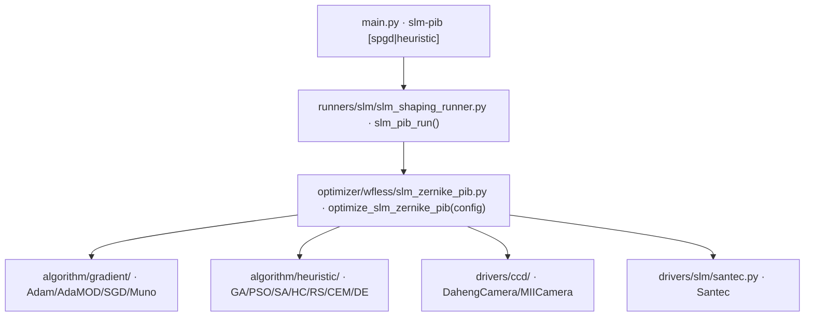

# SLM Zernike PIB 优化 (slm-pib)

> **生成脚本**: [`scripts/generate_slm_pib_report.py`](../../scripts/generate_slm_pib_report.py)
> **复现命令**: `python scripts/generate_slm_pib_report.py`
> **运行环境**: 离线 (纯源码静态分析; 不开设备)

## 1. 这条命令做什么

通过 SLM 加载 Zernike 相位，以 CCD 远场光斑为反馈，优化 Zernike 系数实现 PIB (Power-in-Bucket) 整形。

采用 **dataclass 单参数 API**：`optimize_slm_zernike_pib(config: SlmZernikePibConfig)`，设备由优化器内部自行打开/关闭 (禁止跨 run 复用设备)。

两个子命令：
- `spgd` (默认)：SPGD 梯度优化
- `heuristic`：黑盒启发式搜索 (GA/PSO/SA/HC/RS/CEM/DE)

## 2. 调用关系



## 3. 配置容器 (2026-09 收敛)

```python
@dataclass
class SlmZernikePibConfig:
    center: tuple[int, int]          # 必填
    epochs: int                      # 必填
    camera: CameraParamsPib          # 惰性默认，定义于 runner_common.py
    slm: SlmParamsPib                # 惰性默认
    objective_mode: str = "pib"      # pib/rms_pib/rmse/rmse_out/shape/roi_pib/radius/avg_radiu
    target_shape: str = "circle"
    target_size: int = 0
    n_max: int = 4
    delta: float = 0.2
    lr: float = 0.0
    optimizer_type: str = "adamod"
    zernike_radius: int = 600
    slm_number: int = 1
    slm_wavelength: int = 1064
    shift_x: int = 0
    shift_y: int = 0
    init_c: dict | list | None = None
    load_file: str | None = None
    kwargs: dict = field(default_factory=dict)  # 逃生口
```

**不再接受任何平铺关键字参数 / `cam=` / `slm=`**。

## 4. 算法流程 (SPGD)

1. **初始化**：打开 CCD 与 SLM，读取初始帧定位光斑中心
2. **中心锚定**：`center='auto'` → `argmax` 智能锚定；`center='shape'` → 形状识别
3. **主循环** (每轮 2 帧：`+δ` / `-δ`)：
   - 扰动向量 `u ~ N(0, I)` (维度 = 活动 Zernike 模式数)
   - `c ± δ·u` 下发 SLM (`Santec.create_phase_from_array`)
   - 读 CCD，`_prepare_frame` (去背景+裁剪)
   - 计算目标函数 `J(c)` (PIB / RMS-PIB / RMSE / 形状匹配等)
   - 梯度估计：`g = (J(+) - J(-)) / (2δ) * u`
   - 优化器更新：`c ← optimizer.update(g)`
   - 自适应 δ/LR 调度 (可选)
4. **记录**：每轮标量写 CSV；`--debug` 保存逐轮帧与相位

## 5. 算法流程 (Heuristic)

同一配置容器，算法由 `algorithm` 指定：
- `GA/PSO/CEM/DE`：种群搜索，`pop_size` 控制规模
- `SA/HC/RS`：单轨迹搜索
- 目标函数同 SPGD，但无梯度，直接评估 `J(c)`

## 6. 目标函数 (`objective_mode`)

| 模式 | 说明 |
|------|------|
| `pib` | 桶内功率比 (默认) |
| `rms_pib` | PIB + 桶外 RMS 惩罚 |
| `rmse` | 目标形状 RMSE |
| `rmse_out` | 桶外 RMSE |
| `shape` | 综合形状匹配分 |
| `roi_pib` | ROI 内 PIB |
| `radius` / `avg_radiu` | 半径相关指标 |

## 7. 主要选项

### 共享选项
| 选项 | 说明 | 默认值 |
|------|------|--------|
| `-d, --dir` | 数据保存根目录 | data |
| `--debug` | 调试模式 | False |
| `--seed` | 随机种子 (仅 sim 可复现) | None |
| `--cam_type` | 相机类型 (miicam/daheng/sim) | daheng |
| `--cam_id` | 相机设备 ID | 0 |
| `--exposure_time_ms` | 曝光 ms (0=不固定) | 0 |
| `--cam_size` | 相机开窗大小 | 250 |
| `-c, --center` | 光斑中心检测 (auto/mass/max/shape/centroid_thresh/'x,y') | auto |
| `--auto-exposure` | 自动寻找安全曝光 | False |
| `--objective` | 优化目标 | pib |
| `--target_shape` | 目标形状 (circle/square/...) | circle |
| `--target_size` | 目标尺寸 (像素) | 0 |
| `--r_bucket` | 桶半径 (0=自动) | 0 |
| `--w_uniformity/--w_peak/--w_displacement` | 惩罚权重 | 0 |
| `--zernike_radius` | Zernike 孔径半径 px | 600 |
| `--slm_number` | SLM 设备编号 | 1 |
| `--slm_wavelength` | SLM 波长 nm | 1064 |
| `--n_max` | Zernike 最大阶数 | 4 |
| `--shift_x/--shift_y` | SLM 相位平移 (像素) | 0 |
| `--init_c` | 初始系数 (JSON/逗号分隔) | None |
| `--load_file` | 从文件加载初始系数 | None |

### SPGD 专属
| 选项 | 说明 | 默认值 |
|------|------|--------|
| `-e, --epochs` | 优化迭代次数 | 2000 |
| `--delta` | 扰动幅度 (rad) | 0.2 |
| `--lr` | 学习率 (0=自动) | 0.0 |
| `--optimizer_type` | adam/adamod/sgd/muno | adamod |
| `--shrink_iter` | 收缩半径桶迭代间隔 (0=不收缩) | 0 |
| `--shrink_ratio` | 收缩比例 | 0.9 |
| `--n-eval-frames` | 每次读取平均帧数 | 1 |
| `--fold_ratio` | 亮度折减门控比率 | 0.5 |
| `--noise_gate_k` | 噪声感知更新门 σ 倍数 | 3.0 |
| `--abba-sampling` | 启用 ABBA 采样 (+ - - +) | False |

### Heuristic 专属
| 选项 | 说明 | 默认值 |
|------|------|--------|
| `--algorithm` | ga/pso/sa/hc/rs/cem/de | ga |
| `--pop_size` | 种群大小 | - |
| `--epochs` | 迭代次数 | 2000 |

## 8. 关键实现细节

### `_prepare_frame` (逐帧预处理)
- 减去帧中位数 (去对称读出噪声 DC 偏移)
- `clip(min=0)` (阻止负像素污染 PIB)
- 裁剪到 ROI
- **关键**：直接 `clip(raw, 0)` 会把读出噪声整流成像素计数级 DC 基座 (已知缺陷)，必须**先减中位数再 clip**

### 中心检测
- `auto` = 智能 argmax 锚定 (首帧 argmax，后续跟踪)
- `mass` = 亮度重心 (易被杂散光拉偏)
- `max` = 峰值位置
- `shape` = 形状识别 (阈值分割后质心)
- `'x,y'` = 固定坐标

### 仿真模式
```bash
python src/ao_shaping/main.py slm-pib spgd --cam_type sim --slm_type sim -e 5
```
`--slm_type sim` 必须与 `--cam_type sim` 同时给 (模拟 SLM 只在装上孪生台架后存在)。

## 9. 输出契约

- `data/slm_pib/<日期>/`：优化历史 CSV、`best_coeffs.npy`、`best_phase.npy` (raw 弧度)、最优远场图 PNG
- `--debug`：逐轮 CCD 帧、相位图、Recorder pkl

## 10. 单位约定 (红线)

- 优化器内部系数：**raw 弧度** (非波长、非 µm)
- `generate_zernike_phase` 输出 raw 弧度 → `Santec.create_phase_from_array()` 内部 mod 2π → 灰度
- **禁止**在优化器层做 `mod 2π` 或 min-max 归一化