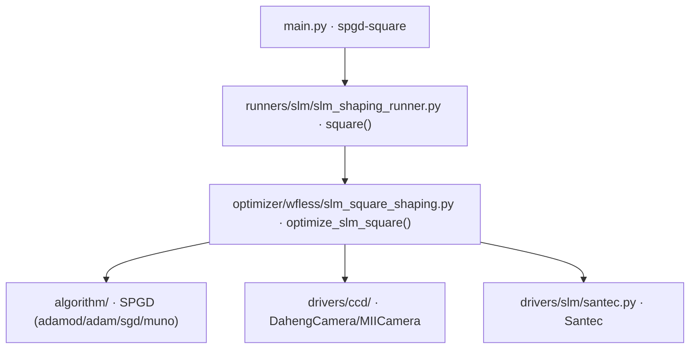

# SLM 方形光斑 SPGD 整形 (spgd-square)

> **生成脚本**: [`scripts/generate_spgd_square_report.py`](../../scripts/generate_spgd_square_report.py)
> **复现命令**: `python scripts/generate_spgd_square_report.py`
> **运行环境**: 离线 (纯源码静态分析; 不开设备)

## 1. 这条命令做什么

通过 SPGD (随机并行梯度下降) 优化 Zernike 系数或自由相位网格，将远场光斑整形为**均匀方形** (SLM+CCD 闭环)。

与 `slm-pib` 共享 runner (`slm_shaping_runner.py`)，通过 `square` 子命令区分。

目标方形边长：
- 显式指定：`--target-side` (像素)
- 自动推导：`--target-mean-brightness` > 0 时按总亮度能量守恒自动推导边长

两种相位参数化 (`--basis`)：
- `zernike` (默认)：Zernike 系数 (radius=600 + defocus + spherical 初始化)
- `freeform`：自由相位网格 (grid×grid，可合成真正方形)

## 2. 调用关系



## 3. 目标函数 (质量评分)

```
score = w_uniformity * (1 - CV) + w_efficiency * EE + w_aspect * (1 - |AR - 1|)
```

- **CV** (变异系数)：目标框内亮度均匀性，越小越好
- **EE** (环绕能量)：目标框内能量占总能量比，越大越好
- **AR** (宽高比)：目标框宽高比，越接近 1 越好

> **红线**：目标函数**必须包含能量项 (EE)**。仅优化 `-CV` 会把能量推出目标框 (硬件实测 EE→0.002)。

## 4. 算法流程

1. **初始化**：打开 CCD 与 SLM，读取平场帧定位 0 阶中心
2. **ROI 锁定**：首帧 `argmax` 定位 0 阶，**冻结方形 ROI** (不随迭代移动)
3. **初始相位**：
   - `zernike`：defocus (Noll 4) + spherical (Noll 11) 初始系数
   - `freeform`：零相位或加载 `--init-coeffs`
4. **主循环** (每轮 2 帧 SPGD)：
   - 生成扰动向量 `u` (Zernike 模式数 / grid² 维)
   - `phase ± δ·u` 下发 SLM
   - 读 CCD，`_prepare_frame` (去背景+裁剪到冻结 ROI)
   - 计算 CV, EE, AR → 综合 `score`
   - 梯度估计：`g = (score(+) - score(-)) / (2δ) * u`
   - 优化器更新参数
   - 记录最优相位与分数
5. **输出**：最优相位 (raw 弧度)、最优远场图、历史 CSV

## 5. 主要选项

| 选项 | 说明 | 默认值 |
|------|------|--------|
| `-e, --epochs` | 优化迭代次数 | 2000 |
| `-n, --n-max` | Zernike 最大径向阶数 | 4 |
| `-c, --center` | 光斑中心检测 (shape/centroid_thresh/max/mass/'x,y') | shape |
| `--target-side` | 目标方形边长 (px, 0=自动) | 0 |
| `--target-mean-brightness` | 目标平均亮度 (>0 时自动推导边长) | 0 |
| `--side-factor` | 自动边长倍率 | 1.5 |
| `-d, --delta` | 扰动幅度 (rad)。省略=0.1+自适应调度；显式给值则固定 | 省略 |
| `--lr` | 学习率 (0=自动) | 0 |
| `--optimizer` | adam/adamod/sgd/muno | adamod |
| `--target-brightness` | 目标最大亮度 | 200 |
| `--w-uniformity` | 均匀性权重 | 0.4 |
| `--w-efficiency` | 能量效率权重 | 0.6 |
| `--w-aspect` | 宽高比权重 | 0.0 |
| `--basis` | 相位参数化 (zernike/freeform) | zernike |
| `--phase-grid` | freeform 网格边长 (dim=grid²) | 24 |
| `--zernike-radius` | Zernike 孔径半径 px | 600 |
| `--zernike-mask` | 参与优化的 Zernike 模式 mask (Noll 1-3 强制 0) | - |
| `--rotation-search` | SLM↔相机旋转搜索范围 (度, 0=关闭) | 0 |
| `--init-defocus` | 初始 Defocus (2,0) 系数 | 1.0 |
| `--init-spherical` | 初始 Spherical (4,0) 系数 | 0.5 |
| `--init-coeffs` | 初始系数 JSON (Noll 索引 dict/数组) | - |
| `--save-best-image` | 保存最优远场图 PNG | False |
| `--seed` | 随机种子 | None |
| `--show` | 显示中间图像 | False |

## 6. 仿真模式 (2026-10-05 真正接线)

```bash
# 无硬件仿真
python src/ao_shaping/main.py spgd-square --cam_type sim --slm_type sim -e 5
```

- `--cam_type sim` / `--slm_type sim` 走 2f-Fourier 数字孪生
- 必须**同时给**两个 flag，否则报 UsageError
- ⚠️ `--debug` 产物目前只有 `--basis freeform` 能进 `ml/hwdataset` 语料

## 7. 曝光默认值陷阱 (红线)

> **`--exposure-ms 0` = "不固定"，不是"自动安全"**
> 
> `drivers/ccd/common.py::resolve_initial_exposure` 分派：
> - `>0` → 固定该值
> - `0` + `--target-max-brightness>0` → 真正自动曝光
> - `0` + 无目标亮度 → `("keep", 0.0)` 交给驱动
> 
> **大恒驱动会把越界值钳到量程端点**，于是 `0` 实际变成**设备最小值 ~0.02 ms** —— 比本台可用区间 0.4–1.5 ms 暗 20–75 倍。
> 
> **上机前必须显式传入按当前激光功率实测的曝光** (本台架参考 1.5 ms)。

## 8. 关键反模式 (红线)

| 反模式 | 后果 | 正确做法 |
|--------|------|----------|
| 低阶 Zernike (n≤4) 合成方形 | 物理上无法合成方形远场 (需 2D-sinc/高频) | 用 `freeform` 全像素自由度 |
| 仅优化 `-CV` 无 EE 项 | 能量被推出目标框 (EE→0.002) | 必须含 `w_efficiency > 0` |
| 每轮 `argmax` 重定位 ROI | 斑粒场下全局最大值跳变 → 指标不连续 | 首帧定位后**冻结 ROI** |
| 原始 CCD 帧直接算指标 | 读出噪声负像素 → PIB>1、CV 被污染 | `_prepare_frame` 先减中位数再 clip≥0 |

## 9. 输出契约

- `data/slm_square_shaping/<日期>/`：历史 CSV、`best_phase.npy` (raw 弧度)、最优远场图 PNG
- `--debug`：逐轮帧、相位、Recorder pkl

## 10. 三个等价入口

```bash
python src/ao_shaping/main.py spgd-square ...
python src/ao_shaping/main.py slm-pib square ...   # 同一 runner 的 square 子命令
python -m ao_shaping.runners.slm.slm_shaping_runner square ...
```