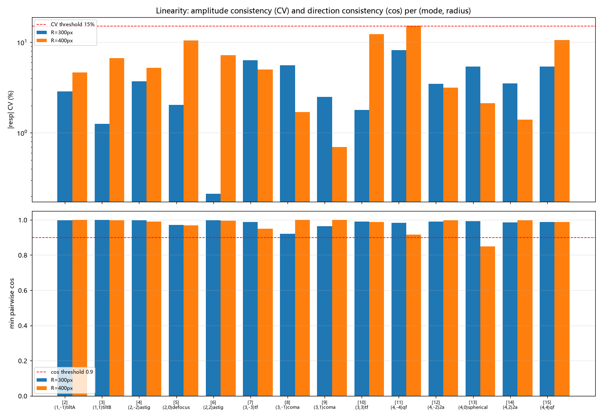
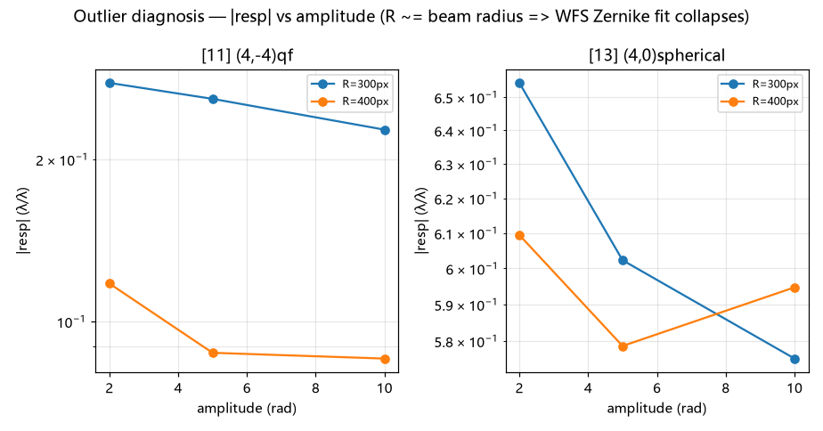
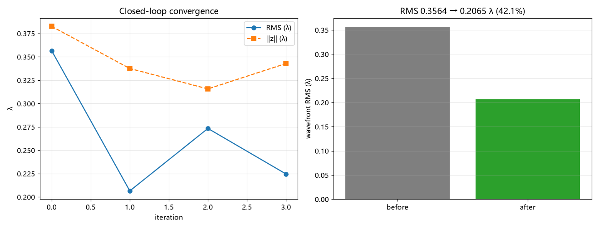
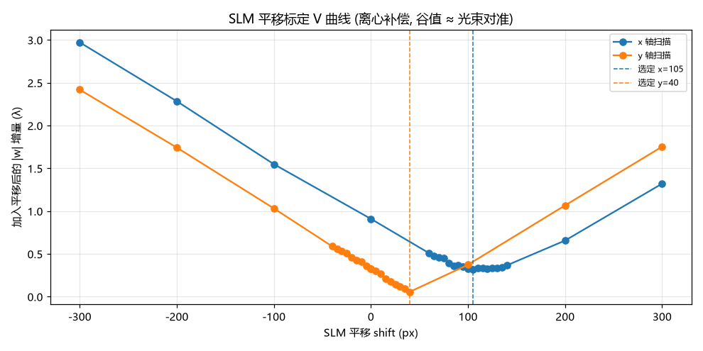
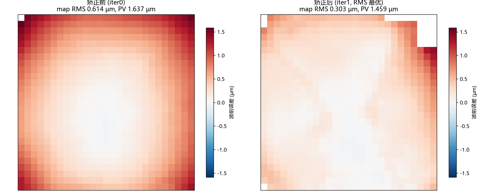
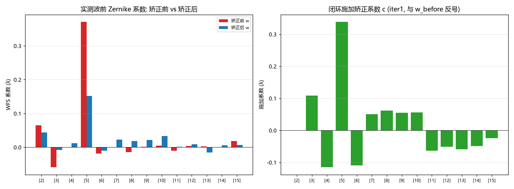
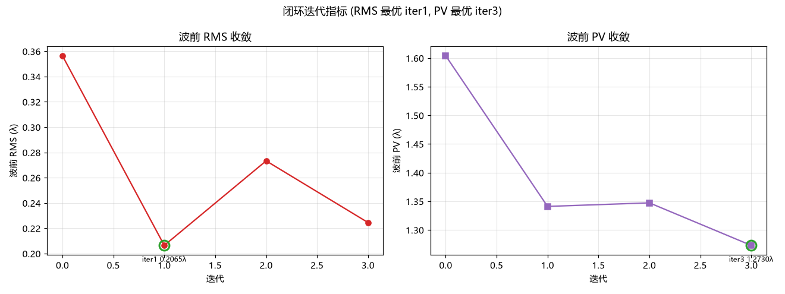

# Zernike 响应矩阵报告 (创建 / 分析 / 检测)

**生成时间**: 2026-09-16 10:32:53  
**数据源**: `zm_recal_532_20260916.h5`, `report_20260916_004944.json`, `raw_scan_20260916_004944.json`

## 1. 创建 (Creation)

响应矩阵由 `tools/slm/slm_zernike_response.py` 以**推拉法**标定: 对每个 SLM Zernike 模式施加 ±A 扰动, 测 WFS Zernike 读数增量, `matrix[wfs_coeff, slm_mode] = Δ(WFS)/Δ(SLM 幅度)`。

| 项 | 值 |
|---|---|
| 设备 | SLM #23020026 + WFS M01219666 |
| 波长 / 2π 灰度 | 532 nm / 998 |
| SLM shift | [105, 40] |
| Zernike 半径 | 300.0 px |
| 扰动幅度 | 3.00 rad (0.4775 λ) |
| 推拉循环 / 帧平均 | 2 / 2 |
| WFS pupil | center=(-0.145, 0.175) mm, diameter=(3.749, 4.171) mm |
| 参考平面 | custom user ref @ flat phase (shift 已应用) |
| 矩阵形状 | (66, 14) (WFS × SLM) |
| SLM 模式 (DLL 索引) | [2, 3, 4, 5, 6, 7, 8, 9, 10, 11, 12, 13, 14, 15] |

### 1.1 设备参数 (SLM / WFS)

| SLM | 值 |
|---|---|
| 序列号 | 23020026 |
| 工作波长 | 532 nm |
| **最大相位 (2π)** | 6.283185307179586 rad = 1.0 λ (2π 灰度 = 998) |
| **工作温度** | [1.0, 61.3] °C (驱动板, 选件板) |
| 固件版本 | DLL:0250,Drive:,Option:0321,FPGA:0110 |
| 面板分辨率 | [1920, 1200] |
| 平移 shift | (105, 40) |
| 视频模式 | 0 (0=memory) |
| 波前矫正 | enabled=True, csv=D:\Projects\TIFO\AO-shaping\data\calibration\Wavefront_correction_Data_240236000006(520nm).csv |
| LUT | loaded=False, dir=None |

| WFS | 值 |
|---|---|
| 序列号 | M01219666 |
| 设备 / 厂商 / 型号 | WFS40-5C / Thorlabs / WFS |
| **曝光时间** | 3.9842571428571434 ms |
| **pupil 中心** | [-0.18211834716796876, 0.21564723205566405] mm |
| **pupil 直径** | [3.605471949213099, 3.8433362866785417] mm |
| MLA | MLA150M-5C (index 3) |
| 子孔径数 | 27 × 27 |
| 参考平面 | use_custom_ref=False |

> ⚠️ **索引约定**: 矩阵行 = DLL 系数索引 (**顺序 m 枚举, 非标准 Noll**); `[5](2,0)defocus` `[9](3,1)coma` `[13](4,0)spherical`。手册佐证 `roCMm` "derived from Zernike coefficient Z[5]"。

## 2. 分析 (Analysis)

### 2.1 响应矩阵热图

绿框 = 对角线 (同索引 SLM 模式 → WFS 系数)。

### 2.2 对角主导性

**9/14** 个模式的列主导项即对角线项。

### 2.3 奇异值谱 / 条件数

条件数 **8.18** (良态, 伪逆稳定)。

### 2.4 重复性方差

平均方差 **8.647e-06**, 最大 **7.226e-04**。

### 2.5 线性度 (多尺寸扫描)

**正确判据**: 响应已按单位幅度归一化 → 线性响应表现为 `|resp|` **恒定**, 故用幅度离散度 **CV** 与响应向量方向一致性 **cos** (原 slope/R² 判据在线性时 slope≈0, 无意义)。

| 模式 | 尺寸 R(px) | CV(%) | cos_min | 判定 |
|---|---|---|---|---|
| [2] (1,-1)tiltA | 300 | 2.9 | 0.998 | ✅ |
| [2] (1,-1)tiltA | 400 | 4.6 | 0.999 | ✅ |
| [3] (1,1)tiltB | 300 | 1.3 | 0.999 | ✅ |
| [3] (1,1)tiltB | 400 | 6.7 | 0.997 | ✅ |
| [4] (2,-2)astig | 300 | 3.7 | 0.997 | ✅ |
| [4] (2,-2)astig | 400 | 5.2 | 0.989 | ✅ |
| [5] (2,0)defocus | 300 | 2.0 | 0.971 | ✅ |
| [5] (2,0)defocus | 400 | 10.5 | 0.969 | ✅ |
| [6] (2,2)astig | 300 | 0.2 | 0.997 | ✅ |
| [6] (2,2)astig | 400 | 7.2 | 0.995 | ✅ |
| [7] (3,-3)tf | 300 | 6.3 | 0.988 | ✅ |
| [7] (3,-3)tf | 400 | 5.0 | 0.948 | ✅ |
| [8] (3,-1)coma | 300 | 5.5 | 0.920 | ✅ |
| [8] (3,-1)coma | 400 | 1.7 | 0.999 | ✅ |
| [9] (3,1)coma | 300 | 2.5 | 0.963 | ✅ |
| [9] (3,1)coma | 400 | 0.7 | 0.999 | ✅ |
| [10] (3,3)tf | 300 | 1.8 | 0.991 | ✅ |
| [10] (3,3)tf | 400 | 12.3 | 0.988 | ✅ |
| [11] (4,-4)qf | 300 | 8.2 | 0.982 | ✅ |
| [11] (4,-4)qf | 400 | 15.2 | 0.916 | ❌ |
| [12] (4,-2)2a | 300 | 3.5 | 0.990 | ✅ |
| [12] (4,-2)2a | 400 | 3.1 | 0.996 | ✅ |
| [13] (4,0)spherical | 300 | 5.4 | 0.993 | ✅ |
| [13] (4,0)spherical | 400 | 2.1 | 0.848 | ❌ |
| [14] (4,2)2a | 300 | 3.5 | 0.986 | ✅ |
| [14] (4,2)2a | 400 | 1.4 | 0.997 | ✅ |
| [15] (4,4)qf | 300 | 5.4 | 0.987 | ✅ |
| [15] (4,4)qf | 400 | 10.6 | 0.986 | ✅ |

## 3. 检测 (Detection)

### 3.1 异常点诊断

**根因**: Zernike 半径 ≈ 光束半径 (实测 200px) 时, 大幅度高阶模式把子孔径光斑推出有效区 → DLL Zernike 拟合崩溃, `|resp|` 暴涨 (实测最高 4288)。故标定应取 **R ≈ 1.5×光束半径**。

### 3.2 离线反解验证

合成像差 `[5]defocus=+0.30λ, [9]coma=−0.20λ` → 反解 `c = pinv(M) @ w`, 残差 ‖Mc−w‖=0.0326 / ‖w‖=0.3606 → **降低 91.0%**。

### 3.3 实测闭环矫正

恢复 WFS 内部参考后, 矫正前 RMS=0.3564λ → 矫正后 0.2065λ (**42.1%**)。

> 本矩阵即 R=300px 重标定的**同源闭环**实测 (SLM 移位标定 → 半径诊断 → 闭环矫正为同一次运行): R=200 污染矩阵仅 13.8% (见 `docs/slm/report2.md`), 改用 R≈300px 后改善显著。波前图 / 系数变化 / RMS-PV 对比见 §3.4。

### 3.4 离心矫正前后波前像差对比

光束在 SLM 面板上**偏离光学轴 (离心)**。矫正前先做 **SLM 平移标定** (扫描图案相对光束的平移量, 取 V 曲线谷值), 之后所有矫正相位都在同一**同心**坐标系下生成。

平移标定 V 曲线 (共 48 个扫描点): 选定 shift = **[105, 40]** px, 即矫正相位下发时的平移基准 (与 §1.1 的 SLM shift 一致)。

- **波前 RMS** 0.3564λ → **0.2065λ** (iter1, 降低 42.1%); **PV** 1.6040λ → **1.2730λ** (iter3, 降低 20.6%)。
- **两指标最优帧不一致**: RMS 最优于 iter1、PV 最优于 iter3 (显式标注, 避免误读单一 after 值; RMS 最优时 PV 尚在回落)。
- **原始波前图** (图 10, 含倾斜/高阶项, 单位 µm): map RMS 0.614 → 0.303 µm; 与 Zernike 拟合 RMS (λ) 不同量纲, 两者下降幅度一致 (约减半)。
- **系数变化** (图 11): 实测 w 前 14 项 (DLL 2..15) 的 RMS 差 = 0.0625λ; 施加的 c 与 w_before 反号, 符合 `c = −pinv·w` 抵消约定。

## 4. 结论与解读

### 4.1 矩阵质量

- **形状** `(66, 14)` = (WFS 系数 66) × (SLM 模式 14)。其中**有效列 14/14** —— 被线性度门控剔除的模式列已置零, 使用时应跳过 (其系数恒为 0)。
- **有效列条件数 `8.18`** —— 越接近 1 越良态, 伪逆越稳定。含零列时直接 `np.linalg.cond` 会因零奇异值爆到 1e18, 故此处只统计有效列 (`slm_zernike_common.effective_cond`)。
- **平均重复方差 `8.647e-06`** —— 推拉循环间的读数散布; 最大 `7.226e-04`。数量级 1e-5 ~ 1e-6 表示重复性良好。

### 4.2 物理合理性

- **对角主导 9/14**: 每个 SLM Zernike 模式应主要激励 WFS 的**同索引**系数 (标定正确性的核心判据)。非对角项来自 (a) 平移引入的低阶耦合 (尤其 piston 行) 与 (b) 光束仅覆盖图案中心区导致的高阶→低阶投影。
- **piston 行数值大是正常的**: 相位图案平移会把常数项注入, 使 WFS 的 piston 读数随模式变化; 但 piston 是**参考平面偏置, 不可也无需矫正**, 故闭环反解前 必须把 `w[0]` 置零 (见 §3.2)。

### 4.3 线性度

- 多尺寸扫描中 **26/28** 个 (模式, 尺寸) 组合通过线性度判据 (CV<15% 且方向 cos>0.9)。未通过者集中在**弱耦合**情形 (R 大 / 高阶模式), 其响应幅度与残差基线同量级, 属噪声受限而非真实非线性。
- 判据用 **CV + 方向余弦**而非 slope/R²: 响应已按单位幅度归一化, 线性响应表现为 `|resp|` **恒定** (slope≈0), 故 slope/R² 在此无意义。

### 4.4 反解能力 (离线)

- 合成像差 `[5]defocus=+0.30λ, [9]coma=−0.20λ` 经 `c = pinv(M) @ w` 反解, 残差 ‖Mc−w‖=0.0326 / ‖w‖=0.3606 → **降低 91.0%**。这是**该矩阵的理论天花板** (受限于 span(M) 覆盖度与条件数)。
- 符号约定: `c = −pinv·w` (加负号才抵消像差); 用 `+pinv` 会使像差翻倍。

### 4.5 实测闭环

- 恢复 WFS 内部参考后加载矫正相位, RMS 0.3564 → 0.2065λ (**42.1%**), PV 1.6040 → 1.2730λ.
- 注意 `after_rms` 取 iter1 (RMS 最优 0.2065λ), 而 `after_pv` 取 iter3 (PV 最优 1.2730λ) — 两指标最优帧不同, 见 §3.4 图 12。
- 实测低于 §4.4 的离线上限: 合成像差仅 2 个非零模式且落在 span(M) 内, 实测 w 却散布全部 66 项、仅前 14 项可控 → 残余主要来自**不可控的高阶项**。模型自检 `model_ratio = ‖Mc‖/‖w‖` 逐帧 (iter1=0.35, iter2=1.22, iter3=0.95): iter1 过冲 (0.35), iter2 欠冲 (1.22), iter3 收敛 (≈1.0)。

### 4.6 使用注意

- **单位**: 本矩阵为 **λ/λ** (WFS 系数 µm 经 `um_to_waves` 换算)。反解得到的 `c` 是**波长(λ)**, 但 `PatternHelper.generate_zernike_polynomial` / `make_phase` 收**弧度** → 加载前必须 `× 2π` (漏此换算会使相位缩小 6.28×)。
- **半径一致性**: 矫正相位必须以**矩阵标定时的同一 Zernike 半径**生成, 否则归一化不匹配会按 `(R_cal/R_use)²` 缩放系数。
- **索引**: 行 = DLL 顺序 m 枚举 (非标准 Noll); 列 = SLM 模式 DLL 索引。

## 5. 产物

| 产物 | 路径 |
| 响应矩阵 h5 | `D:\Projects\TIFO\AO-shaping\data\zernike_response_matrix\zm_recal_532_20260916.h5` |
| 矩阵 + 原始读数 json | `D:\Projects\TIFO\AO-shaping\data\zernike_response_matrix\zm_recal_532_20260916.json` |
| 多尺寸扫描报告 | `D:\Projects\TIFO\AO-shaping\data\zernike_correction\report_20260916_004944.json` |
| 多尺寸原始扫描 | `D:\Projects\TIFO\AO-shaping\data\zernike_correction\raw_scan_20260916_004944.json` |
| 标定工具 | `src/ao_shaping/tools/slm/slm_zernike_response.py` |
| 三阶段工具 | `src/ao_shaping/tools/slm/slm_zernike_correction.py` |
| 共享模块 | `src/ao_shaping/tools/slm/slm_zernike_common.py` |
