# Zernike 相位 → WFS 读数分布报告

**实验日期**: 2026-09-15  
**设备**: SLM #22030102 (532nm, 2π=998 gray) + WFS M01219666  
**SLM shift**: `(106, 40)` — defocus 零点法标定 (`slm_shift_calib.py`)  
**WFS 曝光**: 3.984 ms (≤ 7ms)  
**WFS pupil**: center=(-0.153, 0.185) mm, diameter=(3.621, 3.876) mm

## 1. 实验设置

在标定后的最优 SLM 相位中心 shift 下, 逐一加载不同 **Zernike 模式 / 尺寸 (radius) / 幅度 (amplitude)**, 采集 SLM 相位 (弧度源 + 实际上屏灰度) 与 WFS 读取 (spots 图像 + 相位图/波前 + Zernike 分布)。

- **SLM 相位**由 `PatternHelper.generate_zernike_polynomial()` 生成 (与 `multi_slm_controller` GUI 同一调用链); **上屏图案**为 `create_phase_from_array()` 的输出 (弧度→灰度 + mod 2π + 平移 `(106,40)`)。
- **WFS 读取** `get_zernike(order=10)` → 67 长数组 (`z_um[i]`, index 0 未用, DLL 填 `coeff[1..66]`), 单位 µm, 换算 λ (÷0.532)。**注意** `orders` 有效值 0=auto 或 2..10, 传 15 会失败。
- **⚠️ Zernike 索引不是标准 Noll 1976**: DLL 用**顺序 m 枚举** (`m = -n..+n`): `[1](0,0) [2](1,-1) [3](1,1) [4](2,-2) [5](2,0)defocus [6](2,2) [9](3,1)coma [13](4,0)spherical`。官方手册佐证: `roCMm` "derived from Zernike coefficient **Z[5]**" (球面波 RoC ← defocus)。硬件实测 4 项吻合: (2,0)→[5], (2,2)→[6], (3,1)→[9], (4,0)→[13]。
- **参考平面**: 以**纯平相位**建用户参考 (`create_default_user_ref()` + `set_ref_plane(custom=True)`), 故读数反映**加载相位相对纯平的增量**, 不含系统静态像差。
- 每用例两张图: **SLM 相位图** (弧度源 | 上屏灰度) 与 **WFS 读取图** (spots | 相位图/波前 | Zernike 分布 | 关键指标)。

## 2. 汇总表

| # | 用例 | 模式 (n,m) | R(px) | A(rad) | 相位 PV(rad) | WFS RMS(λ) | WFS PV(λ) | [2] tiltA(λ) | [3] tiltB(λ) | [5] defocus(λ) | ‖z[2-6]‖(λ) |
|---|---|---|---|---|---|---|---|---|---|---|---|
| 0 | `flat` | — | — | — | — | 0.1013 | 0.4868 | 0.0693 | 0.1068 | 0.0037 | 0.1276 |
| 1 | `tilt_n1m1` | (1,1) | 600 | 10.0 | 40.0 | 0.5225 | 2.2005 | 0.1016 | 0.7882 | 0.0054 | 0.7953 |
| 2 | `defocus_n2m0` | (2,0) | 600 | 10.0 | 34.6 | 0.2310 | 1.0909 | 0.0986 | 0.1389 | -0.2483 | 0.3013 |
| 3 | `astig_n2m2` | (2,2) | 600 | 10.0 | 48.9 | 0.2088 | 1.0055 | 0.0771 | 0.1155 | 0.0136 | 0.2978 |
| 4 | `coma_n3m1` | (3,1) | 600 | 10.0 | 56.5 | 0.7762 | 2.5434 | 0.0382 | -1.3946 | -0.0142 | 1.3954 |
| 5 | `spherical_n4m0` | (4,0) | 600 | 10.0 | 33.5 | 0.7148 | 3.0362 | 0.0258 | 0.0711 | 0.8696 | 0.8753 |
| 6 | `defocus_R300` | (2,0) | 300 | 10.0 | 34.6 | 0.7956 | 3.0678 | 0.1382 | 0.2108 | -0.9408 | 0.9742 |
| 7 | `defocus_R900` | (2,0) | 900 | 10.0 | 34.6 | 0.1372 | 0.7785 | 0.0868 | 0.1125 | -0.0760 | 0.1631 |
| 8 | `defocus_A2` | (2,0) | 600 | 2.0 | 6.9 | 0.0939 | 0.5620 | 0.0816 | 0.1198 | -0.0181 | 0.1475 |
| 9 | `defocus_A20` | (2,0) | 600 | 20.0 | 69.3 | 0.4352 | 1.9562 | 0.1287 | 0.1434 | -0.4886 | 0.5253 |

## 3. 各用例详情

### 3.0 `flat`

- **模式**: —  
- **尺寸 (Zernike radius)**: — px  
- **幅度**: — rad  
- **相位 PV**: — rad  
- **WFS RMS / PV**: 0.1013λ / 0.4868λ  
- **Zernike 读数** (λ): [2]tiltA=0.0693, [3]tiltB=0.1068, [5]defocus=0.0037, ‖z[2-6]‖=0.1276  

**① SLM 相位图** — 左: 弧度源相位, 右: 实际上屏灰度图案 (mod 2π + 平移):

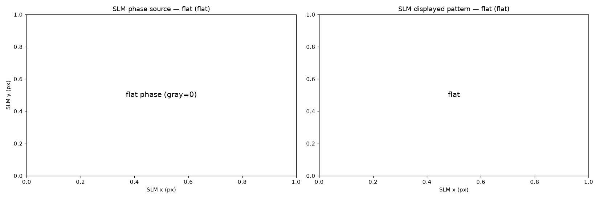

**② WFS 读取图** — spots 图像 / 读取相位图 (波前) / Zernike 分布 / 指标:

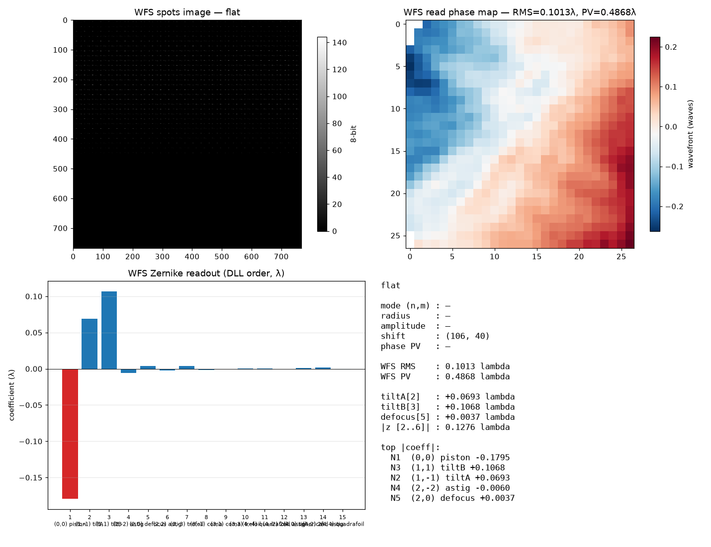

**Zernike 主导项 (|系数| 前 5)**:

| 索引 | 名称 (n,m) | 系数 (λ) |
|---|---|---|
| 1 | (0,0) piston | -0.1795 |
| 3 | (1,1) tiltB | +0.1068 |
| 2 | (1,-1) tiltA | +0.0693 |
| 4 | (2,-2) astig | -0.0060 |
| 5 | (2,0) defocus | +0.0037 |

### 3.1 `tilt_n1m1`

- **模式**: (1,1)  
- **尺寸 (Zernike radius)**: 600 px  
- **幅度**: 10.0 rad  
- **相位 PV**: 40.0 rad  
- **WFS RMS / PV**: 0.5225λ / 2.2005λ  
- **Zernike 读数** (λ): [2]tiltA=0.1016, [3]tiltB=0.7882, [5]defocus=0.0054, ‖z[2-6]‖=0.7953  

**① SLM 相位图** — 左: 弧度源相位, 右: 实际上屏灰度图案 (mod 2π + 平移):

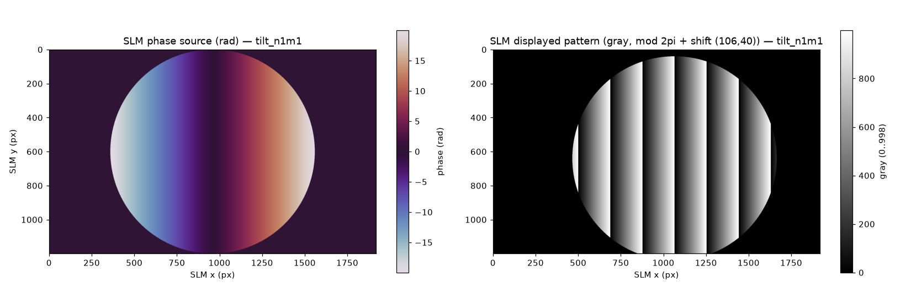

**② WFS 读取图** — spots 图像 / 读取相位图 (波前) / Zernike 分布 / 指标:

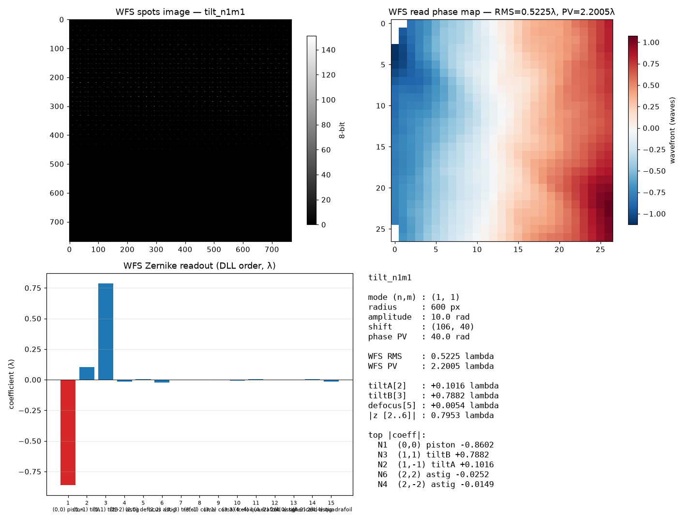

**Zernike 主导项 (|系数| 前 5)**:

| 索引 | 名称 (n,m) | 系数 (λ) |
|---|---|---|
| 1 | (0,0) piston | -0.8602 |
| 3 | (1,1) tiltB | +0.7882 |
| 2 | (1,-1) tiltA | +0.1016 |
| 6 | (2,2) astig | -0.0252 |
| 4 | (2,-2) astig | -0.0149 |

### 3.2 `defocus_n2m0`

- **模式**: (2,0)  
- **尺寸 (Zernike radius)**: 600 px  
- **幅度**: 10.0 rad  
- **相位 PV**: 34.6 rad  
- **WFS RMS / PV**: 0.2310λ / 1.0909λ  
- **Zernike 读数** (λ): [2]tiltA=0.0986, [3]tiltB=0.1389, [5]defocus=-0.2483, ‖z[2-6]‖=0.3013  

**① SLM 相位图** — 左: 弧度源相位, 右: 实际上屏灰度图案 (mod 2π + 平移):

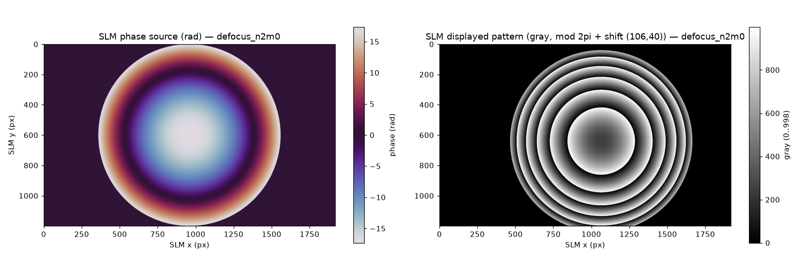

**② WFS 读取图** — spots 图像 / 读取相位图 (波前) / Zernike 分布 / 指标:

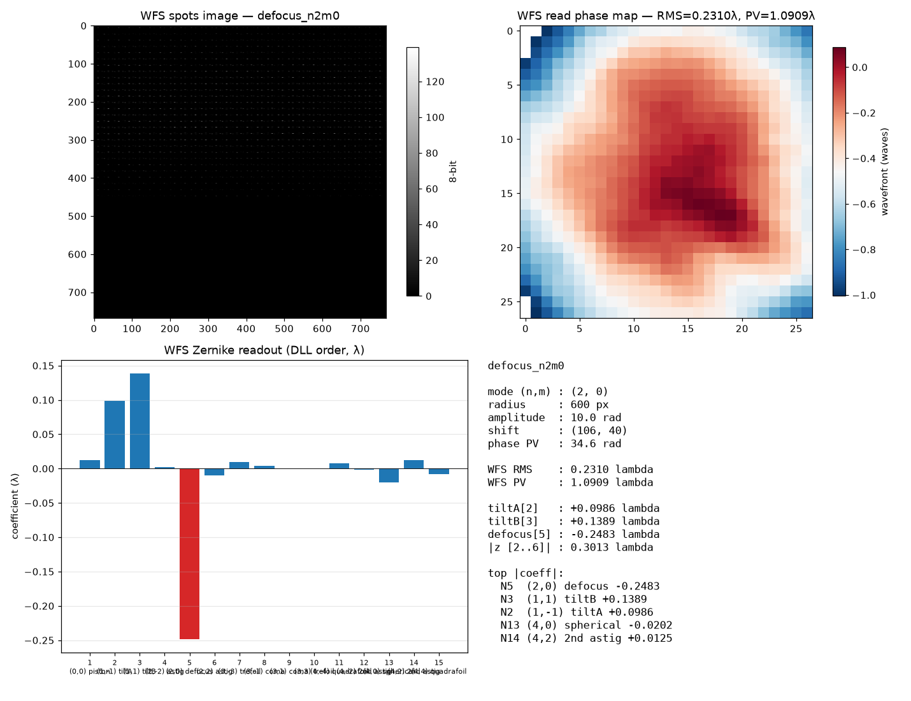

**Zernike 主导项 (|系数| 前 5)**:

| 索引 | 名称 (n,m) | 系数 (λ) |
|---|---|---|
| 5 | (2,0) defocus | -0.2483 |
| 3 | (1,1) tiltB | +0.1389 |
| 2 | (1,-1) tiltA | +0.0986 |
| 13 | (4,0) spherical | -0.0202 |
| 14 | (4,2) 2nd astig | +0.0125 |

### 3.3 `astig_n2m2`

- **模式**: (2,2)  
- **尺寸 (Zernike radius)**: 600 px  
- **幅度**: 10.0 rad  
- **相位 PV**: 48.9 rad  
- **WFS RMS / PV**: 0.2088λ / 1.0055λ  
- **Zernike 读数** (λ): [2]tiltA=0.0771, [3]tiltB=0.1155, [5]defocus=0.0136, ‖z[2-6]‖=0.2978  

**① SLM 相位图** — 左: 弧度源相位, 右: 实际上屏灰度图案 (mod 2π + 平移):

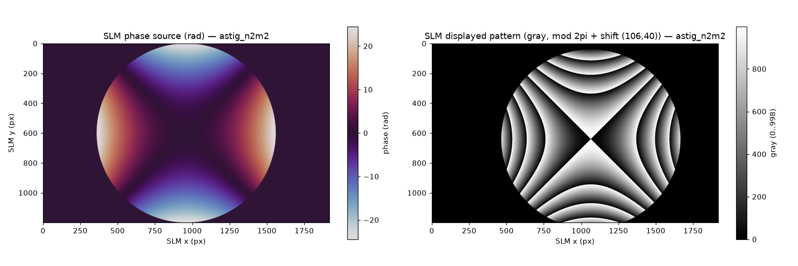

**② WFS 读取图** — spots 图像 / 读取相位图 (波前) / Zernike 分布 / 指标:

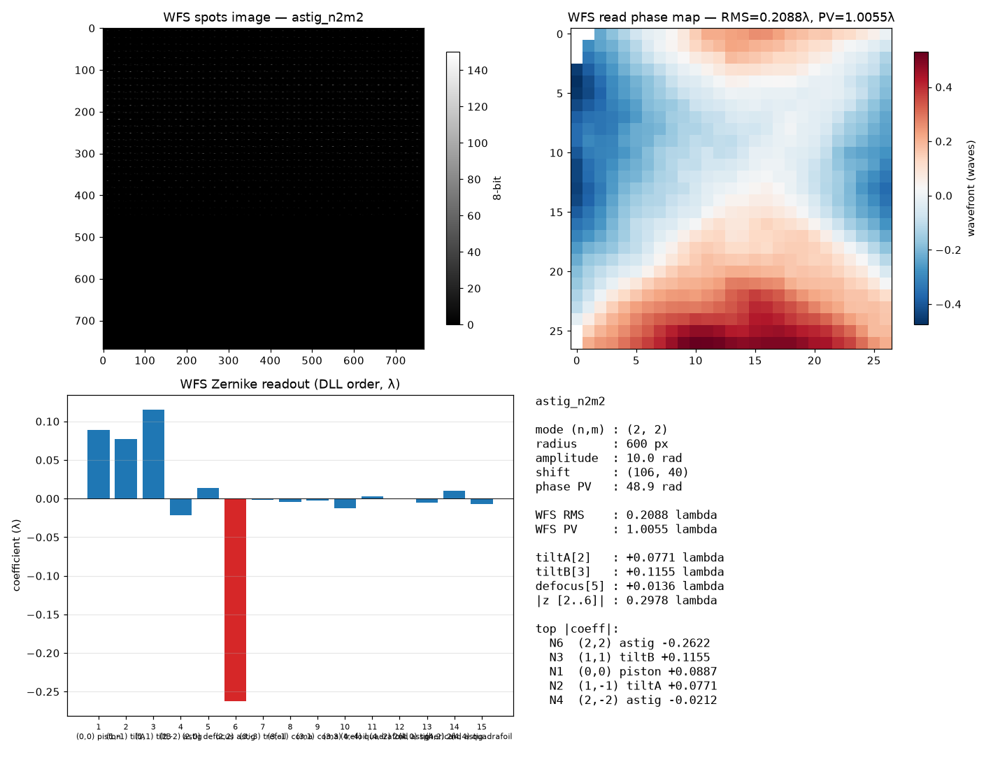

**Zernike 主导项 (|系数| 前 5)**:

| 索引 | 名称 (n,m) | 系数 (λ) |
|---|---|---|
| 6 | (2,2) astig | -0.2622 |
| 3 | (1,1) tiltB | +0.1155 |
| 1 | (0,0) piston | +0.0887 |
| 2 | (1,-1) tiltA | +0.0771 |
| 4 | (2,-2) astig | -0.0212 |

### 3.4 `coma_n3m1`

- **模式**: (3,1)  
- **尺寸 (Zernike radius)**: 600 px  
- **幅度**: 10.0 rad  
- **相位 PV**: 56.5 rad  
- **WFS RMS / PV**: 0.7762λ / 2.5434λ  
- **Zernike 读数** (λ): [2]tiltA=0.0382, [3]tiltB=-1.3946, [5]defocus=-0.0142, ‖z[2-6]‖=1.3954  

**① SLM 相位图** — 左: 弧度源相位, 右: 实际上屏灰度图案 (mod 2π + 平移):

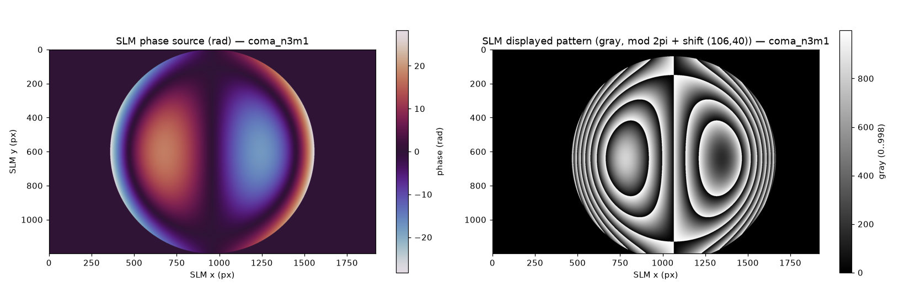

**② WFS 读取图** — spots 图像 / 读取相位图 (波前) / Zernike 分布 / 指标:

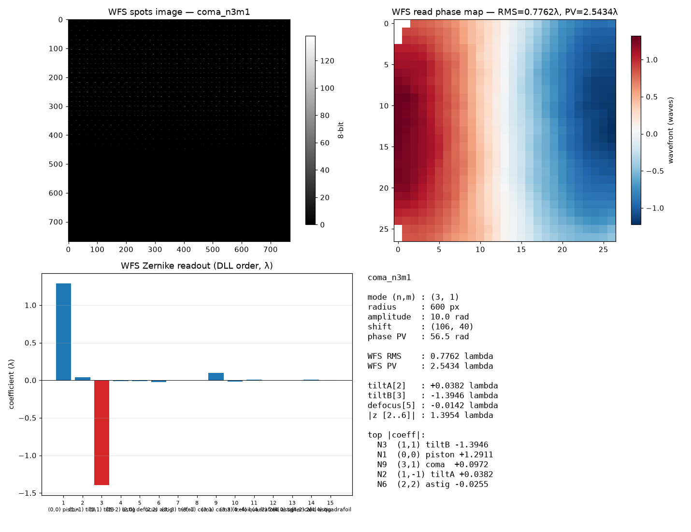

**Zernike 主导项 (|系数| 前 5)**:

| 索引 | 名称 (n,m) | 系数 (λ) |
|---|---|---|
| 3 | (1,1) tiltB | -1.3946 |
| 1 | (0,0) piston | +1.2911 |
| 9 | (3,1) coma | +0.0972 |
| 2 | (1,-1) tiltA | +0.0382 |
| 6 | (2,2) astig | -0.0255 |

### 3.5 `spherical_n4m0`

- **模式**: (4,0)  
- **尺寸 (Zernike radius)**: 600 px  
- **幅度**: 10.0 rad  
- **相位 PV**: 33.5 rad  
- **WFS RMS / PV**: 0.7148λ / 3.0362λ  
- **Zernike 读数** (λ): [2]tiltA=0.0258, [3]tiltB=0.0711, [5]defocus=0.8696, ‖z[2-6]‖=0.8753  

**① SLM 相位图** — 左: 弧度源相位, 右: 实际上屏灰度图案 (mod 2π + 平移):

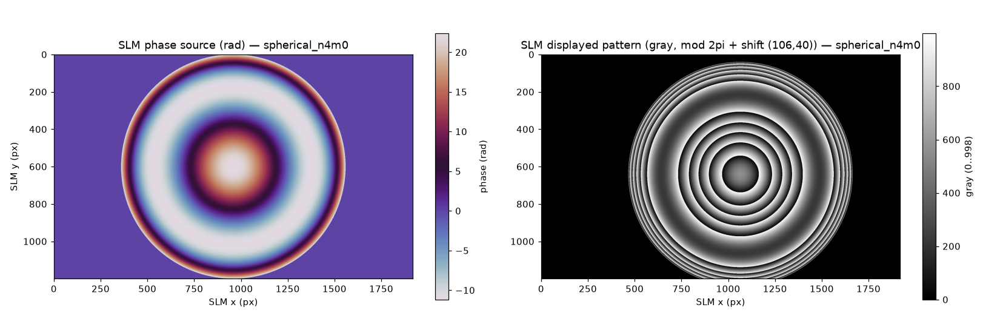

**② WFS 读取图** — spots 图像 / 读取相位图 (波前) / Zernike 分布 / 指标:

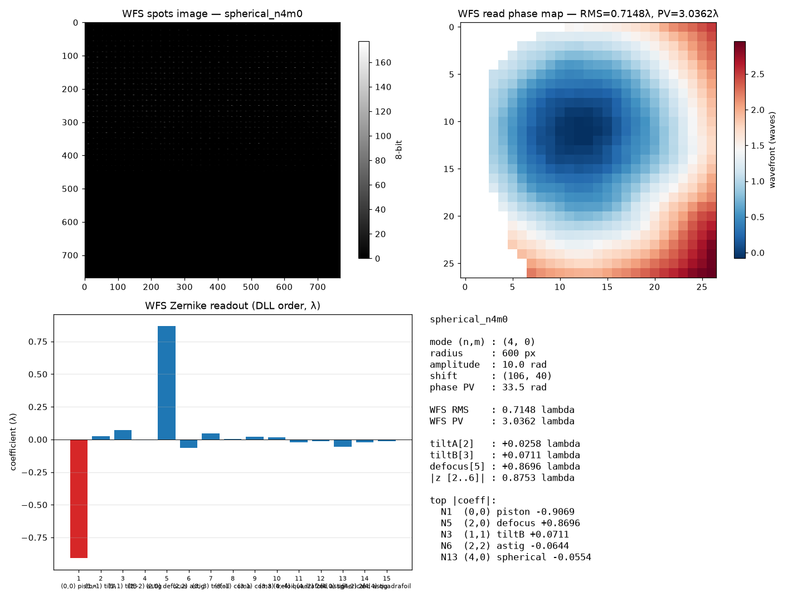

**Zernike 主导项 (|系数| 前 5)**:

| 索引 | 名称 (n,m) | 系数 (λ) |
|---|---|---|
| 1 | (0,0) piston | -0.9069 |
| 5 | (2,0) defocus | +0.8696 |
| 3 | (1,1) tiltB | +0.0711 |
| 6 | (2,2) astig | -0.0644 |
| 13 | (4,0) spherical | -0.0554 |

### 3.6 `defocus_R300`

- **模式**: (2,0)  
- **尺寸 (Zernike radius)**: 300 px  
- **幅度**: 10.0 rad  
- **相位 PV**: 34.6 rad  
- **WFS RMS / PV**: 0.7956λ / 3.0678λ  
- **Zernike 读数** (λ): [2]tiltA=0.1382, [3]tiltB=0.2108, [5]defocus=-0.9408, ‖z[2-6]‖=0.9742  

**① SLM 相位图** — 左: 弧度源相位, 右: 实际上屏灰度图案 (mod 2π + 平移):

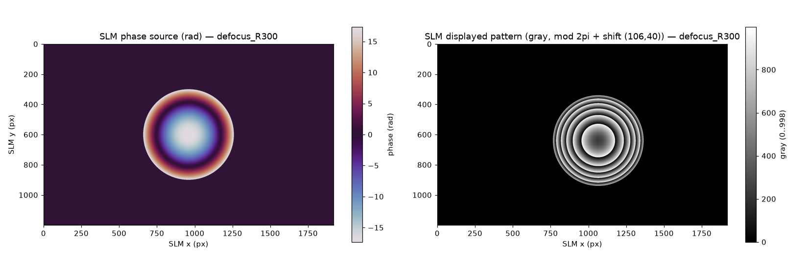

**② WFS 读取图** — spots 图像 / 读取相位图 (波前) / Zernike 分布 / 指标:

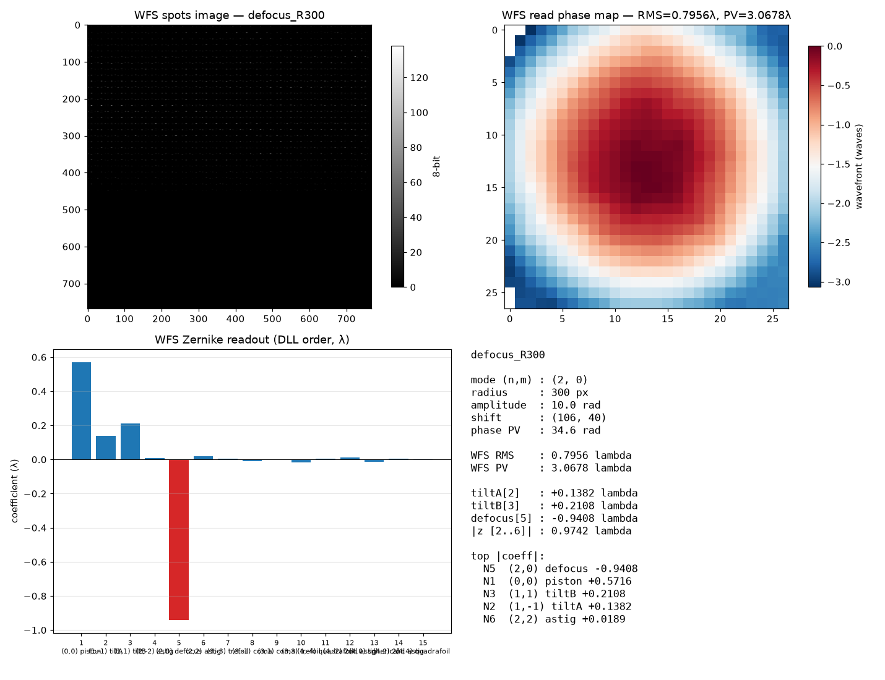

**Zernike 主导项 (|系数| 前 5)**:

| 索引 | 名称 (n,m) | 系数 (λ) |
|---|---|---|
| 5 | (2,0) defocus | -0.9408 |
| 1 | (0,0) piston | +0.5716 |
| 3 | (1,1) tiltB | +0.2108 |
| 2 | (1,-1) tiltA | +0.1382 |
| 6 | (2,2) astig | +0.0189 |

### 3.7 `defocus_R900`

- **模式**: (2,0)  
- **尺寸 (Zernike radius)**: 900 px  
- **幅度**: 10.0 rad  
- **相位 PV**: 34.6 rad  
- **WFS RMS / PV**: 0.1372λ / 0.7785λ  
- **Zernike 读数** (λ): [2]tiltA=0.0868, [3]tiltB=0.1125, [5]defocus=-0.0760, ‖z[2-6]‖=0.1631  

**① SLM 相位图** — 左: 弧度源相位, 右: 实际上屏灰度图案 (mod 2π + 平移):

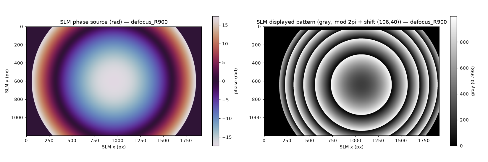

**② WFS 读取图** — spots 图像 / 读取相位图 (波前) / Zernike 分布 / 指标:

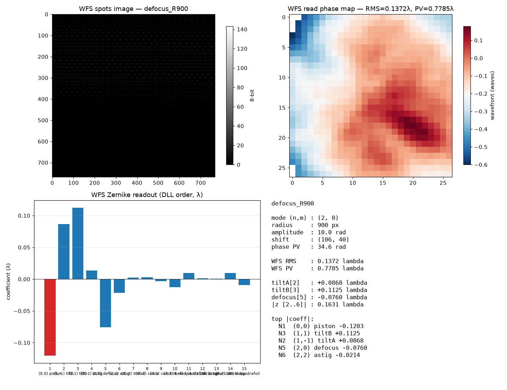

**Zernike 主导项 (|系数| 前 5)**:

| 索引 | 名称 (n,m) | 系数 (λ) |
|---|---|---|
| 1 | (0,0) piston | -0.1203 |
| 3 | (1,1) tiltB | +0.1125 |
| 2 | (1,-1) tiltA | +0.0868 |
| 5 | (2,0) defocus | -0.0760 |
| 6 | (2,2) astig | -0.0214 |

### 3.8 `defocus_A2`

- **模式**: (2,0)  
- **尺寸 (Zernike radius)**: 600 px  
- **幅度**: 2.0 rad  
- **相位 PV**: 6.9 rad  
- **WFS RMS / PV**: 0.0939λ / 0.5620λ  
- **Zernike 读数** (λ): [2]tiltA=0.0816, [3]tiltB=0.1198, [5]defocus=-0.0181, ‖z[2-6]‖=0.1475  

**① SLM 相位图** — 左: 弧度源相位, 右: 实际上屏灰度图案 (mod 2π + 平移):

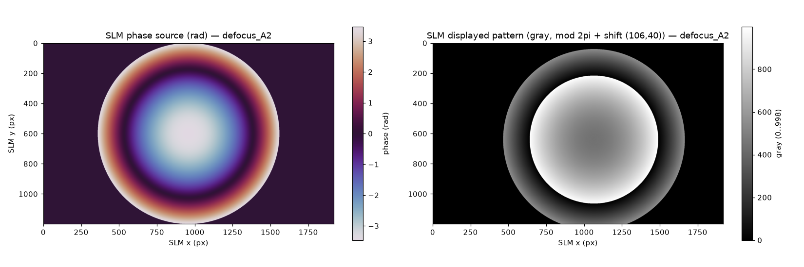

**② WFS 读取图** — spots 图像 / 读取相位图 (波前) / Zernike 分布 / 指标:

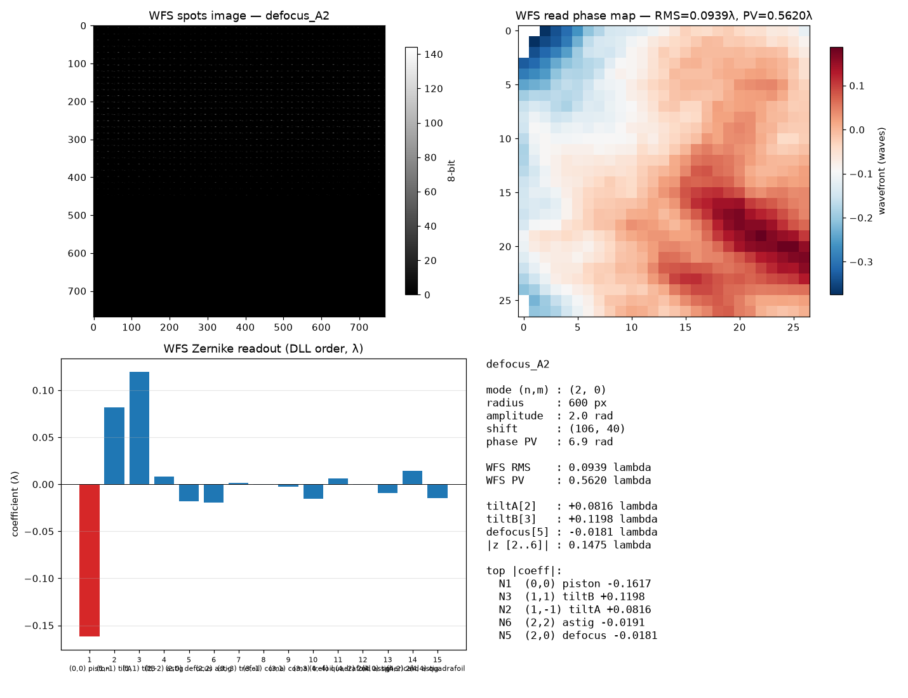

**Zernike 主导项 (|系数| 前 5)**:

| 索引 | 名称 (n,m) | 系数 (λ) |
|---|---|---|
| 1 | (0,0) piston | -0.1617 |
| 3 | (1,1) tiltB | +0.1198 |
| 2 | (1,-1) tiltA | +0.0816 |
| 6 | (2,2) astig | -0.0191 |
| 5 | (2,0) defocus | -0.0181 |

### 3.9 `defocus_A20`

- **模式**: (2,0)  
- **尺寸 (Zernike radius)**: 600 px  
- **幅度**: 20.0 rad  
- **相位 PV**: 69.3 rad  
- **WFS RMS / PV**: 0.4352λ / 1.9562λ  
- **Zernike 读数** (λ): [2]tiltA=0.1287, [3]tiltB=0.1434, [5]defocus=-0.4886, ‖z[2-6]‖=0.5253  

**① SLM 相位图** — 左: 弧度源相位, 右: 实际上屏灰度图案 (mod 2π + 平移):

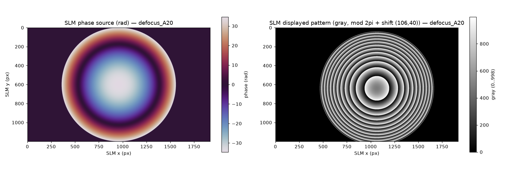

**② WFS 读取图** — spots 图像 / 读取相位图 (波前) / Zernike 分布 / 指标:

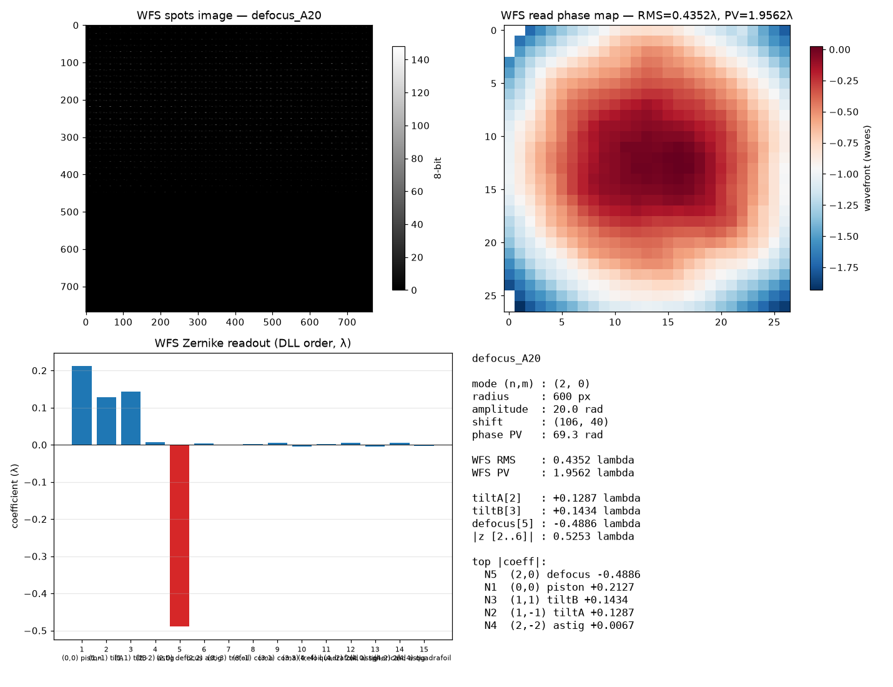

**Zernike 主导项 (|系数| 前 5)**:

| 索引 | 名称 (n,m) | 系数 (λ) |
|---|---|---|
| 5 | (2,0) defocus | -0.4886 |
| 1 | (0,0) piston | +0.2127 |
| 3 | (1,1) tiltB | +0.1434 |
| 2 | (1,-1) tiltA | +0.1287 |
| 4 | (2,-2) astig | +0.0067 |

## 4. 结论与注意

- **pupil 必须先 `wfs.pupil = wfs.optimize_pupil()` 写回**: 硬编码 pupil 会污染 `WFS_ZernikeLsf` 拟合产生假 tip/tilt (详见 `docs/thorlab-wfs/agent.md`)。
- **Zernike 索引 = 顺序 m 枚举 (非标准 Noll)**: defocus=[5], coma(3,1)=[9], spherical(4,0)=[13] —— 驱动 docstring 声称 "Noll 1976" 不准确, 应按本报告映射。
- **Zernike 半径需与光束尺寸匹配**: 光束在 SLM 上半径 ≈200px; radius 远大于它 (如 900px) 时 WFS 读数被 `(r_beam/R)²` 压制 (对比 `defocus_R900` vs `defocus_R300`)。
- **读数含静态系统倾斜残留** (纯平参考下仍有 ~0.2λ 噪声底), 判断相位效果应看相对纯平的**附加**量。
- **SLM 轴 ↔ WFS 轴存在 90° 交换** (实测 SLM-x → z[3] tilt, SLM-y → z[2] tilt), 对位/标定勿假设轴对应。
