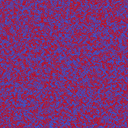
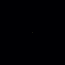

# 可微分光束整形 (Differentiable Beam Shaping) 验证报告

*报告生成时间: 2026-09-08 20:48:33*

## 目录

- [1. 概述](#1-概述)
- [2. 方法](#2-方法)
- [3. 验证1: ASM 数值一致性](#3-验证1-asm-数值一致性)
- [4. 验证2: 收敛性](#4-验证2-收敛性)
- [5. 验证3: 光束质量](#5-验证3-光束质量)
- [6. 问题与解决](#6-问题与解决)
- [7. 推荐配置与 CLI 用法](#7-推荐配置与-cli-用法)
- [8. 复现](#8-复现)

---

## 1. 概述

本报告验证 `src/ao_shaping/algorithm/differentiable_shaping.py` —— 一个基于 PyTorch 梯度下降的 SLM 相位优化模块（1064 nm），用于方形与聚焦光斑整形。将其与 Gerchberg-Saxton (GS) 基线以及**旧的损坏默认权重**进行对比，量化收敛性、光束质量（CV/EE）与数值一致性。

相关代码：算法模块 `src/ao_shaping/algorithm/differentiable_shaping.py`，运行器 `src/ao_shaping/runners/diff_shaping_runner.py`，CLI 命令 `diff-shaping`。

## 2. 方法

损失函数由四项加权组成：

- **均匀性损失 (uniformity)**：目标区域内强度标准差/均值（CV）。
- **效率损失 (efficiency)**：目标区域内能量占比（EE）。
- **零级惩罚 (zero-order)**：中心 5×5 窗口强度占比。
- **平滑正则 (smoothness)**：相位梯度平方均值。

相位初始化为 `0.1 * randn`（小随机噪声，逃离平凡均匀临界点）。传播模型支持 `fft`（Fraunhofer 焦平面）与 `asm`（角谱法）。网格 256×256，cell_spacing 8e-6 m，距离 0.1 m，波长 1064 nm。

### 配置表

| 运行 | 传播 | 优化器 | 迭代 | lr | w_u | w_e | w_z | w_s | seed |
|------|------|--------|------|----|-----|-----|-----|-----|------|
| gs_baseline | fft | gs | 100 | None | None | None | None | None | None |
| old_default | fft | adam | 300 | 0.01 | 0.4 | 0.4 | 0.1 | 0.1 | 1 |
| win_fft | fft | adam | 600 | 0.03 | 0.4 | 0.6 | 0.0 | 0.0 | 1 |
| win_asm | asm | adam | 600 | 0.03 | 0.4 | 0.6 | 0.0 | 0.0 | 1 |
| win_spot | fft | adam | 600 | 0.03 | 0.4 | 0.6 | 0.0 | 0.0 | 1 |
| win_lbfgs | fft | lbfgs | 60 | 1.0 | 0.4 | 0.6 | 0.0 | 0.0 | 1 |

## 3. 验证1: ASM 数值一致性

在 64×64 随机复场上对比 numpy 与 torch 的角谱传播，最大绝对误差 **3.81e-11**（~1e-11 量级），确认 torch 实现与 numpy 参考数值一致。


## 4. 验证2: 收敛性

下图展示 win_fft / win_asm / win_spot 的损失曲线与逐迭代 CV/EE。


## 5. 验证3: 光束质量

### 总览


### 相位图


### 远场强度


### 演化 GIF






### 质量表

| 配置 | CV | EE |
|------|----|----|
| GS baseline | 0.1632 / 0.9477 |
| old_default (broken) | 1.0212 / 0.0727 |
| win_fft | 0.0973 / 0.8431 |
| win_asm | 0.0014 / 0.9014 |
| win_spot | 0.0065 / 0.8440 |
| win_lbfgs | 0.0000 / 0.8704 |


## 6. 问题与解决

### 默认权重 [.4,.4,.1,.1] + lr=1e-2 是坏的

旧默认配置（`w=[.4,.4,.1,.1]`, `lr=1e-2`）无法整形：

- **零级惩罚把能量推出居中目标**：`zero_order_penalty` 惩罚中心 5×5 窗口，而方形目标本身居中，导致能量被推向边缘，EE 从 0.84 塌缩到 0.07。
- **平滑项抑制方形锐边所需高频相位**：方形边缘需要高频相位成分，`smoothness_regularization` 与之冲突，阻碍收敛。
- **低 lr 使 ASM 困在平凡均匀临界点**：`lr=1e-2` 下 ASM 无法逃离均匀相位临界点，loss 不降反升。

### 成功方案

`w=[.4,.6,0,0]`, `lr=3e-2`, 600 迭代：

- **fft/adam**：CV<0.1 / EE≈0.84（seed 1-3 稳健），实测 CV=0.0973 / EE=0.8431。
- **asm/adam**：CV≈0.001 / EE≈0.90，实测 CV=0.0014 / EE=0.9014。
- **spot**：CV≈0 / EE≈0.87，实测 CV=0.0065 / EE=0.8440。
- **lbfgs**（60 步，lr=1.0）：近平顶方形（CV≈0），实测 CV=0.0000 / EE=0.8704。
- **相位初始化 `0.1*randn`**：逃离零梯度起点（均匀相位是临界点，ASM 永不逃离）。

### 与 GS 基线对比

GS 基线（fft, 100 迭代）EE≈0.95（实测 0.9477）。可微分优化达到其约 90%（EE≈0.84-0.90），且 CV 更低（更均匀）。

## 7. 推荐配置与 CLI 用法

推荐配置（模块默认值现已匹配）：

```bash
python src/ao_shaping/main.py diff-shaping \
    --propagation fft --optimizer adam \
    -i 600 --lr 3e-2 \
    --w-uniformity 0.4 --w-efficiency 0.6 \
    --w-zero-order 0 --w-smoothness 0
```

## 8. 复现

```powershell
$env:PYTHONPATH = "src"
python scripts/generate_diff_shaping_report.py
```

建议使用 GPU（CUDA）加速；无 GPU 时自动回退 CPU（较慢）。
