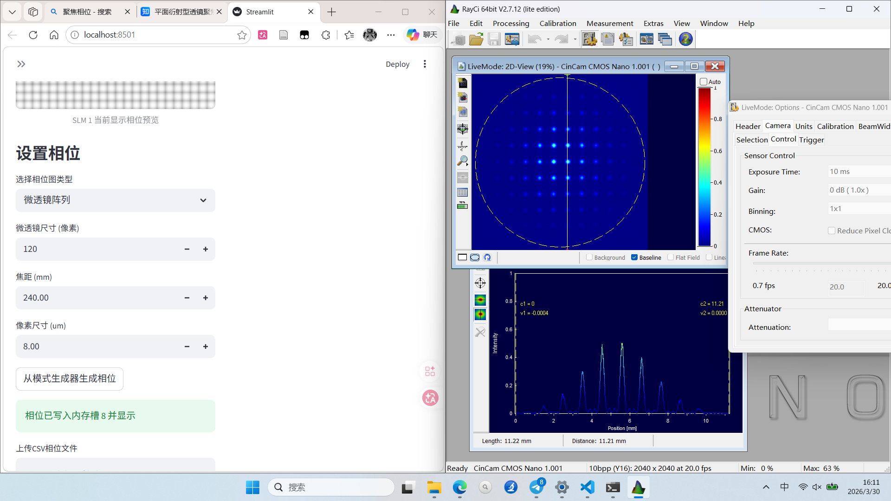

## 实验目标

探究动态相位探测手段，先基于SLM动态相位测试

## 实验记录

### slm添加相位测试

1. 本次实验主要测试SLM驱动控制以及光路设置：
2. 添加聚焦相位，出现双峰，怀疑是光路没有准直
   

   1. TODO:

      * ~~研究MLA参数设置与CCD像素匹配关系，可以找张其老师要一下材料~~
      * ~~解决聚焦双峰问题：1. 准直~~
3. 解决问题：

   1. 像素尺寸要计算外围尺寸
   2. 使用平面衍射公式计算相位：
      $$
      \Phi(r)=2\pi/\lambda \cdot (f-\sqrt{f^2+r^2})
      $$
4. 微透镜阵列

   
5. TODO：

   1. 生成特定zernike相位，反解出波前
   2. 建立IAO~Phase直接映射关系
