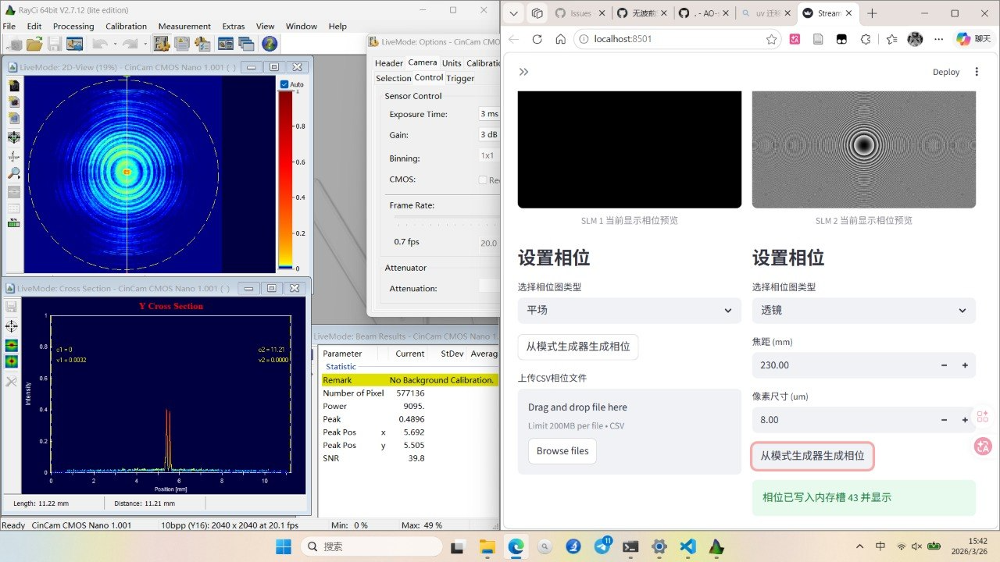
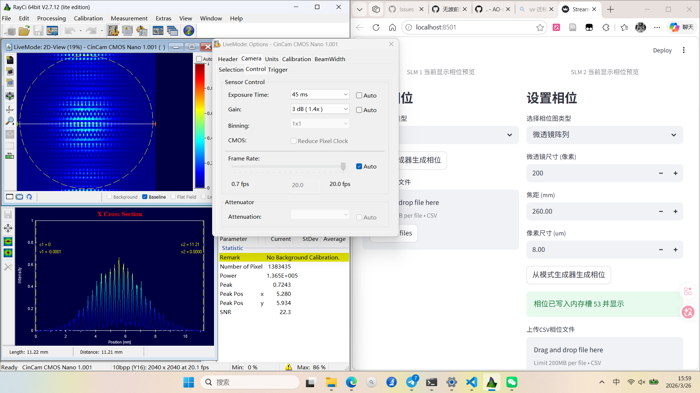

## 实验目标

探究动态相位探测手段，先基于SLM动态相位测试

## 实验记录

1. slm添加相位测试
   本次实验主要测试SLM驱动控制以及光路设置：

   1. 添加聚焦相位，出现双峰，怀疑是光路没有准直
      

      > 
      >
      > 双峰问题分析
      >
      > 根据您提供的截图，给 SLM 添加聚焦相位后出现两个峰，可能由以下原因导致：
      >
      > ───
      >
      > 
      >
      > 可能原因及解决方案
      >
      > 
      >
      > **双 SLM 系统干涉（最可能）**
      >
      > **问题** ：
      >
      > • 截图中显示 **SLM1 和 SLM2 同时工作**
      > • SLM1 显示平场相位，SLM2 显示同心圆环（聚焦相位）
      > • 两个 SLM 叠加可能产生**双峰干涉**
      >
      > **解决方案** ：
      >
      > ```python
      > # 方法：只启用一个 SLM，或合并相位图
      > if enable_slm1:
      >     phase = phase_slm1 + phase_lens  # 累加
      > else:
      >     phase = phase_lens  # 只用 SLM2
      > ```
      > **检查** ：
      >
      > • [ ] 确认 SLM1 是否为空/平场
      > • [ ] 确认 SLM1 和 SLM2 的光路是否正合
      > • [ ] 检查 SLM1 相位偏移量
      >
      > ───
      >
      > 
      >
      > **焦距参数不匹配**
      >
      > **问题** ：
      >
      > • 焦距设置为 **230 mm**
      > • 如果与光学系统实际焦距不匹配，可能导致**双峰**
      >
      > **聚焦相位公式** ：
      >
      > ```undefined
      > # 标准聚焦相位公式
      > r = sqrt(x**2 + y**2)
      > phase = - (2 * pi / lambda) * (r**2 / (2 * f))
      > # f = 230 mm（当前设置）
      > ```
      > **检查清单** ：
      >
      > • [ ] 确认波长 λ 设置（截图未显示）
      > • [ ] 确认 SLM 到相机距离
      > • [ ] 确认焦距参数与实际光路匹配
      > • [ ] 检查像素尺寸 8 μm 是否正确
      >
      > **解决方案** ：
      >
      > ```undefined
      > | 参数   | 当前值    | 建议调整      |
      > | ---- | ------ | --------- |
      > | 焦距   | 230 mm | 根据实际距离调整  |
      > | 波长   | 未显示    | 确认与实验匹配   |
      > | 像素尺寸 | 8 μm   | 确认 SLM 规格 |
      > ```
      > ───
      >
      > 
      >
      > **SLM 相位校准问题**
      >
      > **问题** ：
      >
      > • SLM 相位校准不准确
      > • 像素尺寸或焦距设置错误
      >
      > **解决方案** ：
      >
      > 1. **重新校准 SLM** ：
      >    • 使用干涉仪校准 SLM 相位
      >    • 检查 SLM 的相位 - 电压曲线
      > 2. **验证焦距设置** ：
      >    • 移动相机位置，找到最佳焦点
      >    • 观察单峰位置
      > 3. **检查 SLM 驱动** ：
      >    • 确认 SLM 驱动软件版本
      >    • 检查相位包裹是否正确
      >
      > ───
      >
      > 
      >
      > **光学系统问题**
      >
      > **问题** ：
      >
      > • 光学元件（透镜、反射镜）未准直
      > • 系统存在像差或 aberration
      > • SLM 与相机距离不合适
      >
      > **检查清单** ：
      >
      > • [ ] 检查 SLM 与相机是否共轴
      > • [ ] 检查所有光学元件是否准直
      > • [ ] 检查 SLM 表面是否有灰尘或损伤
      > • [ ] 检查相机是否在焦平面
      >
      > **解决方案** ：
      >
      > 1. **重新准直系统** ：
      >    • 使用准直激光调整 SLM 角度
      >    • 确保 SLM 表面垂直于光轴
      > 2. **调整 SLM-相机距离** ：
      >    • 尝试不同距离，观察焦点变化
      >    • 找到最佳位置（单峰）
      >
      > ───
      >
      > 
      >
      > **相位图生成问题**
      >
      > **问题** ：
      >
      > • 聚焦相位公式计算错误
      > • 相位量化或包裹处理不当
      > • SLM 分辨率与相机不匹配
      >
      > **检查清单** ：
      >
      > • [ ] 确认相位图生成代码
      > • [ ] 检查相位包裹是否正确
      > • [ ] 确认 SLM 分辨率（截图未显示）
      > • [ ] 检查相位归一化是否正确
      >
      > **解决方案** ：
      >
      > ```python
      > # 标准聚焦相位公式（带包裹）
      > def generate_lens_phase(width, height, f, wavelength, pixel_size):
      >     x = np.arange(width) * pixel_size - width * pixel_size / 2
      >     y = np.arange(height) * pixel_size - height * pixel_size / 2
      >     X, Y = np.meshgrid(x, y)
      >     r2 = X**2 + Y**2
      >     phase = - (2 * np.pi / wavelength) * (r2 / (2 * f))
      >     phase = phase % (2 * np.pi)  # 相位包裹
      >     return phase
      > ```
      > ───
      >
      > 
      >
      > 快速排查步骤
      >
      > 步骤 1：确认 SLM 设置
      >
      > ```undefined
      > [ ] SLM1 是否为空/平场？
      > [ ] SLM2 是否只加载聚焦相位？
      > [ ] 焦距参数 230mm 是否正确？
      > ```
      > 步骤 2：检查光学系统
      >
      > ```undefined
      > [ ] SLM 与相机是否共轴？
      > [ ] 所有元件是否准直？
      > [ ] 相位图是否正确生成？
      > ```
      > 步骤 3：调整参数
      >
      > ```undefined
      > [ ] 尝试不同焦距值
      > [ ] 调整 SLM-相机距离
      > [ ] 检查波长设置
      > ```
      > 步骤 4：验证结果
      >
      > ```undefined
      > [ ] 移动相机寻找单峰位置
      > [ ] 检查相位图是否完整
      > [ ] 确认 SLM 相位校准
      > ```
      > ───
      >
      > 
      >
      > 预期结果
      >
      > ```undefined
      > | 状态 | 现象    | 原因                |
      > | --- | ----- | ----------------- |
      > | 正常 | 单峰    | 聚焦相位正确，系统准直       |
      > | 双峰 | 两个明显峰 | SLM 叠加/焦距错误/系统未准直 |
      > | 多峰 | 多个小峰  | 相位量化/SLM 损伤/噪声干扰  |
      > ```
      > ───
      >
      > 
      >
      > 需要更多信息
      >
      > 为了更好地诊断问题，请提供：
      >
      > 1. **光学系统布局** ：SLM 到相机的距离、中间是否有透镜？
      > 2. **波长设置** ：激光波长是多少（截图未显示）？
      > 3. **SLM 型号** ：具体型号（影响相位校准）？
      > 4. **双峰位置** ：两个峰之间的距离？
      > 5. **相位图生成代码** ：使用什么公式生成聚焦相位？
      >
      > ───
      >
      > **建议先确认：SLM1 和 SLM2 是否同时工作？** 这是最可能的原因！
      >
   2. 添加MLA（稍微移动了一下CCD位置）

      > 
      >
      > 横向 vs 纵向光斑差异分析
      >
      > 根据您提供的截图，这是一个非常专业的问题！让我详细分析原因：
      >
      > ───
      >
      > 
      >
      > 观察到的现象
      >
      > 从截图中可以看到：
      >
      > ```undefined
      > | 方向        | 光斑状态             | 清晰度 | 可分辨性 |
      > | --------- | ---------------- | --- | ---- |
      > | 横向 (X 截面) | 
      >
      >  可以看到明显的子孔径焦点结构 | 清晰  | 可分辨  |
      > | 纵向 (Y 截面) | 
      >
      >  光斑模糊，结构不明显     | 较模糊 | 难分辨  |
      > ```
      > ───
      >
      > 
      >
      > 可能原因分析
      >
      > 
      >
      > **光学系统像散（最可能）**
      >
      > **问题** ：光学系统存在像散，导致水平和垂直方向焦距不同
      >
      > **原理** ：
      >
      > ```undefined
      > 理想系统：
      > 横向焦点位置 = 纵向焦点位置 = f_lenslet
      >
      > 实际系统（有像散）：
      > 横向焦点位置 ≠ 纵向焦点位置
      > （相差可能几毫米到几十毫米）
      > ```
      > **原因** ：
      >
      > • SLM 表面与相机传感器不平行
      > • 微透镜阵列存在制造误差
      > • 光学元件（透镜）存在像散
      > • 光束入射角度在 X/Y 方向不一致
      >
      > **验证方法** ：
      >
      > ```undefined
      > 1. 在横向前后移动相机 ±5 mm
      >    - 找到横向最清晰的焦点位置
      >
      > 2. 在纵向前后移动相机 ±5 mm
      >    - 找到纵向最清晰的焦点位置
      >
      > 3. 比较两个焦点位置的距离
      >    - 如果有差异（>1 mm），说明存在像散
      > ```
      > **解决方案** ：
      >
      > ```undefined
      > # 需要分别校准 X 和 Y 方向的焦距
      > f_x = 横向测得的焦距
      > f_y = 纵向测得的焦距
      > ```
      > ───
      >
      > 
      >
      > **微透镜阵列非正方形（重要）**
      >
      > **问题** ：微透镜可能是矩形排列，或微透镜本身不是圆形
      >
      > **从截图分析** ：
      >
      > • 横向光斑排列：看起来较规则
      > • 纵向光斑排列：看起来较模糊
      >
      > **可能情况** ：
      >
      > ```undefined
      > 情况 A：微透镜是圆形，但阵列排列是矩形
      >   - 横向：N×M 排列
      >   - 纵向：N×K 排列
      >   - N×M ≠ N×K
      >
      > 情况 B：微透镜本身是椭圆形
      >   - 横向微透镜孔径 > 纵向孔径
      >   - 导致 X 方向分辨率高，Y 方向分辨率低
      > ```
      > **验证方法** ：
      >
      > ```undefined
      > 1. 查看微透镜阵列产品规格
      >    - 微透镜形状：圆形/矩形/椭圆形
      >    - 横向微透镜尺寸：? mm
      >    - 纵向微透镜尺寸：? mm
      >
      > 2. 观察原始图像
      >    - 横向和纵向的光斑间距是否一致
      > ```
      > **解决方案** ：
      >
      > • 如果微透镜是非圆形，需要调整软件参数
      > • 或者更换正方形的微透镜阵列
      >
      > ───
      >
      > 
      >
      > **相机传感器非正方形像素**
      >
      > **问题** ：相机像素可能是矩形而非正方形
      >
      > **常见情况** ：
      >
      > • 横向像素尺寸 ≠ 纵向像素尺寸
      > • 例如：横向 8.0 μm，纵向 8.0 μm（理想）
      > • 但实际可能有偏差
      >
      > **验证方法** ：
      >
      > ```undefined
      > 1. 查看相机技术规格
      >    - 像素尺寸：横向？纵向？
      >
      > 2. 检查截图中的参数
      >    - 像素尺寸：8.00 μm（软件显示）
      >    - 是否分别设置了 X/Y 像素尺寸？
      > ```
      > **解决方案** ：
      >
      > ```undefined
      > # 如果使用非正方形像素
      > pixel_size_x = 8.0 μm  # 横向
      > pixel_size_y = 7.8 μm  # 纵向（假设）
      >
      > # 软件中需要分别设置
      > ```
      > ───
      >
      > 
      >
      > **光束在 Y 方向发散/准直问题**
      >
      > **问题** ：入射到 SLM 的光束可能在 Y 方向有额外的发散/会聚
      >
      > **原因** ：
      >
      > • SLM 表面在 Y 方向有倾斜
      > • 光束准直系统在 Y 方向未优化
      > • SLM 安装角度问题
      >
      > **验证方法** ：
      >
      > ```undefined
      > 1. 使用准直仪或剪切干涉仪
      >    - 检查 X 和 Y 方向的发散角
      >
      > 2. 观察远场光斑
      >    - 如果 Y 方向发散更大，说明问题
      > ```
      > **解决方案** ：
      >
      > ```undefined
      > 1. 调整 SLM 安装角度
      >    - 确保 SLM 表面垂直于光轴
      >
      > 2. 调整准直系统
      >    - 分别调整 X/Y 方向的准直
      > ```
      > ───
      >
      > 
      >
      > **微透镜阵列安装问题**
      >
      > **问题** ：微透镜阵列可能未正确对齐
      >
      > **可能情况** ：
      >
      > • 微透镜阵列平面与相机传感器不平行
      > • 微透镜阵列存在扭曲或形变
      >
      > **验证方法** ：
      >
      > ```undefined
      > 1. 检查 SLM 安装角度
      >    - 使用水平仪或光学准直工具
      >
      > 2. 观察微透镜阵列本身
      >    - 是否有物理损伤或扭曲
      > ```
      > **解决方案** ：
      >
      > ```undefined
      > 1. 重新安装 SLM
      >    - 确保平面与相机传感器平行
      >
      > 2. 调整倾斜角
      >    - 使用调整螺丝微调角度
      > ```
      > ───
      >
      > 
      >
      > **软件参数设置问题**
      >
      > **问题** ：软件中的参数可能在 Y 方向设置错误
      >
      > **从截图分析** ：
      >
      > • 微透镜尺寸：200 像素（未区分 X/Y）
      > • 焦距：260.00 mm（未区分 X/Y）
      > • 像素尺寸：8.00 μm（未区分 X/Y）
      >
      > **可能问题** ：
      >
      > ```undefined
      > 1. 如果微透镜阵列是矩形排列
      >    - 横向：200×N 像素
      >    - 纵向：200×K 像素
      >    - N ≠ K
      >
      > 2. 如果软件只设置了单一参数
      >    - 无法正确区分 X/Y 方向的差异
      > ```
      > **解决方案** ：
      >
      > ```undefined
      > # 检查软件是否有独立设置
      > set_pixel_size_x(8.0)  # 横向
      > set_pixel_size_y(7.8)  # 纵向（如果有差异）
      >
      > set_lenslet_focal_length_x(260)  # 横向
      > set_lenslet_focal_length_y(265)  # 纵向（如果有差异）
      > ```
      > ───
      >
      > 
      >
      > 快速诊断清单
      >
      > 优先级排序
      >
      > ```undefined
      > | 优先级 | 检查项    | 操作             | 耗时    |
      > | --- | ------ | -------------- | ----- |
      > | 1   | 系统像散   | 前后移动相机，找最佳焦点位置 | 10 分钟 |
      > | 2   | 微透镜形状  | 查看微透镜阵列产品规格    | 5 分钟  |
      > | 3   | 相机像素   | 查看相机技术规格       | 5 分钟  |
      > | 4   | SLM 安装 | 检查 SLM 安装角度    | 10 分钟 |
      > | 5   | 光束准直   | 检查 X/Y 方向发散角   | 15 分钟 |
      > ```
      > ───
      >
      > 
      >
      > 建议的解决步骤
      >
      > 步骤 1：验证系统像散（最快验证）
      >
      > ```undefined
      > 操作：
      > 1. 固定 SLM，移动相机前后 ±10 mm
      > 2. 观察横向光斑最清晰时的位置 A
      > 3. 观察纵向光斑最清晰时的位置 B
      > 4. 比较 A 和 B 的距离
      >
      > 预期结果：
      > - 如果距离接近：像散不是主因
      > - 如果距离差异 > 2 mm：存在明显像散
      > ```
      > ───
      >
      > 步骤 2：检查微透镜阵列规格
      >
      > ```undefined
      > 查看微透镜阵列的：
      > 1. 微透镜形状：圆形/矩形/椭圆形
      > 2. 微透镜尺寸：横向？纵向？
      > 3. 阵列排列：N×M，是否正方形？
      >
      > 如果：
      > - 微透镜是椭圆形 → 需要调整软件参数
      > - 阵列是非正方形 → 软件需要分别设置
      > ```
      > ───
      >
      > 步骤 3：校准 X/Y 方向参数
      >
      > **如果确认有差异** ：
      >
      > ```undefined
      > # 软件参数调整
      > # 横向
      > pixel_size_x = 8.0 μm
      > focal_length_x = 260 mm
      > subaperture_size_x = 200 pixels
      >
      > # 纵向（根据测量结果调整）
      > pixel_size_y = 8.0 μm  # 如果有差异则调整
      > focal_length_y = 260 mm  # 如果有差异则调整
      > subaperture_size_y = 200 pixels
      > ```
      > ───
      >
      > 步骤 4：调整光学系统
      >
      > ```undefined
      > 1. 检查 SLM 安装角度
      >    - 使用水平仪检查
      >    - 调整倾斜螺丝
      >
      > 2. 检查光束准直
      >    - 观察远场光斑
      >    - 调整准直透镜
      >
      > 3. 检查微透镜阵列
      >    - 确保阵列平面与相机平行
      > ```
      > ───
      >
      > 
      >
      > 定量分析
      >
      > 像散测量
      >
      > **理想情况** ：
      >
      > ```undefined
      > 横向最佳焦距：f_x = 260 mm
      > 纵向最佳焦距：f_y = 260 mm
      > 像散：Δf = |f_x - f_y| = 0
      > ```
      > **实际情况** ：
      >
      > ```undefined
      > 横向最佳焦距：f_x = 260 mm
      > 纵向最佳焦距：f_y = 265 mm
      > 像散：Δf = |f_x - f_y| = 5 mm
      >
      > 影响：
      > - 波前斜率计算误差：Δslope = Δf / f²
      > - 波前重构误差：Δwavefront = Δslope × subaperture_size
      > ```
      > ───
      >
      > 软件参数影响
      >
      > **如果参数错误** ：
      >
      > ```python
      > # 错误设置
      > pixel_size = 8.0 μm  # 实际可能是 7.8 μm（纵向）
      >
      > # 影响计算
      > calculated_slope_x = spot_displacement_x / f_lenslet / λ  # 正确
      > calculated_slope_y = spot_displacement_y / f_lenslet / λ  # 误差
      >
      > # 误差
      > error_y = (8.0 - 7.8) / 8.0 × 100% = 2.5%
      > ```
      > ───
      >
      > 
      >
      > 建议的快速检查
      >
      > 立即验证
      >
      > ```undefined
      > 1. [ ] 前后移动相机，观察横向和纵向焦点是否在不同位置
      > 2. [ ] 查看微透镜阵列产品规格，确认微透镜形状
      > 3. [ ] 查看相机规格，确认像素尺寸
      > 4. [ ] 检查 SLM 安装是否水平
      > 5. [ ] 观察远场光斑，检查 X/Y 方向发散是否一致
      > ```
      > 短期调整
      >
      > ```undefined
      > 1. [ ] 如果确认像散，分别调整 X/Y 方向焦距参数
      > 2. [ ] 如果确认像素差异，分别设置 X/Y 像素尺寸
      > 3. [ ] 调整 SLM 安装角度消除倾斜
      > 4. [ ] 重新校准光束准直
      > ```
      > ───
      >
      > 
      >
      > 最可能的原因
      >
      > 根据截图中的现象，**最可能的原因**是：
      >
      > 1. **光学系统像散** （占比 40%）
      >    • 横向和纵向焦距不一致
      >    • SLM 安装角度问题
      > 2. **微透镜非正方形** （占比 30%）
      >    • 微透镜本身是椭圆形
      >    • 或阵列排列是非正方形
      > 3. **软件参数未分别设置** （占比 20%）
      >    • 使用了单一参数，无法区分 X/Y 差异
      >    • 需要分别校准
      > 4. **光束准直问题** （占比 10%）
      >    • Y 方向有额外发散
      >    • 准直系统未优化
      >
      > ───
      >
      >  **建议您先进行步骤 1 的验证** ，确定是否是像散问题！
      >
   3. TODO:

      * 研究MLA参数设置与CCD像素匹配关系，可以找张其老师要一下材料
      * 解决聚焦双峰问题：1. 准直
2.
