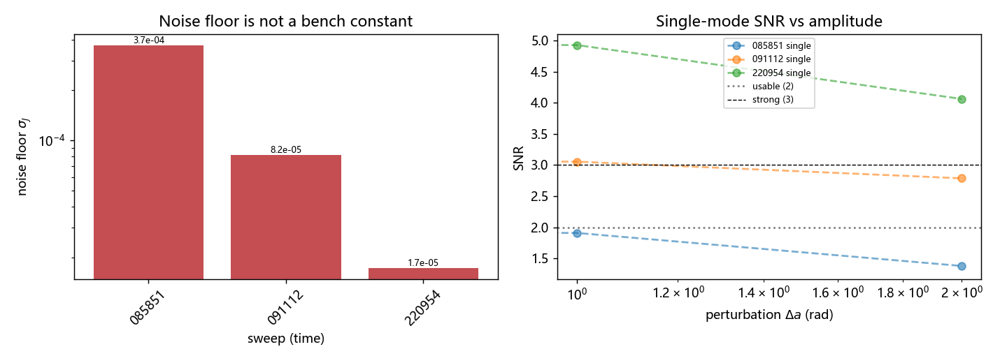
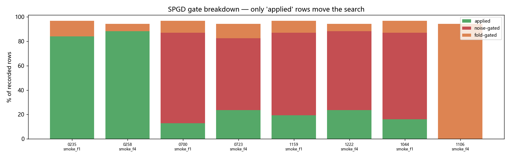
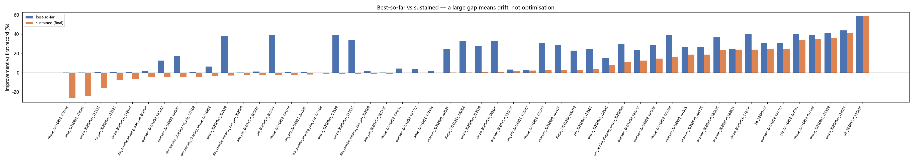

# SLM PIB 整形台架验收报告 (离线分析)

> **Fully offline.** 本报告只读取 `data/debug` 下已保存的 debug 产物
> (recorder pickle + JSON sidecar), 从不打开相机或 SLM。设备离线期间可
> 随时重跑刷新结论。数据根目录: `data\debug`

## 1. 噪声地板与 SNR

共 3 次扫描。噪声地板 $\sigma_J$ 区间 **1.72e-05 … 3.71e-04**（相差 **22×**）。

> **结论 1：噪声地板不是台架常数。** 同一天、同一光斑位置的三次扫描
> 相差 21 倍, 因此 SNR **必须每次实测**, 不可沿用历史值或写死。

| 扫描时间 | 中心 (x, y) | $\sigma_J$ | SNR@0.0005 | SNR@0.001 | SNR@0.01 |
|---|---|---|---|---|---|
| 20260929_085851 | (665, 1031) | 3.71e-04 | 1.35 | 1.91 | 1.38 |
| 20260929_091112 | (664, 1029) | 8.17e-05 | 2.85 | 3.06 | 2.79 |
| 20260929_220954 | (664, 1029) | 1.72e-05 | 3.25 | 4.93 | 4.06 |

> 表中为**单模式** (defocus) 探测。SPGD 同时扰动全部模式, 信号被
> 稀释 —— 见 §2。

## 2. 门控行为 (为什么小 delta 跑不动)

| 运行 | 标签 | rows | applied | noise | fold | delta | n_eval_frames | best objective |
|---|---|---|---|---|---|---|---|---|
| 20260929_090235 | `smoke_f1` | 31 | 26 | 0 | 4 | 0.0005 | 1 | -0.7825 |
| 20260929_090258 | `smoke_f4` | 17 | 15 | 0 | 1 | 0.0005 | 4 | -0.7778 |
| 20260929_090700 | `smoke_f1` | 31 | 4 | 23 | 3 | 0.0005 | 1 | -0.8788 |
| 20260929_090723 | `smoke_f4` | 17 | 4 | 10 | 2 | 0.0005 | 4 | -0.8371 |
| 20260929_091159 | `smoke_f1` | 31 | 6 | 21 | 3 | 0.0005 | 1 | -0.8430 |
| 20260929_091222 | `smoke_f4` | 17 | 4 | 11 | 1 | 0.0005 | 4 | -0.8565 |
| 20260929_221044 | `smoke_f1` | 31 | 5 | 22 | 3 | 0.0005 | 1 | -0.8160 |
| 20260929_221106 | `smoke_f4` | 17 | 0 | 0 | 16 | 0.0005 | 4 | -0.9065 |

> **结论 2：门控是主要损耗项。** 最差的一次 `20260929_221106` 只有 **0%** 的行真正被采纳, 其余被噪声门或亮度折叠门拦下 —— 搜索几乎没有拿到梯度。

两个独立成因, 都在台架上实测确认:

1. **信噪比被自由度稀释。** SPGD 对所有模式施加随机 ±1 扰动, 而单模式探测只动一个模式。实测 `delta=0.0005` 时单模式 SNR 2.25(可用) 而 54 自由度 SNR 仅 1.34 (不可用) —— **这就是 `delta<0.001` 跑不动的原因, 不是约束本身荒谬**。
2. **噪声是慢漂移, 不是散粒噪声。** 40 帧平均并未降低 $\sigma_J$(2.8e-3 vs 10 帧的 1.7e-3), 所以加帧数无效; 必须用 `+ - - +` 回文序列做漂移对消 (见 §5 工具)。

## 3. 搜索结果 (best vs sustained)

**sustained** 是末帧相对首帧的改善, **best** 是历史最优。两者的差值
是判别「真优化」与「漂移」的第一道线索。

⚠️ **但 `sustained` 会骗人。** 轨迹若是随机游走, 末帧落在低点纯属运气。实机曾出现 `0.529 → 0.400 → 0.534 → 0.402` 的轨迹 —— 头尾一比是 "+24%", 全程却没有下降。因此另给两个稳健判据:

- **`dec`** = 下降步占比。`≈0.5` 即随机游走 (抛硬币), 说明没有收敛。
- **`late`** = 前 1/3 与后 1/3 均值之差 (按目标极性归一), 对终点位置不敏感。

`guard` 列是被能量门判为「放弃评估」的行数 (J = 1e3 哨兵), 不参与统计。

| run | objective | epochs | guard | dec | late % | best % | sustained % | 溯源 |
|---|---|---|---|---|---|---|---|---|---|
| slm_pib_pib_20260928_175845 | `shape` | 190 | 0 | 0.52 | -22.3 | +58.7 | +58.7 | delta=0.0005 |
| slm_pib_shape_20260926_174011 | `shape` | 96 | 5 | 0.53 | -39.2 | +44.0 | +41.0 | sidecar 无关键字段 |
| slm_pib_shape_20260923_175829 | `shape` | 43 | 2 | 0.62 | -31.8 | +41.6 | +36.5 | sidecar 无关键字段 |
| slm_pib_shape_20260924_091143 | `shape` | 101 | 0 | 0.56 | -35.5 | +39.4 | +34.8 | sidecar 无关键字段 |
| slm_pib_pib_20260928_204741 | `shape` | 201 | 0 | 0.61 | -34.7 | +40.6 | +34.2 | delta=0.0005 |
| slm_pib_hw_20260929 | `pearson` | 61 | 0 | 0.48 | +12.3 | +30.4 | +24.4 | sidecar 无关键字段 |
| slm_pib_pearson_20260929_161710 | `pearson` | 61 | 0 | 0.48 | +12.3 | +30.4 | +24.4 | delta=0.1 |
| slm_pib_shape_20260926_172355 | `shape` | 101 | 0 | 0.68 | -21.3 | +40.5 | +24.1 | sidecar 无关键字段 |
| slm_pib_pearson_20260930_162631 | `pearson` | 201 | 0 | 0.56 | +8.5 | +24.7 | +24.1 | objective='pearson', cam_type='daheng', cam_id=0, exposure_time_ms=1.2, delta=0.02 |
| slm_pib_pearson_20260929_161856 | `pearson` | 61 | 0 | 0.52 | +20.6 | +36.8 | +23.2 | sidecar 无关键字段 |
| slm_pib_pearson_20260930_164755 | `pearson` | 201 | 0 | 0.49 | +0.6 | +26.7 | +18.9 | objective='pearson', cam_type='daheng', cam_id=0, exposure_time_ms=1.2, delta=0.05 |
| slm_pib_pearson_20260930_161515 | `pearson` | 201 | 0 | 0.48 | +10.0 | +26.7 | +18.8 | objective='pearson', cam_type='daheng', cam_id=0, exposure_time_ms=1.2, delta=0.1 |
| slm_pib_shape_20260929_162049 | `shape` | 61 | 0 | 0.57 | -10.3 | +39.4 | +16.0 | delta=0.1 |
| slm_pib_pearson_20260929_163533 | `pearson` | 61 | 0 | 0.40 | +15.1 | +29.0 | +14.6 | objective='pearson', cam_type='daheng', cam_id=0, exposure_time_ms=1.2, delta=0.1 |
| slm_pib_pearson_20260930_161030 | `pearson` | 201 | 0 | 0.47 | +7.8 | +23.6 | +12.8 | objective='pearson', cam_type='daheng', cam_id=0, exposure_time_ms=1.2, delta=0.05 |
| slm_zernike_shaping_shape_20260926_170950 | `shape` | 101 | 0 | 0.57 | -8.9 | +29.8 | +10.8 | sidecar 无关键字段 |
| slm_pib_shape_20260923_190544 | `shape` | 101 | 0 | 0.54 | -8.1 | +14.9 | +7.7 | sidecar 无关键字段 |
| slm_pib_pib_20260928_173303 | `shape` | 101 | 0 | 0.61 | -5.0 | +24.2 | +4.1 | delta=0.0005 |
| slm_pib_shape_20260924_090210 | `shape` | 101 | 0 | 0.52 | +0.8 | +23.0 | +3.0 | sidecar 无关键字段 |
| slm_pib_pearson_20260929_161417 | `pearson` | 201 | 0 | 0.51 | +0.0 | +28.9 | +3.0 | delta=0.01 |
| slm_pib_shape_20260926_172917 | `shape` | 101 | 0 | 0.54 | +0.1 | +30.5 | +2.7 | sidecar 无关键字段 |
| slm_pib_rms_pib_20260926_172642 | `rms_pib` | 101 | 0 | 0.61 | -3.0 | +2.5 | +2.4 | sidecar 无关键字段 |
| slm_pib_pearson_20260929_151039 | `pearson` | 41 | 0 | 0.53 | +0.2 | +3.3 | +1.4 | delta=0.5 |
| slm_pib_shape_20260929_160226 | `shape` | 201 | 0 | 0.53 | +0.0 | +32.5 | +0.8 | delta=0.0005 |
| slm_pib_shape_20260929_222639 | `shape` | 41 | 0 | 0.53 | +2.4 | +27.3 | +0.6 | objective='shape', cam_type='daheng', cam_id=0, exposure_time_ms=1.2, delta=0.0005 |
| slm_pib_shape_20260923_190206 | `shape` | 101 | 0 | 0.56 | +1.6 | +32.8 | +0.2 | sidecar 无关键字段 |
| slm_pib_pearson_20260929_160921 | `pearson` | 201 | 0 | 0.50 | -1.2 | +24.8 | +0.2 | delta=0.002 |
| slm_pib_rmse_20260926_174434 | `rmse` | 101 | 0 | 0.47 | -0.3 | +1.6 | -0.6 | sidecar 无关键字段 |
| slm_pib_pearson_20260930_163712 | `pearson` | 201 | 0 | 0.50 | +0.8 | +3.8 | -0.6 | objective='pearson', cam_type='daheng', cam_id=0, exposure_time_ms=1.2, delta=0.05 |
| slm_pib_shape_20260929_150531 | `shape` | 301 | 0 | 0.48 | -1.9 | +4.5 | -0.6 | delta=0.5 |
| slm_pib_rms_pib_20260928_205958 | `rms_pib` | 151 | 0 | 0.49 | -0.5 | +0.2 | -1.0 | delta=0.001 |
| slm_zernike_shaping_rms_pib_20260926_170626 | `rms_pib` | 101 | 0 | 0.56 | +0.4 | +1.9 | -1.2 | sidecar 无关键字段 |
| slm_pib_shape_20260926_173633 | `shape` | 101 | 0 | 0.43 | +3.6 | +33.6 | -1.4 | sidecar 无关键字段 |
| slm_pib_shape_20260929_222529 | `shape` | 41 | 0 | 0.45 | +1.0 | +39.0 | -1.6 | objective='shape', cam_type='daheng', cam_id=0, exposure_time_ms=1.2, delta=0.0005 |
| slm_zernike_shaping_rms_pib_20260926_164154 | `rms_pib` | 101 | 0 | 0.52 | +1.0 | +0.0 | -1.6 | sidecar 无关键字段 |
| slm_pib_rms_pib_20260923_201537 | `rms_pib` | 101 | 0 | 0.56 | +0.9 | +0.6 | -1.8 | sidecar 无关键字段 |
| slm_pib_shape_20260929_150918 | `shape` | 301 | 0 | 0.49 | -0.0 | +0.9 | -2.1 | delta=0.5 |
| slm_pib_pib_20260928_205321 | `shape` | 132 | 0 | 0.49 | +2.8 | +39.5 | -2.3 | delta=0.0007 |
| slm_pib_rms_pib_20260928_205645 | `rms_pib` | 85 | 0 | 0.50 | +1.7 | +1.3 | -2.4 | delta=0.0007 |
| slm_zernike_shaping_rms_pib_20260926_170021 | `rms_pib` | 101 | 0 | 0.49 | +1.2 | +0.1 | -2.4 | sidecar 无关键字段 |
| slm_pib_shape_20260923_201859 | `shape` | 101 | 0 | 0.48 | +3.7 | +38.2 | -3.0 | sidecar 无关键字段 |
| slm_zernike_shaping_shape_20260926_170322 | `shape` | 101 | 0 | 0.43 | +2.5 | +6.5 | -3.1 | sidecar 无关键字段 |
| slm_zernike_shaping_roi_pib_20260926_171311 | `roi_pib` | 101 | 0 | 0.48 | -0.3 | +0.6 | -4.1 | sidecar 无关键字段 |
| slm_pib_pearson_20260930_164337 | `pearson` | 201 | 0 | 0.48 | -2.0 | +17.4 | -4.7 | objective='pearson', cam_type='daheng', cam_id=0, exposure_time_ms=1.2, delta=0.05 |
| slm_pib_pearson_20260930_163242 | `pearson` | 201 | 0 | 0.47 | -2.1 | +12.5 | -4.7 | objective='pearson', cam_type='daheng', cam_id=0, exposure_time_ms=1.2, delta=0.05 |
| slm_zernike_shaping_rms_pib_20260926_162917 | `rms_pib` | 101 | 0 | 0.50 | +1.7 | +1.5 | -4.8 | sidecar 无关键字段 |
| slm_pib_shape_20260926_172104 | `shape` | 20 | 81 | 0.37 | +1.6 | +0.9 | -6.9 | sidecar 无关键字段 |
| slm_pib_roi_pib_20260926_173223 | `roi_pib` | 101 | 0 | 0.44 | +2.2 | +0.8 | -7.3 | sidecar 无关键字段 |
| slm_pib_shape_20260926_175334 | `shape` | 64 | 669 | 0.41 | +2.8 | +0.4 | -15.8 | sidecar 无关键字段 |
| slm_pib_rmse_20260928_174041 | `rmse` | 61 | 229 | 0.43 | +5.0 | +0.1 | -24.3 | sidecar 无关键字段 |
| slm_pib_shape_20260928_174644 | `shape` | 63 | 282 | 0.48 | +5.2 | +0.1 | -26.5 | sidecar 无关键字段 |

> **⚠️ 32/51 个运行的 `dec` 在 0.45–0.55 之间** = 随机游走。这些运行的 `sustained` 不应被解读为优化成果。

- **sustained > 5%** 的运行: 17 / 51
- **best 显著但 sustained ≈ 0** (判为漂移, 非优化): 6 / 51

> **结论 3：能量门频繁触发的运行基本等于没优化。** 6 个运行出现过 guard 惩罚行, 其 sustained 改善中位数 **-11.3%**; 而 45 个无 guard 的运行中位数为 **+0.6%**。被门拦下的迭代不更新系数, 因此门一旦频繁触发, 搜索就原地踏步 —— 排查时先看 guard 计数, 再看 delta。

判为漂移的运行 (仅列名前 8 个):

| run | best % | sustained % |
|---|---|---|
| slm_pib_shape_20260929_222529 | +39.0 | -1.6 |
| slm_pib_shape_20260926_173633 | +33.6 | -1.4 |
| slm_pib_shape_20260923_190206 | +32.8 | +0.2 |
| slm_pib_shape_20260929_160226 | +32.5 | +0.8 |
| slm_pib_shape_20260929_222639 | +27.3 | +0.6 |
| slm_pib_pearson_20260929_160921 | +24.8 | +0.2 |

## 4. 图







## 5. 参数测量工具 (设备无关)

本报告引用的 SNR / 噪声地板测量已抽到 **`ao_shaping.tools.slm.slm_snr_probe`**, 设备实例由参数传入, 不构造任何设备:

```python
from ao_shaping.tools.slm.slm_snr_probe import snr_sweep
with create_camera('daheng', cam_id=0, exposure_time_ms=1.2) as cam, \
     Santec(slm_number=1, wavelength=1064) as slm:
    result = snr_sweep(cam, slm, n_max=9, radius=480.0)
    print(result.sigma, result.multi_snrs, result.usable_deltas())
```

| 符号 | 作用 |
|---|---|
| `snr_sweep` | 噪底 + 单模式/多模式逐 delta SNR (设备实例传入) |
| `measure_noise_floor` | 固定相位下 σ (含慢漂移) |
| `abba_signal` | `+ - - +` 回文对消漂移的 ΔJ |
| `snr_verdict` | 阈值 → strong / usable / unusable |
| `SnrSweepResult.usable_deltas` | **按多模式 SNR** 给出的可用 delta |

消费者: `scripts/measure_shape_sensitivity.py` 与硬件门控测试 `tests/ao_shaping/optimizer/wfless/test_slm_zernike_pib_online.py` 均改为委托该工具, 二者不会再各自漂移。离线可测: `tests/ao_shaping/tools/test_slm_snr_probe.py` (纯 fake 设备, 无需硬件)。

> ⚠️ `usable_deltas()` 刻意按**多模式** SNR 过滤: 单模式列会高估 SPGD 实际能分辨的信号, 直接采信会再次把 delta 选到不可用的区间。

## 6. 建议

1. **排查顺序: 先看 guard 计数, 再看 delta。** 6 个运行出现能量门惩罚行, 其 sustained 改善中位数为负 (§3 结论 3)。门拦下的迭代不更新系数, 门频繁触发时搜索原地踏步, 调 delta 无济于事。
2. **按每次实测的多模式 SNR 选 `delta`**, 不要沿用历史值 —— 噪声地板单日波动 21×。用 `snr_sweep(...).usable_deltas()`。
3. **`delta<0.001` 在 `n_max=9` (54 自由度) 下不可用**: 实测多模式 SNR ≈ 1.3, 95% 迭代被门控。若必须满足该约束, 只能显著降低 `n_max`(自由度越少, 稀释越轻)。
4. **`delta≈0.1` 是当前 `n_max=9` 的可用区间**; `0.2` 会触发亮度折叠门(45/60 被拒), 过大反而更差。
5. **加帧数不能降噪**, 只能靠 `+ - - +` 漂移对消; 任何降噪方案先验证是否真的降低了 σ。`n_eval_frames=4` 的 smoke 出现 16/16 全被折断门拒绝, 属于独立失效模式。
6. 目标函数选择请参考 [三目标对比报告](slm_pib_online_hw/objective_comparison.md): `1 - Pearson` 在实机上只优化成功、排序不可靠 (2/4 符号正确), 维持 **RISKY**, 仅作显式可选目标并保留能量门。

---

### 下一步 (设备上线后)

1. 用新工具重跑一次完整 SNR 扫描: `AO_RUN_HARDWARE=1 pytest tests/ao_shaping/optimizer/wfless/test_slm_zernike_pib_online.py -v -s`, 读取 `multi_snrs` 列选 delta。
2. 用选定 delta 跑 `n_max=9` 的方形/PIB 各一次 ≥200 epoch, 确认 sustained > 5%。
3. 硬件验收脚本: `scripts/measure_shape_sensitivity.py` (已改为委托同一工具, 与门控测试结果一致)。

