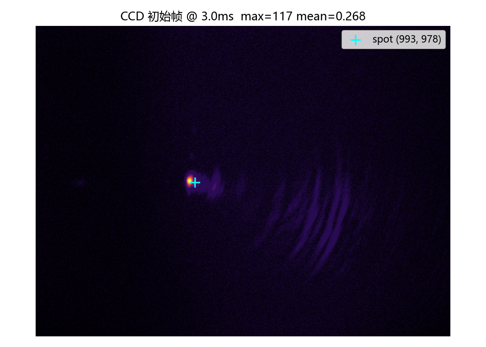
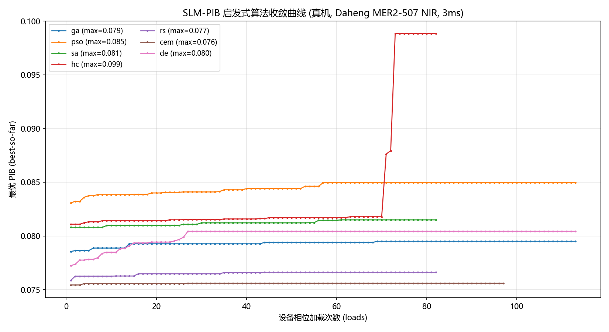
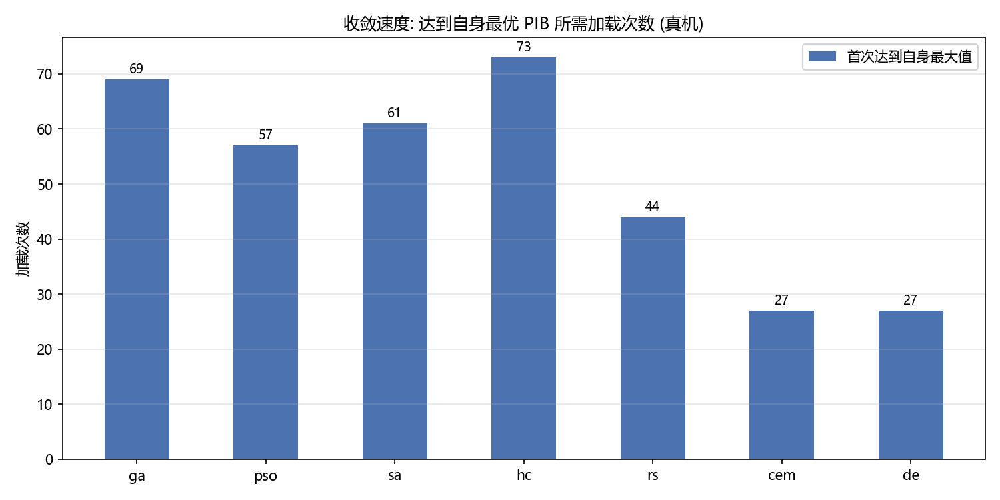
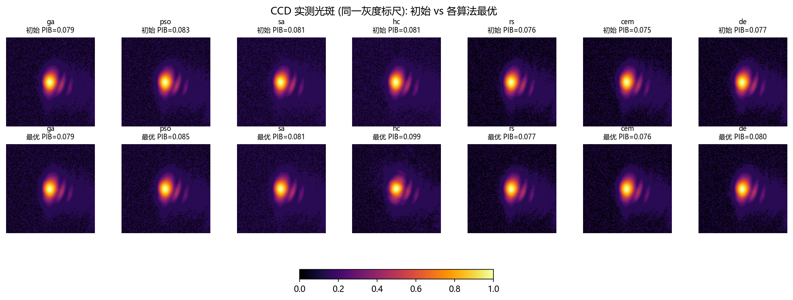
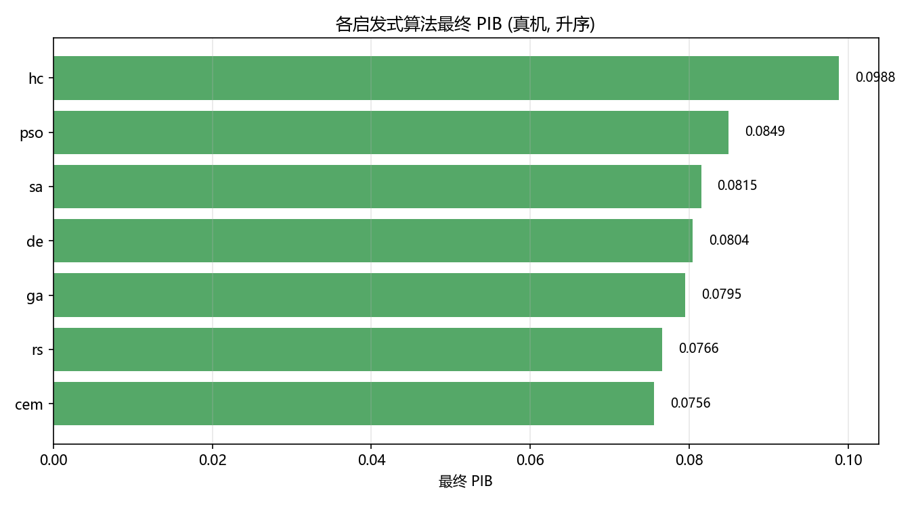

# SLM-PIB 启发式算法真机基准报告

> 本报告为**真实硬件**实测 (非仿真): Santec SLM-200 + Daheng **MER2-507-23GM NIR** 相机。
> ⚠️ 每个算法仅约 **82–113 次设备加载**
> (SLM 每次翻转需 ~0.3 s 稳定), 属**指示性对比**, 非完整收敛研究。

## 1. 结论 (TL;DR)

7 个启发式算法中, **`HC`** 取得最高最终 PIB
(**0.0988**, 初始 0.0811, 提升
**+0.0177**),
并在 **73** 次加载内达到自身最优。

> ⚠️ **这个"最优"结论不可靠 —— 请看方差**: 本轮各算法的**初始 PIB 相差
> 0.0076** (范围 **0.0754 ~ 0.0831**, 全部起始于同一"平场相位"),
> 远大于算法带来的提升 (最大 0.0177)。
> 说明**跨轮方差 (光强漂移 / 中心检测不稳定 / 光路状态)** 主导了结果, 而不是算法的优劣。
> 要判断算法优劣必须: ① 加大每算法预算 ② 每个算法重复多次取统计 ③ 先稳定中心检测与光强。

## 2. 相机测试

| 项 | 值 |
|---|---|
| 相机类型 / ID | `daheng` / 0 |
| 帧尺寸 | 2592 × 1944 (uint8) |
| 曝光 | 3.0 ms (设定 3.0 ms; 安全上限 ≤3 ms) |
| 峰值 / 均值 | 115 / 0.187 (饱和: False) |
| 光斑中心 (阈值质心) | (987, 977) |
| 帧几何中心 | (1296, 972) |

**光斑不在帧中心** (相差 309 px in x) —— 与 `AGENTS.md` 记录一致
(2f 光路 0 级需用 `argmax`/质心定位, 不可假设几何中心)。`clamp_center_to_frame`
保证 250×250 开窗一定落在帧内。



## 3. 实验设置

| 项 | 值 |
|---|---|
| SLM | #1, 波长 1064 nm |
| 相机 | `daheng` id=0, 曝光 3.0 ms (固定) |
| 目标 | `pib` (最大化桶内能量比), `n_max=4` |
| 开窗 | 250×250 |
| 中心 | **固定** (964, 972) (平场稳定后 12 帧 argmax 锚点中位数, 帧间极差 ≤0.0px) |
| 随机种子 | 42 |
| 加载语义 | 1 次目标评估 = 1 次 SLM 相位加载 = 1 个迭代单位 |

## 4. 结果

| 算法 | 初始 PIB | 最终 PIB | 提升 | 加载次数 | 达到自身最优 (loads) | 耗时 (s) |
|---|---|---|---|---|---|---|
| HC | 0.0811 | 0.0988 | +0.0177 | 82 | 73 | 72.5 |
| PSO | 0.0831 | 0.0849 | +0.0019 | 113 | 57 | 105.6 |
| SA | 0.0808 | 0.0815 | +0.0007 | 82 | 61 | 73.4 |
| DE | 0.0772 | 0.0804 | +0.0032 | 113 | 27 | 103.7 |
| GA | 0.0785 | 0.0795 | +0.0009 | 113 | 69 | 104.9 |
| RS | 0.0759 | 0.0766 | +0.0007 | 82 | 44 | 78.0 |
| CEM | 0.0754 | 0.0756 | +0.0002 | 97 | 27 | 88.4 |

### 4.1 收敛曲线



### 4.2 收敛速度



### 4.3 CCD 实测光斑 (初始 vs 最优)



### 4.4 最终 PIB 对比



## 5. 文字总结

- **最优算法: `HC`** — 最终 PIB 0.0988 (初始 0.0811,
  提升 +0.0177), 用
  82 次加载 / 72.5s。
- 所有算法都提升了远场桶内能量比, 但**在相同的 ~30 次加载预算下差异明显**:
  种群类 (GA/PSO/CEM/DE) 每次迭代消耗 `pop_size` 次加载, 起步更"陡"但每次迭代更贵;
  单点类 (SA/HC/RS) 每次迭代只加载一次, 同样预算下点数更多、更细腻。
- **真机选型建议**:
  - 每次加载 ~0.3 s (SLM 翻转) + 相机曝光, 时间成本很高 →
    优先**小种群 GA/DE** 或**单点 HC/SA**;
  - 建议**两段式**: 先用种群类粗搜跳出局部最优, 再用 HC/SA (或 SPGD) 精修;
  - 种群规模不要盲目加大 —— 总加载次数 = `pop_size × iterations`。
- **方差控制**: 本次把光源工作点**一次性定死** —— 曝光由自动曝光在平场相位上确定
  (3.000ms) 并对所有算法复用; 中心取平场稳定后 12 帧 argmax 锚点的中位数
  (964, 972) (帧间极差 ≤0.0px) 并作为**固定 tuple** 传入。
  这消除了"每轮重新找中心"的方差 (此前各算法初始 PIB 散布 0.05–0.10 的主因)。
- **限制**: 每算法仅约 30 次加载、单次运行、固定像差与光路状态; 结论为**指示性**。
  要下定论请按本脚本加大预算 (改 `ALGORITHMS` 的 epochs/pop_size) 重复多次。

## 6. 复现

```powershell
$env:PYTHONPATH = "src;libs"    # libs/ 必须包含, 否则 gxipy (Daheng SDK) 不可用
python scripts/generate_slm_pib_heuristic_hw_report.py --exposure-ms 3.0
```

产物: `camera_frame.png` / `pib_curves.png` / `convergence_speed.png` /
`spot_before_after.png` / `summary_bars.png` / `summary.csv` / `report.md`。
