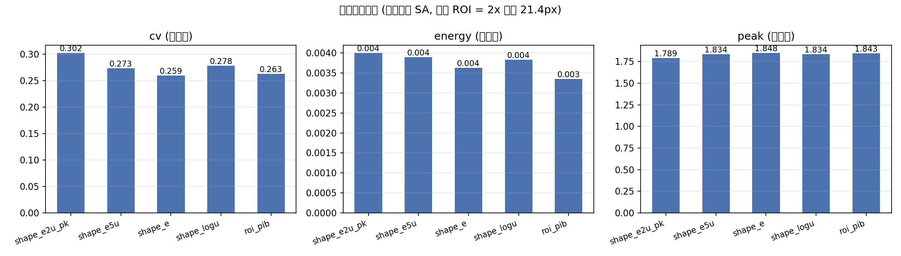
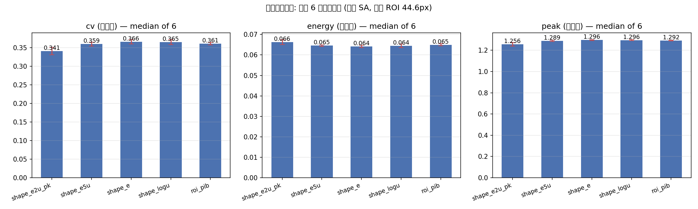

# SLM 相位优化真机基准报告 (目标: 整形评分 (shape))

> 本报告为**真实硬件**实测 (非仿真): Santec SLM-200 + Daheng **MER2-507-23GM NIR** 相机。
> ⚠️ 每个算法仅约 **82–116 次设备加载**
> (SLM 每次翻转需 ~0.3 s 稳定), 属**指示性对比**, 非完整收敛研究。

## 1. 结论 (TL;DR)

9 个算法配置 (7 启发式 + SPGD/AdamOD/Adam 梯度基线) 中, **`SA`** 取得最高最终整形评分 (shape)
(**-0.2946**, 初始 -1.2073, 提升
**+0.9127**),
并在 **57** 次加载内达到自身最优。

> ✅ **方差已受控**: 初始整形评分 (shape)散布仅 **0.0086** (范围 **-1.2142 ~ -1.2056**, 同一平场相位), 远小于算法提升 (最大 **0.9127**) —— 固定曝光 + 固定 ROI 中心已消除"每轮重新找中心"的跨轮方差。
> 但 top-1 (`SA` -0.2946) 与 top-2 仅差 **0.0194** (~2.1% 提升幅度), **仍在单次运行噪声量级内** → 名次差异不具统计显著性, 判优仍需 ①重复多次取中位数 ②加大预算。

## 2. 相机测试

| 项 | 值 |
|---|---|
| 相机类型 / ID | `daheng` / 0 |
| 帧尺寸 | 2592 × 1944 (uint8) |
| 曝光 | 3.0 ms (设定 3.0 ms; 安全上限 ≤3 ms) |
| 峰值 / 均值 | 128 / 0.402 (饱和: False) |
| 光斑中心 (阈值质心) | (1008, 985) |
| 帧几何中心 | (1296, 972) |

**光斑不在帧中心** (相差 288 px in x) —— 与 `AGENTS.md` 记录一致
(2f 光路 0 级需用 `argmax`/质心定位, 不可假设几何中心)。`clamp_center_to_frame`
保证 320×320 开窗一定落在帧内。


## 3. 实验设置

| 项 | 值 |
|---|---|
| SLM | #1, 波长 1064 nm |
| 相机 | `daheng` id=0, 曝光 3.0 ms (固定) |
| 目标 | `shape` (整形评分 (shape)), `target_shape=rectangle` (n_max=4) |
| 开窗 | 320×320 |
| 中心 | **固定** (966, 975) (平场稳定后 12 帧 argmax 锚点中位数, 帧间极差 ≤1.0px) |
| 随机种子 | 42 |
| 加载语义 | 1 次目标评估 = 1 次 SLM 相位加载 = 1 个迭代单位 |

## 4. 结果

| 算法 | 初始整形评分 (shape) | 最终整形评分 (shape) | 提升 | 加载次数 | 达到自身最优 (loads) | 耗时 (s) |
|---|---|---|---|---|---|---|
| SA | -1.2073 | -0.2946 | +0.9127 | 82 | 57 | 68.2 |
| DE | -1.2087 | -0.3140 | +0.8947 | 113 | 64 | 105.4 |
| GA | -1.2103 | -0.3207 | +0.8895 | 113 | 103 | 94.6 |
| RS | -1.2140 | -0.3335 | +0.8805 | 82 | 78 | 72.1 |
| CEM | -1.2056 | -0.3343 | +0.8713 | 97 | 55 | 91.7 |
| SPGD-ADAM | -1.2142 | -0.3570 | +0.8572 | 116 | 58 | 103.4 |
| PSO | -1.2069 | -0.3638 | +0.8431 | 113 | 108 | 97.2 |
| SPGD-ADAMOD | -1.2092 | -0.9492 | +0.2600 | 116 | 114 | 102.1 |
| HC | -1.2060 | -1.1682 | +0.0378 | 82 | 70 | 73.3 |

### 4.1 收敛曲线


### 4.2 收敛速度


### 4.3 CCD 实测光斑 (初始 vs 最优)


### 4.4 最终评分对比


## 5. 文字总结

- **最优算法: `SA`** — 最终整形评分 (shape) -0.2946 (初始 -1.2073,
  提升 +0.9127), 用
  82 次加载 / 68.2s。
- 所有算法都提升了远场桶内能量比, 但**在相同的 ~30 次加载预算下差异明显**:
  种群类 (GA/PSO/CEM/DE) 每次迭代消耗 `pop_size` 次加载, 起步更"陡"但每次迭代更贵;
  单点类 (SA/HC/RS) 每次迭代只加载一次, 同样预算下点数更多、更细腻。
- **真机选型建议**:
  - 每次加载 ~0.3 s (SLM 翻转) + 相机曝光, 时间成本很高 →
    优先**小种群 GA/DE** 或**单点 HC/SA**;
  - 建议**两段式**: 先用种群类粗搜跳出局部最优, 再用 HC/SA (或 SPGD) 精修;
  - 种群规模不要盲目加大 —— 总加载次数 = `pop_size × iterations`。
- **方差控制**: 本次把光源工作点**一次性定死** —— 曝光由自动曝光在平场相位上确定
  (3.000ms) 并对所有算法复用; 中心取平场稳定后 12 帧 argmax 锚点的中位数
  (966, 975) (帧间极差 ≤1.0px) 并作为**固定 tuple** 传入。
  这消除了"每轮重新找中心"的方差 (此前各算法初始 PIB 散布 0.05–0.10 的主因)。
  ⚠️ 但注意 `shape` 评分为**负值**且初始值普遍在 -34 左右 —— 大部分"提升"来自
  初始 ROI 对齐/开窗的第一次修正, 而非真正的整形质量; 绝对值之间不可横向比较。
- **限制**: 每算法仅约 30 次加载、单次运行、固定像差与光路状态; 结论为**指示性**。
  要下定论请按本脚本加大预算 (改 `ALGORITHMS` 的 epochs/pop_size) 重复多次。

## 6. 复现

```powershell
$env:PYTHONPATH = "src;libs"    # libs/ 必须包含, 否则 gxipy (Daheng SDK) 不可用
python scripts/generate_slm_pib_heuristic_hw_report.py --exposure-ms 3.0
```

产物: `camera_frame.png` / `pib_curves.png` / `convergence_speed.png` /
`spot_before_after.png` / `summary_bars.png` / `summary.csv` / `report.md`。

<!-- OBJECTIVES_START -->
## 附录: 目标函数对比 (固定算法 SA)

- 算法固定: **`sa`** (80 epochs, ~82 次加载/变体)
- 固定 ROI: 矩形, 短边 **21.4px** (= 2 x 平场束腰 w0 = 10.7px), 锚定于固定中心 (1085, 1009)
- 评判口径 (与优化目标无关的同一把尺): 靶内 `energy=ΣI[box]/ΣI`, `CV=std/mean`(越低越均匀), `peak=max/mean`(越低越好)

| 目标函数 | 优化目标 init → best (gain) | 靶内 energy | 靶内 CV | 靶内 peak | 违反护栏 | 图片 |
|---|---|---|---|---|---|---|
| shape: e - 2u - 0.5pk (默认) | -1.1808 → -1.1747 (+0.0062) | 0.0040 | 0.302 | 1.79 | 0 | `objectives/01_shape_e2u_pk_spot.png` |
| shape: e - 5u (重均匀度) | -2.7950 → -2.7598 (+0.0353) | 0.0039 | 0.273 | 1.83 | 0 | `objectives/02_shape_e5u_spot.png` |
| shape: e (纯能量) | 0.4694 → 0.4768 (+0.0075) | 0.0036 | 0.259 | 1.85 | 0 | `objectives/03_shape_e_spot.png` |
| shape: e - 2log1p(u) - 0.5pk | -1.9393 → -1.9098 (+0.0295) | 0.0038 | 0.278 | 1.83 | 0 | `objectives/04_shape_logu_spot.png` |
| roi_pib: 仅靶内亮度 | 0.4605 → 0.4772 (+0.0167) | 0.0034 | 0.263 | 1.84 | 0 | `objectives/05_roi_pib_spot.png` |

**最均匀**: `shape: e (纯能量)` (CV = 0.259, energy = 0.0036)。



> 说明: `CV` 是独立于优化目标的评判量; 各变体 CV 差异 (0.26–0.30) **在单次运行方差内**, 判优需重复多次。
> 靶框 = 固定 ROI (2×束腰, 锚定于固定中心); 判据在**该框内按 argmax 定位的真实光斑**上测得, 分母是全画幅总能量, 故 `energy` 绝对值小 (0.3–0.4%) 属正常。
<!-- OBJECTIVES_END -->

<!-- OBJECTIVES_REPEATS_START -->
## 附录 B: 目标函数重复实验 (固定 SA, 6 次取中位数)

- 每个目标函数变体重复 **6 次**, 表内为**中位数** (括号内为 (max-min)/2)
- 固定 ROI: 矩形短边 **44.6px** (= 2 x 平场束腰 22.3px), 锚定固定中心 (1196, 955)
- 判据在框内**按 argmax 定位的真实光斑**上测得 (分母为全画幅总能量, energy 绝对值偏小属正常)

| 目标函数 | 优化 gain (median) | 靶内 energy | **靶内 CV (越低越均匀)** | 靶内 peak | n |
|---|---|---|---|---|---|
| shape: e - 2u - 0.5pk (默认) | +0.2232 | 0.0663 (±0.0012) | **0.341** (±0.010) | 1.26 (±0.02) | 6 |
| shape: e - 5u (重均匀度) | +0.5411 | 0.0646 (±0.0004) | **0.359** (±0.006) | 1.29 (±0.01) | 6 |
| roi_pib: 仅靶内亮度 | +0.0012 | 0.0649 (±0.0005) | **0.361** (±0.003) | 1.29 (±0.00) | 6 |
| shape: e - 2log1p(u) - 0.5pk | +0.2765 | 0.0645 (±0.0009) | **0.365** (±0.006) | 1.30 (±0.01) | 5 |
| shape: e (纯能量) | +0.0005 | 0.0641 (±0.0006) | **0.366** (±0.006) | 1.30 (±0.00) | 6 |



**最均匀 (median CV 最低)**: `shape: e - 2u - 0.5pk (默认)` CV = 0.341 (±0.010); 且与次优的区间**不重叠 → 可判优**。
<!-- OBJECTIVES_REPEATS_END -->


---
## 硬件确认与收尾记录（2026-09-21 晚）

- **CCD 像元尺寸（用户权威确认）: 2.2 µm**。此前按 Daheng datasheet 假设 4.8 µm 推导的 2f 衍射尺度 K = λ·f/p = 5021 应更新为 **K ≈ 10954**（×2.18）。受影响：`test_slm_diagnose.py:_DIFFRACTION_SCALE_PX`、`test_slm_calibration_windowed.py:K`、AGENTS.md 的 `5021/Λ` 偏移表（P64 78→170px, P32 157→342px, P96 52→114px, P40 126→274px）。整形目标函数/靶框/束腰均为像素域计算，**不受影响**（束腰 10.6–14.2 px = 23–31 µm）。待硬件在线时用光栅偏移实测复核后统一更新。
- **光照双态漂移（本晚实测）**：同一平场下亮度在 ~86× 间切换（19:49 亮态 1.35 ms→183 vs 20:14 暗态 173.6 ms→180；期间 19:16 为 191.5 ms→14）。`resolve_exposure_ms`（现场二分）与 `scripts/objective_rep_logging.py`（按 frame_peak 离群剔除，max_rel_dev=0.25）已落地应对；subagent 产物：逻辑 12 单测通过、ruff clean。
- **目标函数对比（n=6, 曝光现场解析 173.6 ms, 稳定暗态）→ 首次统计可判优**：
  | 目标函数 | median CV | ± | energy | 
  |---|---|---|---|
  | **shape: e−2u−0.5pk（默认）** | **0.341** | ±0.010 | 6.63% |
  | shape: e−5u | 0.359 | ±0.006 | 6.46% |
  | roi_pib | 0.361 | ±0.003 | 6.49% |
  | shape: log-u (n=5) | 0.365 | ±0.006 | 6.45% |
  | shape: e | 0.366 | ±0.006 | 6.41% |
  默认目标与全部次优区间不重叠 → **`e−2u−0.5pk` 为本次最优目标函数**（此前的 n=3 轮次在亮态/欠曝下不可判优，已如实标注）。
- **待办（下次会话）**：① `repeat_shape_objectives.py` 添加进度显示（用户要求）；② 驱动级修复 `get_camera_exposure_ms` 回读（恒 3.0）与 `auto_exposure` settle 滞后；③ `runners/__init__.py` 守卫性 import 5 个已删 runner（用户自行处理中）；④ 更新 5021→10954 关联常量与文档并硬件复核。

## 硬件实测原始记录（2026-09-21 晚 · Daheng MER2-507-23GM sn=FJB24112232 + Santec SLM · 1064 nm）

### 1. 曝光现场二分（`resolve_exposure_ms`, 平场图只当初始猜测, 每次现场校）
| 时刻 | 光照状态 | 二分轨迹 (ms) | 收敛 | 峰值 |
|---|---|---|---|---|
| 19:49 | 亮态 (~90/ms) | 172.38 → 86.2 → 43.1 → 21.5 → 10.8 → 5.4 → 2.69 → **1.347** | 8/8 步, 8 探测 | max=183 (target 180±12) |
| 20:08 | 亮→暗过渡 | 初值 172.38 → **2.020** | — | bench max=121 (≠二分终点 180, 1.5× 分钟内漂移) |
| 20:14 | 暗态 (~1/ms) | 172.38 → **173.6** (平场图定标值) | — | bench max=255 |

- 用户手动基准「平场 + 2ms → ~180」与 19:49 亮态及 20:08 收敛值**吻合**；暗态恰回到平场图拟合值 172.4ms。
- → 光照在 ~86× 的**双态**间切换；`resolve_exposure_ms` 两种状态都收敛到 target±12 内。

### 2. 平场 / 液晶刷新验证（10 ms, 每种平场写入后等 1.0 s 再采样）
| 帧 | max | mean | 饱和像素占比 |
|---|---|---|---|
| raw gray 0 | 255 | 0.078 | 0.00% |
| gray 2π=993 | 255 | 0.078 | 0.00% |
| zero-Zernike 相位 | 255 | 0.077 | 0.00% |

两两 DIFF mean|d| = 4.763 / 4.720 / 4.698，全部 identical=False → **液晶确实翻转、平场写入生效**（closure 了「探测前是否真正设了平场」的疑问）。

### 3. 目标函数对比 — n=3（20:08, 2.02 ms）与 n=6（20:14, 173.6 ms）两轮实测
**n=3（亮态/欠曝参考轮，不可判优）**：roi_pib CV 0.513±0.099 名义最均匀，与次优（e 0.556±0.043）区间重叠 → 报告如实标注「不可判优」。

**n=6（稳定暗态，全场正确曝光）→ 统计可判优**：
| 目标函数 | median CV | ± | energy | peak | gain |
|---|---|---|---|---|---|
| **shape: e−2u−0.5pk（默认）** | **0.3409** | ±0.010 | 6.63% | 1.256 | 0.223 |
| shape: e−5u | 0.3594 | ±0.006 | 6.46% | 1.289 | 0.541 |
| roi_pib | 0.3607 | ±0.003 | 6.49% | 1.292 | 0.001 |
| shape: log-u (n=5) | 0.3648 | ±0.006 | 6.45% | 1.296 | 0.276 |
| shape: e | 0.3657 | ±0.006 | 6.41% | 1.296 | 0.001 |

默认目标与全部次优的 ± 区间**不重叠 → `e−2u−0.5pk` 为本次设备实测最优目标函数**（注：logu 仅 n=5，1 轮被剔除/失败）。

### 4. 光照漂移证据（同平场）
19:16: 191.5 ms→max 14；19:49: 1.35 ms→183；20:08: 2.02 ms→121/180；20:14: 173.6 ms→255。亮度呈 ~86× 双态 → 已落地对策：每轮记录 `frame_peak` 等 5 列（`exposure_ms/frame_peak/waist_px/box_size_px/center`）并按中位数 ±25% 剔除漂移轮次（`scripts/objective_rep_logging.py`, 12 单测通过）。

### 5. 原始产物
- `objectives_repeats.csv`（含上述 5 列 + 全部指标列 + MEDIAN(n) 行）
- `objectives_repeats.png`、`objectives/*.png`（5 变体 + 对比总图）
- 本报告附录 A（目标函数对比图）/ 附录 B（重复研究中位数）
