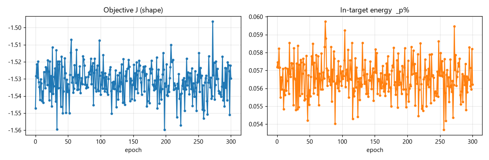
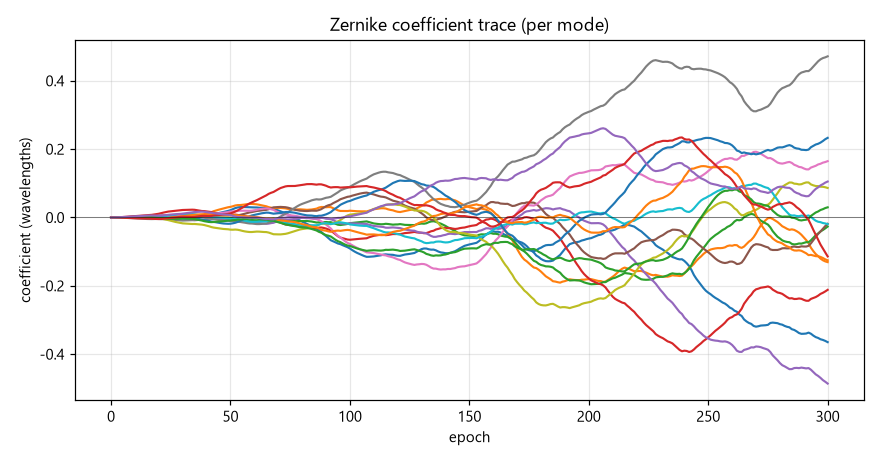
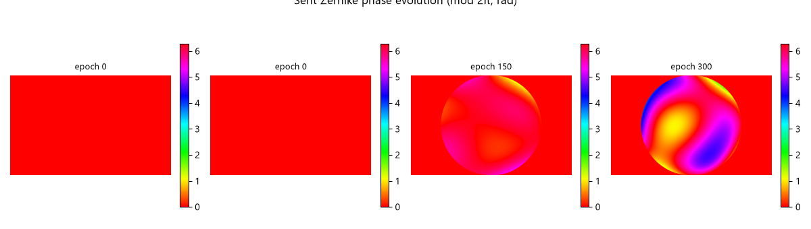
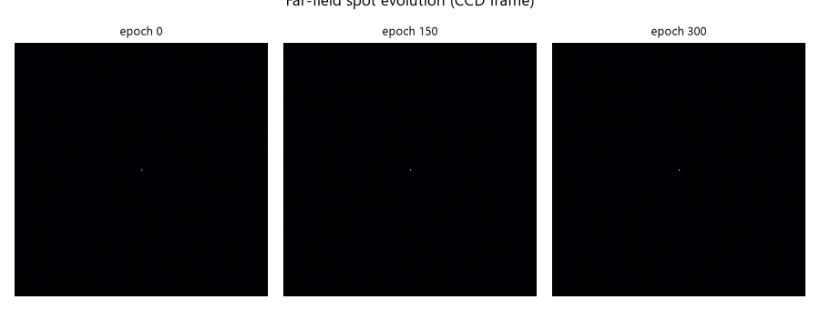
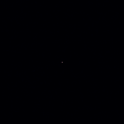

# slm-pib 仿真运行报告 (SPGD 方形目标, 2f-Fourier 数字孪生)

**生成时间**: 2026-09-23 08:47:44

**Fully offline** — 本报告由 `scripts/generate_slm_pib_sim_report.py` 离线生成, 仅读取 `slm_pib_runner --debug` 保存的 PKL/JSON 调试产物, 不打开任何硬件。

## 1. 运行说明

本运行使用 `src/ao_shaping/runners/slm_pib_runner.py` 的 **SPGD** 子命令, 在纯 numpy 2f-Fourier 仿真 (`src/ao_shaping/drivers/sim/slm_pib_sim.py`) 下执行, 无硬件。

- **相机**: `--cam_type sim` (注册到相机注册表, 读取仿真远场)
- **SLM**: `Santec` 被 monkeypatch 为 `SimSLMPib` (FFT 远场, 0 级光斑位于帧中心)
- **目标**: 方形 (`--target_shape square`, `--target_size` 相机像素)
- **搜索**: SPGD 梯度法 (`--optimizer_type adamod`), Zernike 系数 n≤4 (15 个模式)

光学模型: SLM 位于 2f 光路前焦面, CCD 位于后焦面, 因此 CCD 图像 = SLM 瞳孔场的 2D FFT (夫琅禾费远场)。输入为高斯光束, 施加 Zernike 相位后经 `np.fft.fft2` 传播到远场。

## 2. 运行 `run0` (目录 `20260923_084712`)

| 项目 | 值 |
|---|---|
| epoch 数 | 301 |
| 初始 J (shape) | -1.5473 |
| 最终 J (shape) | -1.5298 |
| 初始框内能量 _p% | 0.0572 |
| 最终框内能量 _p% | 0.0562 |
| 搜索配置 | {'epochs': 300, 'delta': 0.5} |

### 解读

- 目标 J 从 -1.5473 变化到 -1.5298 (shape 目标为**最小化**, 数值越接近 0 越好, 负值越大代表离目标越远)。
- 框内能量 `_p%` 从 0.0572 到 0.0562: 低阶 Zernike 主要做波前校正/聚焦, 并非真正的方形成形 (方形需要全像素自由度, 见 AGENTS.md 反模式)。
- 相位图展示 15 个 Zernike 模式 (n≤4) 的加权合成; 远场图展示 0 级光斑的 FFT 传播结果。

## 3. 结论

1. **管线验证通过**: `slm-pib` 的 SPGD 闭环在纯仿真下可端到端运行, 无需硬件, 调试产物 (PKL/JSON/PNG) 与硬件运行格式一致, 可直接用于离线报告生成。
2. **仿真模型合理**: 2f-Fourier FFT 远场使 Zernike 相位对光斑产生真实可测的影响 (非零梯度), 与硬件 2f 光路 (SLM 前焦面 → 透镜 → CCD 后焦面) 一致。
3. **低阶 Zernike 的局限**: 与 AGENTS.md 反模式一致, n≤4 的 Zernike 是圆对称光滑基, 无法合成真正的方形远场; 本报告的方形目标用于验证 **目标函数 + 闭环反馈链路**, 而非真正的方形成形 (后者需 freeform/全像素相位, 如 `spgd-square --basis freeform`)。
4. **可复用**: 报告生成器完全离线, 任何一次 `slm-pib --debug` 运行 (仿真或硬件) 的调试产物都能用本脚本重新出报告。
